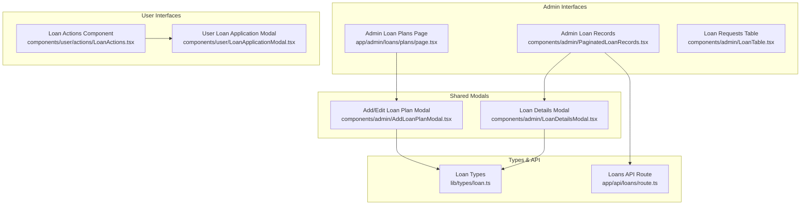
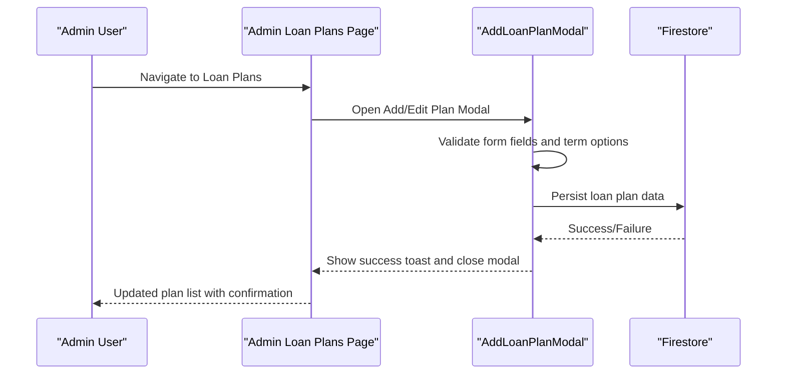
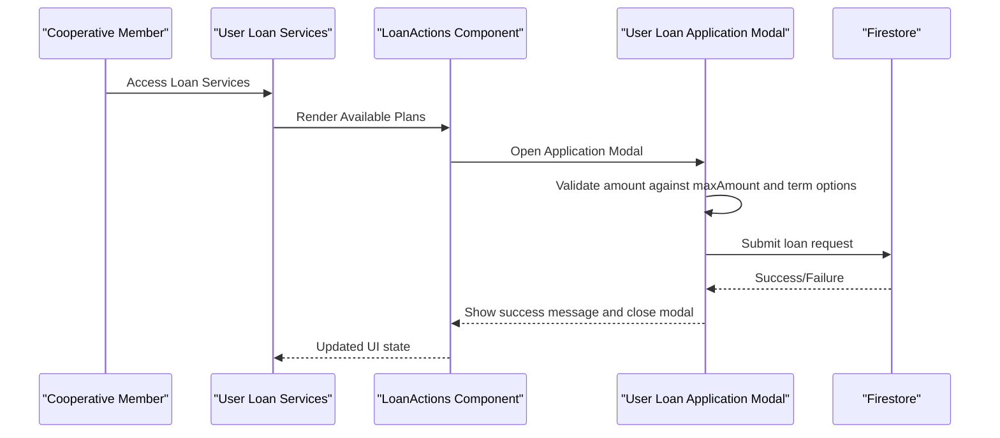
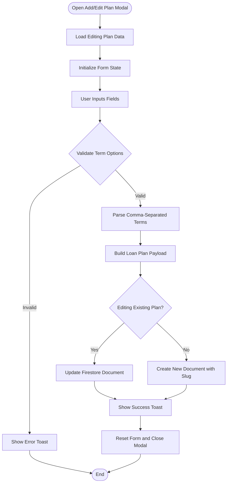
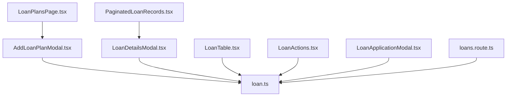

# Loan Plan Management

<cite>
**Referenced Files in This Document**
- [AddLoanPlanModal.tsx](file://components/admin/AddLoanPlanModal.tsx)
- [LoanDetailsModal.tsx](file://components/admin/LoanDetailsModal.tsx)
- [LoanPlansPage.tsx](file://app/admin/loans/plans/page.tsx)
- [PaginatedLoanRecords.tsx](file://components/admin/PaginatedLoanRecords.tsx)
- [LoanTable.tsx](file://components/admin/LoanTable.tsx)
- [LoanActions.tsx](file://components/user/actions/LoanActions.tsx)
- [LoanApplicationModal.tsx](file://components/user/LoanApplicationModal.tsx)
- [loan.ts](file://lib/types/loan.ts)
- [loans.route.ts](file://app/api/loans/route.ts)
</cite>

## Update Summary
**Changes Made**
- Updated AddLoanPlanModal component documentation to reflect new form validation and confirmation dialog features
- Enhanced LoanDetailsModal documentation to include payment processing workflow and confirmation dialogs
- Added comprehensive coverage of loan plan deletion functionality with confirmation dialogs
- Updated loan plan configuration documentation to include maximum amount validation
- Enhanced user application workflow documentation with improved form validation

## Table of Contents
1. [Introduction](#introduction)
2. [Project Structure](#project-structure)
3. [Core Components](#core-components)
4. [Architecture Overview](#architecture-overview)
5. [Detailed Component Analysis](#detailed-component-analysis)
6. [Dependency Analysis](#dependency-analysis)
7. [Performance Considerations](#performance-considerations)
8. [Troubleshooting Guide](#troubleshooting-guide)
9. [Conclusion](#conclusion)

## Introduction
This document provides comprehensive guidance for loan plan management within the SAMPA Cooperative Management System. The system features a dedicated loan plans management interface with configurable maximum amounts, interest rates, term options, modal-based editing interfaces, confirmation dialogs, and comprehensive form validation. It focuses on two primary components: AddLoanPlanModal for creating and configuring loan products, and LoanDetailsModal for viewing loan information, payment processing, and status updates. The documentation covers configuration of interest rate structures, repayment schedules, minimum/maximum loan amounts, and member qualification requirements through loan requests.

## Project Structure
The loan plan management functionality spans several key areas with enhanced administrative capabilities and user interfaces:

- Administrative interfaces for managing loan plans with deletion confirmation dialogs
- User-facing loan application and verification flows with enhanced validation
- Shared modal components for creating/editing plans and viewing loan details
- Type definitions for loan plans and requests
- API routes for loan data retrieval



**Diagram sources**
- [LoanPlansPage.tsx](file://app/admin/loans/plans/page.tsx#L1-L304)
- [PaginatedLoanRecords.tsx](file://components/admin/PaginatedLoanRecords.tsx#L1-L436)
- [LoanTable.tsx](file://components/admin/LoanTable.tsx#L1-L391)
- [AddLoanPlanModal.tsx](file://components/admin/AddLoanPlanModal.tsx#L1-L244)
- [LoanDetailsModal.tsx](file://components/admin/LoanDetailsModal.tsx#L1-L800)
- [LoanActions.tsx](file://components/user/actions/LoanActions.tsx#L1-L631)
- [LoanApplicationModal.tsx](file://components/user/LoanApplicationModal.tsx#L1-L215)
- [loan.ts](file://lib/types/loan.ts#L1-L19)
- [loans.route.ts](file://app/api/loans/route.ts#L1-L133)

**Section sources**
- [LoanPlansPage.tsx](file://app/admin/loans/plans/page.tsx#L1-L304)
- [PaginatedLoanRecords.tsx](file://components/admin/PaginatedLoanRecords.tsx#L1-L436)
- [LoanTable.tsx](file://components/admin/LoanTable.tsx#L1-L391)
- [AddLoanPlanModal.tsx](file://components/admin/AddLoanPlanModal.tsx#L1-L244)
- [LoanDetailsModal.tsx](file://components/admin/LoanDetailsModal.tsx#L1-L800)
- [LoanActions.tsx](file://components/user/actions/LoanActions.tsx#L1-L631)
- [LoanApplicationModal.tsx](file://components/user/LoanApplicationModal.tsx#L1-L215)
- [loan.ts](file://lib/types/loan.ts#L1-L19)
- [loans.route.ts](file://app/api/loans/route.ts#L1-L133)

## Core Components
This section documents the primary components involved in loan plan management and their responsibilities with enhanced functionality.

- **AddLoanPlanModal**: Handles creation and editing of loan plans with comprehensive form validation, term option parsing, and success/error feedback with loading states.
- **LoanDetailsModal**: Displays comprehensive loan details, calculates and shows amortization schedules, supports payment processing with confirmation dialogs, and enables PDF/print exports.
- **LoanPlansPage**: Lists available loan plans, allows adding/editing via the modal, supports deletion with confirmation dialogs, and refreshes data upon changes.
- **PaginatedLoanRecords**: Shows all loan records with advanced search and filter capabilities, pagination, and opens LoanDetailsModal for detailed views.
- **LoanTable**: Manages loan requests, approves/rejects them with confirmation dialogs, generates payment schedules, and creates loan documents upon approval.
- **LoanActions**: Provides user-facing loan application flow with plan selection, amount/term validation against plan limits, amortization preview, and submission to loanRequests.
- **LoanApplicationModal**: Alternative user application modal with enhanced validation and direct submission to loanRequests.
- **Types**: Defines LoanPlan and LoanRequest interfaces used across components.
- **Loans API**: Provides endpoints to fetch all loans and create new loans via API.

**Section sources**
- [AddLoanPlanModal.tsx](file://components/admin/AddLoanPlanModal.tsx#L1-L244)
- [LoanDetailsModal.tsx](file://components/admin/LoanDetailsModal.tsx#L1-L800)
- [LoanPlansPage.tsx](file://app/admin/loans/plans/page.tsx#L1-L304)
- [PaginatedLoanRecords.tsx](file://components/admin/PaginatedLoanRecords.tsx#L1-L436)
- [LoanTable.tsx](file://components/admin/LoanTable.tsx#L1-L391)
- [LoanActions.tsx](file://components/user/actions/LoanActions.tsx#L1-L631)
- [LoanApplicationModal.tsx](file://components/user/LoanApplicationModal.tsx#L1-L215)
- [loan.ts](file://lib/types/loan.ts#L1-L19)
- [loans.route.ts](file://app/api/loans/route.ts#L1-L133)

## Architecture Overview
The loan plan management system integrates administrative and user-facing flows with shared modal components and centralized data storage in Firestore. Administrative users manage loan plans with enhanced validation and confirmation dialogs, while users apply for loans through streamlined interfaces with comprehensive validation.



**Diagram sources**
- [LoanPlansPage.tsx](file://app/admin/loans/plans/page.tsx#L1-L304)
- [AddLoanPlanModal.tsx](file://components/admin/AddLoanPlanModal.tsx#L1-L244)



**Diagram sources**
- [LoanActions.tsx](file://components/user/actions/LoanActions.tsx#L1-L631)
- [LoanApplicationModal.tsx](file://components/user/LoanApplicationModal.tsx#L1-L215)

## Detailed Component Analysis

### AddLoanPlanModal Component
The AddLoanPlanModal component provides a unified interface for creating and editing loan plans with comprehensive validation and user feedback.

**Updated** Enhanced with improved form validation, term option parsing, and loading states.

Key features:
- **Form fields**: name, description, maxAmount, interestRate, termOptions with real-time validation
- **Validation**: Ensures at least one term option is provided, validates numeric inputs, and parses comma-separated term values
- **Persistence**: Creates new documents with generated slugs or updates existing ones with proper timestamps
- **Feedback**: Displays success/error notifications, loading states, and handles form reset on completion
- **User Experience**: Provides clear error messages and maintains form state during editing



**Diagram sources**
- [AddLoanPlanModal.tsx](file://components/admin/AddLoanPlanModal.tsx#L1-L244)

**Section sources**
- [AddLoanPlanModal.tsx](file://components/admin/AddLoanPlanModal.tsx#L1-L244)
- [LoanPlansPage.tsx](file://app/admin/loans/plans/page.tsx#L1-L304)

### LoanDetailsModal Implementation
The LoanDetailsModal provides comprehensive loan details, payment processing, and status updates with enhanced payment workflow.

**Updated** Enhanced with payment confirmation dialogs, improved payment processing workflow, and better user feedback.

Key features:
- **Amortization schedule calculation**: Daily payments with principal and interest breakdown
- **Payment processing**: Confirmation dialogs for payment amounts and receipt numbers
- **Partial/full payment handling**: Supports both partial and full payment processing
- **Receipt generation**: Creates payment notifications and sends email receipts
- **PDF export and print**: Enhanced export functionality with comprehensive data
- **Pagination**: Efficient handling of large payment schedules

```mermaid
sequenceDiagram
participant Admin as "Admin User"
participant Records as "PaginatedLoanRecords"
participant Details as "LoanDetailsModal"
participant Calc as "Amortization Calculator"
participant Firestore as "Firestore"
Admin->>Records : View Loan Records
Records->>Details : Open Loan Details Modal
Details->>Calc : Calculate Amortization Schedule
Calc-->>Details : Return Schedule
Details->>Details : Display Schedule and Stats
Admin->>Details : Initiate Payment
Details->>Details : Validate Payment Amount
Details->>Details : Show Confirmation Dialog
Details->>Details : Process Payment with Receipt
Details->>Firestore : Update Payment Schedule and Status
Firestore-->>Details : Success/Failure
Details-->>Admin : Show Success Toast and Update UI
```

**Diagram sources**
- [PaginatedLoanRecords.tsx](file://components/admin/PaginatedLoanRecords.tsx#L1-L436)
- [LoanDetailsModal.tsx](file://components/admin/LoanDetailsModal.tsx#L1-L800)

**Section sources**
- [LoanDetailsModal.tsx](file://components/admin/LoanDetailsModal.tsx#L1-L800)
- [PaginatedLoanRecords.tsx](file://components/admin/PaginatedLoanRecords.tsx#L1-L436)

### Loan Plan Configuration and Categories
Loan plan configuration encompasses interest rate structures, repayment schedules, minimum/maximum loan amounts, and member qualification requirements.

**Updated** Enhanced with maximum amount validation and improved term option management.

Configuration aspects:
- **Interest Rate Structures**: Fixed percentage rates applied to outstanding balances
- **Repayment Schedules**: Daily amortization with principal and interest breakdown
- **Minimum/Maximum Loan Amounts**: Plan-specific limits enforced during applications
- **Term Options**: Predefined months available for loan terms with comma-separated input
- **Member Qualification**: Applications routed through loanRequests for approval

Practical examples:
- **Creating a new loan plan**: Use AddLoanPlanModal to define name, description, maxAmount, interestRate, and comma-separated termOptions
- **Modifying an existing plan**: Select Edit Plan from the Loan Plans page to open the modal pre-populated with current values
- **Deleting a plan**: Use the Delete Plan button with confirmation dialog to remove loan plans from the system
- **Deactivation procedure**: While the code does not include explicit deactivation logic, plans can be removed by deleting documents from the loanPlans collection

**Section sources**
- [AddLoanPlanModal.tsx](file://components/admin/AddLoanPlanModal.tsx#L1-L244)
- [LoanPlansPage.tsx](file://app/admin/loans/plans/page.tsx#L1-L304)
- [LoanActions.tsx](file://components/user/actions/LoanActions.tsx#L1-L631)
- [LoanApplicationModal.tsx](file://components/user/LoanApplicationModal.tsx#L1-L215)

### Loan Analytics and Reporting
Administrative oversight is supported through loan records, filtering, and summary reports with enhanced search capabilities.

**Updated** Enhanced with advanced filtering options and improved search functionality.

Analytics capabilities:
- **Loan Records Dashboard**: View all loans with comprehensive search and filter by amount, term, interest, start date, and status
- **Advanced Filtering**: Column-specific filters for amount ranges, term categories, interest rates, and time periods
- **Pagination**: Efficiently browse large datasets with configurable items per page
- **Summary Reports**: Administrative reports include loan status distributions and financial summaries
- **Search Functionality**: Multi-field search across names, emails, IDs, roles, and statuses

**Section sources**
- [PaginatedLoanRecords.tsx](file://components/admin/PaginatedLoanRecords.tsx#L1-L436)
- [LoanTable.tsx](file://components/admin/LoanTable.tsx#L1-L391)

### Loan Request Management
The system includes comprehensive loan request management with approval workflows and automated loan creation.

**New** Added comprehensive loan request management functionality.

Key features:
- **Loan Request Approval**: Admins can approve or reject loan requests with confirmation dialogs
- **Automated Loan Creation**: Upon approval, creates loan documents with calculated amortization schedules
- **Notification System**: Automatic notifications for approval/rejection decisions
- **Rejection Reasoning**: Structured rejection process with reason capture
- **Approval Workflows**: Complete approval lifecycle with audit trails

**Section sources**
- [LoanTable.tsx](file://components/admin/LoanTable.tsx#L1-L391)

## Dependency Analysis
The loan plan management system exhibits clear separation of concerns with enhanced shared dependencies and minimal coupling.



**Diagram sources**
- [AddLoanPlanModal.tsx](file://components/admin/AddLoanPlanModal.tsx#L1-L244)
- [LoanDetailsModal.tsx](file://components/admin/LoanDetailsModal.tsx#L1-L800)
- [LoanPlansPage.tsx](file://app/admin/loans/plans/page.tsx#L1-L304)
- [PaginatedLoanRecords.tsx](file://components/admin/PaginatedLoanRecords.tsx#L1-L436)
- [LoanTable.tsx](file://components/admin/LoanTable.tsx#L1-L391)
- [LoanActions.tsx](file://components/user/actions/LoanActions.tsx#L1-L631)
- [LoanApplicationModal.tsx](file://components/user/LoanApplicationModal.tsx#L1-L215)
- [loan.ts](file://lib/types/loan.ts#L1-L19)
- [loans.route.ts](file://app/api/loans/route.ts#L1-L133)

**Section sources**
- [AddLoanPlanModal.tsx](file://components/admin/AddLoanPlanModal.tsx#L1-L244)
- [LoanDetailsModal.tsx](file://components/admin/LoanDetailsModal.tsx#L1-L800)
- [LoanPlansPage.tsx](file://app/admin/loans/plans/page.tsx#L1-L304)
- [PaginatedLoanRecords.tsx](file://components/admin/PaginatedLoanRecords.tsx#L1-L436)
- [LoanTable.tsx](file://components/admin/LoanTable.tsx#L1-L391)
- [LoanActions.tsx](file://components/user/actions/LoanActions.tsx#L1-L631)
- [LoanApplicationModal.tsx](file://components/user/LoanApplicationModal.tsx#L1-L215)
- [loan.ts](file://lib/types/loan.ts#L1-L19)
- [loans.route.ts](file://app/api/loans/route.ts#L1-L133)

## Performance Considerations
- **Amortization calculations**: Daily schedule generation can be computationally intensive for long terms; consider caching or generating schedules on demand
- **Large datasets**: PaginatedLoanRecords uses pagination to limit DOM rendering; maintain efficient filtering and search implementations
- **API endpoints**: The loans API currently supports GET and POST; consider adding PUT/DELETE for comprehensive CRUD operations
- **Modal interactions**: Minimize re-renders by using controlled components and avoiding unnecessary state updates
- **Form validation**: Implement debounced validation for better user experience during form input
- **Payment processing**: Optimize payment schedule updates to minimize Firestore write operations

## Troubleshooting Guide
Common issues and resolutions:
- **Form validation errors**: Ensure term options are comma-separated integers; verify maximum amount constraints align with plan configuration
- **Payment processing failures**: Confirm remaining balance calculations and schedule updates; check notification creation for user alerts
- **Data synchronization**: Verify Firestore permissions and indexes for loanPlans, loanRequests, and loans collections
- **Modal state management**: Reset form state after successful submissions and handle loading states appropriately
- **Loan request approvals**: Ensure proper approval workflows and notification systems are functioning
- **Payment confirmation dialogs**: Verify confirmation dialogs are properly triggered and validated before payment processing

**Section sources**
- [AddLoanPlanModal.tsx](file://components/admin/AddLoanPlanModal.tsx#L1-L244)
- [LoanDetailsModal.tsx](file://components/admin/LoanDetailsModal.tsx#L1-L800)
- [PaginatedLoanRecords.tsx](file://components/admin/PaginatedLoanRecords.tsx#L1-L436)
- [LoanTable.tsx](file://components/admin/LoanTable.tsx#L1-L391)

## Conclusion
The SAMPA Cooperative Management System provides a robust foundation for loan plan management through dedicated administrative and user-facing components with enhanced validation and confirmation dialogs. The AddLoanPlanModal streamlines plan creation and editing with comprehensive form validation, while LoanDetailsModal offers comprehensive loan oversight with payment processing, confirmation dialogs, and reporting capabilities. The system includes loan request management with approval workflows, advanced filtering capabilities, and summary reports for administrative oversight. Users benefit from intuitive application flows with amortization previews, comprehensive validation against plan limits, and seamless submission processes with proper notifications and feedback.