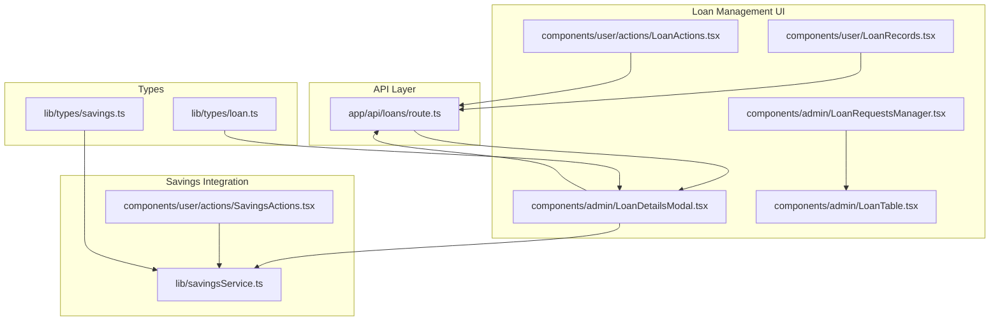
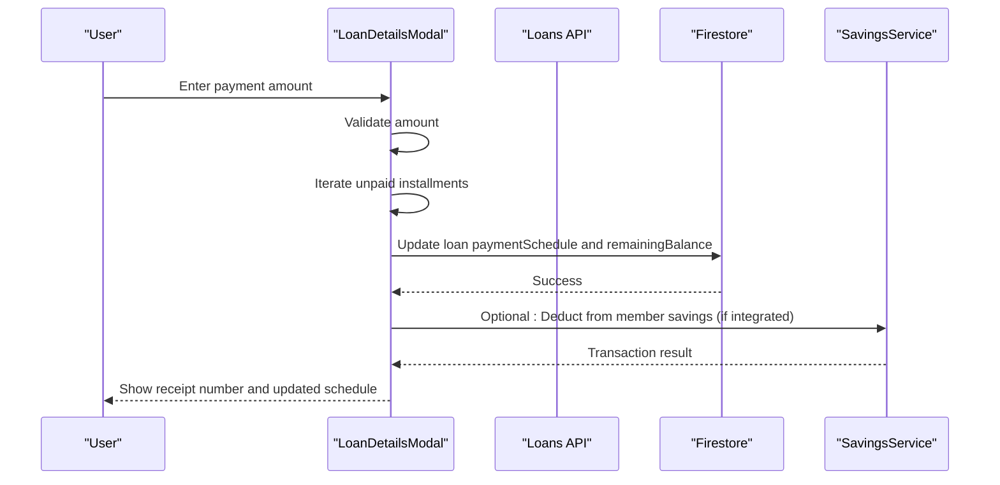
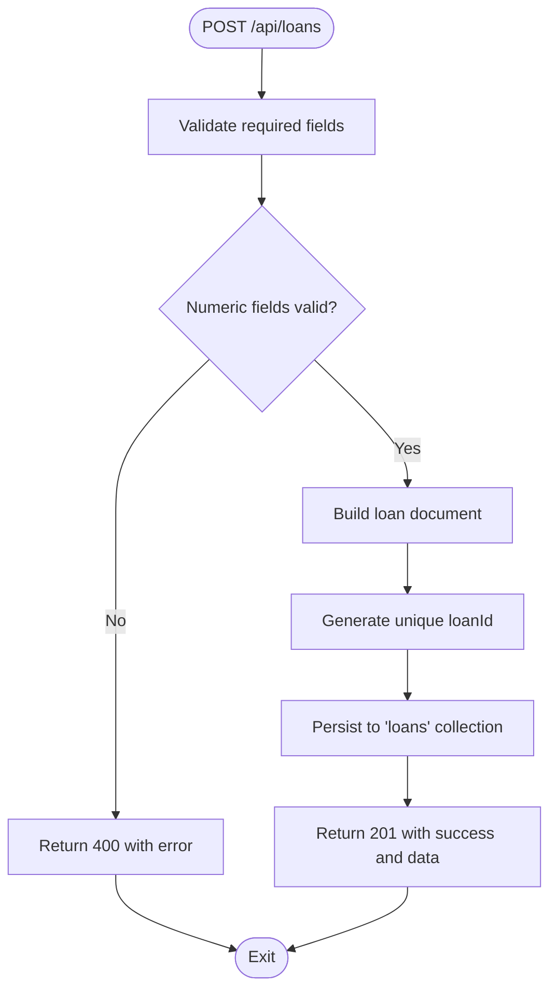
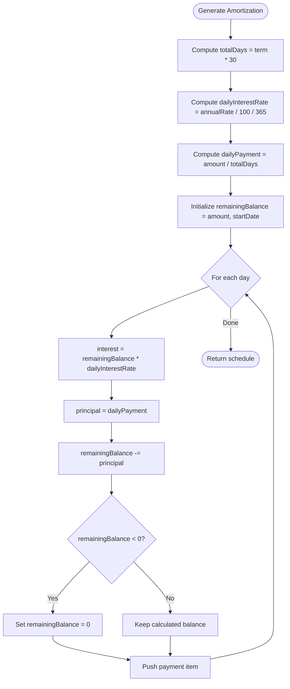
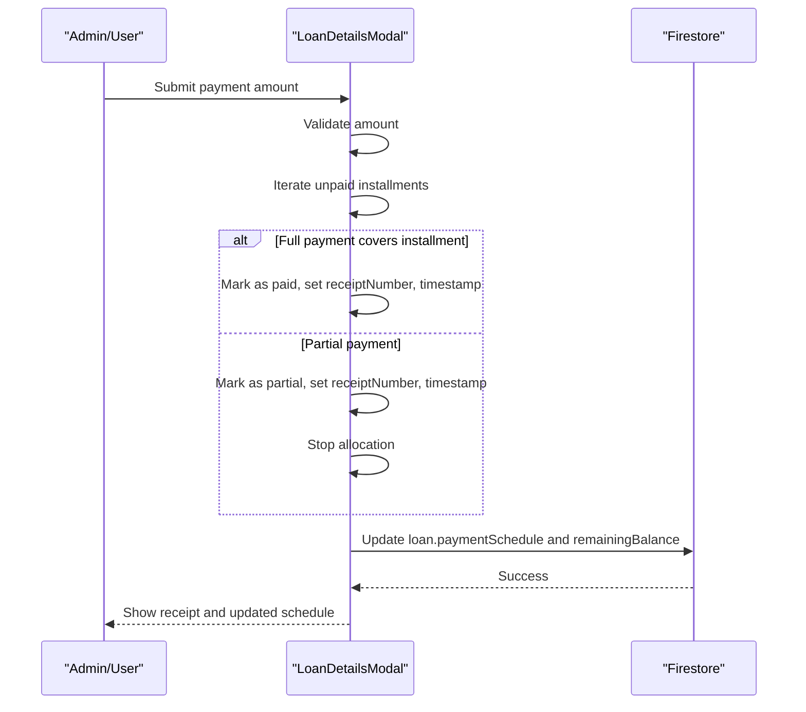
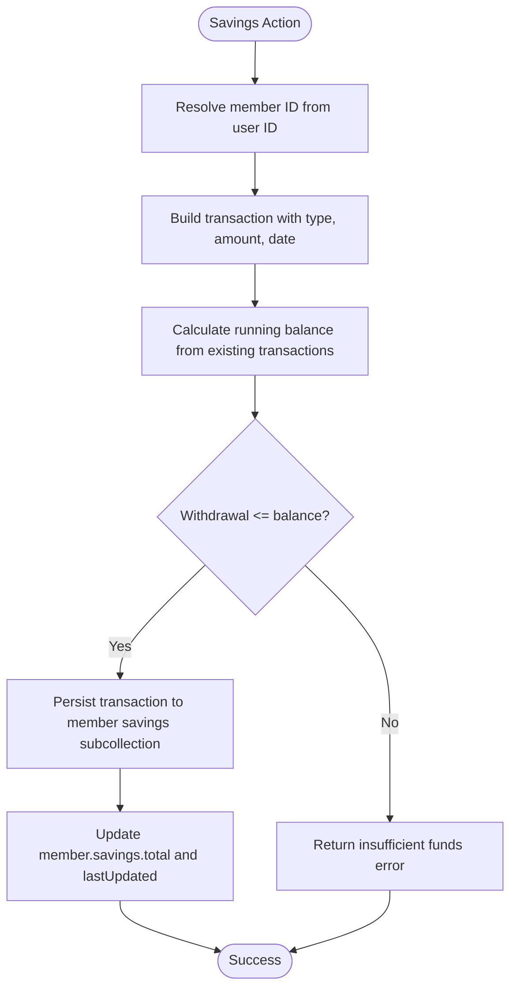
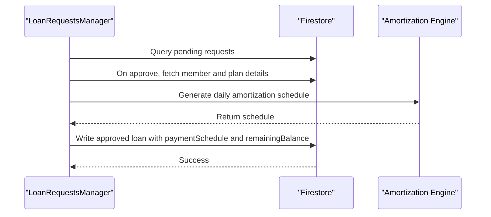
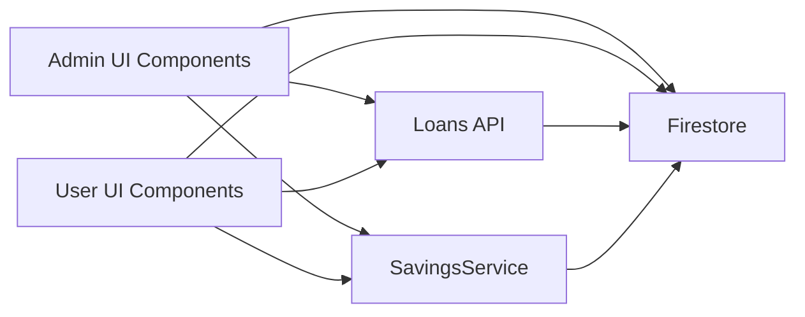

# Loan Repayment System

<cite>
**Referenced Files in This Document**
- [app/api/loans/route.ts](file://app/api/loans/route.ts)
- [components/admin/LoanDetailsModal.tsx](file://components/admin/LoanDetailsModal.tsx)
- [components/admin/LoanTable.tsx](file://components/admin/LoanTable.tsx)
- [components/admin/LoanRequestsManager.tsx](file://components/admin/LoanRequestsManager.tsx)
- [components/user/LoanRecords.tsx](file://components/user/LoanRecords.tsx)
- [components/user/actions/LoanActions.tsx](file://components/user/actions/LoanActions.tsx)
- [components/user/actions/SavingsActions.tsx](file://components/user/actions/SavingsActions.tsx)
- [lib/savingsService.ts](file://lib/savingsService.ts)
- [lib/types/loan.ts](file://lib/types/loan.ts)
- [lib/types/savings.ts](file://lib/types/savings.ts)
- [app/dashboard/page.tsx](file://app/dashboard/page.tsx)
- [app/driver/dashboard/page.tsx](file://app/driver/dashboard/page.tsx)
- [app/admin/dashboard/page.tsx](file://app/admin/dashboard/page.tsx)
</cite>

## Table of Contents
1. [Introduction](#introduction)
2. [Project Structure](#project-structure)
3. [Core Components](#core-components)
4. [Architecture Overview](#architecture-overview)
5. [Detailed Component Analysis](#detailed-component-analysis)
6. [Dependency Analysis](#dependency-analysis)
7. [Performance Considerations](#performance-considerations)
8. [Troubleshooting Guide](#troubleshooting-guide)
9. [Conclusion](#conclusion)

## Introduction
This document describes the loan repayment system within the SAMPA Cooperative Management System. It focuses on repayment calculation algorithms, automated payment processing, integration with the savings management system for automatic deductions, repayment schedule generation, payment reminders, overdue handling, payoff and prepayment processing, and analytics for defaults and recoveries. The system supports daily amortization schedules, payment application against future installments, and maintains detailed payment history with status tracking.

## Project Structure
The loan repayment system spans API routes, administrative and user-facing components, and supporting services:
- API layer: loan creation and retrieval endpoints
- Business logic: amortization schedule generation and payment application
- Data types: loan and savings interfaces
- Integrations: savings service for member balances and transactions
- UI surfaces: loan details, records, and payment workflows

**Diagram sources**
- [app/api/loans/route.ts](file://app/api/loans/route.ts#L1-L133)
- [components/admin/LoanDetailsModal.tsx](file://components/admin/LoanDetailsModal.tsx#L46-L359)
- [components/admin/LoanRequestsManager.tsx](file://components/admin/LoanRequestsManager.tsx#L64-L200)
- [components/admin/LoanTable.tsx](file://components/admin/LoanTable.tsx#L86-L152)
- [components/user/LoanRecords.tsx](file://components/user/LoanRecords.tsx#L87-L123)
- [components/user/actions/LoanActions.tsx](file://components/user/actions/LoanActions.tsx#L39-L73)
- [components/user/actions/SavingsActions.tsx](file://components/user/actions/SavingsActions.tsx#L1-L45)
- [lib/savingsService.ts](file://lib/savingsService.ts#L237-L342)
- [lib/types/loan.ts](file://lib/types/loan.ts#L1-L19)
- [lib/types/savings.ts](file://lib/types/savings.ts#L1-L20)

**Section sources**
- [app/api/loans/route.ts](file://app/api/loans/route.ts#L1-L133)
- [components/admin/LoanDetailsModal.tsx](file://components/admin/LoanDetailsModal.tsx#L46-L359)
- [components/admin/LoanRequestsManager.tsx](file://components/admin/LoanRequestsManager.tsx#L64-L200)
- [components/admin/LoanTable.tsx](file://components/admin/LoanTable.tsx#L86-L152)
- [components/user/LoanRecords.tsx](file://components/user/LoanRecords.tsx#L87-L123)
- [components/user/actions/LoanActions.tsx](file://components/user/actions/LoanActions.tsx#L39-L73)
- [components/user/actions/SavingsActions.tsx](file://components/user/actions/SavingsActions.tsx#L1-L45)
- [lib/savingsService.ts](file://lib/savingsService.ts#L237-L342)
- [lib/types/loan.ts](file://lib/types/loan.ts#L1-L19)
- [lib/types/savings.ts](file://lib/types/savings.ts#L1-L20)

## Core Components
- Loan API: Creates and retrieves loan records with basic validation.
- Amortization engine: Generates daily schedules and applies payments across installments.
- Payment application: Processes full/partial payments against future installments and updates status.
- Savings integration: Validates member identity, calculates balances, and persists transactions atomically.
- UI surfaces: Loan details modal, loan records, and loan application previews.

Key capabilities:
- Principal and interest distribution per daily payment
- Remaining balance tracking and payoff detection
- Receipt numbering and payment notifications
- Savings-backed payment deduction workflow

**Section sources**
- [app/api/loans/route.ts](file://app/api/loans/route.ts#L41-L112)
- [components/admin/LoanDetailsModal.tsx](file://components/admin/LoanDetailsModal.tsx#L94-L123)
- [components/user/LoanRecords.tsx](file://components/user/LoanRecords.tsx#L87-L123)
- [lib/savingsService.ts](file://lib/savingsService.ts#L237-L342)

## Architecture Overview
The repayment system follows a layered architecture:
- Presentation layer: React components for admin and user views
- Application layer: LoanDetailsModal orchestrates payment application and schedule updates
- Domain layer: Amortization calculation and payment allocation logic
- Persistence layer: Firestore collections for loans, loanRequests, members, and savings subcollections
- Integration layer: Savings service coordinates member identification and transaction persistence

**Diagram sources**
- [components/admin/LoanDetailsModal.tsx](file://components/admin/LoanDetailsModal.tsx#L284-L359)
- [app/api/loans/route.ts](file://app/api/loans/route.ts#L41-L112)
- [lib/savingsService.ts](file://lib/savingsService.ts#L237-L342)

## Detailed Component Analysis

### Loan API
- Purpose: Create and list loans with minimal validation.
- Validation: Requires memberId, amount, interestRate, term, startDate; numeric checks enforced.
- Output: Unique loanId and created loan data on successful creation.

**Diagram sources**
- [app/api/loans/route.ts](file://app/api/loans/route.ts#L41-L112)

**Section sources**
- [app/api/loans/route.ts](file://app/api/loans/route.ts#L41-L112)

### Amortization Engine
- Daily schedule generation: Converts term to days (30-day months), computes daily interest and principal components.
- Principal and interest split: Interest computed on remaining balance; principal equals fixed daily payment until payoff.
- Remaining balance enforcement: Caps at zero to prevent negative balances.

**Diagram sources**
- [components/admin/LoanTable.tsx](file://components/admin/LoanTable.tsx#L114-L152)
- [components/user/LoanRecords.tsx](file://components/user/LoanRecords.tsx#L87-L123)
- [components/user/actions/LoanActions.tsx](file://components/user/actions/LoanActions.tsx#L39-L73)

**Section sources**
- [components/admin/LoanTable.tsx](file://components/admin/LoanTable.tsx#L114-L152)
- [components/user/LoanRecords.tsx](file://components/user/LoanRecords.tsx#L87-L123)
- [components/user/actions/LoanActions.tsx](file://components/user/actions/LoanActions.tsx#L39-L73)

### Payment Application Workflow
- Validation: Ensures payment amount is a positive number.
- Allocation: Applies payments to unpaid installments in order until amount exhausted or partial payment occurs.
- Status updates: Marks installments as paid or partial, attaches receipt number and processed timestamp.
- Persistence: Updates loan document with modified schedule and recalculated remaining balance.

**Diagram sources**
- [components/admin/LoanDetailsModal.tsx](file://components/admin/LoanDetailsModal.tsx#L284-L359)

**Section sources**
- [components/admin/LoanDetailsModal.tsx](file://components/admin/LoanDetailsModal.tsx#L284-L359)

### Savings Integration for Automatic Deductions
- Member identification: Resolves user ID to member ID via multiple strategies (userId field, email, name).
- Transaction processing: Adds savings transactions with running balance calculation and validation against insufficient funds.
- Aggregate updates: Maintains member savings totals and last updated timestamps.
- UI integration: SavingsActions component enables deposits and withdrawals; dashboard displays current balance.

**Diagram sources**
- [lib/savingsService.ts](file://lib/savingsService.ts#L237-L342)
- [components/user/actions/SavingsActions.tsx](file://components/user/actions/SavingsActions.tsx#L1-L45)
- [app/dashboard/page.tsx](file://app/dashboard/page.tsx#L286-L311)
- [app/driver/dashboard/page.tsx](file://app/driver/dashboard/page.tsx#L279-L297)
- [app/admin/dashboard/page.tsx](file://app/admin/dashboard/page.tsx#L277-L304)

**Section sources**
- [lib/savingsService.ts](file://lib/savingsService.ts#L237-L342)
- [components/user/actions/SavingsActions.tsx](file://components/user/actions/SavingsActions.tsx#L1-L45)
- [app/dashboard/page.tsx](file://app/dashboard/page.tsx#L286-L311)
- [app/driver/dashboard/page.tsx](file://app/driver/dashboard/page.tsx#L279-L297)
- [app/admin/dashboard/page.tsx](file://app/admin/dashboard/page.tsx#L277-L304)

### Loan Requests and Approval to Disbursement
- Request management: Real-time listeners for pending/approved/rejected loan requests with pagination support.
- Approval path: On approval, generates daily amortization schedule and writes approved loan document with member details.
- Disbursement linkage: While not explicitly shown in code, the approval workflow constructs the loan with paymentSchedule and remainingBalance for immediate repayment processing.

**Diagram sources**
- [components/admin/LoanRequestsManager.tsx](file://components/admin/LoanRequestsManager.tsx#L64-L200)
- [components/admin/LoanTable.tsx](file://components/admin/LoanTable.tsx#L114-L152)

**Section sources**
- [components/admin/LoanRequestsManager.tsx](file://components/admin/LoanRequestsManager.tsx#L64-L200)
- [components/admin/LoanTable.tsx](file://components/admin/LoanTable.tsx#L114-L152)

### Data Types and Contracts
- LoanPlan: Defines loan product terms including interest rate and term options.
- LoanRequest: Captures application metadata and status.
- SavingsTransaction: Standardized savings record with type, amount, balance, and remarks.
- MemberSavings: Aggregated savings summary for reporting.

**Section sources**
- [lib/types/loan.ts](file://lib/types/loan.ts#L1-L19)
- [lib/types/savings.ts](file://lib/types/savings.ts#L1-L20)

## Dependency Analysis
- UI components depend on Firestore for real-time updates and manual persistence of payment changes.
- Amortization logic is shared across admin and user components to ensure consistency.
- SavingsService is a standalone module consumed by UI and potentially backend services for member-linked financial operations.
- Loan API provides minimal CRUD for loans; repayment updates are handled by UI components updating documents.

**Diagram sources**
- [components/admin/LoanDetailsModal.tsx](file://components/admin/LoanDetailsModal.tsx#L46-L359)
- [components/user/LoanRecords.tsx](file://components/user/LoanRecords.tsx#L87-L123)
- [lib/savingsService.ts](file://lib/savingsService.ts#L237-L342)
- [app/api/loans/route.ts](file://app/api/loans/route.ts#L1-L133)

**Section sources**
- [components/admin/LoanDetailsModal.tsx](file://components/admin/LoanDetailsModal.tsx#L46-L359)
- [components/user/LoanRecords.tsx](file://components/user/LoanRecords.tsx#L87-L123)
- [lib/savingsService.ts](file://lib/savingsService.ts#L237-L342)
- [app/api/loans/route.ts](file://app/api/loans/route.ts#L1-L133)

## Performance Considerations
- Amortization computation: Linear in totalDays; acceptable for typical loan terms. Consider caching schedules if frequently accessed.
- Real-time listeners: Use pagination and efficient queries to minimize index overhead.
- Batch updates: Prefer single document updates for paymentSchedule and remainingBalance to reduce write conflicts.
- Savings transactions: Atomic balance calculation prevents race conditions; ensure transaction sorting is efficient.

## Troubleshooting Guide
Common issues and resolutions:
- Payment amount validation failures: Ensure amounts are positive numbers before submission.
- Insufficient funds in savings: SavingsService returns insufficient funds errors; display user-friendly messages.
- Missing member records: Member resolution attempts multiple strategies; verify user.userId linkage and email/name fields.
- Firestore index errors: Pending/Approved/Rejected queries require composite indexes; follow deployment instructions.

Operational tips:
- Use receipt numbers for audit trails; they are generated during payment confirmation.
- Monitor remainingBalance updates after payment application to detect payoff conditions.
- For overdue handling, implement periodic checks against paymentSchedule dates and status to trigger reminders or recovery workflows.

**Section sources**
- [components/admin/LoanDetailsModal.tsx](file://components/admin/LoanDetailsModal.tsx#L284-L359)
- [lib/savingsService.ts](file://lib/savingsService.ts#L291-L294)
- [components/admin/LoanRequestsManager.tsx](file://components/admin/LoanRequestsManager.tsx#L10-L27)

## Conclusion
The SAMPA Cooperative Management System’s loan repayment system provides robust daily amortization, flexible payment application, and seamless savings integration. The modular design allows for straightforward extension to include automated scheduled payments, late fees, penalties, and advanced analytics for defaults and recoveries. Future enhancements could centralize repayment scheduling and integrate reminders and recovery workflows while maintaining the current separation of concerns and data integrity guarantees.