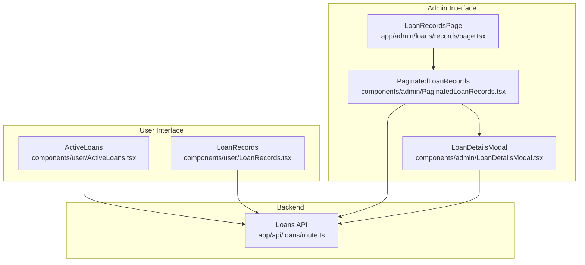
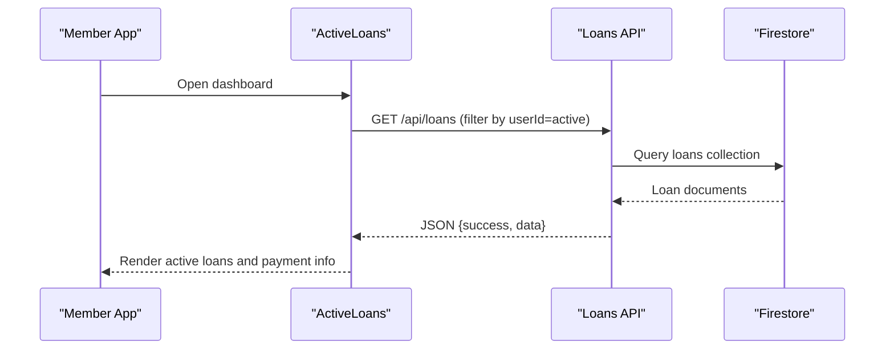
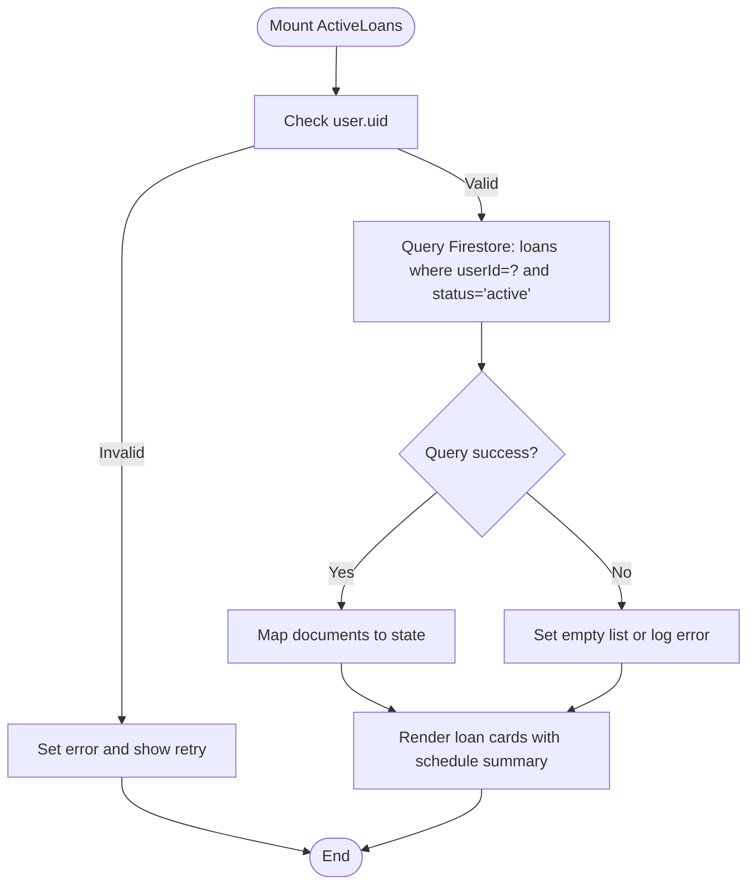
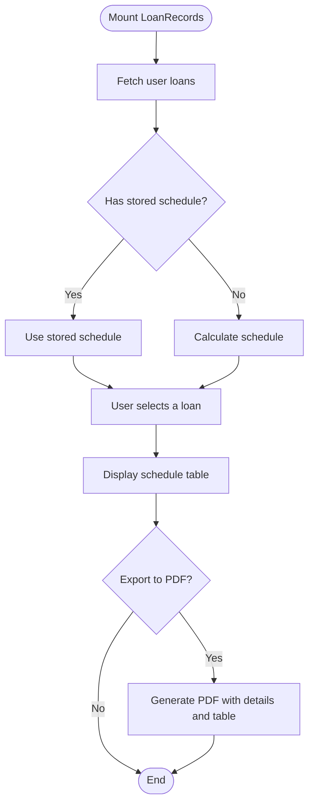
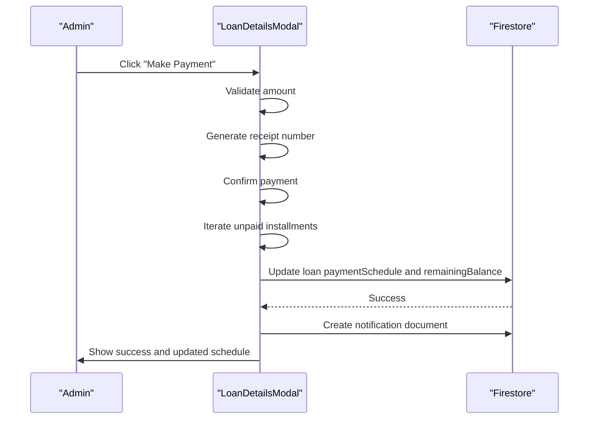
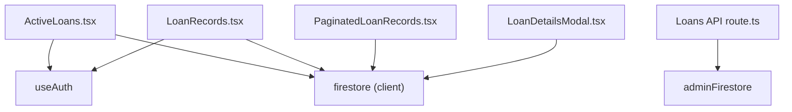

# Loan Tracking and Monitoring

<cite>
**Referenced Files in This Document**
- [ActiveLoans.tsx](file://components/user/ActiveLoans.tsx)
- [LoanRecords.tsx](file://components/user/LoanRecords.tsx)
- [LoanDetailsModal.tsx](file://components/admin/LoanDetailsModal.tsx)
- [PaginatedLoanRecords.tsx](file://components/admin/PaginatedLoanRecords.tsx)
- [LoanRecordsPage.tsx](file://app/admin/loans/records/page.tsx)
- [route.ts](file://app/api/loans/route.ts)
</cite>

## Table of Contents
1. [Introduction](#introduction)
2. [Project Structure](#project-structure)
3. [Core Components](#core-components)
4. [Architecture Overview](#architecture-overview)
5. [Detailed Component Analysis](#detailed-component-analysis)
6. [Dependency Analysis](#dependency-analysis)
7. [Performance Considerations](#performance-considerations)
8. [Troubleshooting Guide](#troubleshooting-guide)
9. [Conclusion](#conclusion)

## Introduction
This document provides comprehensive documentation for the loan tracking and monitoring systems within the SAMPA Cooperative Management Platform. It focuses on three primary areas:
- ActiveLoans: displays current loan status, payment due dates, outstanding balances, and repayment progress for individual members.
- LoanRecords: maintains historical loan data, transaction logs, and status changes for personal records and PDF exports.
- PaymentHistory: integrates payment tracking, late fee calculations, and payment scheduling for administrative oversight and recovery workflows.

The documentation also covers loan status indicators, automated payment reminders, overdue loan detection, loan performance analytics, delinquency tracking, and recovery workflow integration. Practical monitoring scenarios, payment processing, and automated status updates are included to guide both developers and administrators.

## Project Structure
The loan tracking and monitoring functionality spans user-facing components, administrative dashboards, and backend APIs:
- User components:
  - ActiveLoans: member view of active loans and upcoming payments.
  - LoanRecords: member view of historical loan records and amortization schedules.
- Administrative components:
  - PaginatedLoanRecords: admin view of all loans with filtering, pagination, and drill-down details.
  - LoanDetailsModal: detailed loan view with payment processing, receipts, and status updates.
- Backend API:
  - Loans API endpoint for retrieving all loans and creating new loan records.

**Diagram sources**
- [ActiveLoans.tsx](file://components/user/ActiveLoans.tsx#L1-L177)
- [LoanRecords.tsx](file://components/user/LoanRecords.tsx#L1-L350)
- [PaginatedLoanRecords.tsx](file://components/admin/PaginatedLoanRecords.tsx#L1-L436)
- [LoanDetailsModal.tsx](file://components/admin/LoanDetailsModal.tsx#L1-L846)
- [LoanRecordsPage.tsx](file://app/admin/loans/records/page.tsx#L1-L9)
- [route.ts](file://app/api/loans/route.ts#L1-L133)

**Section sources**
- [ActiveLoans.tsx](file://components/user/ActiveLoans.tsx#L1-L177)
- [LoanRecords.tsx](file://components/user/LoanRecords.tsx#L1-L350)
- [PaginatedLoanRecords.tsx](file://components/admin/PaginatedLoanRecords.tsx#L1-L436)
- [LoanDetailsModal.tsx](file://components/admin/LoanDetailsModal.tsx#L1-L846)
- [LoanRecordsPage.tsx](file://app/admin/loans/records/page.tsx#L1-L9)
- [route.ts](file://app/api/loans/route.ts#L1-L133)

## Core Components
This section outlines the responsibilities and key features of each component involved in loan tracking and monitoring.

- ActiveLoans
  - Purpose: Display current active loans for the logged-in member, including loan details, monthly payment amounts, next payment date, and remaining payments.
  - Data source: Queries Firestore for loans linked to the authenticated user with an active status.
  - UI highlights: Currency and date formatting, loading states, error handling, and retry mechanism.

- LoanRecords
  - Purpose: Provide a historical view of all loans for the member, including amortization schedules and the ability to export schedules to PDF.
  - Data source: Retrieves all loans associated with the user and calculates or uses stored amortization schedules.
  - UI highlights: Interactive selection of a loan to view schedule, pagination-like display via dynamic calculation, and PDF export.

- PaginatedLoanRecords
  - Purpose: Admin dashboard for viewing all loans with search and column-based filtering, pagination, and drill-down to LoanDetailsModal.
  - Data source: Fetches all loans and enriches with user metadata for display.
  - UI highlights: Multi-criteria filters (amount, term, interest, start date, status), search by name/email/ID/status, and paginated table.

- LoanDetailsModal
  - Purpose: Detailed view of a single loan with full amortization schedule, payment processing, receipt generation, and status updates.
  - Data source: Uses stored payment schedule or recalculates schedule; updates loan documents upon payment application.
  - UI highlights: Payment modal with confirmation, status badges (paid/partial/pending), receipt number, processed date, and export/print options.

- Loans API
  - Purpose: Backend endpoint to retrieve all loans and create new loan records.
  - Data source: Admin-initialized Firestore access.
  - Features: Validation of required fields, numeric checks, creation of unique loan identifiers, and standardized JSON responses.

**Section sources**
- [ActiveLoans.tsx](file://components/user/ActiveLoans.tsx#L1-L177)
- [LoanRecords.tsx](file://components/user/LoanRecords.tsx#L1-L350)
- [PaginatedLoanRecords.tsx](file://components/admin/PaginatedLoanRecords.tsx#L1-L436)
- [LoanDetailsModal.tsx](file://components/admin/LoanDetailsModal.tsx#L1-L846)
- [route.ts](file://app/api/loans/route.ts#L1-L133)

## Architecture Overview
The loan tracking system follows a layered architecture:
- Frontend components consume Firestore via a unified data access layer abstraction.
- Administrative views rely on modal-driven workflows to manage loan details and payments.
- The backend API exposes CRUD operations for loans with validation and standardized responses.

**Diagram sources**
- [ActiveLoans.tsx](file://components/user/ActiveLoans.tsx#L31-L72)
- [route.ts](file://app/api/loans/route.ts#L4-L39)

**Section sources**
- [ActiveLoans.tsx](file://components/user/ActiveLoans.tsx#L1-L177)
- [route.ts](file://app/api/loans/route.ts#L1-L133)

## Detailed Component Analysis

### ActiveLoans Component
ActiveLoans retrieves and renders the current active loans for the authenticated user. It computes derived metrics such as monthly payment amounts and remaining payments based on the payment schedule.

Key behaviors:
- Authentication and Firestore initialization checks.
- Query for loans where userId matches the current user and status equals active.
- Formatting for currency and dates.
- Rendering of loan details and payment schedule summary.

**Diagram sources**
- [ActiveLoans.tsx](file://components/user/ActiveLoans.tsx#L25-L72)

**Section sources**
- [ActiveLoans.tsx](file://components/user/ActiveLoans.tsx#L1-L177)

### LoanRecords Component
LoanRecords provides a historical view of all loans for the member. It supports dynamic calculation of amortization schedules and exporting to PDF.

Key behaviors:
- Retrieve all loans for the user.
- Calculate amortization schedule if not present in the document.
- Export schedule to PDF with loan details and schedule table.

**Diagram sources**
- [LoanRecords.tsx](file://components/user/LoanRecords.tsx#L45-L148)

**Section sources**
- [LoanRecords.tsx](file://components/user/LoanRecords.tsx#L1-L350)

### PaymentHistory Component
The PaymentHistory component is currently not implemented. However, the administrative LoanDetailsModal demonstrates the payment processing workflow, including:
- Payment confirmation modal with receipt number generation.
- Application of payments to installments in order until the amount is exhausted.
- Updating payment schedule entries with status (paid/partial), receipt number, and processed date.
- Notification creation for payment confirmation.
- Automatic status update to completed when all payments are settled.

**Diagram sources**
- [LoanDetailsModal.tsx](file://components/admin/LoanDetailsModal.tsx#L281-L376)

**Section sources**
- [LoanDetailsModal.tsx](file://components/admin/LoanDetailsModal.tsx#L1-L846)

### Loan Status Indicators and Overdue Detection
Loan status indicators are rendered as colored badges:
- Active: green badge.
- Completed: blue badge.
- Pending or others: gray badge.

Overdue detection is not explicitly implemented in the reviewed files. To implement overdue detection:
- Compare the current date against each installment’s due date in the amortization schedule.
- Mark overdue installments and compute delinquency metrics (e.g., number of overdue days, total overdue amount).
- Trigger automated reminders when nearing due dates or upon becoming overdue.

**Section sources**
- [PaginatedLoanRecords.tsx](file://components/admin/PaginatedLoanRecords.tsx#L400-L407)
- [LoanDetailsModal.tsx](file://components/admin/LoanDetailsModal.tsx#L628-L636)

### Automated Payment Reminders and Recovery Workflow Integration
Automated reminders and recovery workflows are not implemented in the reviewed files. Recommended integration points:
- Background job or scheduled function to check due dates and send reminders.
- Notification system to push reminders to members and admins.
- Recovery workflow triggered when delinquency thresholds are exceeded, including escalation steps and potential collateral actions.

[No sources needed since this section provides general guidance]

### Loan Performance Analytics and Delinquency Tracking
Analytics and delinquency tracking are not implemented in the reviewed files. Suggested implementation:
- Aggregate metrics per loan (total payments, total overdue, average days past due).
- Dashboard widgets for delinquency trends, top delinquent members, and recovery rates.
- Reports for management review and policy adjustments.

[No sources needed since this section provides general guidance]

## Dependency Analysis
The components depend on shared infrastructure and data access abstractions:
- Authentication: useAuth hook supplies the current user context.
- Firestore: centralized data access via a Firestore abstraction layer.
- UI libraries: react-hot-toast for notifications, jspdf/jspdf-autotable for PDF generation.

**Diagram sources**
- [ActiveLoans.tsx](file://components/user/ActiveLoans.tsx#L3-L6)
- [LoanRecords.tsx](file://components/user/LoanRecords.tsx#L3-L6)
- [PaginatedLoanRecords.tsx](file://components/admin/PaginatedLoanRecords.tsx#L3-L7)
- [LoanDetailsModal.tsx](file://components/admin/LoanDetailsModal.tsx#L3-L7)
- [route.ts](file://app/api/loans/route.ts#L1)

**Section sources**
- [ActiveLoans.tsx](file://components/user/ActiveLoans.tsx#L1-L177)
- [LoanRecords.tsx](file://components/user/LoanRecords.tsx#L1-L350)
- [PaginatedLoanRecords.tsx](file://components/admin/PaginatedLoanRecords.tsx#L1-L436)
- [LoanDetailsModal.tsx](file://components/admin/LoanDetailsModal.tsx#L1-L846)
- [route.ts](file://app/api/loans/route.ts#L1-L133)

## Performance Considerations
- Query optimization: Ensure Firestore indexes exist for frequent queries (e.g., loans by userId and status).
- Pagination: Use server-side pagination for large datasets to reduce payload sizes.
- Client-side caching: Cache amortization schedules locally to avoid repeated calculations.
- Batch operations: Group Firestore writes for payment updates to minimize network overhead.
- Lazy loading: Load amortization schedules only when a loan is selected to improve initial render performance.

[No sources needed since this section provides general guidance]

## Troubleshooting Guide
Common issues and resolutions:
- Authentication errors: Verify that the user is authenticated and has a valid uid before querying loans.
- Firestore initialization failures: Confirm that the Firestore client is initialized before performing queries.
- Empty or missing data: Handle cases where no loans are found gracefully and provide retry mechanisms.
- Payment processing errors: Validate payment amounts, ensure sufficient unpaid installments, and handle partial payments correctly.
- PDF export failures: Check that a schedule exists and that required libraries are loaded.

**Section sources**
- [ActiveLoans.tsx](file://components/user/ActiveLoans.tsx#L36-L71)
- [LoanDetailsModal.tsx](file://components/admin/LoanDetailsModal.tsx#L281-L376)

## Conclusion
The SAMPA Cooperative Management Platform includes robust user-facing components for active loan monitoring and historical records, along with an administrative interface for detailed loan management and payment processing. While payment history and automated reminders are not yet implemented, the existing architecture provides clear integration points for adding payment tracking, overdue detection, automated reminders, and recovery workflows. By leveraging the current data access patterns and UI components, teams can extend the system to support comprehensive loan performance analytics and delinquency tracking.