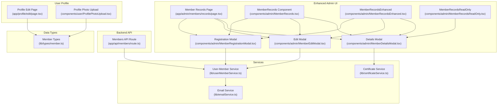
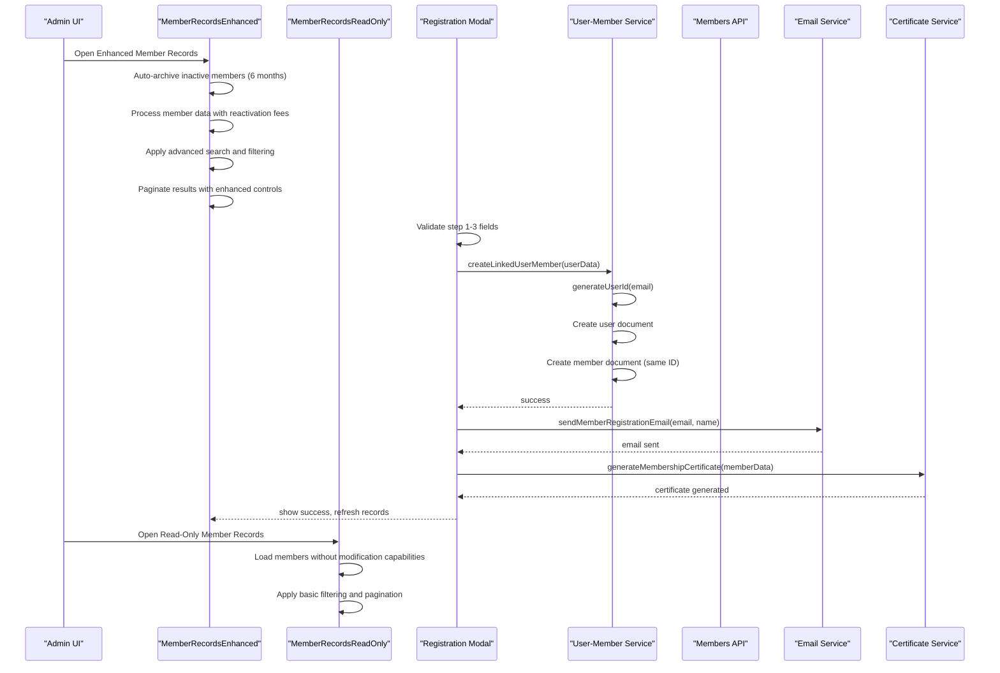
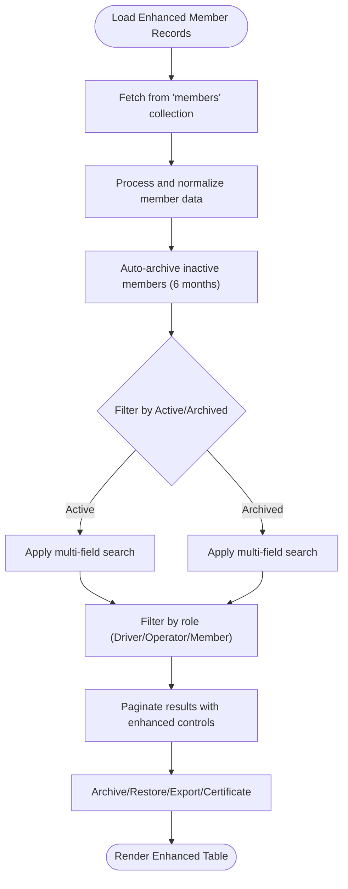
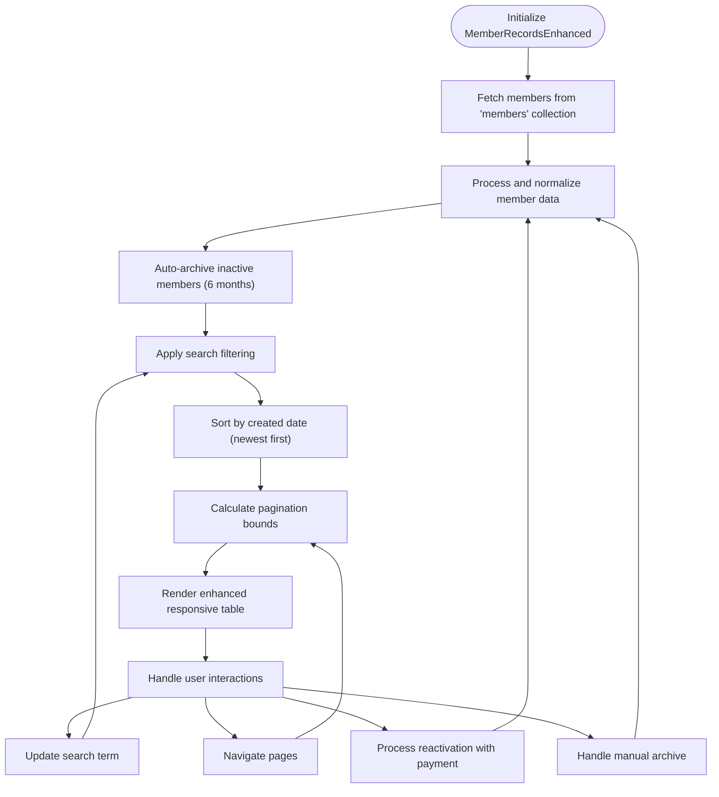
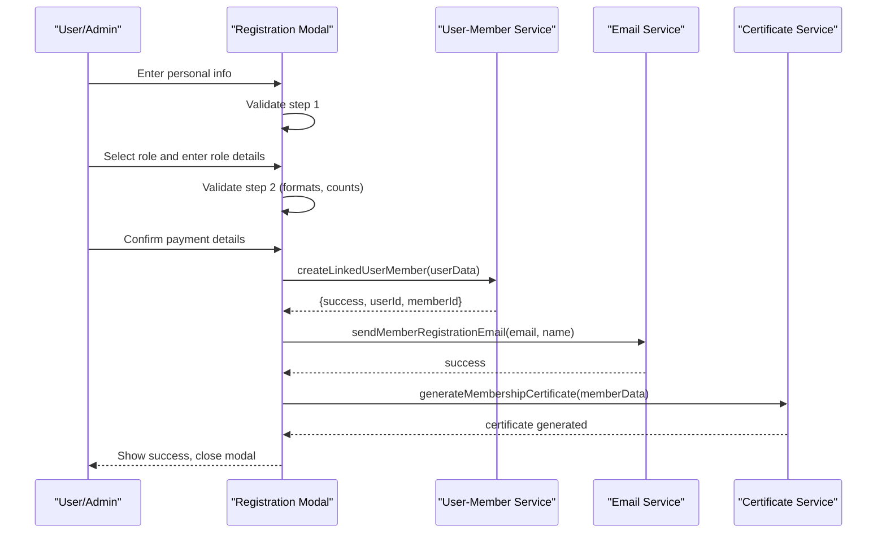
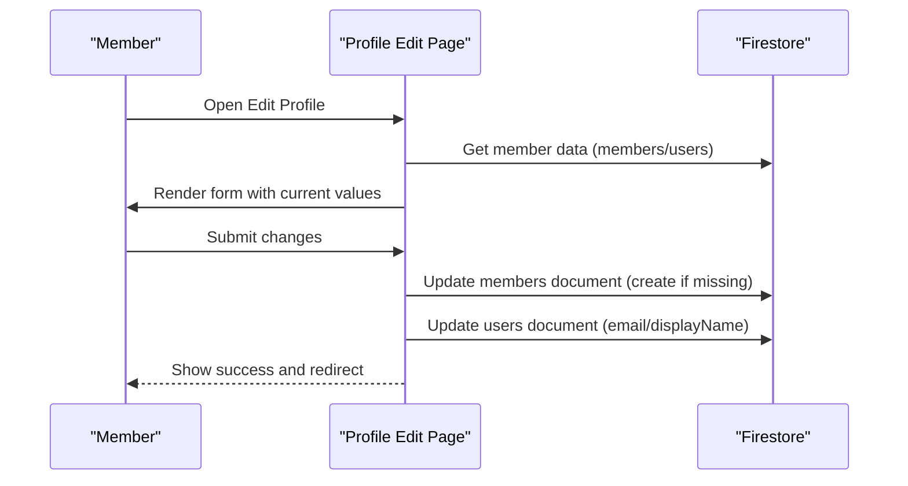
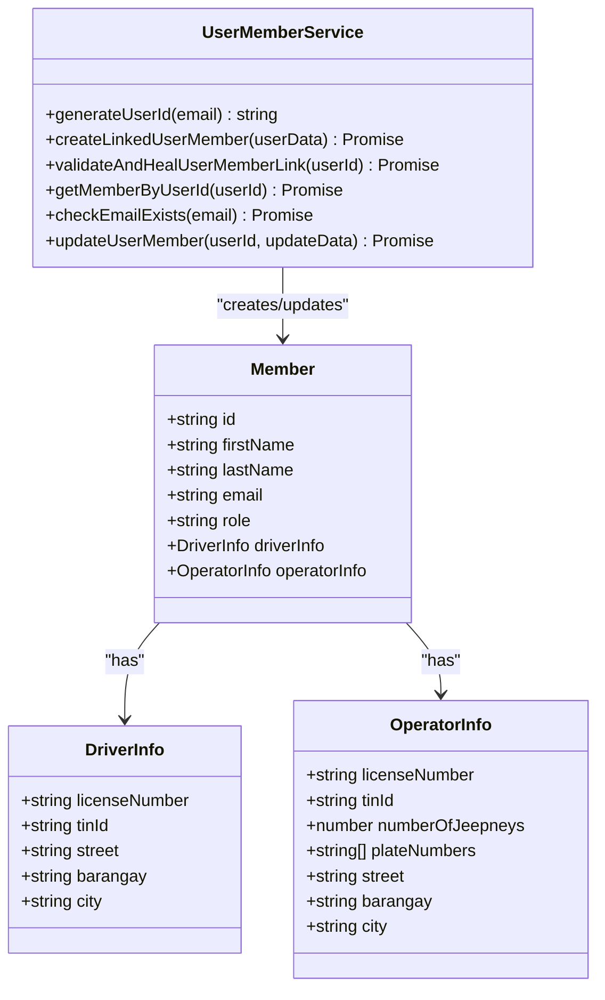
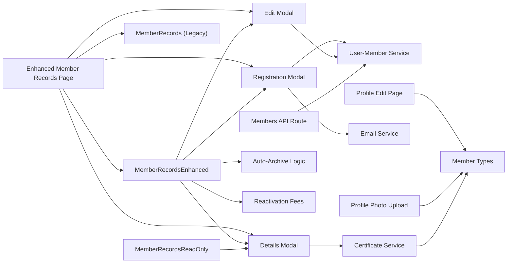

# Member Management System

<cite>
**Referenced Files in This Document**
- [app/admin/members/records/page.tsx](file://app/admin/members/records/page.tsx)
- [app/admin/members/page.tsx](file://app/admin/members/page.tsx)
- [app/admin/chairman/members/page.tsx](file://app/admin/chairman/members/page.tsx)
- [components/admin/MemberRecords.tsx](file://components/admin/MemberRecords.tsx)
- [components/admin/MemberRecordsEnhanced.tsx](file://components/admin/MemberRecordsEnhanced.tsx)
- [components/admin/MemberRecordsReadOnly.tsx](file://components/admin/MemberRecordsReadOnly.tsx)
- [components/admin/MemberRegistrationModal.tsx](file://components/admin/MemberRegistrationModal.tsx)
- [components/admin/MemberEditModal.tsx](file://components/admin/MemberEditModal.tsx)
- [components/admin/MemberDetailsModal.tsx](file://components/admin/MemberDetailsModal.tsx)
- [lib/userMemberService.ts](file://lib/userMemberService.ts)
- [lib/emailService.ts](file://lib/emailService.ts)
- [lib/types/member.ts](file://lib/types/member.ts)
- [lib/certificateService.ts](file://lib/certificateService.ts)
- [app/api/members/route.ts](file://app/api/members/route.ts)
- [app/profile/edit/page.tsx](file://app/profile/edit/page.tsx)
- [components/user/ProfilePhotoUpload.tsx](file://components/user/ProfilePhotoUpload.tsx)
</cite>

## Update Summary
**Changes Made**
- Enhanced Member Records System with sophisticated new components: MemberRecordsEnhanced.tsx and MemberRecordsReadOnly.tsx
- Replaced basic MemberRecords component with advanced data management features including auto-archiving, reactivation fees, and enhanced UI
- Added read-only variant for non-admin roles with simplified functionality
- Improved member records management with comprehensive filtering, detailed member information display, and advanced administrative capabilities
- Enhanced user-account-to-member-profile integration with improved validation and healing mechanisms

## Table of Contents
1. [Introduction](#introduction)
2. [Project Structure](#project-structure)
3. [Core Components](#core-components)
4. [Architecture Overview](#architecture-overview)
5. [Detailed Component Analysis](#detailed-component-analysis)
6. [Dependency Analysis](#dependency-analysis)
7. [Performance Considerations](#performance-considerations)
8. [Troubleshooting Guide](#troubleshooting-guide)
9. [Conclusion](#conclusion)

## Introduction
This document describes the Member Management System within the SAMPA Cooperative Management Platform. It covers the complete lifecycle of member onboarding, profile management, records administration, search and filtering, pagination, bulk operations, user-account-to-member-profile integration, status management, and compliance features. The system now includes enhanced member records management with sophisticated components featuring auto-archiving, reactivation fees, detailed member information display, and role-based access control, providing both comprehensive administrative capabilities and simplified read-only views.

## Project Structure
The Member Management System spans UI components, backend APIs, and shared services with enhanced component architecture:
- Enhanced Member Records Page with comprehensive filtering and pagination
- MemberRecordsEnhanced component providing advanced member management with auto-archiving and reactivation features
- MemberRecordsReadOnly component offering simplified read-only member viewing for non-admin roles
- Standalone MemberRecords component for legacy support
- Administrative modals for member registration, editing, and details viewing
- Services for user-member linking and email notifications
- Types for member data structures
- Certificate generation and management services
- Profile editing and photo upload components
- Backend API routes for member CRUD operations

**Diagram sources**
- [app/admin/members/records/page.tsx](file://app/admin/members/records/page.tsx#L1-L655)
- [app/admin/members/page.tsx](file://app/admin/members/page.tsx#L1-L522)
- [app/admin/chairman/members/page.tsx](file://app/admin/chairman/members/page.tsx#L1-L39)
- [components/admin/MemberRecords.tsx](file://components/admin/MemberRecords.tsx#L1-L748)
- [components/admin/MemberRecordsEnhanced.tsx](file://components/admin/MemberRecordsEnhanced.tsx#L1-L1034)
- [components/admin/MemberRecordsReadOnly.tsx](file://components/admin/MemberRecordsReadOnly.tsx#L1-L278)
- [components/admin/MemberRegistrationModal.tsx](file://components/admin/MemberRegistrationModal.tsx#L1-L1247)
- [components/admin/MemberEditModal.tsx](file://components/admin/MemberEditModal.tsx#L1-L820)
- [components/admin/MemberDetailsModal.tsx](file://components/admin/MemberDetailsModal.tsx#L1-L271)
- [lib/userMemberService.ts](file://lib/userMemberService.ts#L1-L287)
- [lib/emailService.ts](file://lib/emailService.ts#L1-L113)
- [lib/certificateService.ts](file://lib/certificateService.ts#L1-L207)
- [app/api/members/route.ts](file://app/api/members/route.ts#L1-L179)
- [lib/types/member.ts](file://lib/types/member.ts#L1-L56)
- [app/profile/edit/page.tsx](file://app/profile/edit/page.tsx#L1-L498)
- [components/user/ProfilePhotoUpload.tsx](file://components/user/ProfilePhotoUpload.tsx#L1-L166)

**Section sources**
- [app/admin/members/records/page.tsx](file://app/admin/members/records/page.tsx#L1-L655)
- [app/admin/members/page.tsx](file://app/admin/members/page.tsx#L1-L522)
- [app/admin/chairman/members/page.tsx](file://app/admin/chairman/members/page.tsx#L1-L39)
- [components/admin/MemberRecords.tsx](file://components/admin/MemberRecords.tsx#L1-L748)
- [components/admin/MemberRecordsEnhanced.tsx](file://components/admin/MemberRecordsEnhanced.tsx#L1-L1034)
- [components/admin/MemberRecordsReadOnly.tsx](file://components/admin/MemberRecordsReadOnly.tsx#L1-L278)
- [components/admin/MemberRegistrationModal.tsx](file://components/admin/MemberRegistrationModal.tsx#L1-L1247)
- [components/admin/MemberEditModal.tsx](file://components/admin/MemberEditModal.tsx#L1-L820)
- [components/admin/MemberDetailsModal.tsx](file://components/admin/MemberDetailsModal.tsx#L1-L271)
- [lib/userMemberService.ts](file://lib/userMemberService.ts#L1-L287)
- [lib/emailService.ts](file://lib/emailService.ts#L1-L113)
- [lib/certificateService.ts](file://lib/certificateService.ts#L1-L207)
- [app/api/members/route.ts](file://app/api/members/route.ts#L1-L179)
- [lib/types/member.ts](file://lib/types/member.ts#L1-L56)
- [app/profile/edit/page.tsx](file://app/profile/edit/page.tsx#L1-L498)
- [components/user/ProfilePhotoUpload.tsx](file://components/user/ProfilePhotoUpload.tsx#L1-L166)

## Core Components
- Enhanced Member Records Page: Comprehensive member management with advanced filtering, pagination, status management, and bulk operations
- MemberRecordsEnhanced Component: Advanced standalone component providing sophisticated member management capabilities with auto-archiving, reactivation fees, detailed member information display, search functionality, and responsive pagination
- MemberRecordsReadOnly Component: Simplified read-only component designed for non-admin roles with basic member viewing capabilities and essential filtering
- MemberRecords Component: Legacy basic component providing fundamental member management functionality (still maintained for backward compatibility)
- Registration Modal: Multi-step form for new member onboarding with real-time validation, role-specific fields, and payment summary
- Edit Modal: Multi-step form for updating member details with role-aware fields and dynamic plate numbers for operators
- Details Modal: Comprehensive member information display with personal details, address information, role-specific data, and certificate management
- User-Member Service: Ensures consistent IDs across users and members collections, validates and heals links, and synchronizes updates
- Email Service: Sends welcome emails and other notifications using EmailJS
- Certificate Service: Generates membership certificates in PDF format with cooperative branding and member details
- Member Types: Defines the Member, DriverInfo, OperatorInfo, and related interfaces
- Profile Edit Page: Allows authenticated members to update personal info, contact details, and role-specific data
- Profile Photo Upload: Handles image selection, validation, and updates to user documents

**Section sources**
- [app/admin/members/records/page.tsx](file://app/admin/members/records/page.tsx#L1-L655)
- [app/admin/members/page.tsx](file://app/admin/members/page.tsx#L1-L522)
- [app/admin/chairman/members/page.tsx](file://app/admin/chairman/members/page.tsx#L1-L39)
- [components/admin/MemberRecords.tsx](file://components/admin/MemberRecords.tsx#L1-L748)
- [components/admin/MemberRecordsEnhanced.tsx](file://components/admin/MemberRecordsEnhanced.tsx#L1-L1034)
- [components/admin/MemberRecordsReadOnly.tsx](file://components/admin/MemberRecordsReadOnly.tsx#L1-L278)
- [components/admin/MemberRegistrationModal.tsx](file://components/admin/MemberRegistrationModal.tsx#L1-L1247)
- [components/admin/MemberEditModal.tsx](file://components/admin/MemberEditModal.tsx#L1-L820)
- [components/admin/MemberDetailsModal.tsx](file://components/admin/MemberDetailsModal.tsx#L1-L271)
- [lib/userMemberService.ts](file://lib/userMemberService.ts#L1-L287)
- [lib/emailService.ts](file://lib/emailService.ts#L1-L113)
- [lib/certificateService.ts](file://lib/certificateService.ts#L1-L207)
- [lib/types/member.ts](file://lib/types/member.ts#L1-L56)
- [app/profile/edit/page.tsx](file://app/profile/edit/page.tsx#L1-L498)
- [components/user/ProfilePhotoUpload.tsx](file://components/user/ProfilePhotoUpload.tsx#L1-L166)

## Architecture Overview
The system integrates administrative and user-facing flows with backend APIs and shared services. The enhanced member management architecture now includes multiple specialized components with role-based access control, providing both comprehensive administrative capabilities and simplified read-only views for different user roles.

**Diagram sources**
- [app/admin/members/page.tsx](file://app/admin/members/page.tsx#L1-L522)
- [app/admin/chairman/members/page.tsx](file://app/admin/chairman/members/page.tsx#L1-L39)
- [components/admin/MemberRecordsEnhanced.tsx](file://components/admin/MemberRecordsEnhanced.tsx#L1-L1034)
- [components/admin/MemberRecordsReadOnly.tsx](file://components/admin/MemberRecordsReadOnly.tsx#L1-L278)
- [components/admin/MemberRegistrationModal.tsx](file://components/admin/MemberRegistrationModal.tsx#L213-L369)
- [lib/userMemberService.ts](file://lib/userMemberService.ts#L23-L92)
- [lib/emailService.ts](file://lib/emailService.ts#L41-L67)
- [lib/certificateService.ts](file://lib/certificateService.ts#L10-L175)

**Section sources**
- [app/admin/members/page.tsx](file://app/admin/members/page.tsx#L1-L522)
- [app/admin/chairman/members/page.tsx](file://app/admin/chairman/members/page.tsx#L1-L39)
- [components/admin/MemberRecordsEnhanced.tsx](file://components/admin/MemberRecordsEnhanced.tsx#L1-L1034)
- [components/admin/MemberRecordsReadOnly.tsx](file://components/admin/MemberRecordsReadOnly.tsx#L1-L278)
- [components/admin/MemberRegistrationModal.tsx](file://components/admin/MemberRegistrationModal.tsx#L1-L1247)
- [lib/userMemberService.ts](file://lib/userMemberService.ts#L1-L287)
- [lib/emailService.ts](file://lib/emailService.ts#L1-L113)
- [lib/certificateService.ts](file://lib/certificateService.ts#L1-L207)

## Detailed Component Analysis

### Enhanced Member Records Administration
The Member Records Page now provides comprehensive member management capabilities through the enhanced component:
- Advanced data sourcing from members collection with comprehensive member processing
- Auto-archiving functionality for inactive members (6-month inactivity threshold)
- Reactivation fee processing with payment validation and transaction logging
- Multi-field filtering by active/archived status, name, email, and ID
- Sophisticated pagination with configurable items per page and responsive controls
- Status-based filtering with color-coded indicators (Active, Inactive, Pending, Archived)
- Archive/restore actions with confirmation dialogs and payment validation
- CSV export functionality with comprehensive member data
- Integration with modals for viewing, editing, and adding members
- Certificate generation and display capabilities

**Diagram sources**
- [app/admin/members/page.tsx](file://app/admin/members/page.tsx#L218-L220)
- [components/admin/MemberRecordsEnhanced.tsx](file://components/admin/MemberRecordsEnhanced.tsx#L393-L489)
- [components/admin/MemberRecordsEnhanced.tsx](file://components/admin/MemberRecordsEnhanced.tsx#L430-L432)
- [components/admin/MemberRecordsEnhanced.tsx](file://components/admin/MemberRecordsEnhanced.tsx#L372-L391)

**Section sources**
- [app/admin/members/page.tsx](file://app/admin/members/page.tsx#L1-L522)
- [components/admin/MemberRecordsEnhanced.tsx](file://components/admin/MemberRecordsEnhanced.tsx#L1-L1034)

### MemberRecordsEnhanced Component
The new MemberRecordsEnhanced component provides sophisticated member management capabilities with 1034 lines of comprehensive functionality:
- Advanced member listing with auto-archiving, reactivation fees, and detailed member information
- Auto-archiving logic for members inactive for 6+ months with transaction logging
- Reactivation fee processing with payment validation and receipt number tracking
- Enhanced search functionality across names, emails, phone numbers, and IDs
- Sophisticated pagination with previous/next controls and page number indicators
- Color-coded status indicators with hover effects and proper accessibility
- Responsive table design with member avatars and loading states
- Detailed member information display with archive reasons and reactivation details
- Loading states with skeleton animations and error handling with retry functionality
- Client-side filtering with real-time search across multiple fields
- Automatic sorting by creation date with newest members first
- Advanced modal dialogs for restore confirmation with payment validation

**Updated** Added comprehensive enhanced member management component with 1034 lines of advanced functionality

**Diagram sources**
- [components/admin/MemberRecordsEnhanced.tsx](file://components/admin/MemberRecordsEnhanced.tsx#L367-L369)
- [components/admin/MemberRecordsEnhanced.tsx](file://components/admin/MemberRecordsEnhanced.tsx#L372-L391)
- [components/admin/MemberRecordsEnhanced.tsx](file://components/admin/MemberRecordsEnhanced.tsx#L491-L501)

**Section sources**
- [components/admin/MemberRecordsEnhanced.tsx](file://components/admin/MemberRecordsEnhanced.tsx#L1-L1034)

### MemberRecordsReadOnly Component
The new MemberRecordsReadOnly component provides simplified read-only member viewing capabilities with 278 lines of streamlined functionality:
- Basic member listing without modification capabilities for non-admin roles
- Essential filtering by active/archived status and search functionality
- Simple pagination with previous/next controls and page number indicators
- Clean, accessible interface focused solely on member information display
- Responsive design optimized for quick member lookup and verification
- Loading states and error handling for reliable user experience
- Basic status indicators with color coding for member status
- Minimal interaction model suitable for role-based access control

**Updated** Added simplified read-only member management component for non-admin roles

**Section sources**
- [components/admin/MemberRecordsReadOnly.tsx](file://components/admin/MemberRecordsReadOnly.tsx#L1-L278)

### Member Registration Workflow
The Registration Modal implements a three-step wizard:
- Step 1: Personal info, role selection, and address fields
- Step 2: Role-specific fields (license/TIN) and operator plate numbers
- Step 3: Payment summary and confirmation

Validation includes:
- Real-time field validation with user-friendly messages
- Age calculation from birthdate
- License/TIN format enforcement with auto-formatting
- Dynamic plate number fields based on number of jeepneys
- Email uniqueness check against the users collection

**Diagram sources**
- [components/admin/MemberRegistrationModal.tsx](file://components/admin/MemberRegistrationModal.tsx#L103-L144)
- [components/admin/MemberRegistrationModal.tsx](file://components/admin/MemberRegistrationModal.tsx#L213-L369)
- [lib/userMemberService.ts](file://lib/userMemberService.ts#L23-L92)
- [lib/emailService.ts](file://lib/emailService.ts#L41-L67)
- [lib/certificateService.ts](file://lib/certificateService.ts#L10-L175)

**Section sources**
- [components/admin/MemberRegistrationModal.tsx](file://components/admin/MemberRegistrationModal.tsx#L1-L1247)
- [lib/userMemberService.ts](file://lib/userMemberService.ts#L1-L287)
- [lib/emailService.ts](file://lib/emailService.ts#L1-L113)
- [lib/certificateService.ts](file://lib/certificateService.ts#L1-L207)

### Member Profile Management
Authenticated members can update:
- Personal information (names, email, phone, birthdate)
- Role-specific details (license/TIN) and address fields
- Profile photo via base64 storage in the users collection

The Profile Edit Page:
- Loads member data from members or users collections with fallback
- Applies role-aware field rendering
- Updates both members and users collections when needed
- Syncs auth context display name and email when changed

**Diagram sources**
- [app/profile/edit/page.tsx](file://app/profile/edit/page.tsx#L40-L194)
- [app/profile/edit/page.tsx](file://app/profile/edit/page.tsx#L204-L311)

**Section sources**
- [app/profile/edit/page.tsx](file://app/profile/edit/page.tsx#L1-L498)
- [components/user/ProfilePhotoUpload.tsx](file://components/user/ProfilePhotoUpload.tsx#L1-L166)

### Enhanced Member Search and Filtering
The Member Records Page supports:
- Tabbed navigation between Active and Archived members
- Multi-field search across first/last/middle/suffix, email, and ID
- Case-insensitive substring matching with automatic reset to first page
- Role-based filtering with dropdown selectors
- Status-based filtering with color-coded indicators
- Real-time search with debouncing for performance

**Updated** Enhanced search functionality with multi-field matching and role filtering

**Section sources**
- [app/admin/members/records/page.tsx](file://app/admin/members/records/page.tsx#L149-L194)
- [app/admin/members/records/page.tsx](file://app/admin/members/records/page.tsx#L156-L194)

### Advanced Pagination Implementation
Enhanced pagination logic:
- Items per page: 10 with responsive design
- Current page state managed locally with URL persistence
- Responsive pagination controls with previous/next and numbered pages
- Shows item range and total count with page size indicators
- Smart page number calculation with ellipsis for large datasets
- Disabled states for boundary conditions

**Updated** Enhanced pagination with smart page number calculation and responsive design

**Section sources**
- [app/admin/members/records/page.tsx](file://app/admin/members/records/page.tsx#L307-L316)
- [app/admin/members/records/page.tsx](file://app/admin/members/records/page.tsx#L535-L627)
- [app/admin/members/records/page.tsx](file://app/admin/members/records/page.tsx#L576-L611)

### Bulk Operations
Enhanced bulk-like operations supported:
- Export filtered records to CSV with comprehensive member data
- Archive/restore individual members with confirmation dialogs
- Administrative actions triggered from the records table
- Certificate generation and download capabilities
- Status-based filtering for efficient member management

**Updated** Added certificate generation and enhanced bulk operations

**Section sources**
- [app/admin/members/records/page.tsx](file://app/admin/members/records/page.tsx#L252-L283)
- [app/admin/members/records/page.tsx](file://app/admin/members/records/page.tsx#L204-L250)
- [app/admin/members/records/page.tsx](file://app/admin/members/records/page.tsx#L252-L283)

### User Account and Member Profile Integration
The User-Member Service:
- Generates consistent IDs from email addresses
- Creates linked user and member documents with identical IDs
- Validates and heals linkage on login or retrieval
- Updates both collections in parallel where appropriate
- Provides helpers to check email existence and update records consistently

**Diagram sources**
- [lib/userMemberService.ts](file://lib/userMemberService.ts#L14-L92)
- [lib/types/member.ts](file://lib/types/member.ts#L1-L56)

**Section sources**
- [lib/userMemberService.ts](file://lib/userMemberService.ts#L1-L287)
- [lib/types/member.ts](file://lib/types/member.ts#L1-L56)

### Enhanced Member Status Management and Compliance
- Status fields: Active by default; archived flag maintained for historical records
- Enhanced status indicators with color coding (green for Active, gray for Archived, yellow for Pending)
- Auto-archiving functionality for members inactive for 6+ months with transaction logging
- Reactivation fee processing with payment validation and receipt number tracking
- Compliance: Email verification workflow via welcome email with password setup link
- Data retention: Archived members excluded from active listings; export includes archived status
- Certificate management: Automated certificate generation and PDF download capabilities
- Audit trail: Comprehensive logging of member status changes and administrative actions

**Updated** Enhanced status management with auto-archiving, reactivation fees, and certificate capabilities

**Section sources**
- [components/admin/MemberRecordsEnhanced.tsx](file://components/admin/MemberRecordsEnhanced.tsx#L96-L146)
- [components/admin/MemberRecordsEnhanced.tsx](file://components/admin/MemberRecordsEnhanced.tsx#L148-L165)
- [components/admin/MemberRecordsEnhanced.tsx](file://components/admin/MemberRecordsEnhanced.tsx#L167-L237)
- [lib/emailService.ts](file://lib/emailService.ts#L41-L67)
- [app/admin/members/records/page.tsx](file://app/admin/members/records/page.tsx#L204-L250)
- [components/admin/MemberDetailsModal.tsx](file://components/admin/MemberDetailsModal.tsx#L202-L257)

### Certificate Generation and Management
The Certificate Service provides comprehensive membership certificate functionality:
- Generates professional PDF certificates with cooperative branding
- Includes member details, role, registration date, and membership ID
- Stores certificates in Firestore with base64 encoding
- Provides certificate retrieval and display capabilities
- Integrates with member registration workflow

**Updated** Added comprehensive certificate generation and management system

**Section sources**
- [lib/certificateService.ts](file://lib/certificateService.ts#L1-L207)
- [components/admin/MemberDetailsModal.tsx](file://components/admin/MemberDetailsModal.tsx#L202-L257)

### Role-Based Access Control
The system now implements role-based access control for member records:
- **Administrative Roles** (Admin, Chairman, Manager, Treasurer, Secretary, Vice-Chairman): Full access to MemberRecordsEnhanced with advanced features
- **Chairman and Vice-Chairman**: Access to MemberRecordsReadOnly for simplified member viewing
- **Other Users**: Restricted access based on role validation and routing

**Updated** Added role-based access control with specialized components for different user roles

**Section sources**
- [app/admin/members/page.tsx](file://app/admin/members/page.tsx#L1-L522)
- [app/admin/chairman/members/page.tsx](file://app/admin/chairman/members/page.tsx#L1-L39)

### Practical Examples
- Onboarding a new Driver:
  - Open Registration Modal, select Driver role, fill personal and address info, enter license/TIN, confirm payment, submit.
  - System creates linked user and member records, sends welcome email, and generates membership certificate.
- Updating a member's contact details:
  - Navigate to Profile Edit, update phone/email/birthdate/address, submit; system syncs both collections.
- Admin archiving a member:
  - From Member Records, click Archive; member moves to Archived tab and is excluded from active listings.
- Generating member certificates:
  - Access Member Details Modal, click View Certificate, then Download Certificate or Open in New Tab.
- Managing member records with enhanced features:
  - Use MemberRecordsEnhanced component for comprehensive member management, auto-archiving, reactivation fees, and detailed member information.
- Viewing member records in read-only mode:
  - Use MemberRecordsReadOnly component for simplified member viewing without modification capabilities.
- Using legacy MemberRecords component:
  - Import and embed the MemberRecords component for basic member listing functionality with fundamental features.

**Updated** Added certificate generation examples, enhanced member management workflows, and role-based access examples

**Section sources**
- [components/admin/MemberRegistrationModal.tsx](file://components/admin/MemberRegistrationModal.tsx#L1-L1247)
- [app/profile/edit/page.tsx](file://app/profile/edit/page.tsx#L1-L498)
- [app/admin/members/records/page.tsx](file://app/admin/members/records/page.tsx#L196-L250)
- [components/admin/MemberDetailsModal.tsx](file://components/admin/MemberDetailsModal.tsx#L202-L257)
- [components/admin/MemberRecordsEnhanced.tsx](file://components/admin/MemberRecordsEnhanced.tsx#L1-L1034)
- [components/admin/MemberRecordsReadOnly.tsx](file://components/admin/MemberRecordsReadOnly.tsx#L1-L278)
- [components/admin/MemberRecords.tsx](file://components/admin/MemberRecords.tsx#L1-L748)

## Dependency Analysis
Key dependencies and relationships:
- Enhanced Member Records Page depends on Firestore for data and on modals/components for actions
- MemberRecordsEnhanced provides advanced functionality with auto-archiving and reactivation features
- MemberRecordsReadOnly provides simplified functionality for non-admin roles
- MemberRecords component provides legacy support with basic member management
- Registration/Edit Details Modals depend on User-Member Service for linking and on Email Service for notifications
- Certificate Service depends on jsPDF and Firestore for PDF generation and storage
- Profile Edit Page depends on auth context and Firestore for updates
- Backend API route provides CRUD endpoints for members and collaborates with user-member service logic

**Diagram sources**
- [app/admin/members/records/page.tsx](file://app/admin/members/records/page.tsx#L1-L655)
- [app/admin/members/page.tsx](file://app/admin/members/page.tsx#L1-L522)
- [app/admin/chairman/members/page.tsx](file://app/admin/chairman/members/page.tsx#L1-L39)
- [components/admin/MemberRecords.tsx](file://components/admin/MemberRecords.tsx#L1-L748)
- [components/admin/MemberRecordsEnhanced.tsx](file://components/admin/MemberRecordsEnhanced.tsx#L1-L1034)
- [components/admin/MemberRecordsReadOnly.tsx](file://components/admin/MemberRecordsReadOnly.tsx#L1-L278)
- [components/admin/MemberRegistrationModal.tsx](file://components/admin/MemberRegistrationModal.tsx#L1-L1247)
- [components/admin/MemberEditModal.tsx](file://components/admin/MemberEditModal.tsx#L1-L820)
- [components/admin/MemberDetailsModal.tsx](file://components/admin/MemberDetailsModal.tsx#L1-L271)
- [lib/userMemberService.ts](file://lib/userMemberService.ts#L1-L287)
- [lib/emailService.ts](file://lib/emailService.ts#L1-L113)
- [lib/certificateService.ts](file://lib/certificateService.ts#L1-L207)
- [app/api/members/route.ts](file://app/api/members/route.ts#L1-L179)
- [lib/types/member.ts](file://lib/types/member.ts#L1-L56)
- [app/profile/edit/page.tsx](file://app/profile/edit/page.tsx#L1-L498)
- [components/user/ProfilePhotoUpload.tsx](file://components/user/ProfilePhotoUpload.tsx#L1-L166)

**Section sources**
- [app/admin/members/records/page.tsx](file://app/admin/members/records/page.tsx#L1-L655)
- [app/admin/members/page.tsx](file://app/admin/members/page.tsx#L1-L522)
- [app/admin/chairman/members/page.tsx](file://app/admin/chairman/members/page.tsx#L1-L39)
- [components/admin/MemberRecords.tsx](file://components/admin/MemberRecords.tsx#L1-L748)
- [components/admin/MemberRecordsEnhanced.tsx](file://components/admin/MemberRecordsEnhanced.tsx#L1-L1034)
- [components/admin/MemberRecordsReadOnly.tsx](file://components/admin/MemberRecordsReadOnly.tsx#L1-L278)
- [components/admin/MemberRegistrationModal.tsx](file://components/admin/MemberRegistrationModal.tsx#L1-L1247)
- [components/admin/MemberEditModal.tsx](file://components/admin/MemberEditModal.tsx#L1-L820)
- [components/admin/MemberDetailsModal.tsx](file://components/admin/MemberDetailsModal.tsx#L1-L271)
- [lib/userMemberService.ts](file://lib/userMemberService.ts#L1-L287)
- [lib/emailService.ts](file://lib/emailService.ts#L1-L113)
- [lib/certificateService.ts](file://lib/certificateService.ts#L1-L207)
- [app/api/members/route.ts](file://app/api/members/route.ts#L1-L179)
- [lib/types/member.ts](file://lib/types/member.ts#L1-L56)
- [app/profile/edit/page.tsx](file://app/profile/edit/page.tsx#L1-L498)
- [components/user/ProfilePhotoUpload.tsx](file://components/user/ProfilePhotoUpload.tsx#L1-L166)

## Performance Considerations
- Enhanced pagination reduces DOM load and improves responsiveness for large datasets with smart page number calculation
- Auto-archiving functionality processes members efficiently with batch operations and transaction logging
- Reactivation fee processing includes payment validation to prevent invalid operations
- Client-side filtering with debouncing is efficient for moderate record sizes; consider server-side filtering for very large datasets
- Parallel updates in User-Member Service minimize round trips when updating both collections
- Image upload currently stores base64 in Firestore; for production, migrate to Firebase Storage for better performance and cost efficiency
- MemberRecordsEnhanced component provides focused functionality with optimized rendering and responsive design
- MemberRecordsReadOnly component offers streamlined performance for read-only operations
- Certificate generation uses lazy loading to improve initial page load performance
- PDF generation occurs client-side with jsPDF for immediate certificate availability

**Updated** Enhanced performance considerations for new MemberRecordsEnhanced and MemberRecordsReadOnly components

## Troubleshooting Guide
Common issues and resolutions:
- Member not found in members collection:
  - The system falls back to users collection and normalizes fields; verify role and optional fields.
- Email already exists:
  - Registration prevents duplicate emails; prompt user to use another email or recover existing account.
- Linkage inconsistencies:
  - Use validateAndHealUserMemberLink to detect and repair mismatched IDs or missing member documents.
- Update failures:
  - Check Firestore permissions and network connectivity; review returned error messages for specific causes.
- Email delivery issues:
  - Verify EmailJS configuration and template IDs; ensure environment variables are set.
- Certificate generation failures:
  - Check certificate service availability and PDF generation permissions.
- Pagination issues:
  - Verify Firestore query limits and pagination calculations for large datasets.
- Auto-archiving failures:
  - Check member activity timestamps and ensure proper date formatting in Firestore.
- Reactivation fee processing errors:
  - Verify receipt number validation and payment processing logic.
- Role-based access issues:
  - Ensure proper authentication and role validation for component access.

**Updated** Added troubleshooting guidance for auto-archiving, reactivation fees, role-based access, and new component features

**Section sources**
- [app/admin/members/records/page.tsx](file://app/admin/members/records/page.tsx#L44-L88)
- [components/admin/MemberRecordsEnhanced.tsx](file://components/admin/MemberRecordsEnhanced.tsx#L240-L271)
- [components/admin/MemberRecordsEnhanced.tsx](file://components/admin/MemberRecordsEnhanced.tsx#L167-L237)
- [lib/userMemberService.ts](file://lib/userMemberService.ts#L99-L198)
- [lib/emailService.ts](file://lib/emailService.ts#L19-L38)
- [components/admin/MemberDetailsModal.tsx](file://components/admin/MemberDetailsModal.tsx#L202-L257)
- [components/admin/MemberRecords.tsx](file://components/admin/MemberRecords.tsx#L1-L748)

## Conclusion
The Member Management System provides a robust, integrated solution for managing cooperative members with significantly enhanced capabilities. The system now includes sophisticated member records management through the new MemberRecordsEnhanced component with auto-archiving, reactivation fees, and comprehensive administrative features, while the MemberRecordsReadOnly component provides simplified access for non-admin roles. The enhanced system offers advanced filtering, detailed member information display, improved administrative capabilities, and role-based access control. The modular architecture supports scalability and maintainability with enhanced certificate management, status tracking, responsive design features, and comprehensive audit trails. The new components provide excellent foundations for future enhancements and specialized member management scenarios, ensuring strong user-account-to-member-profile linkage, comprehensive validation, and smooth onboarding experiences for all user roles.