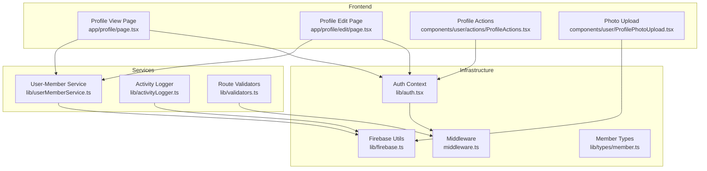
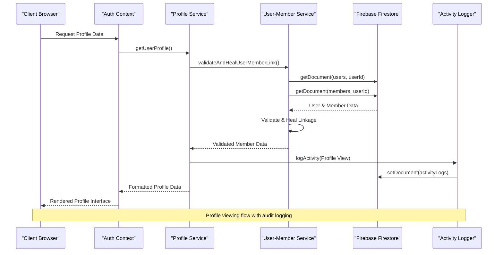
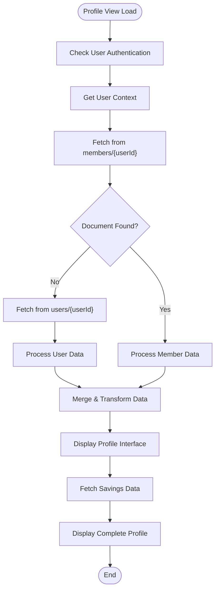
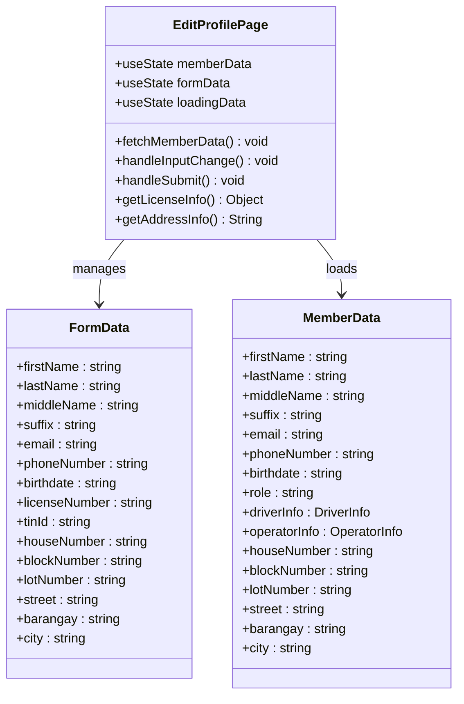
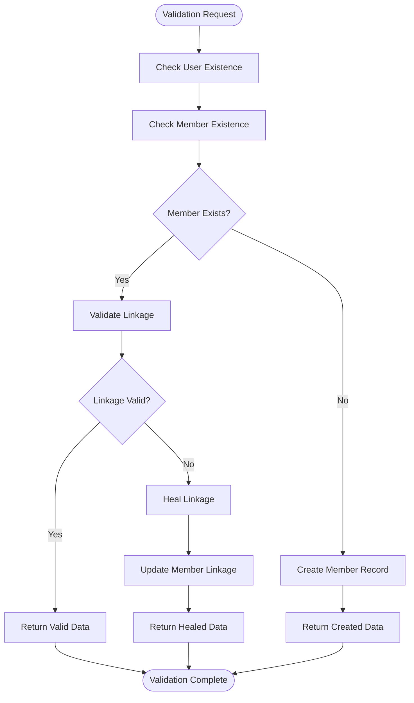
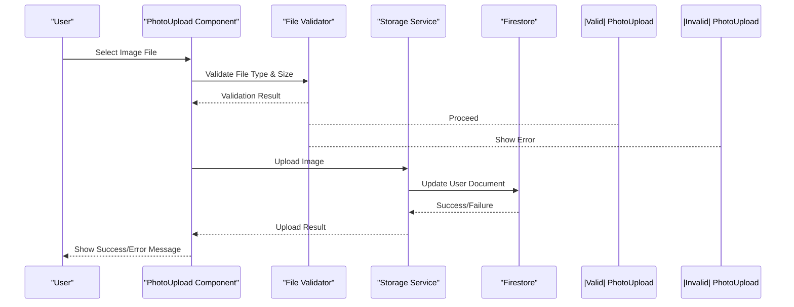
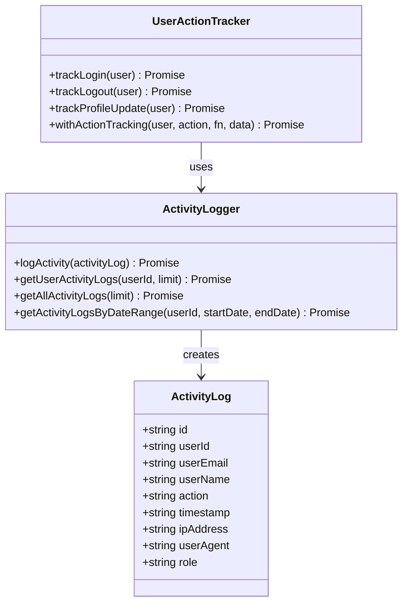
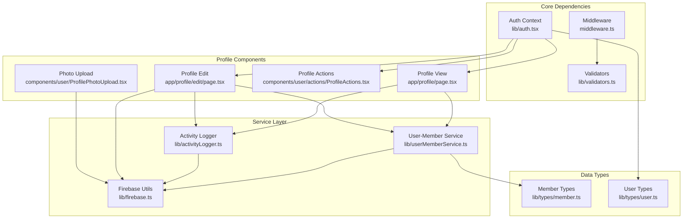

# Member Profile Management

<cite>
**Referenced Files in This Document**
- [app/profile/page.tsx](file://app/profile/page.tsx)
- [app/profile/edit/page.tsx](file://app/profile/edit/page.tsx)
- [components/user/actions/ProfileActions.tsx](file://components/user/actions/ProfileActions.tsx)
- [components/user/ProfilePhotoUpload.tsx](file://components/user/ProfilePhotoUpload.tsx)
- [lib/userMemberService.ts](file://lib/userMemberService.ts)
- [lib/activityLogger.ts](file://lib/activityLogger.ts)
- [lib/validators.ts](file://lib/validators.ts)
- [lib/auth.tsx](file://lib/auth.tsx)
- [middleware.ts](file://middleware.ts)
- [lib/firebase.ts](file://lib/firebase.ts)
- [lib/types/member.ts](file://lib/types/member.ts)
- [docs/USER_MEMBER_LINKING.md](file://docs/USER_MEMBER_LINKING.md)
- [docs/API_BEST_PRACTICES.md](file://docs/API_BEST_PRACTICES.md)
- [ROLE_BASED_ACCESS_CONTROL.md](file://ROLE_BASED_ACCESS_CONTROL.md)
</cite>

## Table of Contents
1. [Introduction](#introduction)
2. [Project Structure](#project-structure)
3. [Core Components](#core-components)
4. [Architecture Overview](#architecture-overview)
5. [Detailed Component Analysis](#detailed-component-analysis)
6. [Dependency Analysis](#dependency-analysis)
7. [Performance Considerations](#performance-considerations)
8. [Troubleshooting Guide](#troubleshooting-guide)
9. [Conclusion](#conclusion)

## Introduction
This document provides comprehensive documentation for the Member Profile Management functionality within the SAMPA Cooperative Management System. It covers the profile viewing interface, editing capabilities, data validation rules, field-level permissions, audit trail requirements, integration between user accounts and member profiles, profile photo upload system, and performance considerations for large member databases.

## Project Structure
The Member Profile Management system spans several key areas:
- Frontend pages for profile viewing and editing
- User interface components for profile actions and photo uploads
- Backend services for user-member linking and synchronization
- Authentication and middleware for access control
- Activity logging for audit trails
- Firebase integration for data persistence

**Diagram sources**
- [app/profile/page.tsx](file://app/profile/page.tsx#L1-L296)
- [app/profile/edit/page.tsx](file://app/profile/edit/page.tsx#L1-L498)
- [components/user/actions/ProfileActions.tsx](file://components/user/actions/ProfileActions.tsx#L1-L101)
- [components/user/ProfilePhotoUpload.tsx](file://components/user/ProfilePhotoUpload.tsx#L1-L166)
- [lib/userMemberService.ts](file://lib/userMemberService.ts#L1-L287)
- [lib/activityLogger.ts](file://lib/activityLogger.ts#L1-L165)
- [lib/validators.ts](file://lib/validators.ts#L1-L236)
- [lib/auth.tsx](file://lib/auth.tsx#L1-L682)
- [middleware.ts](file://middleware.ts#L1-L62)
- [lib/firebase.ts](file://lib/firebase.ts#L1-L309)
- [lib/types/member.ts](file://lib/types/member.ts#L1-L56)

**Section sources**
- [app/profile/page.tsx](file://app/profile/page.tsx#L1-L296)
- [app/profile/edit/page.tsx](file://app/profile/edit/page.tsx#L1-L498)
- [components/user/actions/ProfileActions.tsx](file://components/user/actions/ProfileActions.tsx#L1-L101)
- [components/user/ProfilePhotoUpload.tsx](file://components/user/ProfilePhotoUpload.tsx#L1-L166)
- [lib/userMemberService.ts](file://lib/userMemberService.ts#L1-L287)
- [lib/activityLogger.ts](file://lib/activityLogger.ts#L1-L165)
- [lib/validators.ts](file://lib/validators.ts#L1-L236)
- [lib/auth.tsx](file://lib/auth.tsx#L1-L682)
- [middleware.ts](file://middleware.ts#L1-L62)
- [lib/firebase.ts](file://lib/firebase.ts#L1-L309)
- [lib/types/member.ts](file://lib/types/member.ts#L1-L56)

## Core Components
The Member Profile Management system consists of several interconnected components that work together to provide a seamless user experience:

### Profile Viewing Interface
The profile viewing interface displays comprehensive member information including personal details, contact information, role assignments, and account settings. It supports both members and role-specific profiles (drivers and operators) with specialized information display.

### Profile Editing Capabilities
The editing interface allows authorized users to update member information, photos, and preferences. It includes form validation, conditional field rendering based on user roles, and automatic synchronization between user and member collections.

### User-Member Integration Service
A critical service ensures consistent ID generation and automatic healing of user-member linkages. This service maintains data consistency across the `users` and `members` collections and provides atomic operations for data synchronization.

### Activity Logging System
The system implements comprehensive audit trails for all profile-related activities, including profile updates, photo uploads, and security-related actions. This provides compliance support and enables monitoring of system usage.

**Section sources**
- [app/profile/page.tsx](file://app/profile/page.tsx#L206-L289)
- [app/profile/edit/page.tsx](file://app/profile/edit/page.tsx#L10-L311)
- [lib/userMemberService.ts](file://lib/userMemberService.ts#L23-L92)
- [lib/activityLogger.ts](file://lib/activityLogger.ts#L16-L43)

## Architecture Overview
The Member Profile Management system follows a layered architecture with clear separation of concerns:

**Diagram sources**
- [lib/auth.tsx](file://lib/auth.tsx#L158-L195)
- [lib/userMemberService.ts](file://lib/userMemberService.ts#L99-L198)
- [lib/activityLogger.ts](file://lib/activityLogger.ts#L20-L43)

The architecture ensures:
- **Single Source of Truth**: Consistent user identification across collections
- **Automatic Healing**: Transparent repair of broken linkages
- **Audit Compliance**: Comprehensive logging of all profile activities
- **Role-Based Access**: Secure access control based on user roles

## Detailed Component Analysis

### Profile View Component
The profile view component serves as the central hub for displaying member information. It implements intelligent data sourcing from both `members` and `users` collections with automatic fallback mechanisms.

**Diagram sources**
- [app/profile/page.tsx](file://app/profile/page.tsx#L26-L102)

Key features include:
- **Dual Collection Support**: Automatic fallback from members to users collection
- **Role-Specific Rendering**: Conditional display of driver/operator specific fields
- **Address Formatting**: Intelligent address construction based on role and data availability
- **Real-time Loading States**: Responsive loading indicators and error handling

**Section sources**
- [app/profile/page.tsx](file://app/profile/page.tsx#L32-L102)
- [app/profile/page.tsx](file://app/profile/page.tsx#L138-L202)

### Profile Edit Component
The profile editing interface provides comprehensive form management with role-aware field rendering and robust validation.

**Diagram sources**
- [app/profile/edit/page.tsx](file://app/profile/edit/page.tsx#L10-L311)

The editing system implements:
- **Conditional Field Rendering**: Driver/operator specific fields appear based on role
- **Dual Collection Updates**: Simultaneous updates to both users and members collections
- **Email Change Handling**: Automatic synchronization of email changes across collections
- **Form Validation**: Required field validation and role-specific constraints

**Section sources**
- [app/profile/edit/page.tsx](file://app/profile/edit/page.tsx#L40-L194)
- [app/profile/edit/page.tsx](file://app/profile/edit/page.tsx#L204-L311)

### User-Member Linking Service
The user-member linking service ensures data consistency and provides automatic healing capabilities.

**Diagram sources**
- [lib/userMemberService.ts](file://lib/userMemberService.ts#L99-L198)

Key capabilities include:
- **Consistent ID Generation**: Single source of truth for user identification
- **Automatic Member Creation**: Missing member records are created during login
- **Linkage Repair**: Broken connections are automatically fixed
- **Atomic Operations**: Concurrent updates maintain data integrity

**Section sources**
- [lib/userMemberService.ts](file://lib/userMemberService.ts#L14-L92)
- [lib/userMemberService.ts](file://lib/userMemberService.ts#L99-L198)

### Profile Photo Upload System
The photo upload system provides secure image handling with validation and storage capabilities.

**Diagram sources**
- [components/user/ProfilePhotoUpload.tsx](file://components/user/ProfilePhotoUpload.tsx#L41-L106)

The system includes:
- **File Validation**: MIME type and size restrictions (image/*, < 2MB)
- **Preview Generation**: Client-side image preview functionality
- **Storage Integration**: Base64 encoding for demonstration purposes
- **Error Handling**: Comprehensive validation and error reporting

**Section sources**
- [components/user/ProfilePhotoUpload.tsx](file://components/user/ProfilePhotoUpload.tsx#L41-L106)
- [components/user/ProfilePhotoUpload.tsx](file://components/user/ProfilePhotoUpload.tsx#L112-L165)

### Activity Logging and Audit Trail
The activity logging system provides comprehensive audit capabilities for all profile-related actions.

**Diagram sources**
- [lib/activityLogger.ts](file://lib/activityLogger.ts#L3-L43)
- [lib/userActionTracker.ts](file://lib/userActionTracker.ts#L10-L47)

The audit system provides:
- **Comprehensive Logging**: All user actions are captured with metadata
- **Flexible Queries**: Support for filtering by user, date range, and action type
- **Privacy Protection**: Client IP addresses are handled appropriately
- **Integration Points**: Hooks for automatic logging of system events

**Section sources**
- [lib/activityLogger.ts](file://lib/activityLogger.ts#L16-L86)
- [lib/userActionTracker.ts](file://lib/userActionTracker.ts#L84-L94)

## Dependency Analysis
The Member Profile Management system exhibits strong modularity with clear dependency relationships:

**Diagram sources**
- [lib/auth.tsx](file://lib/auth.tsx#L158-L195)
- [middleware.ts](file://middleware.ts#L5-L56)
- [lib/validators.ts](file://lib/validators.ts#L199-L235)
- [app/profile/page.tsx](file://app/profile/page.tsx#L3-L11)
- [app/profile/edit/page.tsx](file://app/profile/edit/page.tsx#L3-L11)

**Section sources**
- [lib/auth.tsx](file://lib/auth.tsx#L158-L195)
- [middleware.ts](file://middleware.ts#L5-L56)
- [lib/validators.ts](file://lib/validators.ts#L199-L235)

## Performance Considerations
The Member Profile Management system incorporates several performance optimization strategies:

### Data Loading Optimization
- **Lazy Loading**: Profile data is loaded only when needed
- **Dual Collection Strategy**: Fallback mechanism reduces single-point failure risk
- **Efficient Queries**: Minimal field retrieval and optimized collection access patterns

### Caching Strategies
- **Client-Side Caching**: User context and profile data cached in component state
- **Component-Level Optimization**: Avoid unnecessary re-renders through proper state management
- **Image Optimization**: Preview generation reduces full-size image processing overhead

### Scalability Considerations
- **Index-Free Queries**: Minimal reliance on Firestore indexes for better scalability
- **Batch Operations**: Parallel updates for user-member synchronization
- **Graceful Degradation**: System continues functioning even with partial data failures

### Real-Time Updates
- **Immediate Feedback**: Client-side state updates provide instant user feedback
- **Conflict Resolution**: Automatic healing prevents data inconsistency issues
- **Audit Trail**: Non-blocking logging doesn't impact primary operation performance

## Troubleshooting Guide

### Common Issues and Solutions

#### Profile Data Not Loading
**Symptoms**: "Member data not found" errors or blank profile pages
**Causes**: 
- Missing member record in database
- Broken user-member linkage
- Authentication session issues

**Solutions**:
1. Verify user authentication status
2. Check user-member linkage consistency
3. Review database connectivity and permissions
4. Enable automatic healing through validation service

#### Profile Update Failures
**Symptoms**: Changes not persisting or error messages during profile updates
**Causes**:
- Email conflicts in dual collection updates
- Role-specific field validation errors
- Database write permissions issues

**Solutions**:
1. Validate email uniqueness across collections
2. Check role-specific field requirements
3. Review Firestore security rules
4. Monitor activity logs for failed operations

#### Photo Upload Problems
**Symptoms**: Image upload failures or preview generation issues
**Causes**:
- File type validation failures
- Size limitations exceeded
- Storage service connectivity issues

**Solutions**:
1. Verify file MIME type and size constraints
2. Check browser compatibility for FileReader API
3. Review storage service configuration
4. Test with different image formats

**Section sources**
- [lib/userMemberService.ts](file://lib/userMemberService.ts#L99-L198)
- [components/user/ProfilePhotoUpload.tsx](file://components/user/ProfilePhotoUpload.tsx#L41-L66)
- [lib/activityLogger.ts](file://lib/activityLogger.ts#L39-L42)

## Conclusion
The Member Profile Management system provides a comprehensive, secure, and scalable solution for managing member profiles within the SAMPA Cooperative Management System. Its architecture emphasizes data consistency through automatic user-member linking, provides robust audit capabilities, and offers flexible role-based access control.

Key strengths of the system include:
- **Data Integrity**: Automatic healing and consistent ID generation prevent data inconsistencies
- **Security**: Comprehensive validation, role-based access control, and audit logging
- **User Experience**: Responsive interfaces with real-time feedback and graceful error handling
- **Scalability**: Optimized queries and caching strategies support growth

The system successfully balances functionality with security, providing cooperatives with reliable tools for member management while maintaining compliance with data protection requirements through comprehensive audit trails and secure data handling practices.