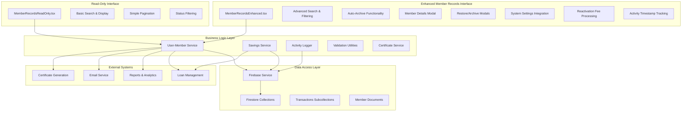
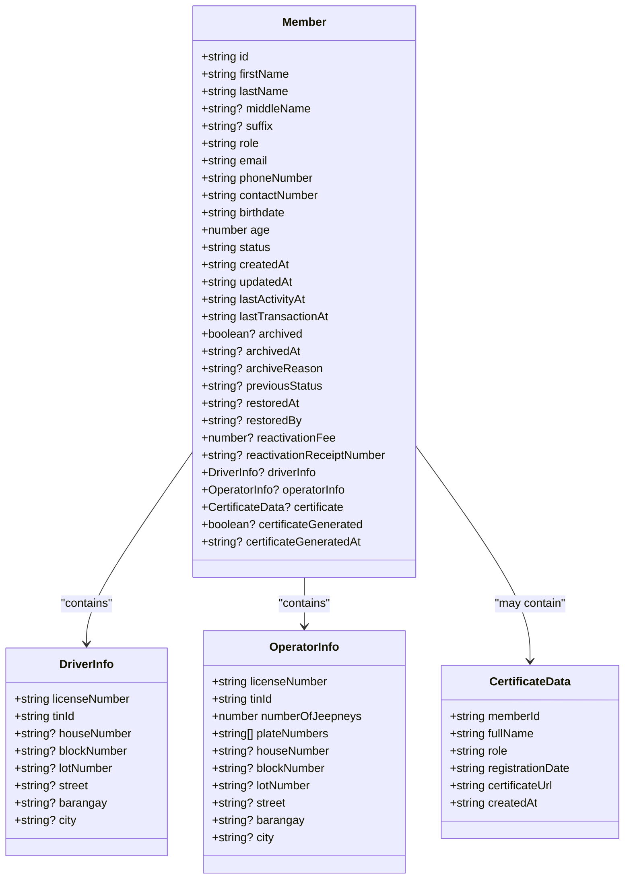
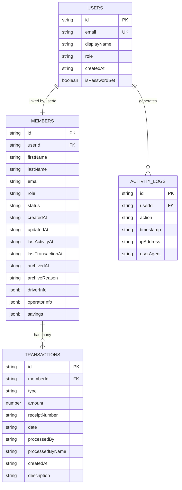
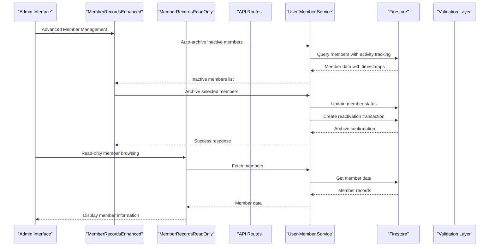
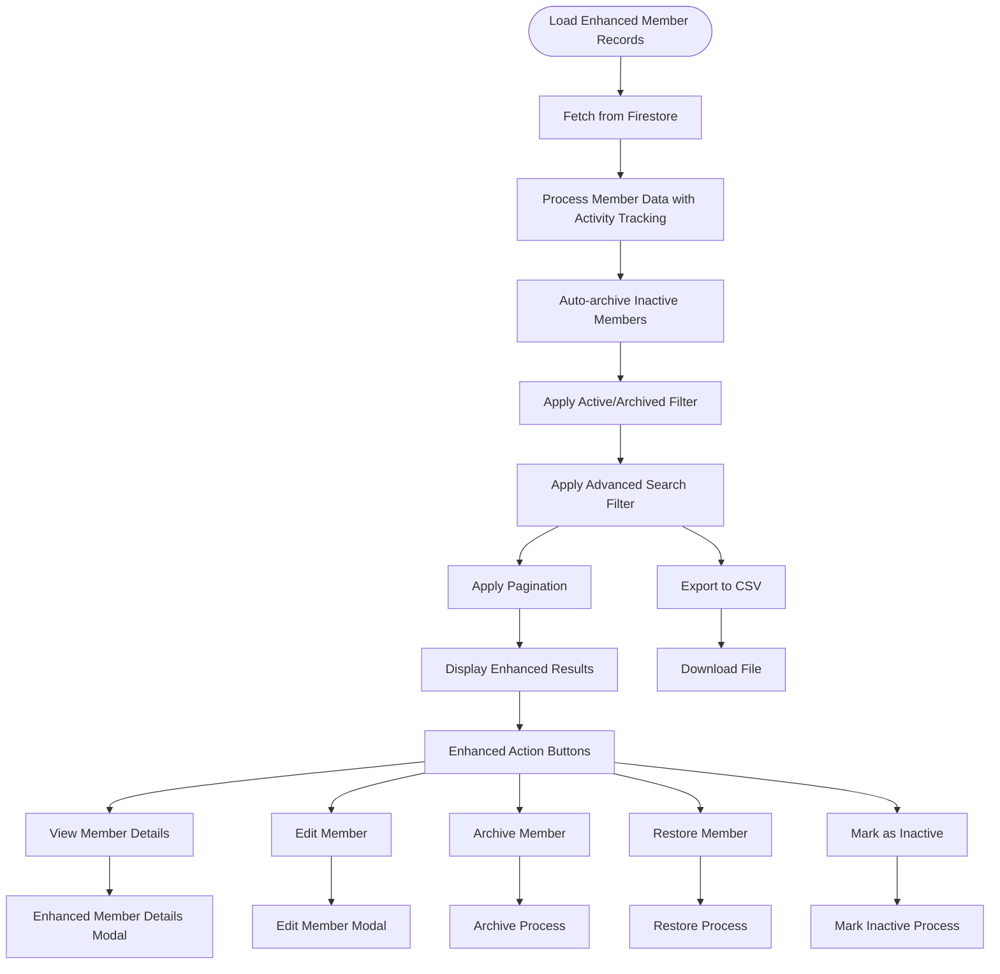
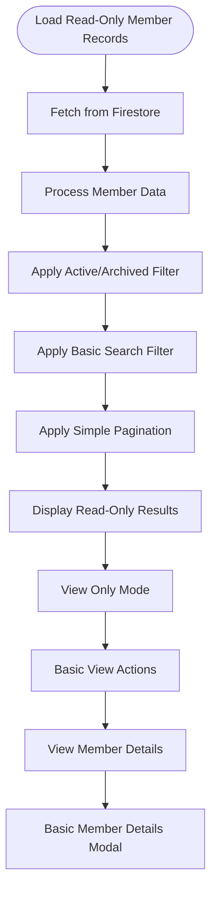
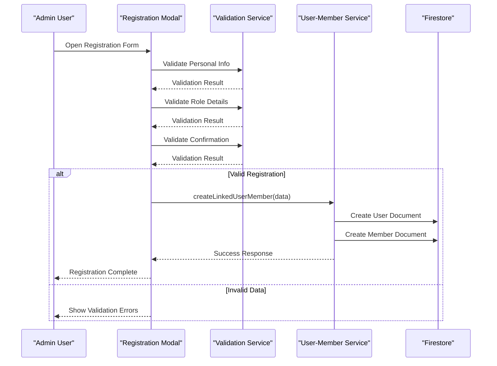
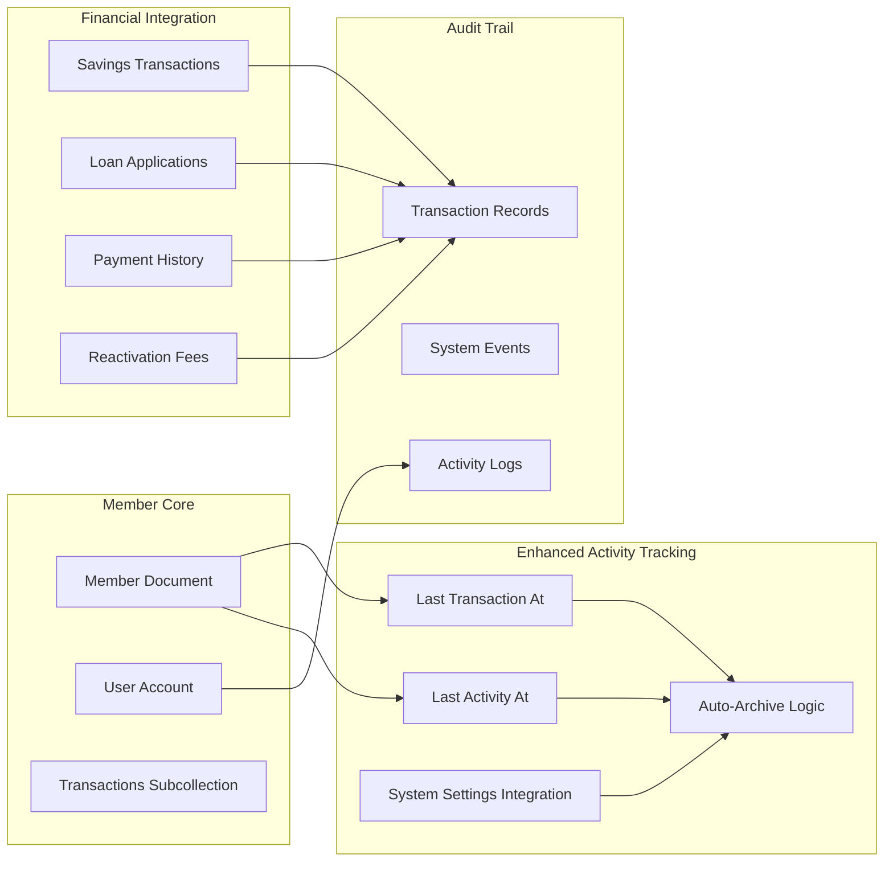
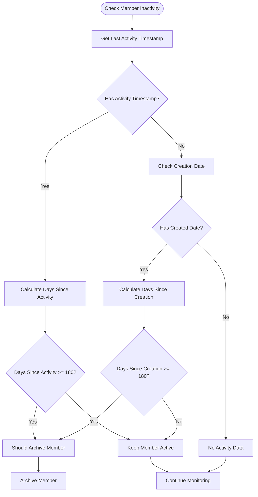
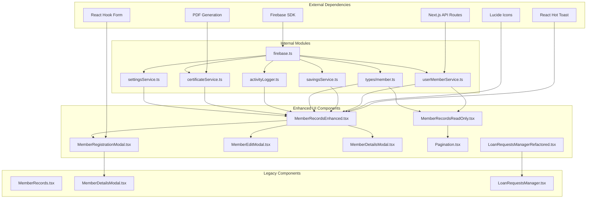

# Member Records System

<cite>
**Referenced Files in This Document**
- [app/admin/members/page.tsx](file://app/admin/members/page.tsx)
- [app/admin/members/records/page.tsx](file://app/admin/members/records/page.tsx)
- [app/api/members/route.ts](file://app/api/members/route.ts)
- [components/admin/MemberRegistrationModal.tsx](file://components/admin/MemberRegistrationModal.tsx)
- [components/admin/MemberEditModal.tsx](file://components/admin/MemberEditModal.tsx)
- [components/admin/MemberRecordsEnhanced.tsx](file://components/admin/MemberRecordsEnhanced.tsx)
- [components/admin/MemberRecordsReadOnly.tsx](file://components/admin/MemberRecordsReadOnly.tsx)
- [components/admin/MemberDetailsModal.tsx](file://components/admin/MemberDetailsModal.tsx)
- [components/admin/Pagination.tsx](file://components/admin/Pagination.tsx)
- [lib/firebase.ts](file://lib/firebase.ts)
- [lib/types/member.ts](file://lib/types/member.ts)
- [lib/userMemberService.ts](file://lib/userMemberService.ts)
- [lib/savingsService.ts](file://lib/savingsService.ts)
- [lib/activityLogger.ts](file://lib/activityLogger.ts)
- [firestore.rules](file://firestore.rules)
</cite>

## Update Summary
**Changes Made**
- Updated to reflect the refactoring of the Member Records System with the introduction of MemberRecordsEnhanced.tsx
- Replaced the legacy MemberRecords component with the enhanced version for improved efficiency and better data presentation
- Added comprehensive documentation for the new enhanced member records management interface
- Updated core components section to include the new enhanced functionality with auto-archive capabilities
- Revised architecture overview to reflect the new component structure and improved member lifecycle management
- Enhanced documentation with detailed coverage of advanced search, filtering, and member activity tracking features

## Table of Contents
1. [Introduction](#introduction)
2. [Project Structure](#project-structure)
3. [Core Components](#core-components)
4. [Architecture Overview](#architecture-overview)
5. [Detailed Component Analysis](#detailed-component-analysis)
6. [Enhanced Member Records Management](#enhanced-member-records-management)
7. [Dependency Analysis](#dependency-analysis)
8. [Performance Considerations](#performance-considerations)
9. [Troubleshooting Guide](#troubleshooting-guide)
10. [Conclusion](#conclusion)

## Introduction
The Member Records System is a comprehensive solution for managing cooperative members within the SAMPA Co-op platform. It provides complete member lifecycle management including registration, profile maintenance, activity tracking, and integration with financial systems for loans and savings. The system supports two primary member roles—Drivers and Operators—each with distinct operational requirements and regulatory compliance needs.

**Updated** The system now features a significantly enhanced member records management interface through the new MemberRecordsEnhanced.tsx component, which replaces the legacy MemberRecords component. This enhancement introduces sophisticated auto-archive functionality, comprehensive member activity tracking, advanced search capabilities, and improved user interface elements for better administrative efficiency.

The system emphasizes data integrity through consistent user-member linking, robust validation mechanisms, and comprehensive audit trails. It offers advanced search and filtering capabilities, efficient pagination for large datasets, seamless integration with the broader cooperative ecosystem including loan management and savings systems, and automated member lifecycle management through intelligent inactivity detection.

## Project Structure
The Member Records System follows a modular architecture with clear separation of concerns across presentation, business logic, and data persistence layers. The system now includes specialized components for different use cases, with the enhanced MemberRecordsEnhanced.tsx serving as the primary administrative interface.

**Diagram sources**
- [components/admin/MemberRecordsEnhanced.tsx:1-1042](file://components/admin/MemberRecordsEnhanced.tsx#L1-L1042)
- [components/admin/MemberRecordsReadOnly.tsx:1-278](file://components/admin/MemberRecordsReadOnly.tsx#L1-L278)
- [lib/userMemberService.ts:1-287](file://lib/userMemberService.ts#L1-L287)
- [lib/firebase.ts:1-309](file://lib/firebase.ts#L1-L309)

**Section sources**
- [components/admin/MemberRecordsEnhanced.tsx:1-1042](file://components/admin/MemberRecordsEnhanced.tsx#L1-L1042)
- [components/admin/MemberRecordsReadOnly.tsx:1-278](file://components/admin/MemberRecordsReadOnly.tsx#L1-L278)
- [lib/userMemberService.ts:1-287](file://lib/userMemberService.ts#L1-L287)

## Core Components

### Enhanced Member Data Model
The system defines a comprehensive member data structure supporting both operational roles and administrative requirements with enhanced tracking capabilities, including advanced archiving and restoration fields.

**Diagram sources**
- [lib/types/member.ts:1-85](file://lib/types/member.ts#L1-L85)

### Database Schema Design
The system employs a dual-collection strategy with consistent ID linking between user accounts and member profiles, enhanced with activity tracking fields and comprehensive archiving capabilities.

**Diagram sources**
- [lib/userMemberService.ts:35-92](file://lib/userMemberService.ts#L35-L92)
- [lib/savingsService.ts:237-342](file://lib/savingsService.ts#L237-L342)

**Section sources**
- [lib/types/member.ts:1-85](file://lib/types/member.ts#L1-L85)
- [lib/userMemberService.ts:1-287](file://lib/userMemberService.ts#L1-L287)

## Architecture Overview

The Member Records System implements a client-server architecture with Firebase Firestore as the primary data store, featuring robust validation, consistent user-member linking, and comprehensive audit capabilities. The system now includes specialized components for different operational scenarios, with the enhanced MemberRecordsEnhanced.tsx providing sophisticated member lifecycle management.

**Diagram sources**
- [components/admin/MemberRecordsEnhanced.tsx:240-271](file://components/admin/MemberRecordsEnhanced.tsx#L240-L271)
- [components/admin/MemberRecordsReadOnly.tsx:52-85](file://components/admin/MemberRecordsReadOnly.tsx#L52-L85)
- [app/api/members/route.ts:67-158](file://app/api/members/route.ts#L67-L158)
- [lib/userMemberService.ts:23-92](file://lib/userMemberService.ts#L23-L92)

**Section sources**
- [components/admin/MemberRecordsEnhanced.tsx:1-1042](file://components/admin/MemberRecordsEnhanced.tsx#L1-L1042)
- [components/admin/MemberRecordsReadOnly.tsx:1-278](file://components/admin/MemberRecordsReadOnly.tsx#L1-L278)
- [app/api/members/route.ts:1-179](file://app/api/members/route.ts#L1-L179)
- [lib/userMemberService.ts:1-287](file://lib/userMemberService.ts#L1-L287)

## Detailed Component Analysis

### Enhanced Member Records Management Interface
The primary administration interface provides comprehensive member management capabilities with advanced filtering and pagination, featuring auto-archive functionality for inactive members and sophisticated member lifecycle management.

**Diagram sources**
- [components/admin/MemberRecordsEnhanced.tsx:393-489](file://components/admin/MemberRecordsEnhanced.tsx#L393-L489)

#### Advanced Search and Filtering Implementation
The enhanced system implements multi-criteria search across member attributes with intelligent fallback mechanisms for data migration scenarios and improved search accuracy. The search functionality now includes comprehensive filtering across name, email, phone number, and member ID with real-time processing.

**Section sources**
- [components/admin/MemberRecordsEnhanced.tsx:371-391](file://components/admin/MemberRecordsEnhanced.tsx#L371-L391)

### Read-Only Member Records Interface
The read-only interface provides simplified member browsing capabilities for scenarios where administrative modifications are restricted, offering basic search and display functionality with essential member information.

**Diagram sources**
- [components/admin/MemberRecordsReadOnly.tsx:87-115](file://components/admin/MemberRecordsReadOnly.tsx#L87-L115)

**Section sources**
- [components/admin/MemberRecordsReadOnly.tsx:1-278](file://components/admin/MemberRecordsReadOnly.tsx#L1-L278)

### Member Registration and Validation
The registration process ensures data integrity through comprehensive validation and consistent user-member linking, with enhanced error handling and user feedback. The system now includes sophisticated validation for role-specific fields and comprehensive data sanitization.

**Diagram sources**
- [components/admin/MemberRegistrationModal.tsx:213-369](file://components/admin/MemberRegistrationModal.tsx#L213-L369)
- [lib/userMemberService.ts:23-92](file://lib/userMemberService.ts#L23-L92)

**Section sources**
- [components/admin/MemberRegistrationModal.tsx:1-800](file://components/admin/MemberRegistrationModal.tsx#L1-L800)
- [lib/userMemberService.ts:1-287](file://lib/userMemberService.ts#L1-L287)

### Pagination and Performance Optimization
The system implements efficient pagination for handling large member datasets with intelligent page number calculation and display optimization, supporting both enhanced and read-only interfaces with improved performance characteristics.

**Section sources**
- [components/admin/MemberRecordsEnhanced.tsx:491-501](file://components/admin/MemberRecordsEnhanced.tsx#L491-L501)
- [components/admin/MemberRecordsReadOnly.tsx:117-121](file://components/admin/MemberRecordsReadOnly.tsx#L117-L121)
- [components/admin/Pagination.tsx:1-141](file://components/admin/Pagination.tsx#L1-L141)

### Financial System Integration
The member records system integrates seamlessly with loan and savings systems through consistent member identification and transaction tracking, with enhanced activity monitoring for automated member management and comprehensive reactivation fee processing.

**Diagram sources**
- [components/admin/MemberRecordsEnhanced.tsx:96-146](file://components/admin/MemberRecordsEnhanced.tsx#L96-L146)
- [lib/savingsService.ts:237-342](file://lib/savingsService.ts#L237-L342)
- [lib/activityLogger.ts:1-165](file://lib/activityLogger.ts#L1-L165)

**Section sources**
- [components/admin/MemberRecordsEnhanced.tsx:1-1042](file://components/admin/MemberRecordsEnhanced.tsx#L1-L1042)
- [lib/savingsService.ts:1-455](file://lib/savingsService.ts#L1-L455)
- [lib/activityLogger.ts:1-165](file://lib/activityLogger.ts#L1-L165)

## Enhanced Member Records Management

### Auto-Archive Functionality
The enhanced system includes sophisticated auto-archive capabilities that automatically identifies and archives inactive members based on transaction activity and last login timestamps, with comprehensive logging and notification capabilities.

**Diagram sources**
- [components/admin/MemberRecordsEnhanced.tsx:96-146](file://components/admin/MemberRecordsEnhanced.tsx#L96-L146)

### Enhanced Search Capabilities
The enhanced search functionality provides comprehensive member discovery through multiple criteria including name, email, phone number, and member ID, with intelligent fallback mechanisms for data migration scenarios and improved search accuracy with real-time filtering.

**Section sources**
- [components/admin/MemberRecordsEnhanced.tsx:371-391](file://components/admin/MemberRecordsEnhanced.tsx#L371-L391)

### Advanced Member Details
The enhanced member details interface provides comprehensive member information display with activity tracking, archival history, and restoration details for administrative oversight, including detailed timeline visualization and status indicators.

**Section sources**
- [components/admin/MemberRecordsEnhanced.tsx:355-365](file://components/admin/MemberRecordsEnhanced.tsx#L355-L365)

### System Settings Integration
The enhanced interface integrates with system settings for dynamic configuration of reactivation fees and other operational parameters, with real-time currency formatting and validation for financial transactions.

**Section sources**
- [components/admin/MemberRecordsEnhanced.tsx:374-377](file://components/admin/MemberRecordsEnhanced.tsx#L374-L377)

## Dependency Analysis

The Member Records System exhibits strong modularity with clear dependency boundaries and minimal coupling between components, now including specialized interfaces for different use cases and enhanced integration capabilities.

**Diagram sources**
- [lib/firebase.ts:1-309](file://lib/firebase.ts#L1-L309)
- [lib/userMemberService.ts:1-287](file://lib/userMemberService.ts#L1-L287)
- [components/admin/MemberRecordsEnhanced.tsx:1-1042](file://components/admin/MemberRecordsEnhanced.tsx#L1-L1042)
- [components/admin/MemberRecordsReadOnly.tsx:1-278](file://components/admin/MemberRecordsReadOnly.tsx#L1-L278)

**Section sources**
- [lib/firebase.ts:1-309](file://lib/firebase.ts#L1-L309)
- [lib/userMemberService.ts:1-287](file://lib/userMemberService.ts#L1-L287)
- [components/admin/MemberRecordsEnhanced.tsx:1-1042](file://components/admin/MemberRecordsEnhanced.tsx#L1-L1042)
- [components/admin/MemberRecordsReadOnly.tsx:1-278](file://components/admin/MemberRecordsReadOnly.tsx#L1-L278)

## Performance Considerations

### Data Retrieval Optimization
The system implements several performance optimization strategies for handling large member datasets efficiently, with enhanced caching and lazy loading capabilities through the improved MemberRecordsEnhanced.tsx component.

**Enhanced Indexing Strategy**: The Firestore configuration should include composite indexes for common query patterns:
- `(status, createdAt)` for member listing with status filtering
- `(role, status)` for role-based member queries
- `(email, status)` for email-based lookups
- `(lastTransactionAt, status)` for activity-based queries

**Enhanced Query Optimization**: Member search operations utilize efficient filtering patterns:
- Multi-field search with OR conditions for flexible member discovery
- Status-based filtering before search term application to reduce dataset size
- Activity-based filtering for auto-archive functionality
- Pagination implementation to limit response sizes

**Enhanced Caching Strategy**: The system maintains cached member data locally with automatic refresh mechanisms to minimize repeated network requests, with separate caches for enhanced and read-only interfaces and intelligent cache invalidation for archived members.

### Memory Management
The interface implements efficient state management:
- Lazy loading of member details through modal components
- Conditional rendering of expensive components
- Proper cleanup of event listeners and timers
- Separate state management for enhanced and read-only interfaces
- Optimized rendering for large datasets with virtual scrolling capabilities

## Troubleshooting Guide

### Common Issues and Solutions

**Enhanced Member Records Issues**
- **Issue**: Auto-archive not working properly for inactive members
- **Solution**: Verify activity timestamps are being updated correctly and check Firestore security rules for write permissions

**Read-Only Interface Problems**
- **Issue**: Members not displaying correctly in read-only mode
- **Solution**: Check Firestore permissions and verify member data structure consistency

**Member Registration Failures**
- **Issue**: Registration validation errors for role-specific fields
- **Solution**: Verify role selection matches the required fields and validate license number format

**Data Synchronization Problems**
- **Issue**: Inconsistent user-member linkage after registration
- **Solution**: Use the validation and healing service to reconcile discrepancies

**Search Functionality Issues**
- **Issue**: Members not appearing in search results
- **Solution**: Check for proper indexing and verify search term formatting

**Pagination Problems**
- **Issue**: Incorrect page calculations or missing members
- **Solution**: Verify items per page configuration and check for data filtering conflicts

**Section sources**
- [components/admin/MemberRecordsEnhanced.tsx:240-271](file://components/admin/MemberRecordsEnhanced.tsx#L240-L271)
- [components/admin/MemberRecordsReadOnly.tsx:52-85](file://components/admin/MemberRecordsReadOnly.tsx#L52-L85)
- [lib/userMemberService.ts:99-198](file://lib/userMemberService.ts#L99-L198)

## Conclusion

The Member Records System provides a robust, scalable foundation for cooperative member management with comprehensive data integrity, advanced search capabilities, and seamless integration with financial systems. The system's modular architecture ensures maintainability while its performance optimizations support efficient handling of large member datasets.

**Updated** The enhanced member records system now features sophisticated auto-archive functionality, comprehensive activity tracking, and specialized interfaces for different operational scenarios. The new MemberRecordsEnhanced.tsx component provides advanced filtering, sorting, and search capabilities with intelligent member management automation, while the MemberRecordsReadOnly.tsx component offers streamlined access for read-only scenarios. The system now includes comprehensive reactivation fee processing, system settings integration, and enhanced member lifecycle management through automated inactivity detection.

Key strengths include the consistent user-member linking strategy, comprehensive validation mechanisms, extensive audit trail capabilities, and sophisticated member lifecycle management through automated inactivity detection. The system successfully balances functionality with security through proper access controls and data protection measures, with enhanced user experience through improved interface design and real-time feedback mechanisms.

Future enhancements could include advanced reporting capabilities, enhanced export formats, additional compliance features for regulatory requirements, and integration with external identity verification systems. The modular design facilitates these improvements while maintaining backward compatibility and system stability.

The introduction of specialized components demonstrates the system's evolution toward supporting diverse operational needs while maintaining its core principles of data integrity, user experience, and system reliability. The enhanced MemberRecordsEnhanced.tsx component represents a significant advancement in member management capabilities, providing administrators with powerful tools for maintaining an organized and compliant cooperative membership database.