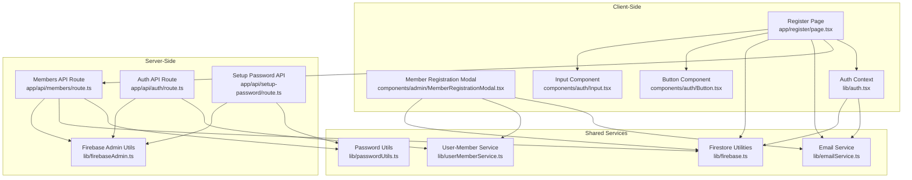
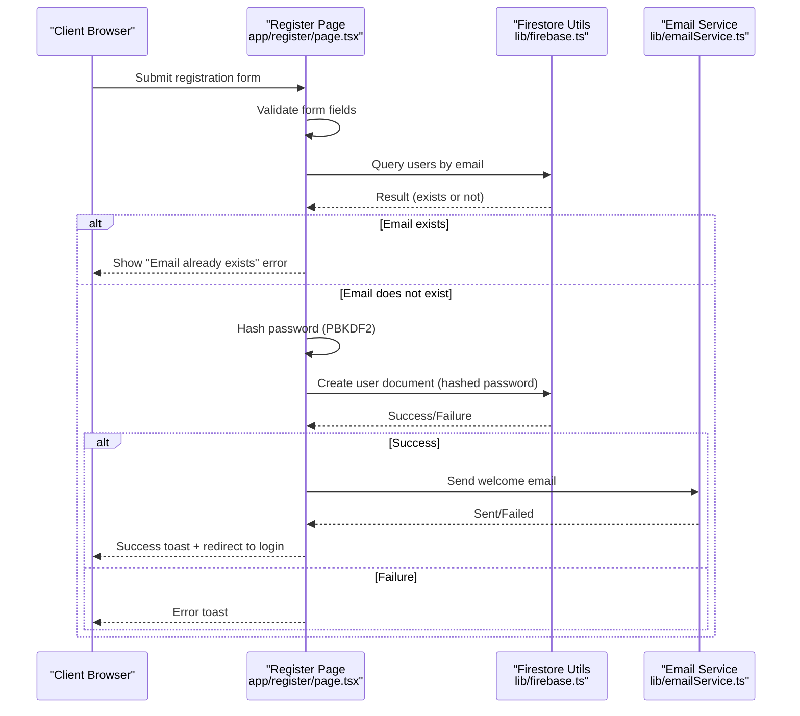
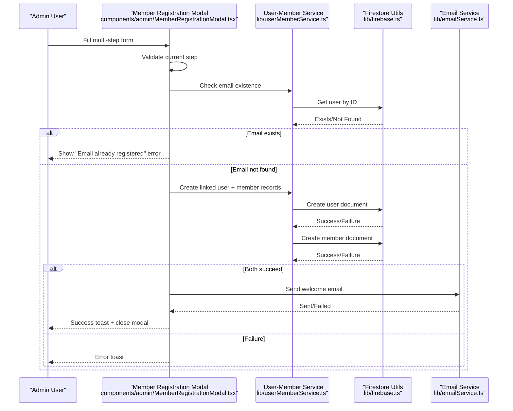
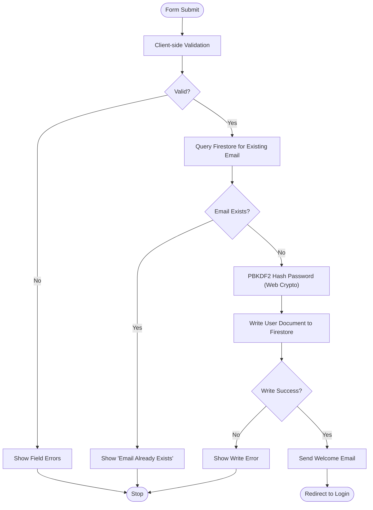
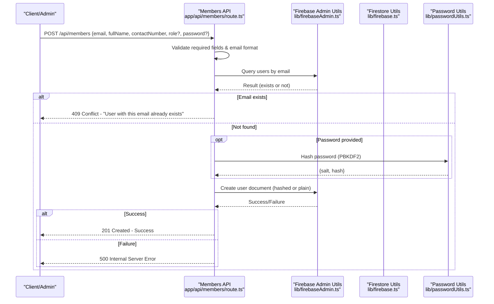
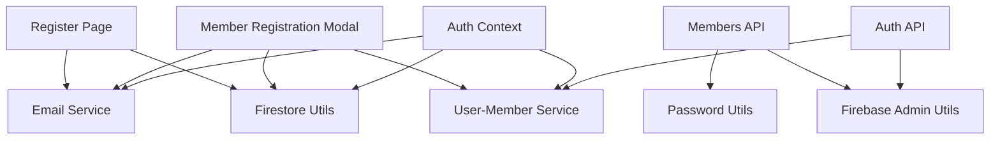

# Member Registration Workflow

<cite>
**Referenced Files in This Document**
- [page.tsx](file://app/register/page.tsx)
- [route.ts](file://app/api/members/route.ts)
- [firebase.ts](file://lib/firebase.ts)
- [passwordUtils.ts](file://lib/passwordUtils.ts)
- [userMemberService.ts](file://lib/userMemberService.ts)
- [emailService.ts](file://lib/emailService.ts)
- [auth.tsx](file://lib/auth.tsx)
- [Input.tsx](file://components/auth/Input.tsx)
- [Button.tsx](file://components/auth/Button.tsx)
- [MemberRegistrationModal.tsx](file://components/admin/MemberRegistrationModal.tsx)
- [page.tsx](file://app/setup-password/page.tsx)
- [route.ts](file://app/api/setup-password/route.ts)
- [route.ts](file://app/api/auth/route.ts)
- [firebaseAdmin.ts](file://lib/firebaseAdmin.ts)
</cite>

## Table of Contents
1. [Introduction](#introduction)
2. [Project Structure](#project-structure)
3. [Core Components](#core-components)
4. [Architecture Overview](#architecture-overview)
5. [Detailed Component Analysis](#detailed-component-analysis)
6. [Dependency Analysis](#dependency-analysis)
7. [Performance Considerations](#performance-considerations)
8. [Troubleshooting Guide](#troubleshooting-guide)
9. [Conclusion](#conclusion)

## Introduction
This document explains the complete Member Registration Workflow within the SAMPA Cooperative Management System. It covers the end-to-end process from initial form submission through account activation, including API endpoints, front-end validation, automatic account creation, role assignment defaults, and integration with Firebase Authentication and Firestore. It also details security considerations, practical examples, common validation errors, and troubleshooting steps.

## Project Structure
The registration workflow spans client-side pages, server-side API routes, and shared libraries for authentication, Firestore utilities, and email services. Key areas include:
- Front-end registration page with form validation and submission
- API route for member creation with input validation and password hashing
- Firestore utilities for database operations
- User-member linking service to maintain consistent IDs across collections
- Email service for sending welcome and password setup notifications
- Authentication context for login and role-based routing

**Diagram sources**
- [page.tsx](file://app/register/page.tsx#L1-L323)
- [route.ts](file://app/api/members/route.ts#L1-L179)
- [firebase.ts](file://lib/firebase.ts#L1-L309)
- [userMemberService.ts](file://lib/userMemberService.ts#L1-L287)
- [emailService.ts](file://lib/emailService.ts#L1-L113)
- [auth.tsx](file://lib/auth.tsx#L1-L682)
- [MemberRegistrationModal.tsx](file://components/admin/MemberRegistrationModal.tsx#L1-L1247)
- [route.ts](file://app/api/auth/route.ts#L1-L295)
- [route.ts](file://app/api/setup-password/route.ts#L1-L177)
- [firebaseAdmin.ts](file://lib/firebaseAdmin.ts#L1-L277)

**Section sources**
- [page.tsx](file://app/register/page.tsx#L1-L323)
- [route.ts](file://app/api/members/route.ts#L1-L179)
- [firebase.ts](file://lib/firebase.ts#L1-L309)
- [userMemberService.ts](file://lib/userMemberService.ts#L1-L287)
- [emailService.ts](file://lib/emailService.ts#L1-L113)
- [auth.tsx](file://lib/auth.tsx#L1-L682)
- [MemberRegistrationModal.tsx](file://components/admin/MemberRegistrationModal.tsx#L1-L1247)
- [route.ts](file://app/api/auth/route.ts#L1-L295)
- [route.ts](file://app/api/setup-password/route.ts#L1-L177)
- [firebaseAdmin.ts](file://lib/firebaseAdmin.ts#L1-L277)

## Core Components
- Register Page: Client-side form with validation, email uniqueness check, and password hashing prior to Firestore write.
- Members API Route: Server-side endpoint for creating members with robust input validation, email format checks, duplicate detection, and PBKDF2-based password hashing.
- Firestore Utilities: Unified client-side Firestore helpers for set/get/query/update/delete operations with error handling.
- User-Member Service: Ensures consistent user ID across users and members collections, email existence checks, and automatic linkage validation/repair.
- Email Service: Sends welcome and password setup emails via EmailJS with configurable templates.
- Authentication Context: Manages user state, role-based routing, and login flow with timing-safe comparisons and secure password verification.
- Member Registration Modal: Multi-step form for admin-driven member registration with dynamic fields, validation, and automatic user-member record creation.
- Setup Password API: Handles password setup for accounts that were created without an initial password, enforcing PBKDF2 hashing and preventing duplicate setups.

**Section sources**
- [page.tsx](file://app/register/page.tsx#L1-L323)
- [route.ts](file://app/api/members/route.ts#L1-L179)
- [firebase.ts](file://lib/firebase.ts#L89-L309)
- [userMemberService.ts](file://lib/userMemberService.ts#L1-L287)
- [emailService.ts](file://lib/emailService.ts#L1-L113)
- [auth.tsx](file://lib/auth.tsx#L1-L682)
- [MemberRegistrationModal.tsx](file://components/admin/MemberRegistrationModal.tsx#L1-L1247)
- [route.ts](file://app/api/setup-password/route.ts#L1-L177)

## Architecture Overview
The registration workflow integrates client-side forms, server-side APIs, and Firestore. Two complementary flows exist:
- Direct registration via the Register Page (client-side hashing and Firestore write)
- Admin-driven registration via the Member Registration Modal (server-side hashing and user-member linking)

**Diagram sources**
- [page.tsx](file://app/register/page.tsx#L153-L210)
- [firebase.ts](file://lib/firebase.ts#L184-L240)
- [emailService.ts](file://lib/emailService.ts#L41-L67)

**Diagram sources**
- [MemberRegistrationModal.tsx](file://components/admin/MemberRegistrationModal.tsx#L213-L369)
- [userMemberService.ts](file://lib/userMemberService.ts#L23-L92)
- [firebase.ts](file://lib/firebase.ts#L90-L113)
- [emailService.ts](file://lib/emailService.ts#L41-L67)

## Detailed Component Analysis

### Register Page (Direct Registration)
- Purpose: Allows users to self-register with client-side validation and password hashing.
- Validation:
  - Full name required
  - Contact number numeric only
  - Email format validation
  - Role selection required
  - Password minimum length and character requirements
  - Password confirmation matching
- Uniqueness Check: Queries Firestore for existing user by email before submission.
- Password Hashing: Uses PBKDF2 with 100k iterations and SHA-256, storing base64-encoded hash and salt.
- Submission: Writes user document to Firestore with role, timestamps, and hashed credentials.
- Feedback: Toast notifications for success/error; redirects to login on success.

**Diagram sources**
- [page.tsx](file://app/register/page.tsx#L72-L210)
- [firebase.ts](file://lib/firebase.ts#L184-L240)
- [emailService.ts](file://lib/emailService.ts#L41-L67)

**Section sources**
- [page.tsx](file://app/register/page.tsx#L1-L323)
- [Input.tsx](file://components/auth/Input.tsx#L1-L27)
- [Button.tsx](file://components/auth/Button.tsx#L1-L51)

### Members API Route (Admin/Server Registration)
- Purpose: Server-side endpoint to create members with strong validation and PBKDF2 hashing.
- Validation:
  - Required fields: email, full name, contact number
  - Email format regex
  - Duplicate email detection via Firestore query
- Password Handling:
  - Accepts optional password; if provided, hashes using PBKDF2 with 100k iterations and SHA-256
  - Stores base64-encoded salt and hash
- Role Assignment: Normalizes role to lowercase; default is applied if omitted.
- Response: JSON success with created user data or error with appropriate HTTP status.

**Diagram sources**
- [route.ts](file://app/api/members/route.ts#L67-L158)
- [firebaseAdmin.ts](file://lib/firebaseAdmin.ts#L150-L194)
- [passwordUtils.ts](file://lib/passwordUtils.ts#L64-L92)

**Section sources**
- [route.ts](file://app/api/members/route.ts#L1-L179)
- [passwordUtils.ts](file://lib/passwordUtils.ts#L1-L146)

### Firestore Utilities
- Provides unified helpers for set, get, query, update, delete operations with validation and error handling.
- Client-side helpers ensure Firestore is initialized and accessible before operations.
- Server-side admin helpers wrap Firebase Admin SDK with consistent return shapes.

**Section sources**
- [firebase.ts](file://lib/firebase.ts#L89-L309)
- [firebaseAdmin.ts](file://lib/firebaseAdmin.ts#L110-L277)

### User-Member Service
- Enforces a single source of truth for user identification by generating consistent IDs from normalized emails.
- Creates linked user and member records atomically; on failure, rolls back user creation.
- Validates and repairs user-member linkage on login, ensuring both collections remain synchronized.
- Provides email existence checks and batched updates across both collections.

**Section sources**
- [userMemberService.ts](file://lib/userMemberService.ts#L1-L287)

### Email Service
- Sends templated emails via EmailJS with configurable keys and templates.
- Includes welcome email for new members and password setup notifications.
- Returns boolean success/failure for downstream handling.

**Section sources**
- [emailService.ts](file://lib/emailService.ts#L1-L113)

### Authentication Context and Login Flow
- Provides sign-in/sign-up/createUser/customLogin functions with role-based routing.
- Uses timing-safe comparisons to prevent timing attacks during password verification.
- Supports password setup requirement signaling to redirect users to setup-password page.
- Maintains user state and sets cookies for session persistence.

**Section sources**
- [auth.tsx](file://lib/auth.tsx#L1-L682)
- [route.ts](file://app/api/auth/route.ts#L1-L295)

### Member Registration Modal (Admin-Driven)
- Multi-step form with dynamic fields for Driver/Operator roles.
- Validates required fields per step and triggers validation on navigation.
- Performs email uniqueness check via userMemberService before submission.
- Automatically creates linked user and member records with payment information and role-specific details.
- Sends welcome email upon successful registration and resets form state.

**Section sources**
- [MemberRegistrationModal.tsx](file://components/admin/MemberRegistrationModal.tsx#L1-L1247)
- [userMemberService.ts](file://lib/userMemberService.ts#L23-L92)
- [emailService.ts](file://lib/emailService.ts#L41-L67)

### Setup Password API
- Handles password setup for accounts that were created without an initial password.
- Validates email format and ensures account exists and password is not already set.
- Hashes the provided password using PBKDF2 and updates the user document with salt, hash, and flags.

**Section sources**
- [page.tsx](file://app/setup-password/page.tsx#L1-L207)
- [route.ts](file://app/api/setup-password/route.ts#L1-L177)
- [passwordUtils.ts](file://lib/passwordUtils.ts#L64-L92)

## Dependency Analysis
The registration workflow exhibits clear separation of concerns:
- Client-side registration depends on Firestore utilities and email service.
- Server-side registration depends on Firebase Admin utilities and password utilities.
- Both flows rely on user-member service for consistent identity management.
- Authentication context coordinates login and role-based routing.

**Diagram sources**
- [page.tsx](file://app/register/page.tsx#L1-L323)
- [route.ts](file://app/api/members/route.ts#L1-L179)
- [firebase.ts](file://lib/firebase.ts#L1-L309)
- [userMemberService.ts](file://lib/userMemberService.ts#L1-L287)
- [emailService.ts](file://lib/emailService.ts#L1-L113)
- [auth.tsx](file://lib/auth.tsx#L1-L682)
- [MemberRegistrationModal.tsx](file://components/admin/MemberRegistrationModal.tsx#L1-L1247)
- [route.ts](file://app/api/auth/route.ts#L1-L295)
- [firebaseAdmin.ts](file://lib/firebaseAdmin.ts#L1-L277)
- [passwordUtils.ts](file://lib/passwordUtils.ts#L1-L146)

**Section sources**
- [page.tsx](file://app/register/page.tsx#L1-L323)
- [route.ts](file://app/api/members/route.ts#L1-L179)
- [firebase.ts](file://lib/firebase.ts#L1-L309)
- [userMemberService.ts](file://lib/userMemberService.ts#L1-L287)
- [emailService.ts](file://lib/emailService.ts#L1-L113)
- [auth.tsx](file://lib/auth.tsx#L1-L682)
- [MemberRegistrationModal.tsx](file://components/admin/MemberRegistrationModal.tsx#L1-L1247)
- [route.ts](file://app/api/auth/route.ts#L1-L295)
- [firebaseAdmin.ts](file://lib/firebaseAdmin.ts#L1-L277)
- [passwordUtils.ts](file://lib/passwordUtils.ts#L1-L146)

## Performance Considerations
- Client-side hashing reduces server load but increases client CPU usage; acceptable for modern browsers.
- PBKDF2 iteration count balances security and performance; ensure consistent hashing across client and server.
- Firestore queries for email uniqueness should be indexed appropriately to minimize latency.
- Email sending is asynchronous; consider queueing for high-volume scenarios.
- Parallelize user-member writes only when safe; rollback on failure to maintain consistency.

## Troubleshooting Guide
Common validation errors and resolutions:
- Email already exists:
  - Client-side: Occurs when Firestore query finds a user with the same email.
  - Server-side: Returned as conflict (409) when duplicate detected.
  - Resolution: Prompt user to use another email or initiate password reset flow.
- Invalid email format:
  - Client-side: Regex validation fails.
  - Server-side: Regex validation fails.
  - Resolution: Ensure proper email formatting before submission.
- Password requirements not met:
  - Client-side: Minimum length and character class checks.
  - Server-side: PBKDF2 hashing requires minimum length; ensure client enforces the same rules.
  - Resolution: Align client and server validation rules.
- Password confirmation mismatch:
  - Client-side: Confirmation field must match password.
  - Resolution: Clear error on input change and re-validate on submit.
- Firestore connectivity issues:
  - Client-side: Initialization or permission errors.
  - Server-side: Admin SDK initialization errors or missing credentials.
  - Resolution: Verify environment variables and Firebase configuration; check Firestore rules.
- Authentication failures:
  - Incorrect password or unverified account.
  - Resolution: Ensure password is set; use setup-password flow if needed.

Security considerations:
- Password hashing: PBKDF2 with 100k iterations and SHA-256; store salt and hash separately.
- Timing-safe comparisons: Prevent timing attacks during password verification.
- Role validation: Enforce allowed roles server-side to prevent privilege escalation.
- Email verification: Implement email verification flow to confirm ownership.
- Data privacy: Comply with applicable regulations; minimize stored PII; encrypt sensitive fields if required.

**Section sources**
- [page.tsx](file://app/register/page.tsx#L72-L133)
- [route.ts](file://app/api/members/route.ts#L72-L93)
- [firebase.ts](file://lib/firebase.ts#L62-L87)
- [firebaseAdmin.ts](file://lib/firebaseAdmin.ts#L13-L108)
- [auth.tsx](file://lib/auth.tsx#L97-L109)
- [route.ts](file://app/api/auth/route.ts#L128-L140)

## Conclusion
The SAMPA Cooperative Management System implements a robust and secure member registration workflow supporting both self-registration and admin-driven registration. Client-side and server-side flows share consistent validation, hashing, and error handling patterns, while user-member linking ensures data integrity across collections. The integration with Firestore and EmailJS provides a reliable foundation for user onboarding, complemented by strong security practices and comprehensive troubleshooting guidance.