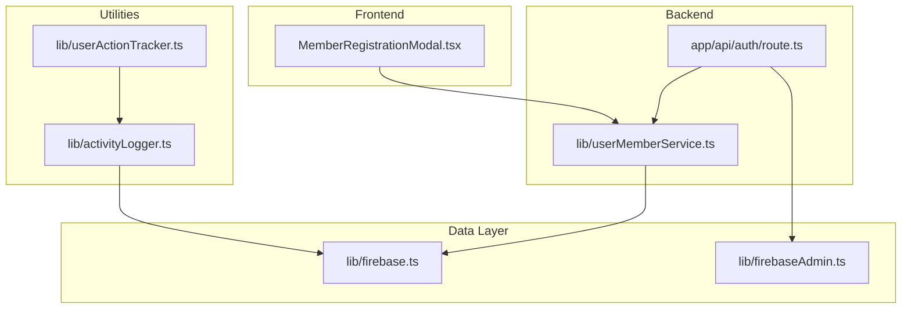
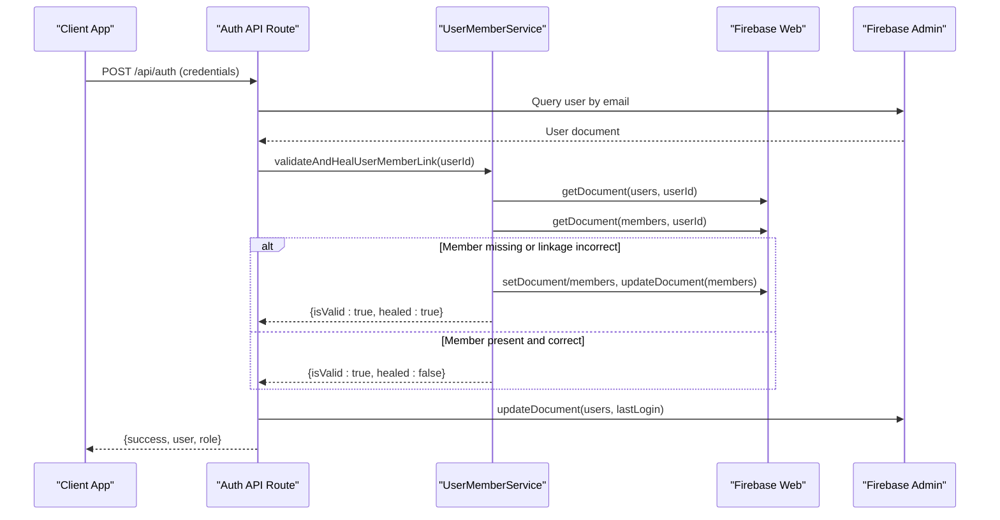
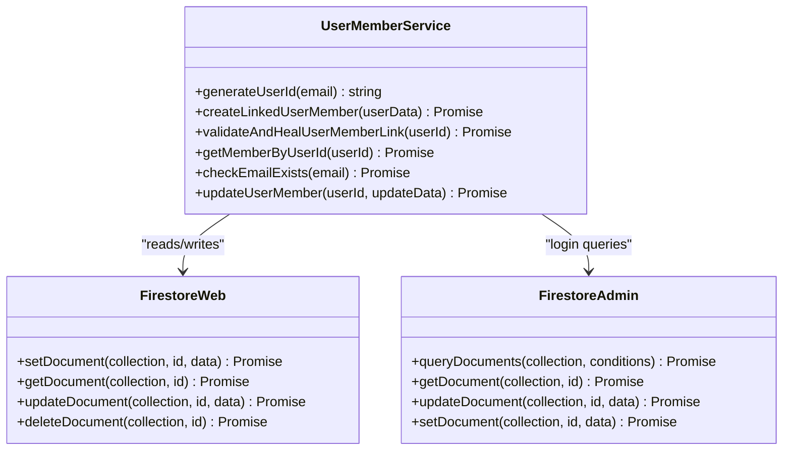
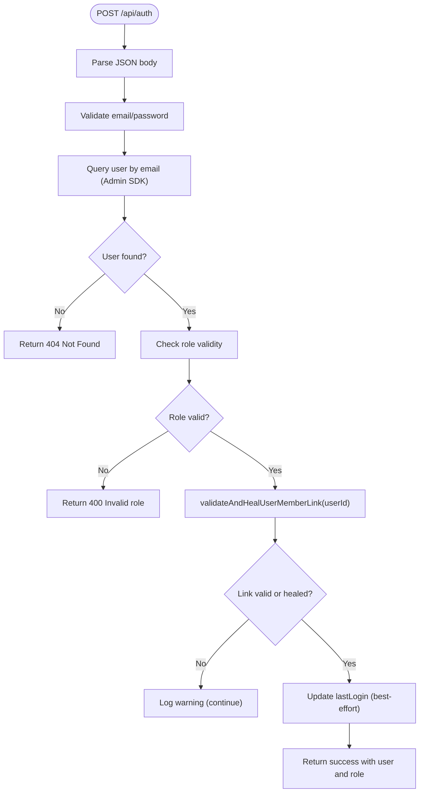
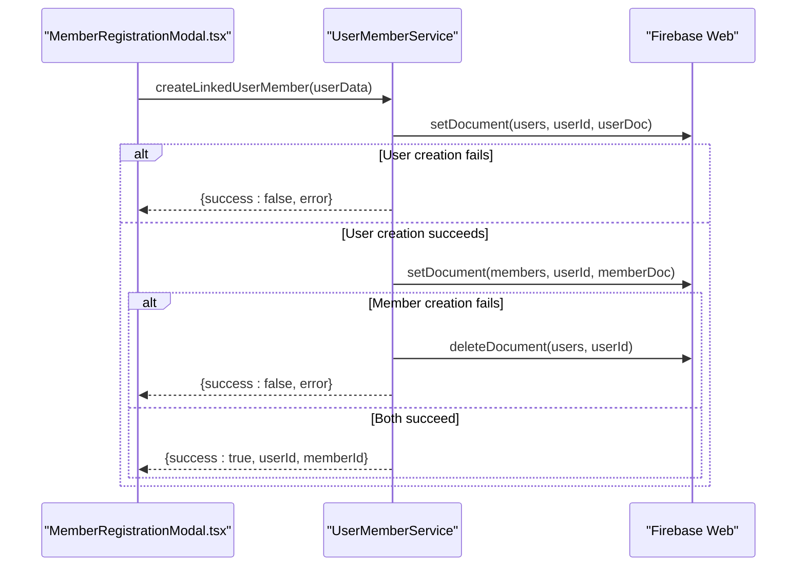
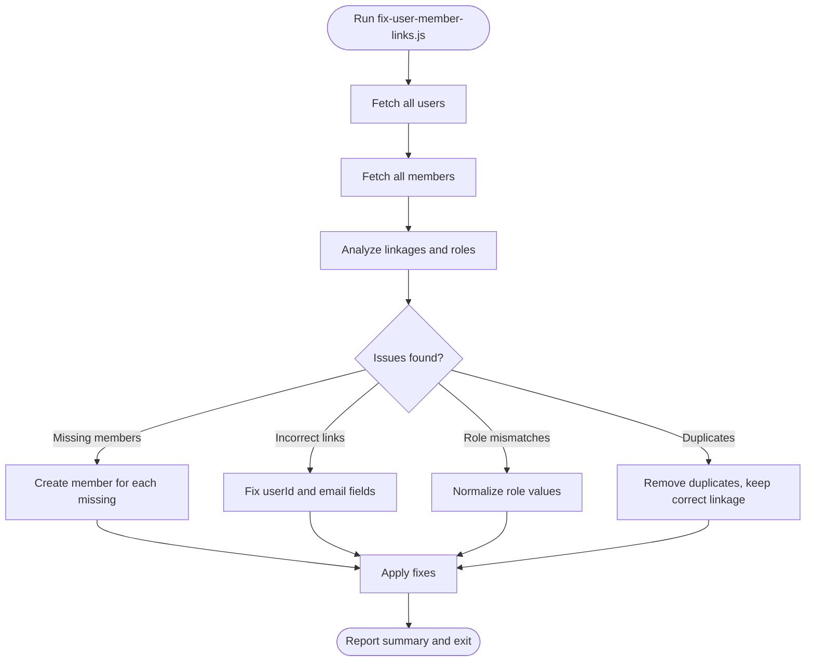
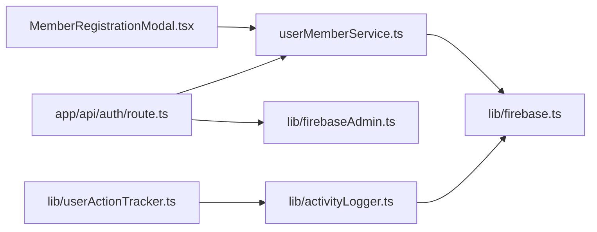

# User-Member Linking System

<cite>
**Referenced Files in This Document**
- [USER_MEMBER_LINKING.md](file://docs/USER_MEMBER_LINKING.md)
- [userMemberService.ts](file://lib/userMemberService.ts)
- [route.ts](file://app/api/auth/route.ts)
- [MemberRegistrationModal.tsx](file://components/admin/MemberRegistrationModal.tsx)
- [fix-user-member-links.js](file://scripts/fix-user-member-links.js)
- [firebase.ts](file://lib/firebase.ts)
- [firebaseAdmin.ts](file://lib/firebaseAdmin.ts)
- [activityLogger.ts](file://lib/activityLogger.ts)
- [userActionTracker.ts](file://lib/userActionTracker.ts)
</cite>

## Table of Contents
1. [Introduction](#introduction)
2. [Project Structure](#project-structure)
3. [Core Components](#core-components)
4. [Architecture Overview](#architecture-overview)
5. [Detailed Component Analysis](#detailed-component-analysis)
6. [Dependency Analysis](#dependency-analysis)
7. [Performance Considerations](#performance-considerations)
8. [Troubleshooting Guide](#troubleshooting-guide)
9. [Security and Audit Trail](#security-and-audit-trail)
10. [Conclusion](#conclusion)

## Introduction
This document explains the User-Member Linking System that connects authentication users with cooperative member profiles. It covers:
- Automatic linking during registration
- Validation and self-healing on login
- Bidirectional synchronization and conflict resolution
- Role inheritance from user accounts to member profiles
- Unlinking considerations for deactivation/deletion
- Examples, troubleshooting, and consistency maintenance
- Security and audit trail requirements

## Project Structure
The linking system spans three primary areas:
- Backend API route that authenticates users and validates/repairs links
- Frontend registration modal that creates linked user and member records atomically
- Shared service library that encapsulates ID generation, atomic creation, validation/healing, and updates
- Supporting scripts and utilities for data consistency and audit logging

**Diagram sources**
- [MemberRegistrationModal.tsx](file://components/admin/MemberRegistrationModal.tsx#L328-L341)
- [route.ts](file://app/api/auth/route.ts#L205-L221)
- [userMemberService.ts](file://lib/userMemberService.ts#L14-L92)
- [firebase.ts](file://lib/firebase.ts#L90-L146)
- [firebaseAdmin.ts](file://lib/firebaseAdmin.ts#L150-L236)
- [activityLogger.ts](file://lib/activityLogger.ts#L20-L43)
- [userActionTracker.ts](file://lib/userActionTracker.ts#L10-L47)

**Section sources**
- [USER_MEMBER_LINKING.md](file://docs/USER_MEMBER_LINKING.md#L1-L146)
- [MemberRegistrationModal.tsx](file://components/admin/MemberRegistrationModal.tsx#L328-L341)
- [route.ts](file://app/api/auth/route.ts#L205-L221)
- [userMemberService.ts](file://lib/userMemberService.ts#L14-L92)
- [firebase.ts](file://lib/firebase.ts#L90-L146)
- [firebaseAdmin.ts](file://lib/firebaseAdmin.ts#L150-L236)
- [activityLogger.ts](file://lib/activityLogger.ts#L20-L43)
- [userActionTracker.ts](file://lib/userActionTracker.ts#L10-L47)

## Core Components
- Single source of truth for IDs: consistent encoding of email into user/member document IDs
- Atomic creation of linked user and member records
- Validation and automatic healing of linkages on login
- Synchronized updates across both collections
- Role normalization and inheritance from user to member
- Data fix script to remediate historical inconsistencies

**Section sources**
- [USER_MEMBER_LINKING.md](file://docs/USER_MEMBER_LINKING.md#L19-L91)
- [userMemberService.ts](file://lib/userMemberService.ts#L14-L92)
- [userMemberService.ts](file://lib/userMemberService.ts#L99-L198)
- [userMemberService.ts](file://lib/userMemberService.ts#L246-L287)
- [fix-user-member-links.js](file://scripts/fix-user-member-links.js#L24-L64)

## Architecture Overview
The system ensures that user and member documents share the same ID and maintain consistent metadata. On login, the backend validates and heals any broken linkages. During registration, the frontend uses a service that atomically creates both documents.

**Diagram sources**
- [route.ts](file://app/api/auth/route.ts#L48-L264)
- [userMemberService.ts](file://lib/userMemberService.ts#L99-L198)
- [firebase.ts](file://lib/firebase.ts#L115-L146)
- [firebaseAdmin.ts](file://lib/firebaseAdmin.ts#L150-L236)

## Detailed Component Analysis

### Service Layer: User-Member Linking
The service centralizes ID generation, atomic creation, validation/healing, retrieval, and synchronized updates.

**Diagram sources**
- [userMemberService.ts](file://lib/userMemberService.ts#L14-L287)
- [firebase.ts](file://lib/firebase.ts#L90-L284)
- [firebaseAdmin.ts](file://lib/firebaseAdmin.ts#L150-L236)

**Section sources**
- [userMemberService.ts](file://lib/userMemberService.ts#L14-L92)
- [userMemberService.ts](file://lib/userMemberService.ts#L99-L198)
- [userMemberService.ts](file://lib/userMemberService.ts#L205-L221)
- [userMemberService.ts](file://lib/userMemberService.ts#L246-L287)

### Authentication Flow: Login Validation and Healing
On successful login, the backend validates and heals the user-member linkage. It also updates the last login timestamp.

**Diagram sources**
- [route.ts](file://app/api/auth/route.ts#L48-L264)
- [userMemberService.ts](file://lib/userMemberService.ts#L99-L198)

**Section sources**
- [route.ts](file://app/api/auth/route.ts#L48-L264)
- [userMemberService.ts](file://lib/userMemberService.ts#L99-L198)

### Registration Flow: Atomic Linked Creation
The registration modal uses the service to create both user and member documents atomically. If member creation fails, the user document is rolled back.

**Diagram sources**
- [MemberRegistrationModal.tsx](file://components/admin/MemberRegistrationModal.tsx#L328-L341)
- [userMemberService.ts](file://lib/userMemberService.ts#L23-L92)
- [firebase.ts](file://lib/firebase.ts#L90-L146)

**Section sources**
- [MemberRegistrationModal.tsx](file://components/admin/MemberRegistrationModal.tsx#L328-L341)
- [userMemberService.ts](file://lib/userMemberService.ts#L23-L92)

### Data Fix Script: Remediation of Inconsistencies
The script identifies and fixes missing members, incorrect linkages, role mismatches, and duplicate member records.

**Diagram sources**
- [fix-user-member-links.js](file://scripts/fix-user-member-links.js#L66-L294)

**Section sources**
- [fix-user-member-links.js](file://scripts/fix-user-member-links.js#L66-L294)

### Role Inheritance and Synchronization
- Role normalization: roles are normalized to lowercase and trimmed before storage
- Inheritance: user roles are propagated to member records during healing and creation
- Conflict resolution: user role is treated as the authoritative source when discrepancies exist

**Section sources**
- [userMemberService.ts](file://lib/userMemberService.ts#L138-L149)
- [fix-user-member-links.js](file://scripts/fix-user-member-links.js#L32-L37)
- [fix-user-member-links.js](file://scripts/fix-user-member-links.js#L224-L240)

### Unlinking Considerations
- Deactivation: To deactivate a user, update the user’s status in the users collection and optionally mark the member inactive. Maintain the documents for audit trails.
- Deletion: Deleting user/member documents should be avoided to preserve auditability. Instead, mark records as inactive and retain metadata for compliance.
- Manual unlinking: If needed, adjust the member’s userId and email fields to align with the user document; use the validation/healing routine to confirm consistency.

[No sources needed since this section provides general guidance]

## Dependency Analysis
The system exhibits clear separation of concerns:
- Frontend registration depends on the service layer for atomic creation
- Backend authentication depends on the service for validation/healing
- Both layers depend on Firestore utilities for database operations
- Audit logging is decoupled via activity logger and tracker utilities

**Diagram sources**
- [MemberRegistrationModal.tsx](file://components/admin/MemberRegistrationModal.tsx#L328-L341)
- [route.ts](file://app/api/auth/route.ts#L205-L221)
- [userMemberService.ts](file://lib/userMemberService.ts#L14-L92)
- [firebase.ts](file://lib/firebase.ts#L90-L146)
- [firebaseAdmin.ts](file://lib/firebaseAdmin.ts#L150-L236)
- [activityLogger.ts](file://lib/activityLogger.ts#L20-L43)
- [userActionTracker.ts](file://lib/userActionTracker.ts#L10-L47)

**Section sources**
- [MemberRegistrationModal.tsx](file://components/admin/MemberRegistrationModal.tsx#L328-L341)
- [route.ts](file://app/api/auth/route.ts#L205-L221)
- [userMemberService.ts](file://lib/userMemberService.ts#L14-L92)
- [firebase.ts](file://lib/firebase.ts#L90-L146)
- [firebaseAdmin.ts](file://lib/firebaseAdmin.ts#L150-L236)
- [activityLogger.ts](file://lib/activityLogger.ts#L20-L43)
- [userActionTracker.ts](file://lib/userActionTracker.ts#L10-L47)

## Performance Considerations
- Atomic operations: The service ensures rollback on partial failures, preventing inconsistent states
- Parallel reads/writes: The update routine executes updates in parallel where safe
- Best-effort updates: Login attempts to update lastLogin even if healing succeeds, minimizing disruption
- Indexing: Ensure Firestore indexes exist for email queries and role filtering to optimize login and search performance

[No sources needed since this section provides general guidance]

## Troubleshooting Guide
Common issues and resolutions:
- “No member found for this user ID”: Trigger the validation/healing routine; it will create missing member records
- Role mismatch between user and member: The fix script normalizes roles; re-run to reconcile
- Duplicate members: The fix script removes duplicates and keeps the correct linkage
- Registration failure: If member creation fails after user creation, the service rolls back the user document; retry after resolving underlying data conflicts
- Login still fails after healing: Verify role validity and that the user account exists and has a password set

Validation checklist:
- New member registration creates both user and member records
- Login works for all existing accounts (auto-healing)
- Member data loads correctly in all dashboard views
- Profile editing updates both collections
- Transactions work with proper member linking
- Role-based routing functions correctly
- No “No member found” errors in console

**Section sources**
- [USER_MEMBER_LINKING.md](file://docs/USER_MEMBER_LINKING.md#L114-L123)
- [fix-user-member-links.js](file://scripts/fix-user-member-links.js#L172-L178)

## Security and Audit Trail
- Audit logging: Use the activity logger and tracker to capture user actions, including login/logout, profile updates, member creation, and financial updates
- Compliance: Maintain records of membership changes and role modifications for regulatory requirements
- Logging fields: Include user ID, email, role, action, timestamp, IP address (when available), and user agent
- Recommendations: Implement backend IP logging for stronger auditability; periodically review logs for anomalies

**Section sources**
- [activityLogger.ts](file://lib/activityLogger.ts#L20-L43)
- [userActionTracker.ts](file://lib/userActionTracker.ts#L10-L47)
- [userActionTracker.ts](file://lib/userActionTracker.ts#L84-L118)

## Conclusion
The User-Member Linking System establishes a robust, self-healing mechanism that ensures consistent identity across user and member collections. Through atomic creation, validation/healing on login, role normalization, and comprehensive audit logging, the system improves reliability, reduces manual intervention, and supports secure, compliant operations.