# Administrative Features

<cite>
**Referenced Files in This Document**
- [app/admin/layout.tsx](file://app/admin/layout.tsx)
- [components/admin/Sidebar.tsx](file://components/admin/Sidebar.tsx)
- [components/admin/Card.tsx](file://components/admin/Card.tsx)
- [components/admin/Footer.tsx](file://components/admin/Footer.tsx)
- [components/admin/OfficerDashboard.tsx](file://components/admin/OfficerDashboard.tsx)
- [app/admin/settings/officers/page.tsx](file://app/admin/settings/officers/page.tsx)
- [app/admin/settings/permissions/page.tsx](file://app/admin/settings/permissions/page.tsx)
- [app/admin/settings/system/page.tsx](file://app/admin/settings/system/page.tsx)
- [lib/sidebarConfig.ts](file://lib/sidebarConfig.ts)
- [lib/auth.tsx](file://lib/auth.tsx)
- [lib/validators.ts](file://lib/validators.ts)
- [lib/rolePermissions.tsx](file://lib/rolePermissions.tsx)
- [lib/firebase.ts](file://lib/firebase.ts)
- [middleware.ts](file://middleware.ts)
- [app/admin/dashboard/page.tsx](file://app/admin/dashboard/page.tsx)
- [app/admin/reports/page.tsx](file://app/admin/reports/page.tsx)
- [app/api/users/route.ts](file://app/api/users/route.ts)
- [app/api/dashboard/initialize/route.ts](file://app/api/dashboard/initialize/route.ts)
- [lib/userActionTracker.ts](file://lib/userActionTracker.ts)
- [lib/activityLogger.ts](file://lib/activityLogger.ts)
</cite>

## Update Summary
**Changes Made**
- Added comprehensive administrative settings system documentation
- Documented new officer management functionality with CRUD operations
- Added role permissions management with granular access control
- Documented system configuration including financial settings and loan plans
- Updated sidebar configuration to include new settings pages
- Enhanced role-based access control documentation

## Table of Contents
1. [Introduction](#introduction)
2. [Project Structure](#project-structure)
3. [Core Components](#core-components)
4. [Architecture Overview](#architecture-overview)
5. [Detailed Component Analysis](#detailed-component-analysis)
6. [Administrative Settings System](#administrative-settings-system)
7. [Dependency Analysis](#dependency-analysis)
8. [Performance Considerations](#performance-considerations)
9. [Troubleshooting Guide](#troubleshooting-guide)
10. [Conclusion](#conclusion)

## Introduction
This document describes the administrative features and dashboard functionality of the SAMPA Cooperative Management System. It focuses on the role-specific officer dashboards, the administrative sidebar navigation, administrative cards for metrics and activities, the administrative footer, report generation capabilities, user management features, workflows, customization options, and security measures including audit logging and compliance reporting. The system now includes a comprehensive administrative settings system for managing cooperative officers, role-based permissions, and system configuration.

## Project Structure
The administrative domain is organized around:
- Role-based dashboards and navigation under app/admin
- Shared administrative UI components under components/admin
- Role-based sidebar configuration and validation utilities under lib
- Middleware enforcing route access and redirects
- API routes for administrative tasks such as user creation and dashboard data initialization
- Audit logging and action tracking utilities
- **New**: Administrative settings system under app/admin/settings for managing officers, permissions, and system configuration

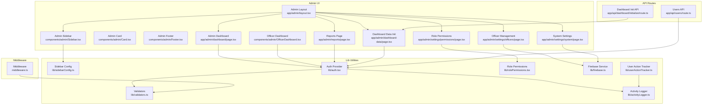

**Diagram sources**
- [app/admin/layout.tsx:1-69](file://app/admin/layout.tsx#L1-L69)
- [components/admin/Sidebar.tsx:1-279](file://components/admin/Sidebar.tsx#L1-L279)
- [components/admin/Card.tsx:1-35](file://components/admin/Card.tsx#L1-L35)
- [components/admin/Footer.tsx:1-23](file://components/admin/Footer.tsx#L1-L23)
- [components/admin/OfficerDashboard.tsx:1-198](file://components/admin/OfficerDashboard.tsx#L1-L198)
- [app/admin/dashboard/page.tsx:1-799](file://app/admin/dashboard/page.tsx#L1-L799)
- [app/admin/reports/page.tsx:1-737](file://app/admin/reports/page.tsx#L1-L737)
- [app/admin/dashboard-data/page.tsx:1-468](file://app/admin/dashboard-data/page.tsx#L1-L468)
- [app/admin/settings/officers/page.tsx:1-702](file://app/admin/settings/officers/page.tsx#L1-L702)
- [app/admin/settings/permissions/page.tsx:1-486](file://app/admin/settings/permissions/page.tsx#L1-L486)
- [app/admin/settings/system/page.tsx:1-799](file://app/admin/settings/system/page.tsx#L1-L799)
- [lib/sidebarConfig.ts:1-397](file://lib/sidebarConfig.ts#L1-L397)
- [lib/auth.tsx:1-682](file://lib/auth.tsx#L1-L682)
- [lib/validators.ts:1-236](file://lib/validators.ts#L1-L236)
- [lib/rolePermissions.tsx:1-226](file://lib/rolePermissions.tsx#L1-L226)
- [lib/firebase.ts:1-345](file://lib/firebase.ts#L1-L345)
- [middleware.ts:1-62](file://middleware.ts#L1-L62)
- [app/api/users/route.ts:1-126](file://app/api/users/route.ts#L1-L126)
- [app/api/dashboard/initialize/route.ts:1-186](file://app/api/dashboard/initialize/route.ts#L1-L186)
- [lib/activityLogger.ts:1-165](file://lib/activityLogger.ts#L1-L165)
- [lib/userActionTracker.ts:1-118](file://lib/userActionTracker.ts#L1-L118)

**Section sources**
- [app/admin/layout.tsx:1-69](file://app/admin/layout.tsx#L1-L69)
- [lib/sidebarConfig.ts:1-397](file://lib/sidebarConfig.ts#L1-L397)
- [lib/auth.tsx:1-682](file://lib/auth.tsx#L1-L682)
- [lib/validators.ts:1-236](file://lib/validators.ts#L1-L236)
- [middleware.ts:1-62](file://middleware.ts#L1-L62)

## Core Components
- Admin Layout: Enforces authentication and role checks for admin routes, conditionally renders the sidebar, and handles redirects for unauthenticated or unauthorized users.
- Admin Sidebar: Role-aware navigation with collapsible sections, dropdowns, active route highlighting, and a logout handler. Now includes new settings pages.
- Admin Card: Reusable card container for dashboard metrics and content.
- Admin Footer: Fixed footer with copyright and version information.
- Officer Dashboard: Role-specific dashboard rendering with metrics, recent activities, and quick actions.
- Admin Dashboard: Comprehensive analytics dashboard for administrators with charts, leaderboards, and filters.
- Reports Page: Financial and operational reports with filtering and print functionality.
- Dashboard Data Initialization: Event and reminder generator for system setup.
- **New**: Officer Management: Comprehensive CRUD operations for managing cooperative officers with role hierarchy and validation.
- **New**: Role Permissions: Granular permission management system with role-based access control.
- **New**: System Settings: Configuration management for membership fees, loan plans, and system policies.
- Authentication and Validation: Centralized auth provider, route validators, and middleware enforcement.
- Audit Logging and Action Tracking: Utilities to log user actions and maintain compliance.

**Section sources**
- [app/admin/layout.tsx:1-69](file://app/admin/layout.tsx#L1-L69)
- [components/admin/Sidebar.tsx:1-279](file://components/admin/Sidebar.tsx#L1-L279)
- [components/admin/Card.tsx:1-35](file://components/admin/Card.tsx#L1-L35)
- [components/admin/Footer.tsx:1-23](file://components/admin/Footer.tsx#L1-L23)
- [components/admin/OfficerDashboard.tsx:1-198](file://components/admin/OfficerDashboard.tsx#L1-L198)
- [app/admin/dashboard/page.tsx:1-799](file://app/admin/dashboard/page.tsx#L1-L799)
- [app/admin/reports/page.tsx:1-737](file://app/admin/reports/page.tsx#L1-L737)
- [app/admin/dashboard-data/page.tsx:1-468](file://app/admin/dashboard-data/page.tsx#L1-L468)
- [app/admin/settings/officers/page.tsx:1-702](file://app/admin/settings/officers/page.tsx#L1-L702)
- [app/admin/settings/permissions/page.tsx:1-486](file://app/admin/settings/permissions/page.tsx#L1-L486)
- [app/admin/settings/system/page.tsx:1-799](file://app/admin/settings/system/page.tsx#L1-L799)
- [lib/sidebarConfig.ts:1-397](file://lib/sidebarConfig.ts#L1-L397)
- [lib/auth.tsx:1-682](file://lib/auth.tsx#L1-L682)
- [lib/validators.ts:1-236](file://lib/validators.ts#L1-L236)
- [middleware.ts:1-62](file://middleware.ts#L1-L62)
- [lib/userActionTracker.ts:1-118](file://lib/userActionTracker.ts#L1-L118)
- [lib/activityLogger.ts:1-165](file://lib/activityLogger.ts#L1-L165)

## Architecture Overview
The administrative system enforces role-based access control at both the UI and routing layers. The Admin Layout validates user roles and renders the Sidebar accordingly. Middleware intercepts requests to enforce route access and redirect unauthorized users. The Auth Provider centralizes authentication state and exposes helpers for role-based routing and dashboard selection. Reports and dashboard data pages rely on Firestore queries and provide filtering and printing capabilities. Audit logging captures user actions for compliance. **The new settings system integrates seamlessly with the existing architecture, using Firestore for persistent storage and role-based permissions for access control.**

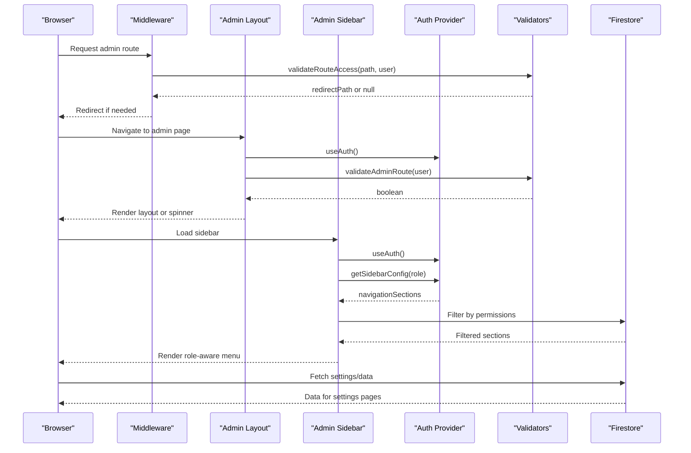

**Diagram sources**
- [middleware.ts:1-62](file://middleware.ts#L1-L62)
- [app/admin/layout.tsx:1-69](file://app/admin/layout.tsx#L1-L69)
- [components/admin/Sidebar.tsx:1-279](file://components/admin/Sidebar.tsx#L1-L279)
- [lib/auth.tsx:1-682](file://lib/auth.tsx#L1-L682)
- [lib/validators.ts:1-236](file://lib/validators.ts#L1-L236)

## Detailed Component Analysis

### Admin Layout and Role-Based Access Control
- Validates admin routes and redirects unauthenticated or unauthorized users to the admin login page.
- Conditionally renders the sidebar except on login/register pages.
- Integrates with the Auth Provider and validators to ensure only admin roles can access admin routes.

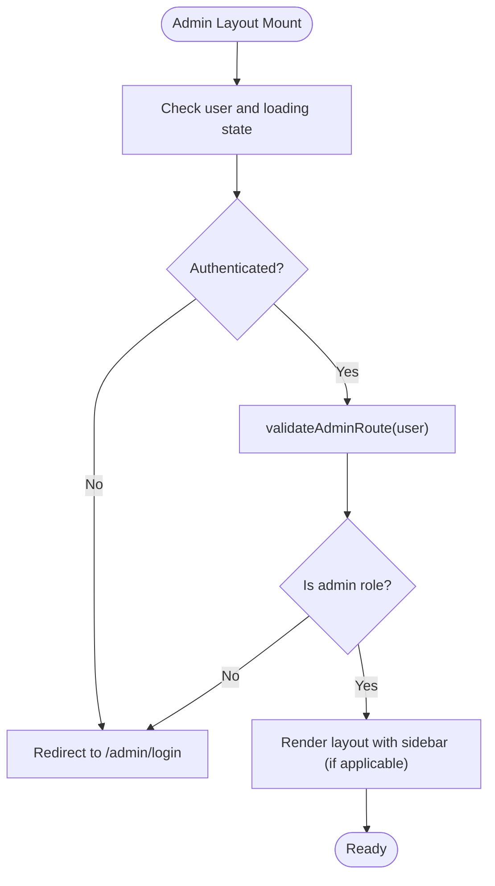

**Diagram sources**
- [app/admin/layout.tsx:1-69](file://app/admin/layout.tsx#L1-L69)
- [lib/validators.ts:1-236](file://lib/validators.ts#L1-L236)

**Section sources**
- [app/admin/layout.tsx:1-69](file://app/admin/layout.tsx#L1-L69)
- [lib/validators.ts:1-236](file://lib/validators.ts#L1-L236)

### Administrative Sidebar Navigation
- Role-aware navigation built from a centralized configuration.
- Supports collapsible sections, dropdowns, and active route highlighting.
- Provides a logout handler integrated with the Auth Provider.
- **Updated**: Now includes new settings pages: Role Permissions, Officer Management, Audit Logs, and System Settings.

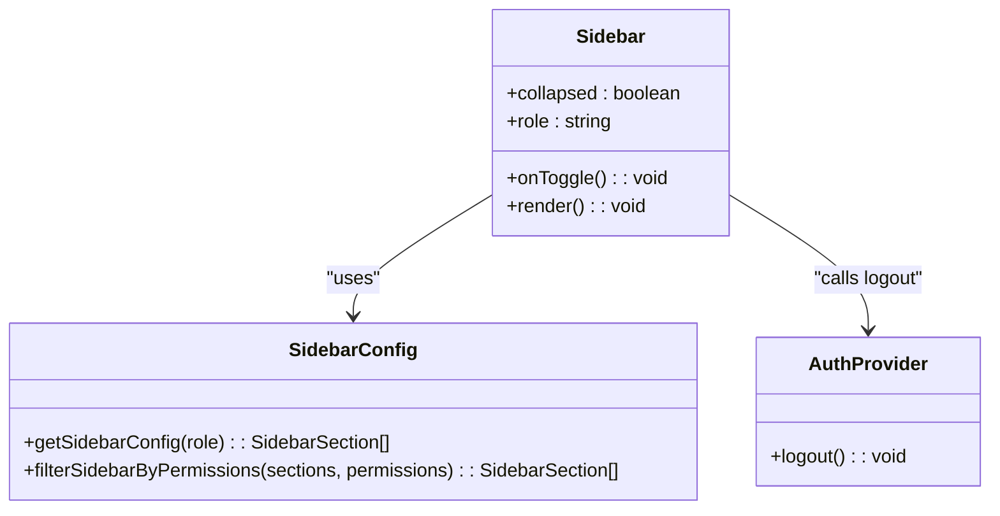

**Diagram sources**
- [components/admin/Sidebar.tsx:1-279](file://components/admin/Sidebar.tsx#L1-L279)
- [lib/sidebarConfig.ts:1-397](file://lib/sidebarConfig.ts#L1-L397)
- [lib/auth.tsx:1-682](file://lib/auth.tsx#L1-L682)

**Section sources**
- [components/admin/Sidebar.tsx:1-279](file://components/admin/Sidebar.tsx#L1-L279)
- [lib/sidebarConfig.ts:1-397](file://lib/sidebarConfig.ts#L1-L397)
- [lib/auth.tsx:1-682](file://lib/auth.tsx#L1-L682)

### Administrative Cards and Dashboard Components
- Admin Card: A reusable card component for consistent styling and responsive layout.
- Officer Dashboard: Displays role-specific metrics, recent activities, and quick actions.
- Admin Dashboard: Comprehensive analytics with charts, savings leaderboard, and filters.

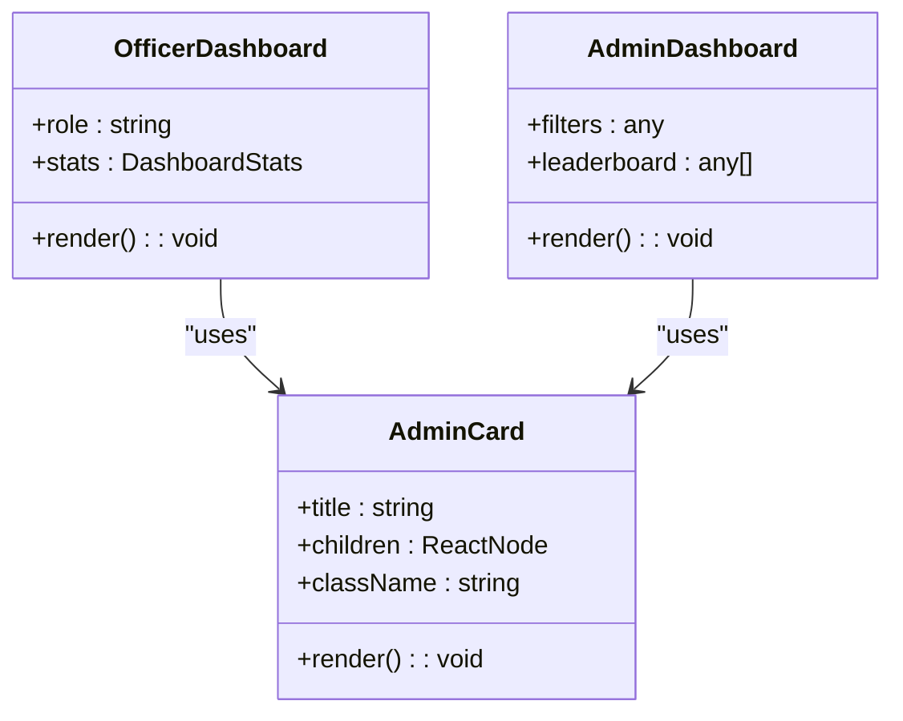

**Diagram sources**
- [components/admin/Card.tsx:1-35](file://components/admin/Card.tsx#L1-L35)
- [components/admin/OfficerDashboard.tsx:1-198](file://components/admin/OfficerDashboard.tsx#L1-L198)
- [app/admin/dashboard/page.tsx:1-799](file://app/admin/dashboard/page.tsx#L1-L799)

**Section sources**
- [components/admin/Card.tsx:1-35](file://components/admin/Card.tsx#L1-L35)
- [components/admin/OfficerDashboard.tsx:1-198](file://components/admin/OfficerDashboard.tsx#L1-L198)
- [app/admin/dashboard/page.tsx:1-799](file://app/admin/dashboard/page.tsx#L1-L799)

### Administrative Footer
- Fixed footer displaying copyright and version information.

**Section sources**
- [components/admin/Footer.tsx:1-23](file://components/admin/Footer.tsx#L1-L23)

### Administrative Report Generation
- Reports page aggregates member, savings, and loan data with filtering by date range and role.
- Provides print functionality to generate PDF-like printable reports.

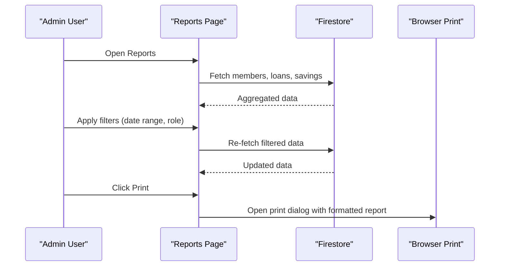

**Diagram sources**
- [app/admin/reports/page.tsx:1-737](file://app/admin/reports/page.tsx#L1-L737)

**Section sources**
- [app/admin/reports/page.tsx:1-737](file://app/admin/reports/page.tsx#L1-L737)

### Administrative User Management
- Users API supports fetching all users and creating new users with validation.
- Admins can create users programmatically via the API.

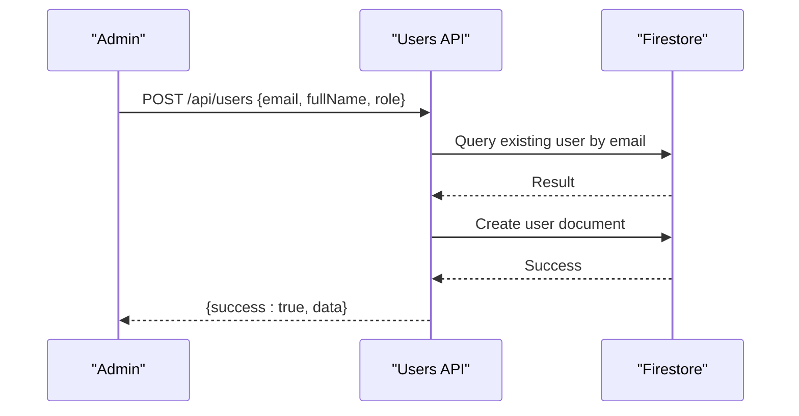

**Diagram sources**
- [app/api/users/route.ts:1-126](file://app/api/users/route.ts#L1-L126)

**Section sources**
- [app/api/users/route.ts:1-126](file://app/api/users/route.ts#L1-L126)

### Administrative Dashboard Data Initialization
- Dashboard Data Init page initializes reminders and events collections and allows adding new reminders and events.

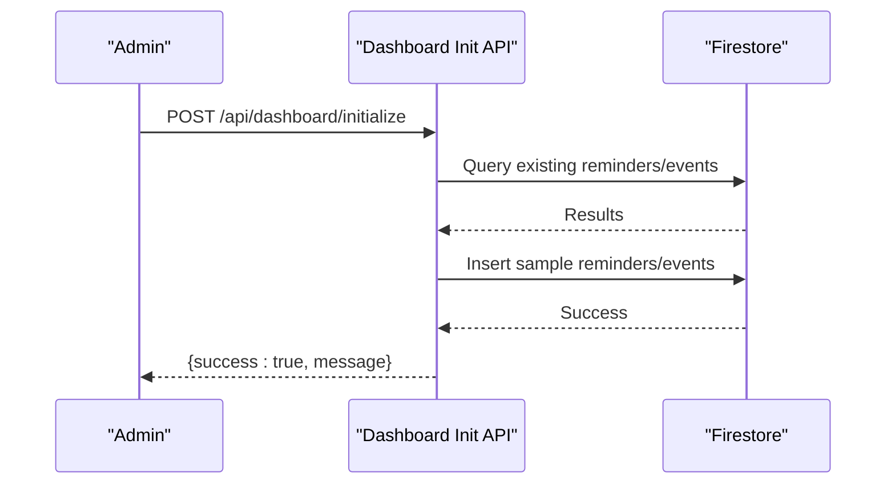

**Diagram sources**
- [app/admin/dashboard-data/page.tsx:1-468](file://app/admin/dashboard-data/page.tsx#L1-L468)
- [app/api/dashboard/initialize/route.ts:1-186](file://app/api/dashboard/initialize/route.ts#L1-L186)

**Section sources**
- [app/admin/dashboard-data/page.tsx:1-468](file://app/admin/dashboard-data/page.tsx#L1-L468)
- [app/api/dashboard/initialize/route.ts:1-186](file://app/api/dashboard/initialize/route.ts#L1-L186)

### Administrative Workflows and Customization
- Role-specific dashboards: Admins see the comprehensive Admin Dashboard; other roles see role-specific dashboards.
- Sidebar customization: Menu items are driven by roleSidebarConfig and rendered dynamically.
- Filters and quick actions: Reports and Admin Dashboard support filtering and interactive navigation.

**Section sources**
- [lib/sidebarConfig.ts:1-397](file://lib/sidebarConfig.ts#L1-L397)
- [app/admin/dashboard/page.tsx:1-799](file://app/admin/dashboard/page.tsx#L1-L799)
- [app/admin/reports/page.tsx:1-737](file://app/admin/reports/page.tsx#L1-L737)

### Security Measures, Audit Logging, and Compliance Reporting
- Middleware enforces route access and redirects unauthorized users.
- Validators ensure only authorized roles access specific routes.
- Auth Provider tracks login/logout/profile updates and wraps actions with automatic logging.
- Activity logger stores logs in Firestore with timestamps and contextual metadata.
- Compliance-ready audit trails enable date-range queries and user-scoped logs.

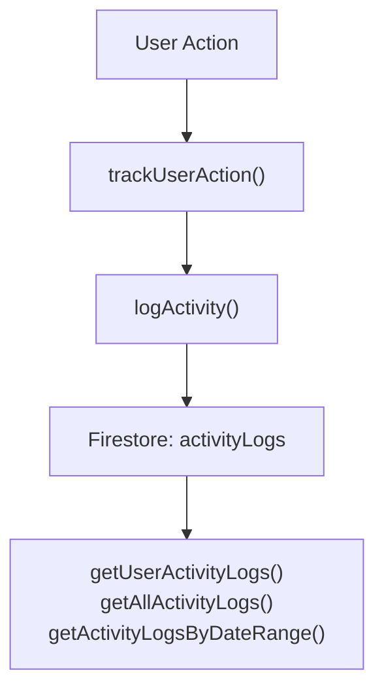

**Diagram sources**
- [lib/userActionTracker.ts:1-118](file://lib/userActionTracker.ts#L1-L118)
- [lib/activityLogger.ts:1-165](file://lib/activityLogger.ts#L1-L165)

**Section sources**
- [middleware.ts:1-62](file://middleware.ts#L1-L62)
- [lib/validators.ts:1-236](file://lib/validators.ts#L1-L236)
- [lib/userActionTracker.ts:1-118](file://lib/userActionTracker.ts#L1-L118)
- [lib/activityLogger.ts:1-165](file://lib/activityLogger.ts#L1-L165)

## Administrative Settings System

### Officer Management
The Officer Management system provides comprehensive CRUD operations for managing cooperative officers with role hierarchy and validation:

- **Role Hierarchy**: Officers are managed in a hierarchical order (Chairman → Vice Chairman → Secretary → Treasurer → Manager → Board of Directors)
- **Validation**: Email uniqueness validation, phone number format validation (11 digits starting with "09"), and password requirements (minimum 8 characters)
- **CRUD Operations**: Full create, read, update, and delete functionality with modal-based forms
- **Search and Filtering**: Real-time search across names, emails, and roles with role-based sorting
- **Status Management**: Active/inactive status tracking with visual indicators

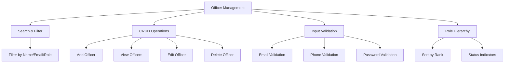

**Diagram sources**
- [app/admin/settings/officers/page.tsx:1-702](file://app/admin/settings/officers/page.tsx#L1-L702)

**Section sources**
- [app/admin/settings/officers/page.tsx:1-702](file://app/admin/settings/officers/page.tsx#L1-L702)

### Role Permissions Management
The Role Permissions system provides granular access control with default configurations and custom overrides:

- **Permission Categories**: View Members, Add Members, Edit Members, Archive/Restore Members, View Loans, Approve Loans, Reject Loans, View Savings, Manage Savings, View Reports, Export Data, Manage Settings
- **Default Configurations**: Predefined permission sets for each role with logical access patterns
- **Real-time Editing**: Toggle-based interface for immediate permission changes
- **Backup Storage**: LocalStorage backup for permission configurations
- **Reset Functionality**: One-click reset to default permission sets

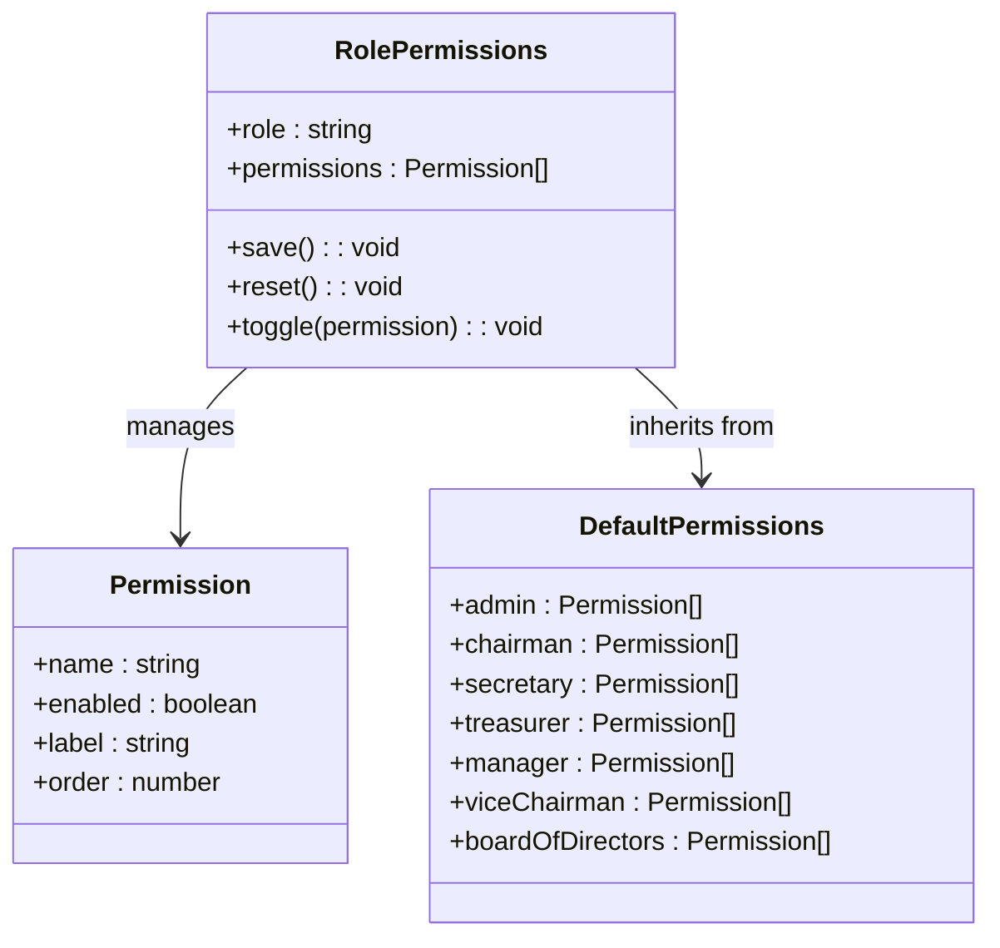

**Diagram sources**
- [app/admin/settings/permissions/page.tsx:1-486](file://app/admin/settings/permissions/page.tsx#L1-L486)
- [lib/rolePermissions.tsx:1-226](file://lib/rolePermissions.tsx#L1-L226)

**Section sources**
- [app/admin/settings/permissions/page.tsx:1-486](file://app/admin/settings/permissions/page.tsx#L1-L486)
- [lib/rolePermissions.tsx:1-226](file://lib/rolePermissions.tsx#L1-L226)

### System Settings Configuration
The System Settings module manages cooperative policies and financial configurations:

- **Membership Settings**: Configure membership payment amounts and reactivation fees with currency formatting
- **Loan Plans Management**: Create, edit, and delete loan plans with maximum amounts, interest rates, and term options
- **Financial Configuration**: Real-time currency formatting and number formatting for Philippine Peso
- **Audit Trail**: Track who made changes and when with timestamped updates
- **Default Values**: Pre-configured default settings with easy reset functionality

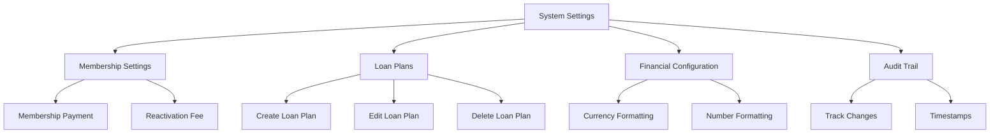

**Diagram sources**
- [app/admin/settings/system/page.tsx:1-799](file://app/admin/settings/system/page.tsx#L1-L799)

**Section sources**
- [app/admin/settings/system/page.tsx:1-799](file://app/admin/settings/system/page.tsx#L1-L799)

### Settings Integration with Sidebar
The new settings pages are fully integrated into the administrative navigation system:

- **Admin Settings Section**: Dedicated section in the sidebar for all administrative settings
- **Permission-based Visibility**: Only administrators can access settings pages
- **Consistent Navigation**: Settings pages follow the same design patterns as other admin pages
- **Role-based Access**: Each settings page enforces appropriate role restrictions

**Section sources**
- [lib/sidebarConfig.ts:73-81](file://lib/sidebarConfig.ts#L73-L81)
- [lib/rolePermissions.tsx:1-226](file://lib/rolePermissions.tsx#L1-L226)

## Dependency Analysis
The administrative system exhibits clear separation of concerns with enhanced integration for the new settings system:
- UI components depend on shared Admin Card and Sidebar components.
- Sidebar depends on roleSidebarConfig for dynamic navigation including new settings pages.
- Auth Provider integrates with validators and middleware for access control.
- Reports and dashboard pages depend on Firestore for data retrieval.
- **New**: Settings pages integrate with Firestore for persistent storage and rolePermissions for access control.
- Audit logging is decoupled and used by action tracking utilities.

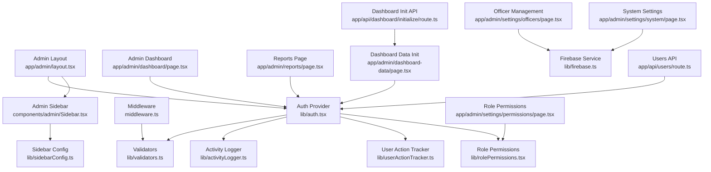

**Diagram sources**
- [lib/auth.tsx:1-682](file://lib/auth.tsx#L1-L682)
- [lib/validators.ts:1-236](file://lib/validators.ts#L1-L236)
- [lib/activityLogger.ts:1-165](file://lib/activityLogger.ts#L1-L165)
- [lib/userActionTracker.ts:1-118](file://lib/userActionTracker.ts#L1-L118)
- [lib/rolePermissions.tsx:1-226](file://lib/rolePermissions.tsx#L1-L226)
- [lib/firebase.ts:1-345](file://lib/firebase.ts#L1-L345)
- [middleware.ts:1-62](file://middleware.ts#L1-L62)
- [app/admin/layout.tsx:1-69](file://app/admin/layout.tsx#L1-L69)
- [components/admin/Sidebar.tsx:1-279](file://components/admin/Sidebar.tsx#L1-L279)
- [lib/sidebarConfig.ts:1-397](file://lib/sidebarConfig.ts#L1-L397)
- [app/admin/dashboard/page.tsx:1-799](file://app/admin/dashboard/page.tsx#L1-L799)
- [app/admin/reports/page.tsx:1-737](file://app/admin/reports/page.tsx#L1-L737)
- [app/admin/dashboard-data/page.tsx:1-468](file://app/admin/dashboard-data/page.tsx#L1-L468)
- [app/admin/settings/officers/page.tsx:1-702](file://app/admin/settings/officers/page.tsx#L1-L702)
- [app/admin/settings/permissions/page.tsx:1-486](file://app/admin/settings/permissions/page.tsx#L1-L486)
- [app/admin/settings/system/page.tsx:1-799](file://app/admin/settings/system/page.tsx#L1-L799)
- [app/api/users/route.ts:1-126](file://app/api/users/route.ts#L1-L126)
- [app/api/dashboard/initialize/route.ts:1-186](file://app/api/dashboard/initialize/route.ts#L1-L186)

**Section sources**
- [lib/sidebarConfig.ts:1-397](file://lib/sidebarConfig.ts#L1-L397)
- [lib/auth.tsx:1-682](file://lib/auth.tsx#L1-L682)
- [lib/validators.ts:1-236](file://lib/validators.ts#L1-L236)
- [middleware.ts:1-62](file://middleware.ts#L1-L62)
- [app/admin/layout.tsx:1-69](file://app/admin/layout.tsx#L1-L69)
- [components/admin/Sidebar.tsx:1-279](file://components/admin/Sidebar.tsx#L1-L279)
- [app/admin/dashboard/page.tsx:1-799](file://app/admin/dashboard/page.tsx#L1-L799)
- [app/admin/reports/page.tsx:1-737](file://app/admin/reports/page.tsx#L1-L737)
- [app/admin/dashboard-data/page.tsx:1-468](file://app/admin/dashboard-data/page.tsx#L1-L468)
- [app/admin/settings/officers/page.tsx:1-702](file://app/admin/settings/officers/page.tsx#L1-L702)
- [app/admin/settings/permissions/page.tsx:1-486](file://app/admin/settings/permissions/page.tsx#L1-L486)
- [app/admin/settings/system/page.tsx:1-799](file://app/admin/settings/system/page.tsx#L1-L799)
- [app/api/users/route.ts:1-126](file://app/api/users/route.ts#L1-L126)
- [app/api/dashboard/initialize/route.ts:1-186](file://app/api/dashboard/initialize/route.ts#L1-L186)
- [lib/userActionTracker.ts:1-118](file://lib/userActionTracker.ts#L1-L118)
- [lib/activityLogger.ts:1-165](file://lib/activityLogger.ts#L1-L165)

## Performance Considerations
- Parallel data fetching: Admin Dashboard uses Promise.all to fetch members, loan requests, loans, and savings concurrently.
- Client-side fallbacks: Dashboard gracefully falls back to client-side filtering if Firestore queries fail.
- Efficient leaderboard computation: Savings leaderboard aggregates transactions per member and sorts efficiently.
- Memoization opportunities: Consider caching frequently accessed configuration and computed metrics.
- **New**: Settings pages implement efficient Firestore queries with proper error handling and loading states.
- **New**: Role permissions are cached locally to reduce Firestore calls and improve performance.

## Troubleshooting Guide
- Authentication failures: Verify cookies and user role are set; ensure Auth Provider state is initialized and validated by middleware.
- Unauthorized access: Confirm validateRouteAccess and validateAdminRoute return expected values for the current user role.
- Missing sidebar items: Check roleSidebarConfig for the user's role and ensure getSidebarConfig returns the correct sections.
- Audit logging issues: Ensure logActivity succeeds and that activityLogs collection exists; verify getUserActivityLogs and date-range queries work as expected.
- Report generation errors: Validate Firestore collections and document structures; confirm date range filters and role filters are applied correctly.
- **New**: Settings page issues: Verify Firestore collections exist (rolePermissions, systemSettings, loanPlans); check network connectivity for Firestore operations.
- **New**: Officer management errors: Validate email uniqueness, phone number format, and password requirements; check Firestore security rules.
- **New**: Permission system errors: Ensure rolePermissions collection exists; verify default permissions are properly loaded from Firestore.

**Section sources**
- [lib/auth.tsx:1-682](file://lib/auth.tsx#L1-L682)
- [lib/validators.ts:1-236](file://lib/validators.ts#L1-L236)
- [lib/sidebarConfig.ts:1-397](file://lib/sidebarConfig.ts#L1-L397)
- [lib/activityLogger.ts:1-165](file://lib/activityLogger.ts#L1-L165)
- [app/admin/reports/page.tsx:1-737](file://app/admin/reports/page.tsx#L1-L737)
- [lib/rolePermissions.tsx:1-226](file://lib/rolePermissions.tsx#L1-L226)
- [lib/firebase.ts:1-345](file://lib/firebase.ts#L1-L345)

## Conclusion
The SAMPA Cooperative Management System's administrative features provide a robust, role-aware interface with comprehensive dashboards, navigation, reporting, and auditing capabilities. The modular design, centralized configuration, and strict access control ensure maintainability and scalability. **The new administrative settings system significantly enhances the platform's functionality by providing comprehensive officer management, granular role permissions, and flexible system configuration.** Administrators benefit from powerful analytics, customizable dashboards, compliance-ready audit logs, and a complete administrative toolkit for managing cooperative operations. The middleware and validators protect against unauthorized access, while the new settings system ensures proper governance and operational control across all cooperative functions.