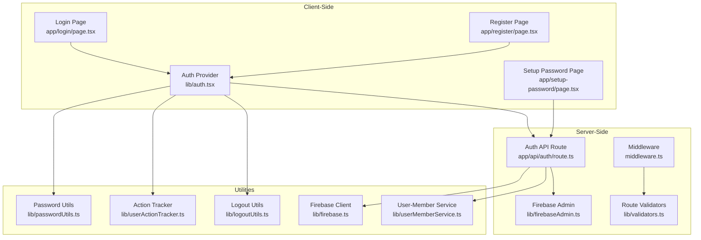
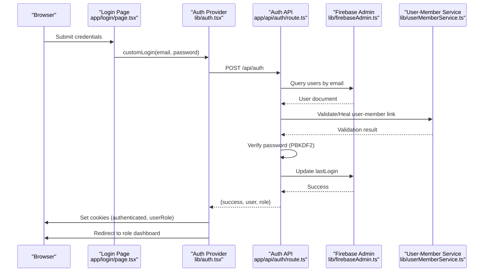
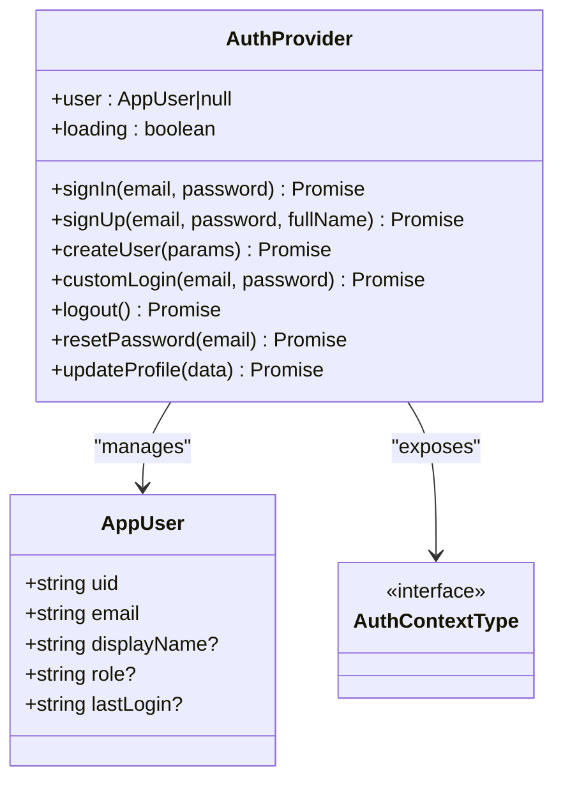
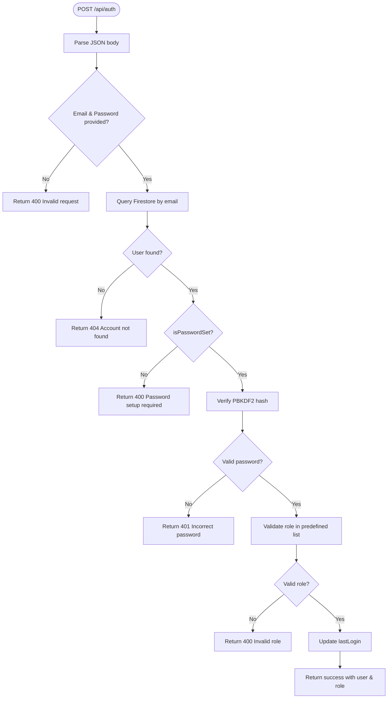
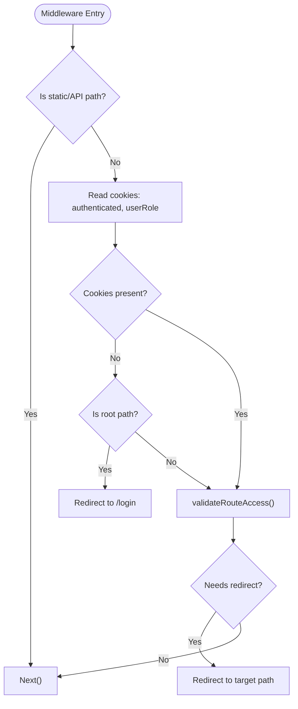
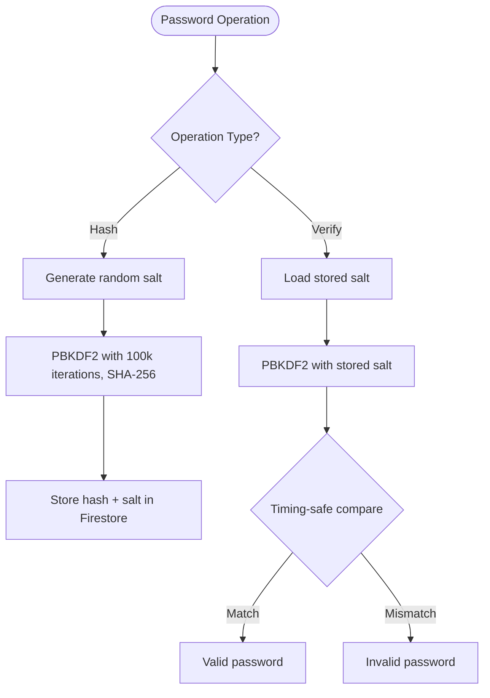
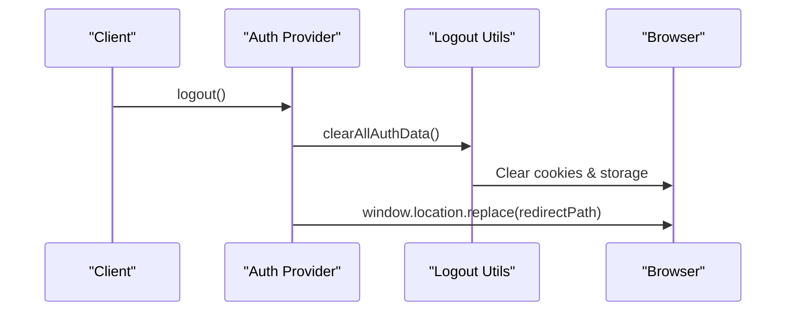
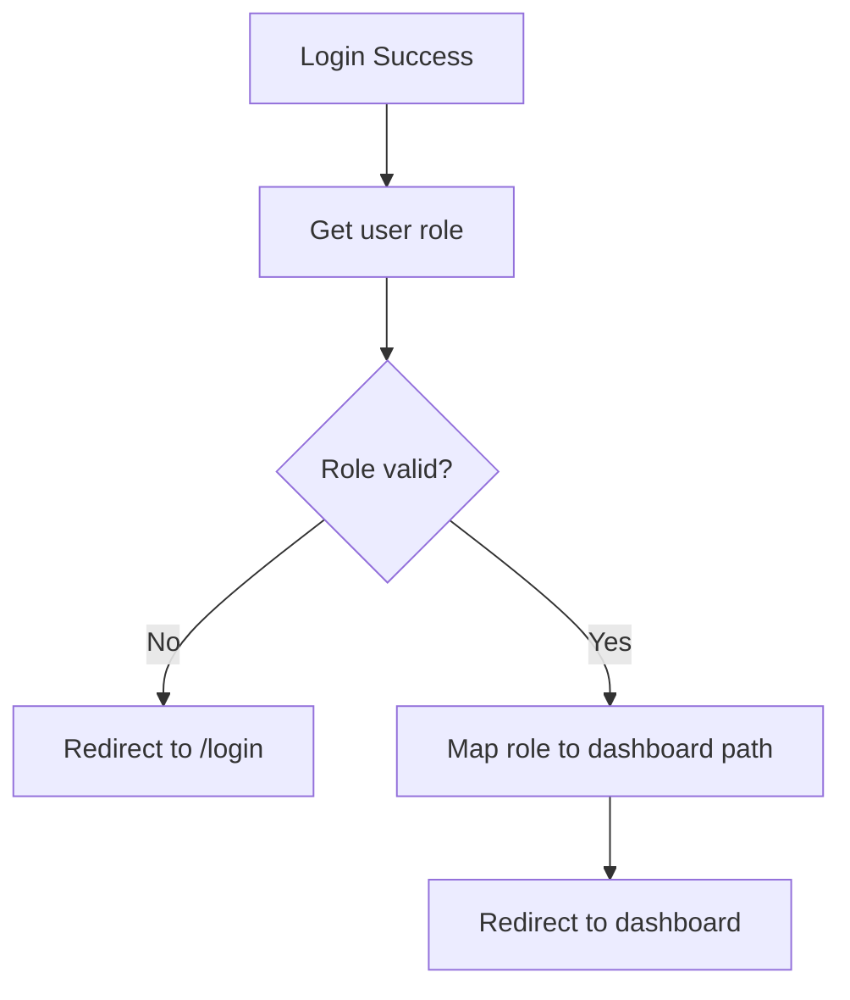
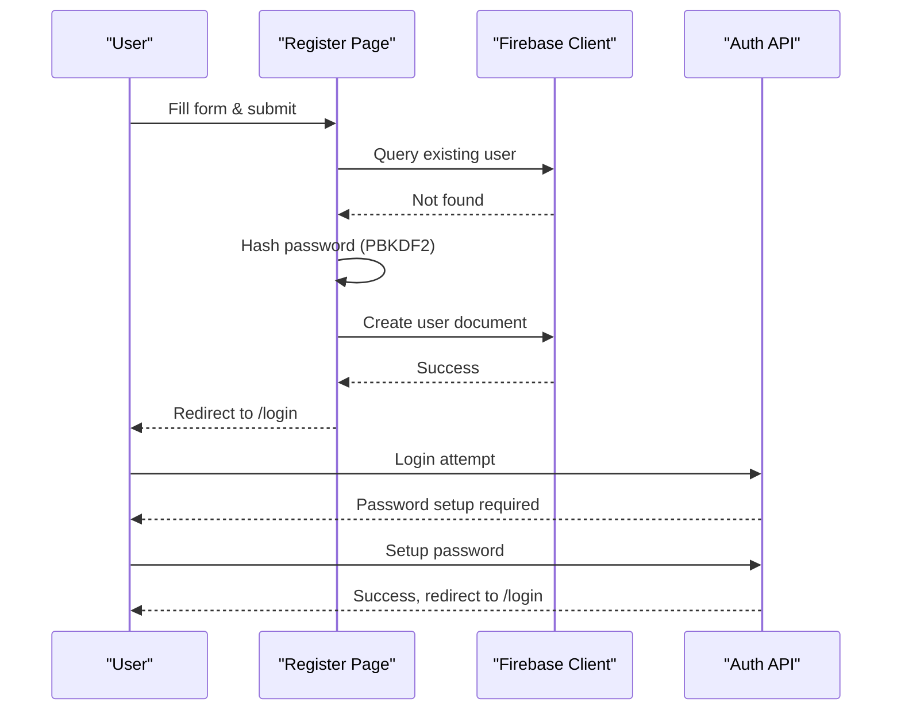
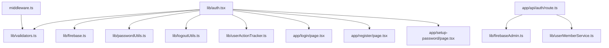

# Authentication System

<cite>
**Referenced Files in This Document**
- [lib/auth.tsx](file://lib/auth.tsx)
- [app/api/auth/route.ts](file://app/api/auth/route.ts)
- [middleware.ts](file://middleware.ts)
- [lib/validators.ts](file://lib/validators.ts)
- [lib/passwordUtils.ts](file://lib/passwordUtils.ts)
- [lib/firebase.ts](file://lib/firebase.ts)
- [lib/firebaseAdmin.ts](file://lib/firebaseAdmin.ts)
- [lib/logoutUtils.ts](file://lib/logoutUtils.ts)
- [lib/userMemberService.ts](file://lib/userMemberService.ts)
- [lib/userActionTracker.ts](file://lib/userActionTracker.ts)
- [app/login/page.tsx](file://app/login/page.tsx)
- [app/register/page.tsx](file://app/register/page.tsx)
- [app/setup-password/page.tsx](file://app/setup-password/page.tsx)
- [IMPLEMENTATION_SUMMARY.md](file://IMPLEMENTATION_SUMMARY.md)
- [ROLE_BASED_ACCESS_CONTROL.md](file://ROLE_BASED_ACCESS_CONTROL.md)
</cite>

## Table of Contents
1. [Introduction](#introduction)
2. [Project Structure](#project-structure)
3. [Core Components](#core-components)
4. [Architecture Overview](#architecture-overview)
5. [Detailed Component Analysis](#detailed-component-analysis)
6. [Dependency Analysis](#dependency-analysis)
7. [Performance Considerations](#performance-considerations)
8. [Troubleshooting Guide](#troubleshooting-guide)
9. [Conclusion](#conclusion)

## Introduction
This document provides comprehensive documentation for the SAMPA Cooperative Management System's authentication system. It covers the multi-role authentication architecture supporting Admin, Chairman, Vice-Chairman, Treasurer, Secretary, Driver, Operator, and Member roles. The system implements secure password handling, middleware-based route protection, session management via browser cookies, and automatic role-based dashboard redirection. It also details the integration with Firebase services and custom user validation logic.

## Project Structure
The authentication system spans client-side React components, Next.js API routes, middleware, and Firebase utilities. Key areas include:
- Client authentication provider and hooks
- Server-side authentication API
- Middleware-based route protection
- Password security utilities
- Firebase client and admin integrations
- User-member linkage validation
- Logout and action tracking utilities

**Diagram sources**
- [lib/auth.tsx](file://lib/auth.tsx#L158-L680)
- [app/api/auth/route.ts](file://app/api/auth/route.ts#L48-L264)
- [middleware.ts](file://middleware.ts#L5-L56)
- [lib/validators.ts](file://lib/validators.ts#L199-L235)
- [lib/passwordUtils.ts](file://lib/passwordUtils.ts#L1-L146)
- [lib/firebase.ts](file://lib/firebase.ts#L90-L307)
- [lib/firebaseAdmin.ts](file://lib/firebaseAdmin.ts#L111-L266)
- [lib/userMemberService.ts](file://lib/userMemberService.ts#L99-L198)
- [lib/logoutUtils.ts](file://lib/logoutUtils.ts#L16-L93)
- [lib/userActionTracker.ts](file://lib/userActionTracker.ts#L10-L118)
- [app/login/page.tsx](file://app/login/page.tsx#L12-L223)
- [app/register/page.tsx](file://app/register/page.tsx#L51-L323)
- [app/setup-password/page.tsx](file://app/setup-password/page.tsx#L10-L207)

**Section sources**
- [lib/auth.tsx](file://lib/auth.tsx#L1-L682)
- [app/api/auth/route.ts](file://app/api/auth/route.ts#L1-L295)
- [middleware.ts](file://middleware.ts#L1-L62)
- [lib/validators.ts](file://lib/validators.ts#L1-L236)
- [lib/passwordUtils.ts](file://lib/passwordUtils.ts#L1-L146)
- [lib/firebase.ts](file://lib/firebase.ts#L1-L309)
- [lib/firebaseAdmin.ts](file://lib/firebaseAdmin.ts#L1-L277)
- [lib/logoutUtils.ts](file://lib/logoutUtils.ts#L1-L93)
- [lib/userMemberService.ts](file://lib/userMemberService.ts#L1-L287)
- [lib/userActionTracker.ts](file://lib/userActionTracker.ts#L1-L118)
- [app/login/page.tsx](file://app/login/page.tsx#L1-L223)
- [app/register/page.tsx](file://app/register/page.tsx#L1-L323)
- [app/setup-password/page.tsx](file://app/setup-password/page.tsx#L1-L207)

## Core Components
- Authentication Provider: Manages user state, login/signup, password updates, and logout. Implements role-based dashboard redirection and cookie-based session persistence.
- Authentication API: Validates credentials against Firestore, performs password verification, and returns user data with role for redirection.
- Middleware: Enforces route access based on user roles and cookies, redirecting unauthorized users appropriately.
- Validators: Provides role-specific route validation and conflict prevention logic.
- Password Utilities: Implements PBKDF2-based hashing and verification with timing-safe comparison.
- Firebase Integrations: Client-side Firestore helpers and server-side Admin SDK for secure database operations.
- User-Member Service: Ensures consistent user-member linkage across collections.
- Logout Utilities: Centralized logout handling with cookie and storage cleanup.
- Action Tracker: Logs user actions for audit trails.

**Section sources**
- [lib/auth.tsx](file://lib/auth.tsx#L41-L680)
- [app/api/auth/route.ts](file://app/api/auth/route.ts#L48-L264)
- [middleware.ts](file://middleware.ts#L5-L56)
- [lib/validators.ts](file://lib/validators.ts#L1-L236)
- [lib/passwordUtils.ts](file://lib/passwordUtils.ts#L64-L146)
- [lib/firebase.ts](file://lib/firebase.ts#L90-L307)
- [lib/firebaseAdmin.ts](file://lib/firebaseAdmin.ts#L111-L266)
- [lib/userMemberService.ts](file://lib/userMemberService.ts#L99-L198)
- [lib/logoutUtils.ts](file://lib/logoutUtils.ts#L16-L93)
- [lib/userActionTracker.ts](file://lib/userActionTracker.ts#L10-L118)

## Architecture Overview
The authentication system follows a client-provider pattern with server-side validation:
- Client initiates login via the Auth Provider, which calls the Auth API.
- The Auth API validates credentials, checks role assignment, and updates last login.
- Successful authentication sets browser cookies and redirects to role-specific dashboard.
- Middleware enforces route access based on cookies and validators.
- Password updates leverage PBKDF2 hashing with secure storage.

**Diagram sources**
- [app/login/page.tsx](file://app/login/page.tsx#L26-L79)
- [lib/auth.tsx](file://lib/auth.tsx#L356-L514)
- [app/api/auth/route.ts](file://app/api/auth/route.ts#L48-L248)
- [lib/firebaseAdmin.ts](file://lib/firebaseAdmin.ts#L150-L194)
- [lib/userMemberService.ts](file://lib/userMemberService.ts#L99-L198)

**Section sources**
- [lib/auth.tsx](file://lib/auth.tsx#L197-L348)
- [app/api/auth/route.ts](file://app/api/auth/route.ts#L48-L248)
- [middleware.ts](file://middleware.ts#L5-L56)

## Detailed Component Analysis

### Authentication Provider (Client)
The Auth Provider encapsulates authentication logic:
- User state management with loading indicators
- Login/signup flows with input validation and error handling
- Role-based dashboard redirection using a dedicated helper
- Cookie-based session persistence for authenticated state
- Password update and profile update utilities
- Logout with centralized cleanup and immediate redirect

**Diagram sources**
- [lib/auth.tsx](file://lib/auth.tsx#L11-L61)
- [lib/auth.tsx](file://lib/auth.tsx#L158-L680)

**Section sources**
- [lib/auth.tsx](file://lib/auth.tsx#L158-L680)

### Authentication API (Server)
The server-side authentication route:
- Parses and validates incoming request body
- Queries Firestore for user by email
- Handles missing accounts, password setup requirement, and invalid credentials
- Verifies password using PBKDF2 with timing-safe comparison
- Validates role against a predefined list
- Updates last login timestamp
- Returns structured JSON responses for client consumption

**Diagram sources**
- [app/api/auth/route.ts](file://app/api/auth/route.ts#L48-L248)

**Section sources**
- [app/api/auth/route.ts](file://app/api/auth/route.ts#L48-L264)

### Middleware-Based Route Protection
The middleware enforces route access:
- Skips API routes and static assets
- Reads authentication cookies to determine user identity
- Applies route validation logic to prevent cross-role access
- Redirects unauthorized users to appropriate login pages

**Diagram sources**
- [middleware.ts](file://middleware.ts#L5-L56)
- [lib/validators.ts](file://lib/validators.ts#L199-L235)

**Section sources**
- [middleware.ts](file://middleware.ts#L5-L56)
- [lib/validators.ts](file://lib/validators.ts#L199-L235)

### Password Security Implementation
Password security is implemented using PBKDF2:
- Client-side hashing for registration and password updates
- Server-side verification using PBKDF2 with 100k iterations and SHA-256
- Timing-safe string comparison to prevent timing attacks
- Secure storage of password hashes and salts in Firestore
- Legacy support for plain-text passwords with fallback verification

**Diagram sources**
- [lib/passwordUtils.ts](file://lib/passwordUtils.ts#L64-L146)
- [app/api/auth/route.ts](file://app/api/auth/route.ts#L19-L45)

**Section sources**
- [lib/passwordUtils.ts](file://lib/passwordUtils.ts#L4-L146)
- [app/api/auth/route.ts](file://app/api/auth/route.ts#L19-L45)

### Session Management and Logout
Session management relies on browser cookies:
- Cookies store authenticated user ID and role for middleware validation
- Logout clears cookies, localStorage, and sessionStorage
- Immediate redirect prevents back navigation to protected pages
- Action tracker logs login/logout events for audit trails

**Diagram sources**
- [lib/auth.tsx](file://lib/auth.tsx#L621-L635)
- [lib/logoutUtils.ts](file://lib/logoutUtils.ts#L16-L50)

**Section sources**
- [lib/auth.tsx](file://lib/auth.tsx#L621-L635)
- [lib/logoutUtils.ts](file://lib/logoutUtils.ts#L16-L93)
- [lib/userActionTracker.ts](file://lib/userActionTracker.ts#L84-L94)

### Role-Based Dashboard Redirection
The system automatically redirects users to role-specific dashboards:
- Role validation occurs on both client and server
- Middleware prevents cross-role access attempts
- Dashboard paths are mapped for all supported roles
- Invalid or missing roles redirect to login with clear messaging

**Diagram sources**
- [lib/auth.tsx](file://lib/auth.tsx#L111-L156)
- [lib/validators.ts](file://lib/validators.ts#L98-L104)

**Section sources**
- [lib/auth.tsx](file://lib/auth.tsx#L111-L156)
- [lib/validators.ts](file://lib/validators.ts#L98-L104)
- [IMPLEMENTATION_SUMMARY.md](file://IMPLEMENTATION_SUMMARY.md#L84-L124)

### User Registration and Password Setup
Registration supports multiple roles and secure password handling:
- Form validation for required fields and password strength
- PBKDF2 hashing and secure storage of credentials
- Automatic redirection to login after successful registration
- Password setup flow for accounts that require initial password configuration

**Diagram sources**
- [app/register/page.tsx](file://app/register/page.tsx#L152-L210)
- [lib/firebase.ts](file://lib/firebase.ts#L90-L146)
- [app/setup-password/page.tsx](file://app/setup-password/page.tsx#L94-L132)

**Section sources**
- [app/register/page.tsx](file://app/register/page.tsx#L71-L210)
- [app/setup-password/page.tsx](file://app/setup-password/page.tsx#L94-L132)

## Dependency Analysis
The authentication system exhibits clear separation of concerns:
- Client provider depends on Firebase client utilities and validators
- Server API depends on Firebase Admin SDK and user-member service
- Middleware depends on validators and cookie parsing
- Password utilities are shared between client and server flows
- Logout utilities centralize cleanup logic

**Diagram sources**
- [lib/auth.tsx](file://lib/auth.tsx#L1-L682)
- [app/api/auth/route.ts](file://app/api/auth/route.ts#L1-L295)
- [middleware.ts](file://middleware.ts#L1-L62)
- [lib/validators.ts](file://lib/validators.ts#L1-L236)
- [lib/firebase.ts](file://lib/firebase.ts#L1-L309)
- [lib/firebaseAdmin.ts](file://lib/firebaseAdmin.ts#L1-L277)
- [lib/userMemberService.ts](file://lib/userMemberService.ts#L1-L287)
- [lib/logoutUtils.ts](file://lib/logoutUtils.ts#L1-L93)
- [lib/userActionTracker.ts](file://lib/userActionTracker.ts#L1-L118)
- [app/login/page.tsx](file://app/login/page.tsx#L1-L223)
- [app/register/page.tsx](file://app/register/page.tsx#L1-L323)
- [app/setup-password/page.tsx](file://app/setup-password/page.tsx#L1-L207)

**Section sources**
- [lib/auth.tsx](file://lib/auth.tsx#L1-L682)
- [app/api/auth/route.ts](file://app/api/auth/route.ts#L1-L295)
- [middleware.ts](file://middleware.ts#L1-L62)
- [lib/validators.ts](file://lib/validators.ts#L1-L236)
- [lib/firebase.ts](file://lib/firebase.ts#L1-L309)
- [lib/firebaseAdmin.ts](file://lib/firebaseAdmin.ts#L1-L277)
- [lib/userMemberService.ts](file://lib/userMemberService.ts#L1-L287)
- [lib/logoutUtils.ts](file://lib/logoutUtils.ts#L1-L93)
- [lib/userActionTracker.ts](file://lib/userActionTracker.ts#L1-L118)
- [app/login/page.tsx](file://app/login/page.tsx#L1-L223)
- [app/register/page.tsx](file://app/register/page.tsx#L1-L323)
- [app/setup-password/page.tsx](file://app/setup-password/page.tsx#L1-L207)

## Performance Considerations
- PBKDF2 iteration count (100k) balances security and performance; adjust based on hardware constraints
- Middleware cookie parsing is lightweight; ensure minimal cookie size
- Firestore queries use indexed fields (email) for efficient lookups
- Parallel updates for user-member linkage reduce latency
- Client-side hashing avoids server overload but requires modern browser support

## Troubleshooting Guide
Common issues and resolutions:
- Invalid role or missing role: Ensure user has a valid role assigned; middleware redirects to login with clear messaging
- Password setup required: Redirect to setup-password flow; verify isPasswordSet flag
- Incorrect password: Verify PBKDF2 hash and salt; check legacy plain-text fallback
- Database connectivity: Validate Firebase configuration and Firestore rules
- Route conflicts: Middleware prevents cross-role access; ensure correct role assignment
- Logout issues: Use centralized logout utilities to clear cookies and storage

**Section sources**
- [app/api/auth/route.ts](file://app/api/auth/route.ts#L114-L192)
- [middleware.ts](file://middleware.ts#L42-L53)
- [lib/logoutUtils.ts](file://lib/logoutUtils.ts#L16-L50)
- [lib/userMemberService.ts](file://lib/userMemberService.ts#L99-L198)

## Conclusion
The SAMPA Cooperative Management System's authentication system provides a robust, role-based authentication framework with secure password handling, middleware-based route protection, and seamless user experience. The implementation leverages PBKDF2 for password security, Firebase for data persistence, and centralized utilities for consistent behavior across roles. The system is designed for maintainability, scalability, and strong security practices.