# Core Features & Functionality

<cite>
**Referenced Files in This Document**
- [README.md](file://README.md)
- [package.json](file://package.json)
- [lib/firebase.ts](file://lib/firebase.ts)
- [lib/auth.tsx](file://lib/auth.tsx)
- [middleware.ts](file://middleware.ts)
- [lib/validators.ts](file://lib/validators.ts)
- [app/api/auth/route.ts](file://app/api/auth/route.ts)
- [app/api/members/route.ts](file://app/api/members/route.ts)
- [app/api/loans/route.ts](file://app/api/loans/route.ts)
- [lib/savingsService.ts](file://lib/savingsService.ts)
- [lib/certificateService.ts](file://lib/certificateService.ts)
- [lib/emailService.ts](file://lib/emailService.ts)
- [components/admin/SavingsLeaderboard.tsx](file://components/admin/SavingsLeaderboard.tsx)
</cite>

## Table of Contents
1. [Introduction](#introduction)
2. [Project Structure](#project-structure)
3. [Core Components](#core-components)
4. [Architecture Overview](#architecture-overview)
5. [Detailed Component Analysis](#detailed-component-analysis)
6. [Dependency Analysis](#dependency-analysis)
7. [Performance Considerations](#performance-considerations)
8. [Troubleshooting Guide](#troubleshooting-guide)
9. [Conclusion](#conclusion)

## Introduction
This document explains the SAMPA Cooperative Management System’s core features and functionality. It covers the multi-role authentication system with automatic dashboard redirection, the loan management workflow, the savings account system with transaction processing and leaderboard, the member registration and profile management system, the administrative dashboard with role-based permissions, real-time-like synchronization via Firebase, the email notification system, certificate generation, activity logging, compliance and audit trail capabilities, and practical workflows such as applying for a loan, making savings deposits, and managing member records.

## Project Structure
The system is a Next.js application with:
- Client-side authentication and routing guards
- Serverless API routes for authentication, members, loans, certificates, and emails
- Firebase client SDK for real-time-like data access
- Shared libraries for Firebase, auth, validators, savings, certificates, and email services
- Admin components for dashboards, leaderboards, and reporting

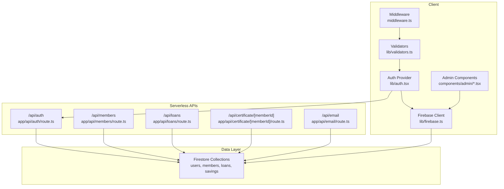

**Diagram sources**
- [lib/auth.tsx](file://lib/auth.tsx#L158-L680)
- [middleware.ts](file://middleware.ts#L5-L56)
- [lib/validators.ts](file://lib/validators.ts#L1-L236)
- [lib/firebase.ts](file://lib/firebase.ts#L1-L309)
- [app/api/auth/route.ts](file://app/api/auth/route.ts#L48-L264)
- [app/api/members/route.ts](file://app/api/members/route.ts#L26-L179)
- [app/api/loans/route.ts](file://app/api/loans/route.ts#L4-L133)

**Section sources**
- [README.md](file://README.md#L1-L37)
- [package.json](file://package.json#L1-L53)

## Core Components
- Authentication and Authorization
  - Client-side Auth Provider manages user state, cookies, and role-based redirection
  - Middleware enforces route access and prevents cross-dashboard navigation
  - Validators define role-specific access rules and dashboard routing
  - Server-side login route authenticates against Firestore with secure password checks
- Member Management
  - API route supports listing and creating members with password hashing
  - Member documents include personal info and role metadata
- Loan Management
  - API route supports listing and creating loan applications
  - Loans are stored with status and metadata for tracking
- Savings System
  - Atomic transaction service calculates balances and updates member totals
  - Leaderboard component aggregates savings across members
- Certificates and Emails
  - Certificate generation produces PDFs and stores references in member documents
  - Email service integrates with EmailJS for notifications
- Real-time Data Access
  - Firebase client SDK provides CRUD helpers and connection validation

**Section sources**
- [lib/auth.tsx](file://lib/auth.tsx#L111-L156)
- [middleware.ts](file://middleware.ts#L5-L56)
- [lib/validators.ts](file://lib/validators.ts#L9-L236)
- [app/api/auth/route.ts](file://app/api/auth/route.ts#L48-L264)
- [app/api/members/route.ts](file://app/api/members/route.ts#L67-L179)
- [app/api/loans/route.ts](file://app/api/loans/route.ts#L4-L133)
- [lib/savingsService.ts](file://lib/savingsService.ts#L237-L342)
- [components/admin/SavingsLeaderboard.tsx](file://components/admin/SavingsLeaderboard.tsx#L32-L213)
- [lib/certificateService.ts](file://lib/certificateService.ts#L10-L175)
- [lib/emailService.ts](file://lib/emailService.ts#L19-L113)
- [lib/firebase.ts](file://lib/firebase.ts#L89-L307)

## Architecture Overview
The system uses a client-side Auth Provider with serverless authentication and role-based routing. Middleware validates access per user role, while validators enforce path-specific permissions. APIs handle member, loan, certificate, and email operations, persisting data in Firestore collections. Firebase client SDKs enable safe, typed CRUD operations and connection validation.

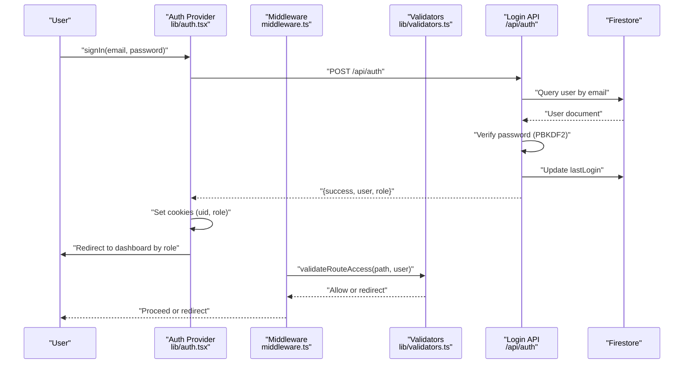

**Diagram sources**
- [lib/auth.tsx](file://lib/auth.tsx#L197-L348)
- [app/api/auth/route.ts](file://app/api/auth/route.ts#L48-L264)
- [middleware.ts](file://middleware.ts#L5-L56)
- [lib/validators.ts](file://lib/validators.ts#L199-L235)

## Detailed Component Analysis

### Multi-Role Authentication System
- Roles supported: Admin, Chairman, Vice-Chairman, Treasurer, Secretary, Board of Directors, Manager, Driver, Operator, Member
- Automatic dashboard redirection based on role
- Cookie-based session persistence for client-side access
- Middleware and validators enforce role-specific paths and prevent cross-dashboard access
- Server-side login validates credentials and updates last login

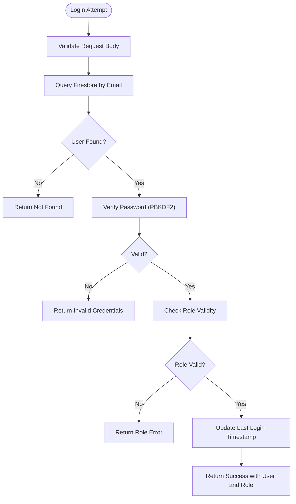

**Diagram sources**
- [app/api/auth/route.ts](file://app/api/auth/route.ts#L48-L264)
- [lib/validators.ts](file://lib/validators.ts#L177-L192)

**Section sources**
- [lib/auth.tsx](file://lib/auth.tsx#L111-L156)
- [lib/auth.tsx](file://lib/auth.tsx#L197-L348)
- [middleware.ts](file://middleware.ts#L5-L56)
- [lib/validators.ts](file://lib/validators.ts#L9-L236)
- [app/api/auth/route.ts](file://app/api/auth/route.ts#L48-L264)

### Loan Management Workflow
- Application submission: POST to /api/loans with memberId, amount, interestRate, term, startDate
- Approval processes: Admin roles can manage loan requests and records
- Tracking: Loans stored with status and metadata
- Repayment scheduling: Implemented conceptually via loan terms and start dates

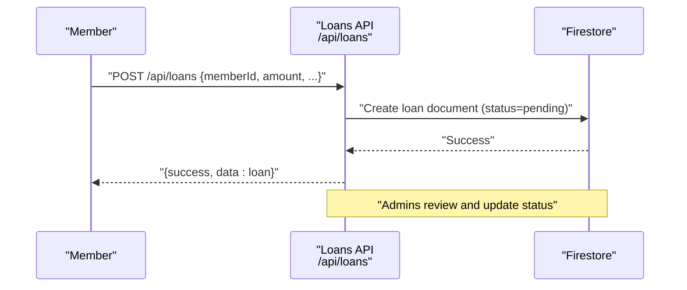

**Diagram sources**
- [app/api/loans/route.ts](file://app/api/loans/route.ts#L42-L112)

**Section sources**
- [app/api/loans/route.ts](file://app/api/loans/route.ts#L4-L133)

### Savings Account System
- Transaction processing: Atomic deposit/withdrawal with running balance calculation
- Balance management: Updates member aggregate savings and validates overdrafts
- Leaderboard: Aggregates savings across members and ranks top 10

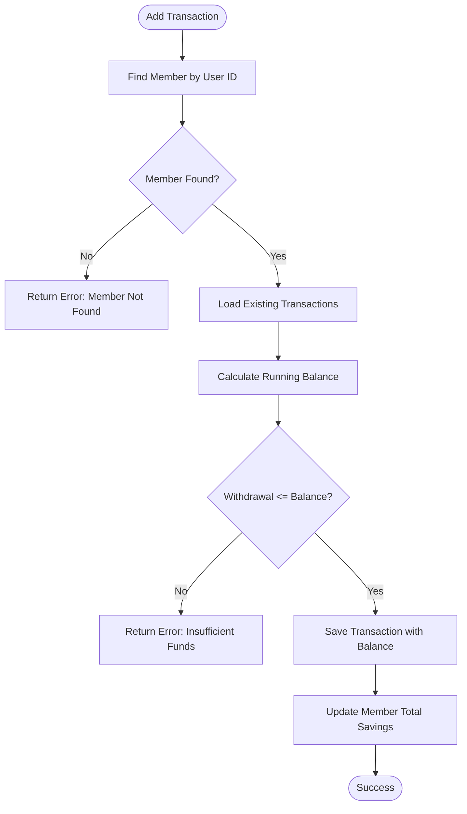

**Diagram sources**
- [lib/savingsService.ts](file://lib/savingsService.ts#L237-L342)

**Section sources**
- [lib/savingsService.ts](file://lib/savingsService.ts#L21-L455)
- [components/admin/SavingsLeaderboard.tsx](file://components/admin/SavingsLeaderboard.tsx#L32-L213)

### Member Registration and Profile Management
- Registration: POST to /api/members with personal info; optional password hashes
- Profile updates: Auth provider supports updateProfile with audit tracking
- Activity tracking: Centralized trackers for login, logout, and profile updates

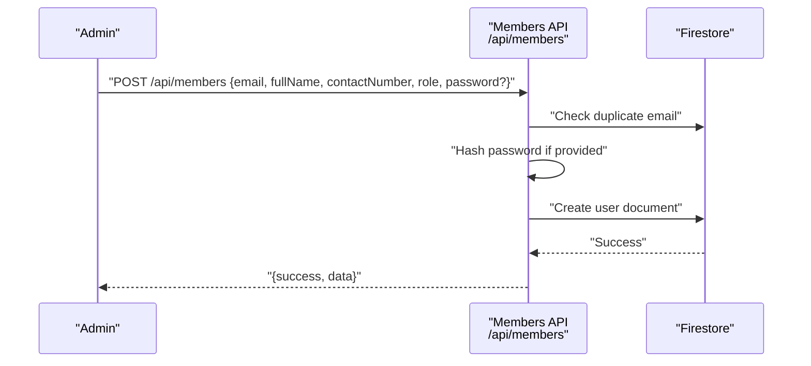

**Diagram sources**
- [app/api/members/route.ts](file://app/api/members/route.ts#L67-L158)

**Section sources**
- [app/api/members/route.ts](file://app/api/members/route.ts#L26-L179)
- [lib/auth.tsx](file://lib/auth.tsx#L644-L673)

### Administrative Dashboard System
- Role-specific dashboards: Middleware and validators restrict access to role-specific paths
- Reporting: Savings leaderboard component aggregates and displays top savers
- Permissions: Admin roles include Admin, Secretary, Chairman, Vice-Chairman, Manager, Treasurer, Board of Directors

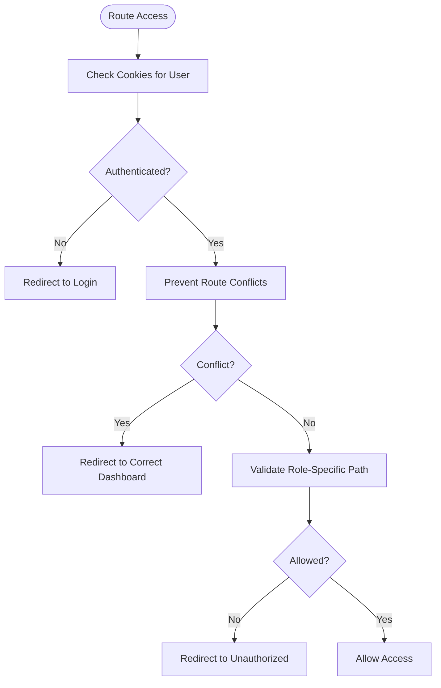

**Diagram sources**
- [middleware.ts](file://middleware.ts#L5-L56)
- [lib/validators.ts](file://lib/validators.ts#L112-L191)

**Section sources**
- [middleware.ts](file://middleware.ts#L5-L56)
- [lib/validators.ts](file://lib/validators.ts#L9-L236)
- [components/admin/SavingsLeaderboard.tsx](file://components/admin/SavingsLeaderboard.tsx#L32-L213)

### Real-time Data Synchronization
- Firebase client SDK provides typed CRUD helpers and connection validation
- Firestore utilities centralize error handling and logging
- Client components use Firestore helpers for reads/writes

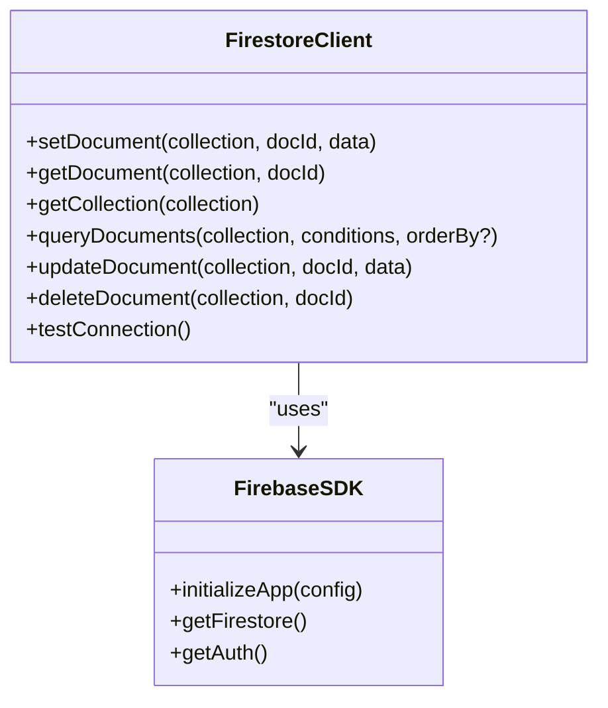

**Diagram sources**
- [lib/firebase.ts](file://lib/firebase.ts#L89-L307)

**Section sources**
- [lib/firebase.ts](file://lib/firebase.ts#L1-L309)

### Email Notification System
- EmailJS integration for sending templated emails
- Templates for member registration and loan approvals
- Environment variables for service keys

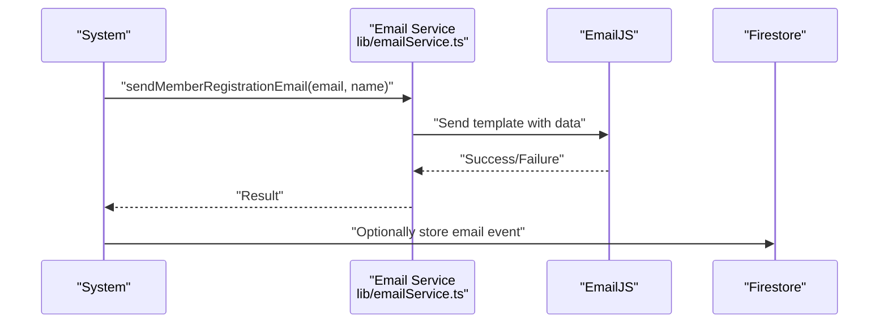

**Diagram sources**
- [lib/emailService.ts](file://lib/emailService.ts#L19-L113)

**Section sources**
- [lib/emailService.ts](file://lib/emailService.ts#L19-L113)

### Certificate Generation
- PDF generation using jsPDF and autotable
- Stores certificate data in member document and marks generation timestamp

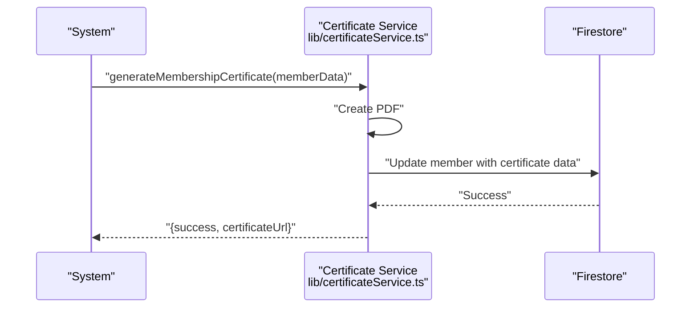

**Diagram sources**
- [lib/certificateService.ts](file://lib/certificateService.ts#L10-L175)

**Section sources**
- [lib/certificateService.ts](file://lib/certificateService.ts#L10-L207)

### Practical Workflows

#### Applying for a Loan
- Member submits application via the Loans API
- Admin reviews and updates status
- Tracking and reporting available through admin dashboards

**Section sources**
- [app/api/loans/route.ts](file://app/api/loans/route.ts#L42-L112)

#### Making a Savings Deposit
- Member initiates a deposit transaction
- System calculates running balance and updates member total
- Leaderboard reflects updated rankings

**Section sources**
- [lib/savingsService.ts](file://lib/savingsService.ts#L237-L342)
- [components/admin/SavingsLeaderboard.tsx](file://components/admin/SavingsLeaderboard.tsx#L32-L213)

#### Managing Member Records
- Admin creates members with optional password setup
- Member documents include personal info and role metadata
- Activity tracking logs profile updates

**Section sources**
- [app/api/members/route.ts](file://app/api/members/route.ts#L67-L158)
- [lib/auth.tsx](file://lib/auth.tsx#L644-L673)

### Compliance and Audit Trail
- Activity logging: Track login, logout, and profile update actions
- Password security: PBKDF2 hashing with salt; timing-safe comparisons
- Access control: Middleware and validators enforce role-based routing
- Data integrity: Atomic savings transactions and balance calculations

**Section sources**
- [lib/auth.tsx](file://lib/auth.tsx#L621-L635)
- [app/api/auth/route.ts](file://app/api/auth/route.ts#L19-L45)
- [lib/savingsService.ts](file://lib/savingsService.ts#L237-L342)

## Dependency Analysis
- Client-side depends on Firebase client SDK and EmailJS for emails
- Serverless APIs depend on Firebase Admin SDK for secure operations
- Auth Provider coordinates client-side state and redirects
- Validators and middleware enforce consistent access control

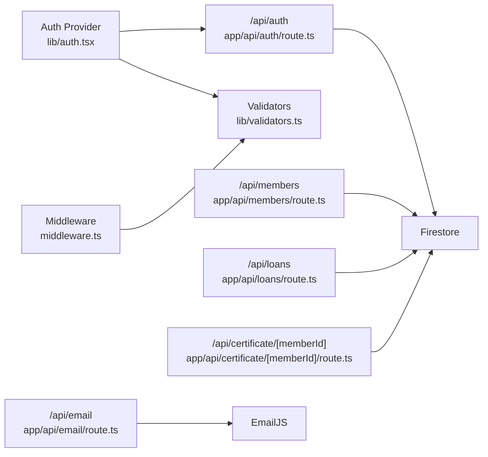

**Diagram sources**
- [lib/auth.tsx](file://lib/auth.tsx#L158-L680)
- [lib/validators.ts](file://lib/validators.ts#L1-L236)
- [middleware.ts](file://middleware.ts#L5-L56)
- [app/api/auth/route.ts](file://app/api/auth/route.ts#L48-L264)
- [app/api/members/route.ts](file://app/api/members/route.ts#L67-L158)
- [app/api/loans/route.ts](file://app/api/loans/route.ts#L4-L133)
- [lib/emailService.ts](file://lib/emailService.ts#L19-L113)

**Section sources**
- [package.json](file://package.json#L16-L40)

## Performance Considerations
- Use Firestore queries with appropriate indexes for frequent filters (e.g., email, role)
- Batch writes for bulk operations on savings transactions
- Client-side caching for frequently accessed dashboards
- Optimize leaderboard rendering by limiting fetched datasets

## Troubleshooting Guide
- Firebase initialization failures: Verify environment variables and client-side initialization guard
- Permission denied errors: Check Firestore rules and user roles
- Login errors: Confirm email format, password verification, and role validity
- Middleware redirect loops: Ensure cookies are readable and user roles are valid

**Section sources**
- [lib/firebase.ts](file://lib/firebase.ts#L37-L60)
- [app/api/auth/route.ts](file://app/api/auth/route.ts#L101-L111)
- [middleware.ts](file://middleware.ts#L18-L39)

## Conclusion
The SAMPA Cooperative Management System provides a robust, role-based platform with secure authentication, comprehensive member and loan management, savings accounting with leaderboards, automated certificates, and email notifications. Its architecture leverages Next.js, Firebase, and serverless APIs to deliver scalable, maintainable functionality with strong access controls and audit-ready operations.