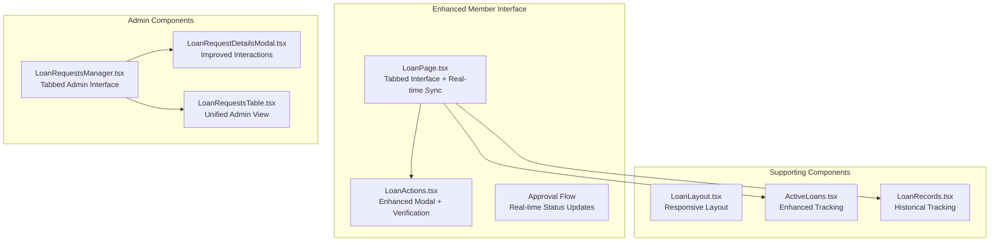
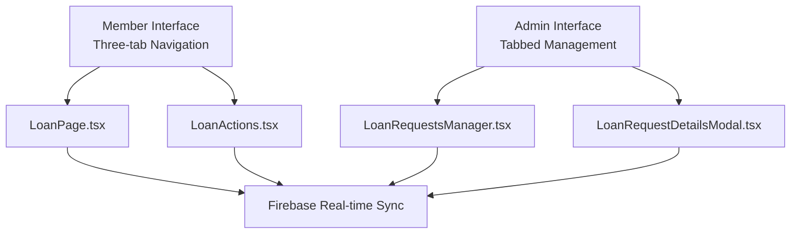

# Loan Management System

<cite>
**Referenced Files in This Document**
- [LoanPage.tsx](file://app/loan/page.tsx)
- [LoanActions.tsx](file://components/user/actions/LoanActions.tsx)
- [LoanApplicationModal.tsx](file://components/user/LoanApplicationModal.tsx)
- [LoanRequestsManager.tsx](file://components/admin/LoanRequestsManager.tsx)
- [LoanRequestDetailsModal.tsx](file://components/admin/LoanRequestDetailsModal.tsx)
- [LoanRequestsTable.tsx](file://components/admin/LoanRequestsTable.tsx)
- [LoanLayout.tsx](file://components/shared/LoanLayout.tsx)
- [ActiveLoans.tsx](file://components/user/ActiveLoans.tsx)
- [LoanRecords.tsx](file://components/user/LoanRecords.tsx)
- [PaginatedLoanRecords.tsx](file://components/admin/PaginatedLoanRecords.tsx)
- [LoanRecords.tsx](file://components/admin/LoanRecords.tsx)
- [transactionReceiptService.ts](file://lib/transactionReceiptService.ts)
- [emailService.ts](file://lib/emailService.ts)
- [useFirestoreData.ts](file://hooks/useFirestoreData.ts)
- [route.ts](file://app/api/loans/route.ts)
- [LoanTable.tsx](file://components/admin/LoanTable.tsx)
- [AddLoanPlanModal.tsx](file://components/admin/AddLoanPlanModal.tsx)
- [Pagination.tsx](file://components/admin/Pagination.tsx)
- [SecretaryLoansPage.tsx](file://app/admin/secretary/loans/page.tsx)
- [SecretaryLoanRequestsPage.tsx](file://app/admin/secretary/loans/requests/page.tsx)
- [SecretaryLoanRecordsPage.tsx](file://app/admin/secretary/loans/records/page.tsx)
- [ChairmanLoansPage.tsx](file://app/admin/chairman/loans/page.tsx)
- [ChairmanLoanRecordsPage.tsx](file://app/admin/chairman/loans/records/page.tsx)
- [ManagerLoansPage.tsx](file://app/admin/manager/loans/page.tsx)
- [TreasurerLoansPage.tsx](file://app/admin/treasurer/loans/page.tsx)
- [BODLoansPage.tsx](file://app/admin/bod/loans/page.tsx)
- [auth.tsx](file://lib/auth.tsx)
- [firebase.ts](file://lib/firebase.ts)
- [FIRESTORE_INDEXES.md](file://docs/FIRESTORE_INDEXES.md)
</cite>

## Update Summary
**Changes Made**
- Enhanced LoanPage with new tabbed interface for loan applications, active loans, and completed loans
- Improved LoanActions component with better modal interactions and real-time status synchronization
- Added comprehensive loan lifecycle tracking with three-tab navigation system
- Enhanced loan request management with improved admin interface and real-time updates
- Streamlined loan application process with integrated verification and amortization scheduling

## Table of Contents
1. [Introduction](#introduction)
2. [Project Structure](#project-structure)
3. [Core Components](#core-components)
4. [Architecture Overview](#architecture-overview)
5. [Enhanced Tabbed Interface System](#enhanced-tabbed-interface-system)
6. [Advanced Loan Lifecycle Management](#advanced-loan-lifecycle-management)
7. [Improved Loan Request Management](#improved-loan-request-management)
8. [Enhanced Loan Application Process](#enhanced-loan-application-process)
9. [Real-time Status Synchronization](#real-time-status-synchronization)
10. [Loan Tracking and Monitoring](#loan-tracking-and-monitoring)
11. [Automated Payment Processing](#automated-payment-processing)
12. [Administrative Loan Management](#administrative-loan-management)
13. [Performance Considerations](#performance-considerations)
14. [Troubleshooting Guide](#troubleshooting-guide)
15. [Conclusion](#conclusion)

## Introduction
This document describes the SAMPA Cooperative Management System's enhanced loan management functionality featuring a comprehensive tabbed interface system, improved loan application processes, and sophisticated real-time status monitoring. The system now provides a unified platform for members to manage their loan applications, track active loans, and monitor completed loan history through an intuitive three-tab interface. Administrative components offer enhanced loan request management with real-time updates and improved modal interactions.

## Project Structure
The loan management system is implemented as a Next.js application with role-based admin pages, shared React components, and a new tabbed interface architecture. The enhanced structure supports seamless navigation between loan applications, active loans, and completed loan history.

**Diagram sources**
- [LoanPage.tsx:456-927](file://app/loan/page.tsx#L456-L927)
- [LoanActions.tsx:1-663](file://components/user/actions/LoanActions.tsx#L1-L663)
- [LoanRequestsManager.tsx:68-200](file://components/admin/LoanRequestsManager.tsx#L68-L200)

## Core Components
- **LoanPage**: Enhanced main interface featuring three-tab navigation (My Loan Applications, Active Loans, Completed Loans) with real-time status synchronization and improved loan tracking capabilities.
- **LoanActions**: Streamlined loan application component with integrated verification modal, amortization scheduling, and enhanced user interaction patterns.
- **LoanRequestsManager**: Comprehensive admin interface with tabbed organization for pending, approved, and rejected loan requests, supporting real-time updates and improved modal interactions.
- **LoanRequestDetailsModal**: Enhanced modal component with improved user interactions, rejection reason handling, and streamlined approval processes.
- **LoanLayout**: Responsive layout component providing collapsible sidebar navigation and consistent styling across loan management pages.

**Section sources**
- [LoanPage.tsx:15-101](file://app/loan/page.tsx#L15-L101)
- [LoanActions.tsx:15-60](file://components/user/actions/LoanActions.tsx#L15-L60)
- [LoanRequestsManager.tsx:68-98](file://components/admin/LoanRequestsManager.tsx#L68-L98)
- [LoanRequestDetailsModal.tsx:42-74](file://components/admin/LoanRequestDetailsModal.tsx#L42-L74)

## Architecture Overview
The system follows a modular architecture with enhanced real-time synchronization and improved user experience patterns:

- **Presentation Layer**: Three-tab interface for loan applications, active loans, and completed loans with responsive design and real-time updates.
- **Business Logic Layer**: Enhanced loan application processing with verification workflows, amortization calculations, and status management.
- **Data Access Layer**: Firebase Firestore integration with real-time listeners and improved data synchronization patterns.
- **Administration Layer**: Comprehensive loan request management with role-based access and enhanced modal interactions.
- **User Experience Layer**: Streamlined application process with integrated verification and improved user feedback mechanisms.

**Diagram sources**
- [LoanPage.tsx:456-492](file://app/loan/page.tsx#L456-L492)
- [LoanActions.tsx:44-58](file://components/user/actions/LoanActions.tsx#L44-L58)
- [LoanRequestsManager.tsx:164-225](file://components/admin/LoanRequestsManager.tsx#L164-L225)

## Enhanced Tabbed Interface System
The system now features a comprehensive three-tab interface for seamless loan management:

### Tab Navigation Architecture
- **My Loan Applications Tab**: Displays all submitted loan applications with status indicators and detailed information
- **Active Loans Tab**: Shows currently active and approved loans with payment tracking and loan details
- **Completed Loans Tab**: Provides historical record of paid-off loans with summary information and completion status

### Real-time Status Synchronization
- **Live Updates**: Firebase real-time listeners provide instant updates to loan status across all tabs
- **Automatic Refresh**: Components automatically refresh when user authentication state changes or loan status updates
- **Status Consistency**: Unified status indicators ensure consistent loan status representation across all tabs

### Enhanced User Experience
- **Responsive Design**: Mobile-friendly tab navigation with appropriate spacing and touch targets
- **Visual Feedback**: Active tab highlighting with red accent color and hover effects
- **Loading States**: Appropriate loading indicators during data fetching and status updates

**Section sources**
- [LoanPage.tsx:456-492](file://app/loan/page.tsx#L456-L492)
- [LoanPage.tsx:497-837](file://app/loan/page.tsx#L497-L837)

## Advanced Loan Lifecycle Management
The enhanced system provides comprehensive loan lifecycle management through integrated tracking and status monitoring:

### Loan Application Tracking
- **Application Status**: Real-time tracking of loan application status (pending, approved, rejected)
- **Application Details**: Comprehensive information display including loan plan, amount, term, and application date
- **Application History**: Complete history of submitted applications with pagination support

### Active Loan Management
- **Active Status Tracking**: Real-time monitoring of active loans with payment status indicators
- **Loan Details**: Complete loan information including principal amount, interest rate, loan term, and current status
- **Payment Scheduling**: Detailed payment schedule with daily payment breakdown and remaining balance tracking

### Completed Loan History
- **Completion Tracking**: Historical record of completed loans with total paid amounts and completion dates
- **Summary Information**: Compact display of loan summary with key metrics and completion status
- **Archival Management**: Organized storage of completed loan information for future reference

**Section sources**
- [LoanPage.tsx:510-607](file://app/loan/page.tsx#L510-L607)
- [LoanPage.tsx:625-721](file://app/loan/page.tsx#L625-L721)
- [LoanPage.tsx:738-836](file://app/loan/page.tsx#L738-L836)

## Improved Loan Request Management
The administrative loan request management system has been significantly enhanced:

### Tabbed Admin Interface
- **Pending Requests Tab**: Dedicated tab for managing pending loan requests with immediate action buttons
- **Approved Requests Tab**: Organization of approved loan requests with approval timestamps and details
- **Rejected Requests Tab**: Comprehensive management of rejected loan requests with rejection reasons and timestamps

### Enhanced Modal Interactions
- **Streamlined Approvals**: Direct approval process from modal without page reload requirements
- **Improved Rejection Handling**: Integrated rejection reason input with validation and confirmation
- **Detailed Information Display**: Comprehensive loan request details with user information and loan specifications

### Real-time Data Synchronization
- **Live Status Updates**: Real-time updates to loan request status across all admin tabs
- **Instant Notifications**: Immediate visual feedback for approval and rejection actions
- **Client-side Sorting**: Efficient client-side sorting and filtering for large datasets

**Section sources**
- [LoanRequestsManager.tsx:68-98](file://components/admin/LoanRequestsManager.tsx#L68-L98)
- [LoanRequestDetailsModal.tsx:42-74](file://components/admin/LoanRequestDetailsModal.tsx#L42-L74)
- [LoanRequestsManager.tsx:164-225](file://components/admin/LoanRequestsManager.tsx#L164-L225)

## Enhanced Loan Application Process
The loan application process has been streamlined with improved user interactions and verification workflows:

### Integrated Application Workflow
- **Plan Selection**: Seamless loan plan selection with detailed information display
- **Amount Tile Selection**: Dynamic amount selection with percentage-based options
- **Term Selection**: Flexible term selection with validation and user feedback
- **Verification Process**: Comprehensive verification modal with amortization schedule preview

### Enhanced Verification System
- **Amortization Preview**: Detailed daily payment schedule with principal and interest breakdown
- **Total Cost Display**: Clear presentation of total interest and total repayment amounts
- **Confirmation Workflow**: Secure confirmation process with user acknowledgment requirements
- **Loading States**: Appropriate loading indicators during application submission and processing

### Real-time Application Status
- **Immediate Feedback**: Instant status updates after application submission
- **Notification System**: Automated notifications for application status changes
- **Status Tracking**: Real-time tracking of application status through approval process

**Section sources**
- [LoanActions.tsx:15-60](file://components/user/actions/LoanActions.tsx#L15-L60)
- [LoanActions.tsx:108-134](file://components/user/actions/LoanActions.tsx#L108-L134)
- [LoanActions.tsx:136-292](file://components/user/actions/LoanActions.tsx#L136-L292)

## Real-time Status Synchronization
The system implements sophisticated real-time synchronization for enhanced user experience:

### Multi-Collection Real-time Listeners
- **Active Loans Listener**: Real-time monitoring of active loan status with automatic updates
- **Pending Requests Listener**: Live tracking of pending loan application status
- **Complete Loans Listener**: Real-time updates to loan history and completed loan status

### Status Update Mechanisms
- **Automatic Detection**: Instant detection of loan status changes through Firestore listeners
- **State Synchronization**: Consistent state updates across all loan-related components
- **Error Handling**: Robust error handling with user-friendly error messages and recovery mechanisms

### Enhanced User Feedback
- **Loading States**: Appropriate loading indicators during real-time data fetching
- **Success Notifications**: Immediate feedback for successful status updates
- **Error Communication**: Clear error messages with actionable solutions for synchronization failures

**Section sources**
- [LoanPage.tsx:55-101](file://app/loan/page.tsx#L55-L101)
- [LoanPage.tsx:103-144](file://app/loan/page.tsx#L103-L144)
- [LoanRequestsManager.tsx:164-225](file://components/admin/LoanRequestsManager.tsx#L164-L225)

## Loan Tracking and Monitoring
The system provides comprehensive loan tracking capabilities through enhanced components:

### Active Loan Monitoring
- **Real-time Tracking**: Live monitoring of active loan status and payment progress
- **Payment Schedule Tracking**: Detailed tracking of daily payment schedules with balance updates
- **Status Indicators**: Color-coded status indicators for quick loan status identification

### Historical Loan Tracking
- **Loan History Management**: Comprehensive tracking of completed loan history
- **Archival Storage**: Organized storage of loan information for future reference and reporting
- **Search and Filter**: Enhanced search and filtering capabilities for loan history management

### Enhanced User Interface
- **Responsive Design**: Mobile-friendly loan tracking interface with appropriate spacing and touch targets
- **Visual Progression**: Clear visual indicators of loan progress and completion status
- **Detailed Information**: Comprehensive loan information display with key metrics and timeline

**Section sources**
- [ActiveLoans.tsx:1-402](file://components/user/ActiveLoans.tsx#L1-L402)
- [LoanRecords.tsx:1-429](file://components/user/LoanRecords.tsx#L1-L429)
- [PaginatedLoanRecords.tsx:1-436](file://components/admin/PaginatedLoanRecords.tsx#L1-L436)

## Automated Payment Processing
The system includes sophisticated automated payment processing capabilities:

### Payment Schedule Generation
- **Daily Payment Calculation**: Accurate daily payment calculations based on loan amount, interest rate, and term
- **Amortization Scheduling**: Comprehensive amortization schedules with principal and interest breakdown
- **Balance Tracking**: Real-time balance tracking with automatic updates for each payment

### Automated Receipt Processing
- **Email Integration**: Automated email receipt processing through EmailJS integration
- **Receipt Generation**: Dynamic receipt generation with loan-specific information
- **Duplicate Prevention**: Database logging to prevent duplicate receipt emails

### Enhanced Payment Tracking
- **Payment Status Monitoring**: Real-time monitoring of payment status and completion
- **Overdue Detection**: Automated detection of overdue payments with status updates
- **Payment History**: Comprehensive payment history tracking with detailed transaction records

**Section sources**
- [LoanActions.tsx:67-106](file://components/user/actions/LoanActions.tsx#L67-L106)
- [transactionReceiptService.ts:1-636](file://lib/transactionReceiptService.ts#L1-L636)
- [emailService.ts:1-143](file://lib/emailService.ts#L1-L143)

## Administrative Loan Management
The administrative loan management system provides comprehensive oversight capabilities:

### Role-Based Access Control
- **Permission Management**: Role-based access control for loan management functions
- **Authorization Enforcement**: Strict authorization enforcement for loan approval and rejection
- **Audit Trails**: Comprehensive audit trails for all administrative actions

### Enhanced Administrative Tools
- **Bulk Operations**: Support for bulk loan approval and rejection operations
- **Advanced Filtering**: Sophisticated filtering and search capabilities for loan requests
- **Reporting Features**: Comprehensive reporting features for loan management analytics

### Streamlined Administrative Workflows
- **Direct Approvals**: Direct loan approval from request details without page reload
- **Integrated Rejection**: Integrated rejection process with reason capture and notification
- **Status Management**: Comprehensive status management for all loan request types

**Section sources**
- [LoanRequestsManager.tsx:1-31](file://components/admin/LoanRequestsManager.tsx#L1-L31)
- [LoanTable.tsx:183-211](file://components/admin/LoanTable.tsx#L183-L211)
- [auth.tsx:1-200](file://lib/auth.tsx#L1-L200)

## Performance Considerations
Enhanced performance optimizations and considerations for the improved system:

### Real-time Listener Optimization
- **Efficient Listeners**: Optimized Firestore real-time listeners to minimize bandwidth usage
- **Connection Management**: Proper connection cleanup and management for optimal performance
- **Error Recovery**: Robust error recovery mechanisms for real-time listener failures

### Client-side Processing Enhancements
- **Memoization**: Strategic use of useMemo for expensive calculations and data transformations
- **State Optimization**: Optimized state management to reduce unnecessary re-renders
- **Data Caching**: Intelligent caching strategies for frequently accessed loan data

### User Experience Performance
- **Loading States**: Appropriate loading states to maintain user engagement during data fetching
- **Progressive Enhancement**: Progressive enhancement techniques for improved perceived performance
- **Mobile Optimization**: Mobile-specific optimizations for touch interactions and responsive design

### Data Management Efficiency
- **Pagination Strategies**: Efficient pagination strategies for large loan datasets
- **Filtering Performance**: Optimized client-side filtering for improved responsiveness
- **Memory Management**: Proper memory management for large datasets and real-time updates

## Troubleshooting Guide
Enhanced troubleshooting for the improved loan management system:

### Real-time Listener Issues
- **Connection Problems**: Verify Firestore connection status and authentication state
- **Listener Cleanup**: Ensure proper cleanup of real-time listeners on component unmount
- **Error Handling**: Implement comprehensive error handling for real-time listener failures

### Tab Navigation Problems
- **State Synchronization**: Verify proper state synchronization between tabs and components
- **Data Consistency**: Ensure data consistency across different tab views and real-time updates
- **Performance Issues**: Monitor for performance degradation with large datasets across tabs

### Loan Application Issues
- **Application Submission**: Verify proper application submission process and error handling
- **Verification Failures**: Check verification modal functionality and data validation
- **Status Updates**: Ensure proper status update mechanisms for loan applications

### Administrative Interface Problems
- **Permission Issues**: Verify proper permission checking and role-based access control
- **Modal Interactions**: Ensure proper modal interaction handling and state management
- **Data Synchronization**: Check real-time data synchronization across admin components

**Section sources**
- [LoanPage.tsx:328-334](file://app/loan/page.tsx#L328-L334)
- [LoanActions.tsx:136-292](file://components/user/actions/LoanActions.tsx#L136-L292)
- [LoanRequestsManager.tsx:164-225](file://components/admin/LoanRequestsManager.tsx#L164-L225)

## Conclusion
The SAMPA Cooperative Management System's enhanced loan management functionality represents a significant advancement in cooperative financial management capabilities. The new tabbed interface system provides seamless navigation between loan applications, active loans, and completed loan history, while the improved LoanActions component streamlines the entire loan application process. Real-time status synchronization ensures users always have access to the most current loan information, and the enhanced administrative interface provides comprehensive oversight capabilities for cooperative management.

The system's modular architecture supports future expansion and customization while maintaining excellent performance and user experience standards. The combination of sophisticated real-time synchronization, comprehensive loan tracking, and streamlined administrative workflows positions the system as a modern, scalable solution for cooperative financial management with room for continued evolution and improvement.