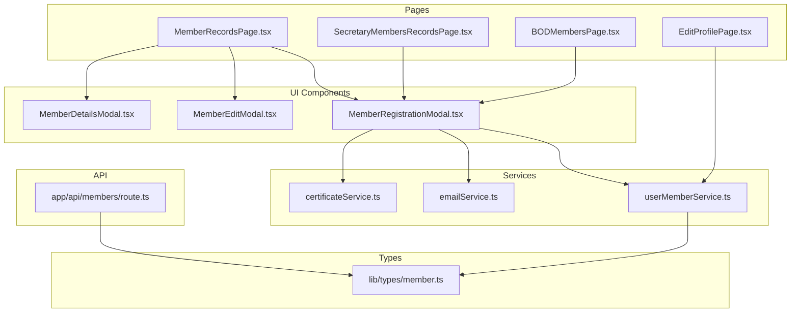
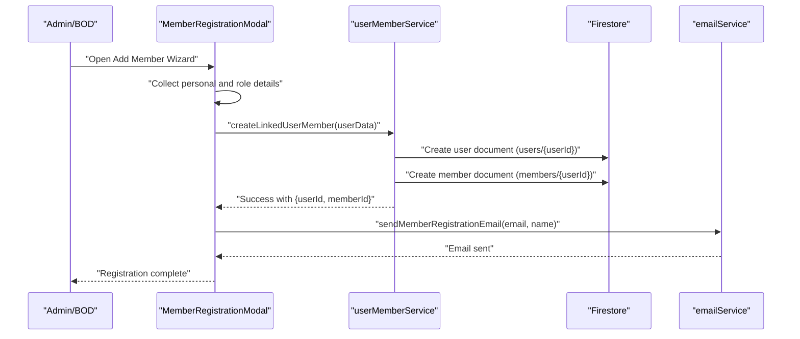
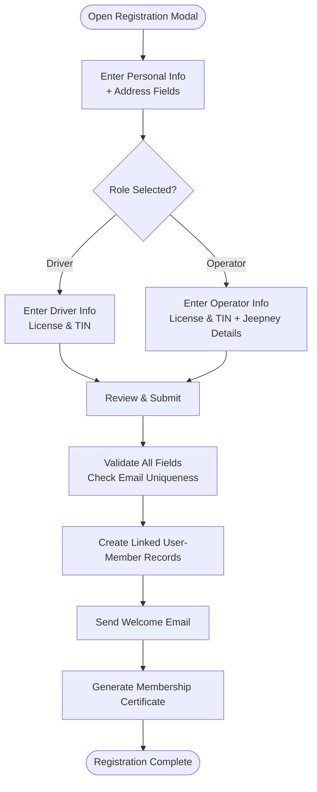
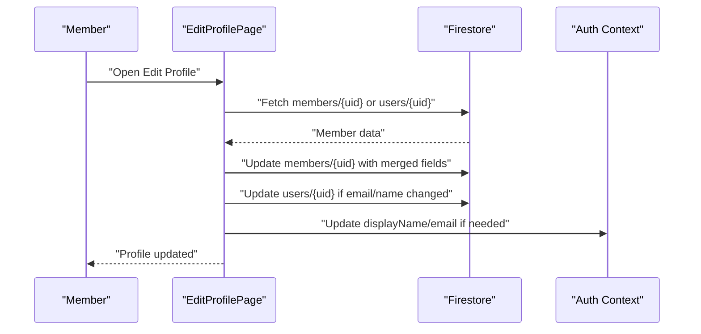
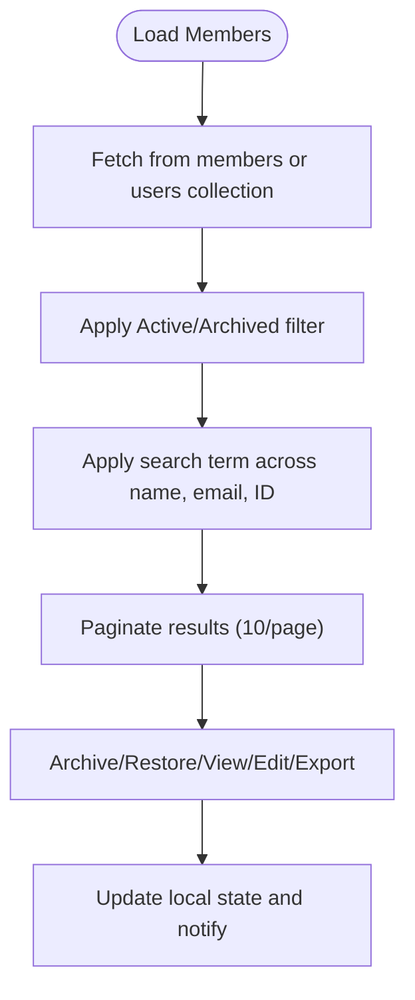
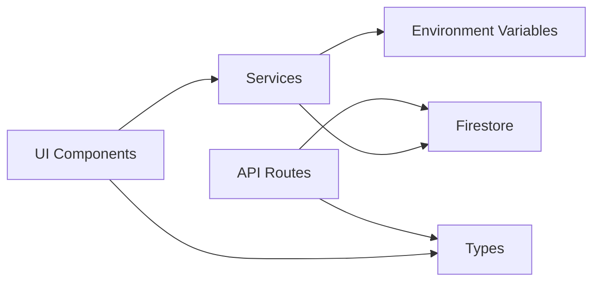

# Member Management System

<cite>
**Referenced Files in This Document**
- [MemberRegistrationModal.tsx](file://components/admin/MemberRegistrationModal.tsx)
- [MemberEditModal.tsx](file://components/admin/MemberEditModal.tsx)
- [MemberDetailsModal.tsx](file://components/admin/MemberDetailsModal.tsx)
- [MemberRecordsPage.tsx](file://app/admin/members/records/page.tsx)
- [SecretaryMembersRecordsPage.tsx](file://app/admin/secretary/members/records/page.tsx)
- [BODMembersPage.tsx](file://app/admin/bod/members/page.tsx)
- [EditProfilePage.tsx](file://app/profile/edit/page.tsx)
- [userMemberService.ts](file://lib/userMemberService.ts)
- [emailService.ts](file://lib/emailService.ts)
- [certificateService.ts](file://lib/certificateService.ts)
- [member.ts](file://lib/types/member.ts)
- [route.ts](file://app/api/members/route.ts)
</cite>

## Table of Contents
1. [Introduction](#introduction)
2. [Project Structure](#project-structure)
3. [Core Components](#core-components)
4. [Architecture Overview](#architecture-overview)
5. [Detailed Component Analysis](#detailed-component-analysis)
6. [Dependency Analysis](#dependency-analysis)
7. [Performance Considerations](#performance-considerations)
8. [Troubleshooting Guide](#troubleshooting-guide)
9. [Conclusion](#conclusion)

## Introduction
This document describes the SAMPA Cooperative Management System's member management functionality. It covers the complete member registration process, profile management, record maintenance, search and filtering, communication features, onboarding workflow, categorization, and integration with other cooperative services. The system supports two primary member categories: Drivers and Operators, with unified user-account and member-profile synchronization across collections.

## Project Structure
The member management system spans UI components, pages, services, and API routes:
- UI components encapsulate modals for registration, editing, viewing details, and certificate handling
- Pages orchestrate data fetching, filtering, pagination, and action handlers
- Services manage user-member linkage, email delivery, and certificate generation
- API routes expose backend endpoints for member retrieval and creation

**Diagram sources**
- [MemberRegistrationModal.tsx](file://components/admin/MemberRegistrationModal.tsx#L1-L800)
- [MemberEditModal.tsx](file://components/admin/MemberEditModal.tsx#L1-L800)
- [MemberDetailsModal.tsx](file://components/admin/MemberDetailsModal.tsx#L1-L271)
- [MemberRecordsPage.tsx](file://app/admin/members/records/page.tsx#L1-L655)
- [SecretaryMembersRecordsPage.tsx](file://app/admin/secretary/members/records/page.tsx#L1-L262)
- [BODMembersPage.tsx](file://app/admin/bod/members/page.tsx#L1-L260)
- [EditProfilePage.tsx](file://app/profile/edit/page.tsx#L1-L498)
- [userMemberService.ts](file://lib/userMemberService.ts#L1-L287)
- [emailService.ts](file://lib/emailService.ts#L1-L113)
- [certificateService.ts](file://lib/certificateService.ts#L1-L207)
- [route.ts](file://app/api/members/route.ts#L1-L179)
- [member.ts](file://lib/types/member.ts#L1-L56)

**Section sources**
- [MemberRegistrationModal.tsx](file://components/admin/MemberRegistrationModal.tsx#L1-L800)
- [MemberRecordsPage.tsx](file://app/admin/members/records/page.tsx#L1-L655)
- [userMemberService.ts](file://lib/userMemberService.ts#L1-L287)

## Core Components
- MemberRegistrationModal: Multi-step wizard collecting personal info, role details, and confirmation; validates inputs and creates linked user-member records; sends welcome emails; generates membership certificates.
- MemberEditModal: Edits existing member profiles with role-aware fields and dynamic plate numbers for operators.
- MemberDetailsModal: Displays comprehensive member details, role-specific info, and certificate controls.
- MemberRecordsPage: Lists members with search, filtering by active/archived, pagination, export to CSV, archive/restore actions, and modals for view/edit/add.
- SecretaryMembersRecordsPage: Role-constrained listing of members for Secretaries.
- BODMembersPage: Board of Directors view with add-member modal and robust data fetching from either members or users collections.
- EditProfilePage: Individual member profile editing with dual-collection sync and user context updates.
- userMemberService: Ensures consistent IDs across users and members collections, validates and heals links, and updates both collections atomically.
- emailService: Sends registration and credential emails via EmailJS.
- certificateService: Generates PDF membership certificates and stores metadata in Firestore.
- Types: Defines Member, DriverInfo, OperatorInfo, and CertificateData structures.

**Section sources**
- [MemberRegistrationModal.tsx](file://components/admin/MemberRegistrationModal.tsx#L1-L800)
- [MemberEditModal.tsx](file://components/admin/MemberEditModal.tsx#L1-L800)
- [MemberDetailsModal.tsx](file://components/admin/MemberDetailsModal.tsx#L1-L271)
- [MemberRecordsPage.tsx](file://app/admin/members/records/page.tsx#L1-L655)
- [SecretaryMembersRecordsPage.tsx](file://app/admin/secretary/members/records/page.tsx#L1-L262)
- [BODMembersPage.tsx](file://app/admin/bod/members/page.tsx#L1-L260)
- [EditProfilePage.tsx](file://app/profile/edit/page.tsx#L1-L498)
- [userMemberService.ts](file://lib/userMemberService.ts#L1-L287)
- [emailService.ts](file://lib/emailService.ts#L1-L113)
- [certificateService.ts](file://lib/certificateService.ts#L1-L207)
- [member.ts](file://lib/types/member.ts#L1-L56)

## Architecture Overview
The system follows a dual-collection architecture:
- users collection: user accounts with authentication-related fields
- members collection: member profiles with role-specific details and cooperative metadata

A single-source-of-truth strategy ensures both collections share the same document ID derived from the normalized email. Services coordinate cross-collection operations and maintain consistency.

**Diagram sources**
- [MemberRegistrationModal.tsx](file://components/admin/MemberRegistrationModal.tsx#L328-L369)
- [userMemberService.ts](file://lib/userMemberService.ts#L23-L92)
- [emailService.ts](file://lib/emailService.ts#L41-L67)

**Section sources**
- [userMemberService.ts](file://lib/userMemberService.ts#L14-L92)
- [MemberRegistrationModal.tsx](file://components/admin/MemberRegistrationModal.tsx#L328-L369)

## Detailed Component Analysis

### Member Registration Workflow
The registration process is a guided, multi-step wizard:
- Step 1: Personal info (names, email, phone, birthdate, role selection) and shared address fields
- Step 2: Role-specific info (license/TIN) and operator-specific jeepney details (count and plate numbers)
- Step 3: Confirmation screen summarizing all collected data
- Backend: Creates linked user and member documents, checks email uniqueness, sends welcome email, and initializes payment info

**Diagram sources**
- [MemberRegistrationModal.tsx](file://components/admin/MemberRegistrationModal.tsx#L196-L369)
- [userMemberService.ts](file://lib/userMemberService.ts#L23-L92)
- [emailService.ts](file://lib/emailService.ts#L41-L67)
- [certificateService.ts](file://lib/certificateService.ts#L10-L175)

**Section sources**
- [MemberRegistrationModal.tsx](file://components/admin/MemberRegistrationModal.tsx#L103-L369)
- [userMemberService.ts](file://lib/userMemberService.ts#L23-L92)
- [emailService.ts](file://lib/emailService.ts#L41-L67)
- [certificateService.ts](file://lib/certificateService.ts#L10-L175)

### Member Profile Management
Members can update personal details, contact info, and role-specific information:
- EditProfilePage loads member data from members or users collection, merges fields, and applies updates atomically to both collections
- MemberEditModal supports role-aware editing with dynamic plate-number arrays for operators

**Diagram sources**
- [EditProfilePage.tsx](file://app/profile/edit/page.tsx#L40-L311)
- [userMemberService.ts](file://lib/userMemberService.ts#L246-L287)

**Section sources**
- [EditProfilePage.tsx](file://app/profile/edit/page.tsx#L40-L311)
- [MemberEditModal.tsx](file://components/admin/MemberEditModal.tsx#L126-L273)

### Member Record Maintenance
The MemberRecordsPage provides:
- Search by name, ID, email, middle/suffix
- Filter by Active/Archived status
- Pagination (10 items per page)
- Export to CSV
- Archive/Restore actions
- Modals for View/Edit/Add

**Diagram sources**
- [MemberRecordsPage.tsx](file://app/admin/members/records/page.tsx#L39-L147)
- [MemberRecordsPage.tsx](file://app/admin/members/records/page.tsx#L149-L194)
- [MemberRecordsPage.tsx](file://app/admin/members/records/page.tsx#L204-L250)

**Section sources**
- [MemberRecordsPage.tsx](file://app/admin/members/records/page.tsx#L11-L655)

### Member Search and Filtering
Search logic:
- Case-insensitive matching across firstName, lastName, email, id, middleName, suffix
- Two-stage pipeline: status filter (Active/Archived) then search filter
- Real-time updates with pagination reset

**Section sources**
- [MemberRecordsPage.tsx](file://app/admin/members/records/page.tsx#L149-L194)

### Member Communication Features
- Welcome email sent upon successful registration with password setup link
- Alternative auto-credential email support
- Certificate viewing/download capability via embedded PDF viewer and download button

**Section sources**
- [emailService.ts](file://lib/emailService.ts#L41-L67)
- [MemberDetailsModal.tsx](file://components/admin/MemberDetailsModal.tsx#L202-L257)

### Member Onboarding Workflow
- Automated email with password setup link
- Single-source-of-truth user-member linkage
- Optional auto-generated credentials email
- Certificate generation and storage for official documentation

**Section sources**
- [MemberRegistrationModal.tsx](file://components/admin/MemberRegistrationModal.tsx#L344-L351)
- [userMemberService.ts](file://lib/userMemberService.ts#L35-L92)
- [certificateService.ts](file://lib/certificateService.ts#L10-L175)

### Data Validation Rules
- Personal info: required fields, name patterns, valid email format, phone number format, calculated/validated age
- Role-specific: license/TIN required for both roles; operator requires jeepney count and plate numbers
- Address: street/barangay/city required for role-specific address blocks
- Age constraints: 18–100 range enforced
- Email uniqueness: checked before creation

**Section sources**
- [MemberRegistrationModal.tsx](file://components/admin/MemberRegistrationModal.tsx#L103-L144)
- [MemberRegistrationModal.tsx](file://components/admin/MemberRegistrationModal.tsx#L536-L644)

### Audit Trail and Compliance Monitoring
- createdAt/updatedAt timestamps maintained in both collections
- Archive/restore timestamps (archivedAt/restoredAt) for compliance tracking
- Activity logs can leverage existing activity logger utilities for broader audit coverage

**Section sources**
- [MemberRecordsPage.tsx](file://app/admin/members/records/page.tsx#L204-L250)
- [MemberEditModal.tsx](file://components/admin/MemberEditModal.tsx#L235-L250)

### Member Categorization and Special Status Handling
- Roles: Driver and Operator with distinct license/TIN and address fields
- Status: Active by default; archived flag toggled via Archive/Restore actions
- Special status: archived flag with display indicators

**Section sources**
- [member.ts](file://lib/types/member.ts#L36-L56)
- [MemberRecordsPage.tsx](file://app/admin/members/records/page.tsx#L480-L487)

### Integration with Other Cooperative Services
- Savings and Loans: integrated via shared user/member IDs enabling cross-service operations
- API endpoints: centralized member retrieval and creation for external integrations
- Notifications: EmailJS integration for automated communications

**Section sources**
- [route.ts](file://app/api/members/route.ts#L25-L65)
- [emailService.ts](file://lib/emailService.ts#L19-L38)

## Dependency Analysis
The system exhibits clear separation of concerns:
- UI components depend on services for data operations
- Services depend on Firestore wrappers and environment configurations
- API routes provide backend endpoints for member operations
- Types define contracts across modules

**Diagram sources**
- [MemberRegistrationModal.tsx](file://components/admin/MemberRegistrationModal.tsx#L1-L10)
- [userMemberService.ts](file://lib/userMemberService.ts#L1-L16)
- [route.ts](file://app/api/members/route.ts#L1-L6)
- [member.ts](file://lib/types/member.ts#L1-L56)

**Section sources**
- [MemberRegistrationModal.tsx](file://components/admin/MemberRegistrationModal.tsx#L1-L10)
- [userMemberService.ts](file://lib/userMemberService.ts#L1-L16)
- [route.ts](file://app/api/members/route.ts#L1-L6)
- [member.ts](file://lib/types/member.ts#L1-L56)

## Performance Considerations
- Prefer fetching from the members collection first; fall back to users with role filtering
- Use pagination to limit payload sizes
- Debounce search input to reduce unnecessary re-renders
- Batch updates where possible to minimize Firestore writes
- Cache frequently accessed data (e.g., member lists) to improve responsiveness

## Troubleshooting Guide
Common issues and resolutions:
- Member not found in members collection: falls back to users collection with role filtering
- Email already exists: validation prevents duplicate registration
- Archive/restore failures: verify Firestore permissions and document existence
- Certificate generation errors: confirm PDF generation and Firestore update success
- Email delivery failures: check EmailJS configuration and template IDs

**Section sources**
- [MemberRecordsPage.tsx](file://app/admin/members/records/page.tsx#L44-L88)
- [MemberRegistrationModal.tsx](file://components/admin/MemberRegistrationModal.tsx#L254-L261)
- [certificateService.ts](file://lib/certificateService.ts#L168-L175)
- [emailService.ts](file://lib/emailService.ts#L21-L24)

## Conclusion
The SAMPA Cooperative Management System provides a robust, scalable member management solution with strong data integrity, comprehensive communication features, and seamless integration across cooperative services. The dual-collection architecture, guided registration workflow, and role-aware profile management ensure efficient onboarding, maintenance, and compliance tracking for both Drivers and Operators.