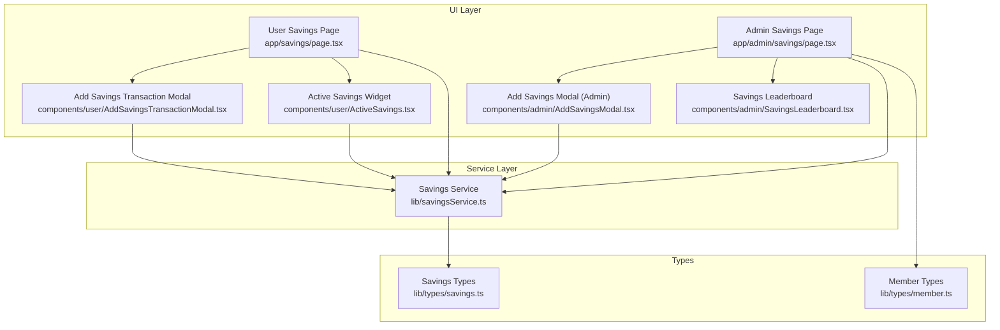
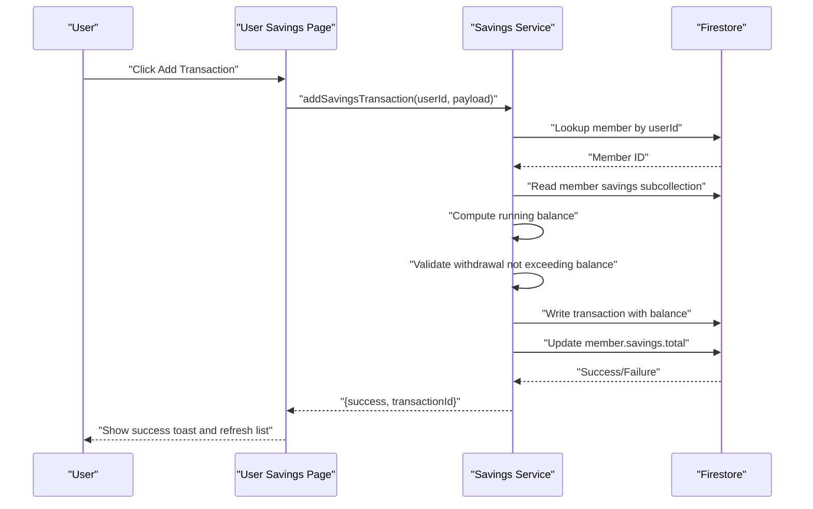
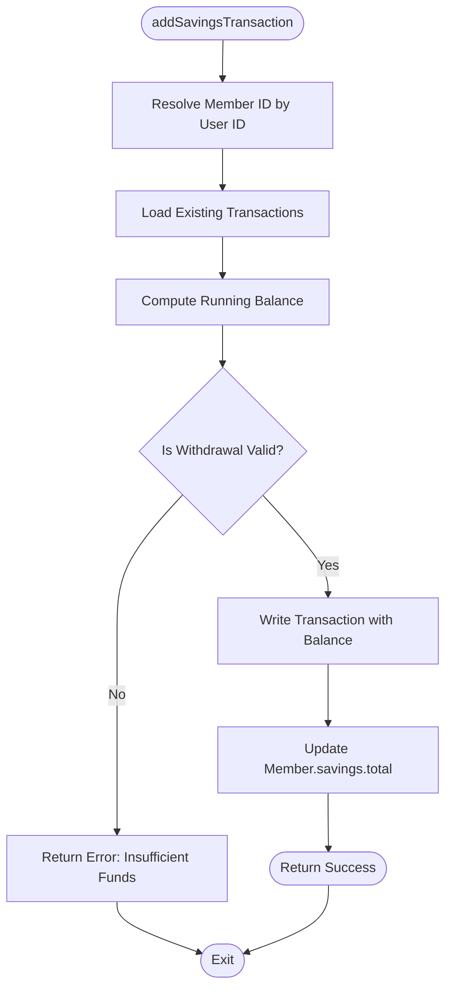
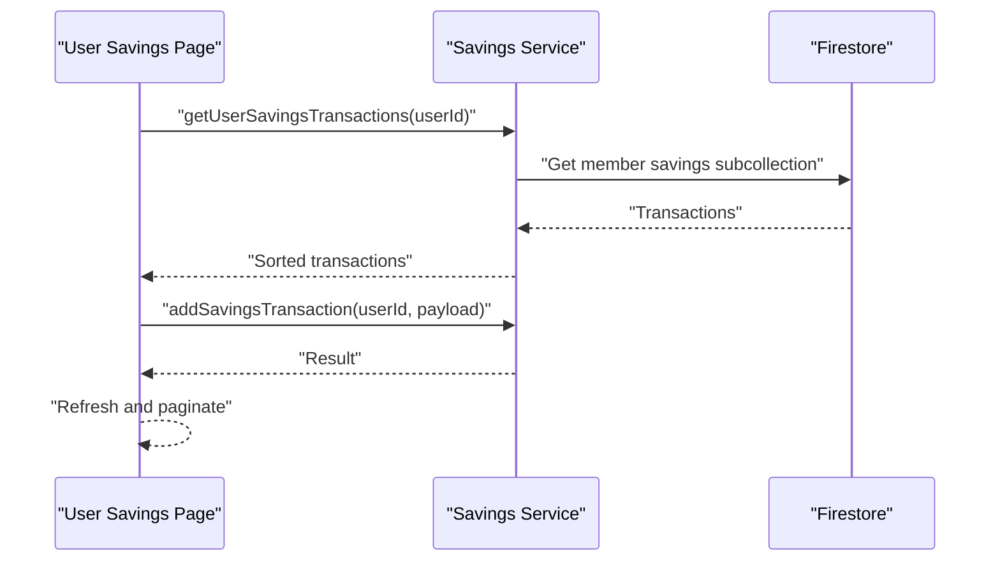
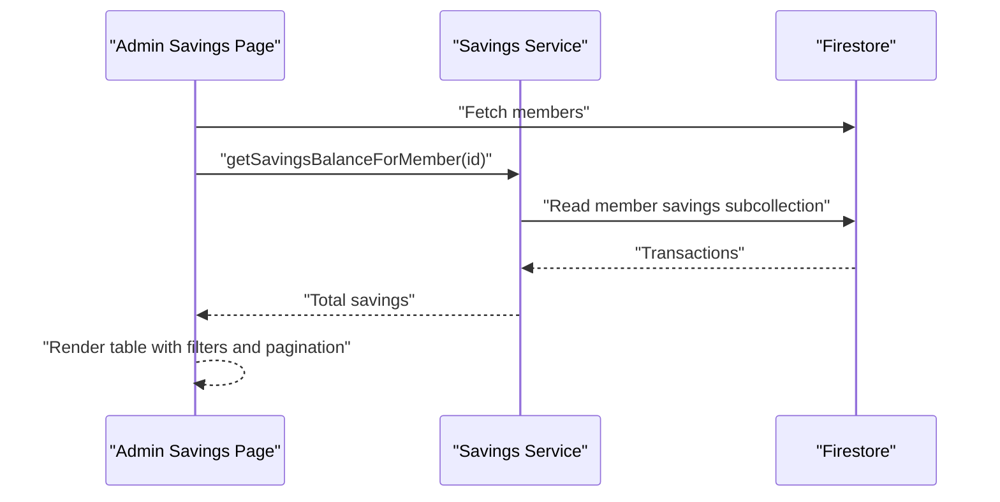
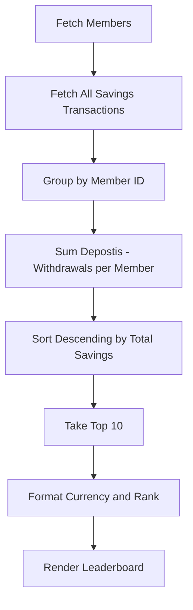
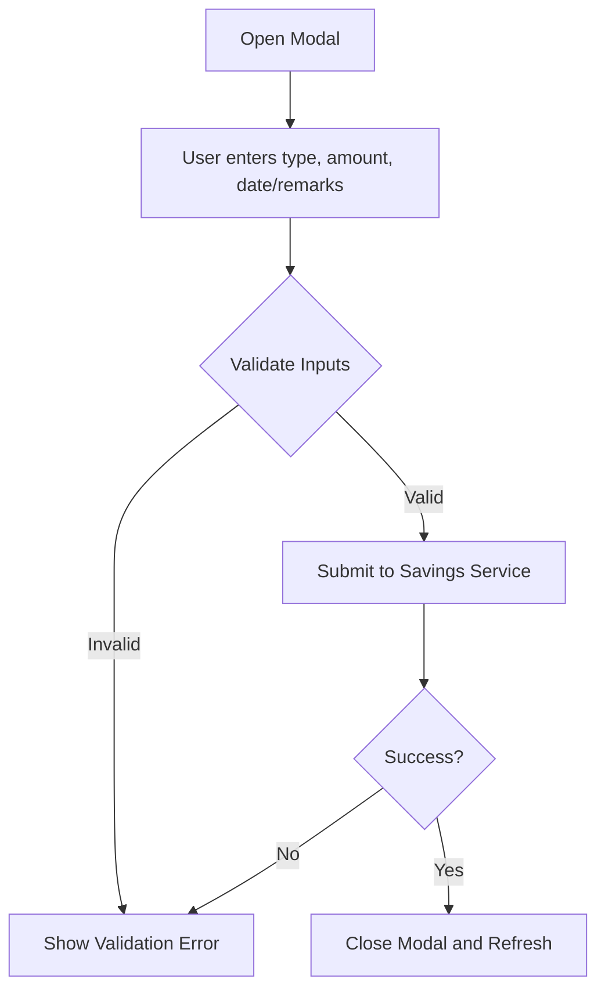
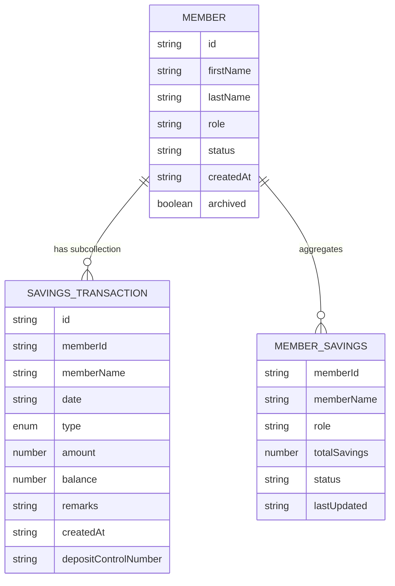
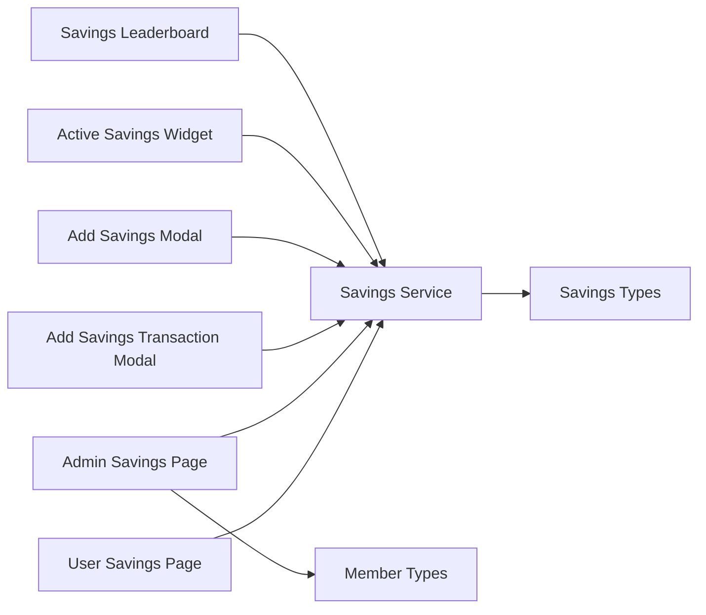

# Savings Management System

<cite>
**Referenced Files in This Document**
- [savingsService.ts](file://lib/savingsService.ts)
- [AddSavingsModal.tsx](file://components/admin/AddSavingsModal.tsx)
- [AddSavingsTransactionModal.tsx](file://components/user/AddSavingsTransactionModal.tsx)
- [SavingsLeaderboard.tsx](file://components/admin/SavingsLeaderboard.tsx)
- [page.tsx (User Savings)](file://app/savings/page.tsx)
- [page.tsx (Admin Savings)](file://app/admin/savings/page.tsx)
- [savings.ts](file://lib/types/savings.ts)
- [member.ts](file://lib/types/member.ts)
- [ActiveSavings.tsx](file://components/user/ActiveSavings.tsx)
</cite>

## Table of Contents
1. [Introduction](#introduction)
2. [Project Structure](#project-structure)
3. [Core Components](#core-components)
4. [Architecture Overview](#architecture-overview)
5. [Detailed Component Analysis](#detailed-component-analysis)
6. [Dependency Analysis](#dependency-analysis)
7. [Performance Considerations](#performance-considerations)
8. [Troubleshooting Guide](#troubleshooting-guide)
9. [Conclusion](#conclusion)

## Introduction
This document describes the Savings Management System within the SAMPA Cooperative Management System. It covers savings account creation, account types, transaction processing (deposits and withdrawals), validation, balance calculations, the savings leaderboard, report generation, and integration with the broader financial reporting system. It also outlines account monitoring capabilities and common operational scenarios.

## Project Structure
The savings functionality spans three primary areas:
- Backend service layer for atomic transaction processing and balance maintenance
- Admin and user UI components for transaction entry, viewing, and reporting
- Shared TypeScript types for savings transactions and member financial summaries

**Diagram sources**
- [page.tsx (User Savings)](file://app/savings/page.tsx#L1-L382)
- [page.tsx (Admin Savings)](file://app/admin/savings/page.tsx#L1-L652)
- [AddSavingsTransactionModal.tsx](file://components/user/AddSavingsTransactionModal.tsx#L1-L221)
- [AddSavingsModal.tsx](file://components/admin/AddSavingsModal.tsx#L1-L197)
- [SavingsLeaderboard.tsx](file://components/admin/SavingsLeaderboard.tsx#L1-L213)
- [ActiveSavings.tsx](file://components/user/ActiveSavings.tsx#L1-L270)
- [savingsService.ts](file://lib/savingsService.ts#L1-L455)
- [savings.ts](file://lib/types/savings.ts#L1-L21)
- [member.ts](file://lib/types/member.ts#L1-L56)

**Section sources**
- [page.tsx (User Savings)](file://app/savings/page.tsx#L1-L382)
- [page.tsx (Admin Savings)](file://app/admin/savings/page.tsx#L1-L652)
- [savingsService.ts](file://lib/savingsService.ts#L1-L455)
- [savings.ts](file://lib/types/savings.ts#L1-L21)
- [member.ts](file://lib/types/member.ts#L1-L56)

## Core Components
- Savings Service: Provides atomic transaction recording, balance validation, and balance aggregation for members.
- User Savings Page: Displays a member’s transactions, current balance, and allows adding deposits/withdrawals.
- Admin Savings Page: Lists members, filters by criteria, shows total savings, and prints reports.
- Savings Leaderboard: Ranks members by total savings contributions.
- Savings Transaction Modals: Admin and user-facing forms for entering transactions with validation.
- Active Savings Widget: Displays recent transactions and current balance for quick access.

Key responsibilities:
- Transaction validation (amount positivity, sufficient funds for withdrawals)
- Running balance calculation per transaction
- Aggregate savings maintained in member documents
- Currency formatting and pagination for transaction lists

**Section sources**
- [savingsService.ts](file://lib/savingsService.ts#L237-L342)
- [page.tsx (User Savings)](file://app/savings/page.tsx#L30-L160)
- [page.tsx (Admin Savings)](file://app/admin/savings/page.tsx#L10-L260)
- [SavingsLeaderboard.tsx](file://components/admin/SavingsLeaderboard.tsx#L32-L124)
- [AddSavingsTransactionModal.tsx](file://components/user/AddSavingsTransactionModal.tsx#L15-L96)
- [AddSavingsModal.tsx](file://components/admin/AddSavingsModal.tsx#L12-L87)
- [ActiveSavings.tsx](file://components/user/ActiveSavings.tsx#L16-L82)

## Architecture Overview
The system follows a layered architecture:
- UI layer: Next.js pages and client components
- Service layer: Savings service orchestrates Firestore operations and validations
- Data layer: Firestore collections for members, member savings subcollections, and savings aggregates

**Diagram sources**
- [page.tsx (User Savings)](file://app/savings/page.tsx#L112-L160)
- [savingsService.ts](file://lib/savingsService.ts#L237-L342)

## Detailed Component Analysis

### Savings Service
The savings service encapsulates:
- Member resolution via user ID
- Atomic transaction creation with running balance computation
- Balance validation for withdrawals
- Aggregate savings updates in member documents
- Transaction retrieval and balance queries

**Diagram sources**
- [savingsService.ts](file://lib/savingsService.ts#L237-L342)

**Section sources**
- [savingsService.ts](file://lib/savingsService.ts#L21-L135)
- [savingsService.ts](file://lib/savingsService.ts#L140-L232)
- [savingsService.ts](file://lib/savingsService.ts#L237-L342)
- [savingsService.ts](file://lib/savingsService.ts#L347-L422)
- [savingsService.ts](file://lib/savingsService.ts#L427-L454)

### User Savings Page
Responsibilities:
- Fetch and display member transactions with pagination
- Compute totals for deposits and withdrawals
- Allow adding transactions via modal
- Show current balance and summary statistics

**Diagram sources**
- [page.tsx (User Savings)](file://app/savings/page.tsx#L39-L160)
- [savingsService.ts](file://lib/savingsService.ts#L347-L377)
- [savingsService.ts](file://lib/savingsService.ts#L237-L342)

**Section sources**
- [page.tsx (User Savings)](file://app/savings/page.tsx#L30-L382)
- [ActiveSavings.tsx](file://components/user/ActiveSavings.tsx#L16-L82)

### Admin Savings Page
Responsibilities:
- List members with filters (name, role, status, savings range)
- Compute and display total savings per member
- Open details modal with financial summary
- Print savings report

**Diagram sources**
- [page.tsx (Admin Savings)](file://app/admin/savings/page.tsx#L37-L260)
- [savingsService.ts](file://lib/savingsService.ts#L427-L454)

**Section sources**
- [page.tsx (Admin Savings)](file://app/admin/savings/page.tsx#L10-L652)

### Savings Leaderboard
Responsibilities:
- Fetch members and savings transactions
- Group transactions by member and compute totals
- Rank top 10 members by savings
- Render with currency formatting and special styling for top 3

**Diagram sources**
- [SavingsLeaderboard.tsx](file://components/admin/SavingsLeaderboard.tsx#L36-L124)

**Section sources**
- [SavingsLeaderboard.tsx](file://components/admin/SavingsLeaderboard.tsx#L32-L213)

### Transaction Entry Modals
- User Modal: Allows specifying date, type, amount, remarks; validates amount positivity and sufficient funds; shows current balance.
- Admin Modal: Similar validation for authorized officers; adds transactions on behalf of members.

**Diagram sources**
- [AddSavingsTransactionModal.tsx](file://components/user/AddSavingsTransactionModal.tsx#L26-L96)
- [AddSavingsModal.tsx](file://components/admin/AddSavingsModal.tsx#L21-L87)

**Section sources**
- [AddSavingsTransactionModal.tsx](file://components/user/AddSavingsTransactionModal.tsx#L15-L221)
- [AddSavingsModal.tsx](file://components/admin/AddSavingsModal.tsx#L12-L197)

### Data Models
Savings transaction and member savings summary types define the shape of stored data and UI rendering.

**Diagram sources**
- [savings.ts](file://lib/types/savings.ts#L1-L21)
- [member.ts](file://lib/types/member.ts#L36-L56)

**Section sources**
- [savings.ts](file://lib/types/savings.ts#L1-L21)
- [member.ts](file://lib/types/member.ts#L36-L56)

## Dependency Analysis
- UI pages depend on the savings service for data and mutations.
- Savings service depends on Firestore abstraction for reads/writes.
- Admin page depends on member types for rendering and filtering.
- Leaderboard component depends on savings transactions and member metadata.

**Diagram sources**
- [page.tsx (User Savings)](file://app/savings/page.tsx#L1-L382)
- [page.tsx (Admin Savings)](file://app/admin/savings/page.tsx#L1-L652)
- [AddSavingsTransactionModal.tsx](file://components/user/AddSavingsTransactionModal.tsx#L1-L221)
- [AddSavingsModal.tsx](file://components/admin/AddSavingsModal.tsx#L1-L197)
- [ActiveSavings.tsx](file://components/user/ActiveSavings.tsx#L1-L270)
- [SavingsLeaderboard.tsx](file://components/admin/SavingsLeaderboard.tsx#L1-L213)
- [savingsService.ts](file://lib/savingsService.ts#L1-L455)
- [savings.ts](file://lib/types/savings.ts#L1-L21)
- [member.ts](file://lib/types/member.ts#L1-L56)

**Section sources**
- [savingsService.ts](file://lib/savingsService.ts#L1-L455)
- [page.tsx (User Savings)](file://app/savings/page.tsx#L1-L382)
- [page.tsx (Admin Savings)](file://app/admin/savings/page.tsx#L1-L652)

## Performance Considerations
- Running balance computation iterates existing transactions; for very large histories, consider storing a cached balance field and updating it atomically alongside transaction writes.
- Leaderboard recalculates totals by grouping transactions; for large datasets, precompute aggregates and maintain them incrementally.
- UI pagination reduces rendering overhead; keep page sizes reasonable to avoid long sort/filter operations on the client.
- Batch operations and indexing in Firestore can improve member and transaction queries.

## Troubleshooting Guide
Common issues and resolutions:
- Member not found by user ID: The service attempts multiple fallbacks (userId field, direct member ID, email, decoded email, name). Verify member document fields and user identity linkage.
- Insufficient funds on withdrawal: The service prevents negative balances; ensure the current balance is accurately reflected before submission.
- Transaction not saving: Check Firestore write permissions and network connectivity; the service logs warnings if member aggregate update fails after successful transaction save.
- Leaderboard shows zeros: The leaderboard falls back to zero for members without transactions; confirm transaction collections exist and are readable.

**Section sources**
- [savingsService.ts](file://lib/savingsService.ts#L21-L135)
- [savingsService.ts](file://lib/savingsService.ts#L291-L294)
- [savingsService.ts](file://lib/savingsService.ts#L332-L335)
- [SavingsLeaderboard.tsx](file://components/admin/SavingsLeaderboard.tsx#L54-L63)

## Conclusion
The Savings Management System provides a robust, user-friendly framework for managing member savings. It ensures transaction integrity, offers real-time balance visibility, supports administrative oversight, and enables reporting and ranking. Future enhancements could include automatic interest accrual, savings account closure workflows, and integration with cooperative-wide financial dashboards.