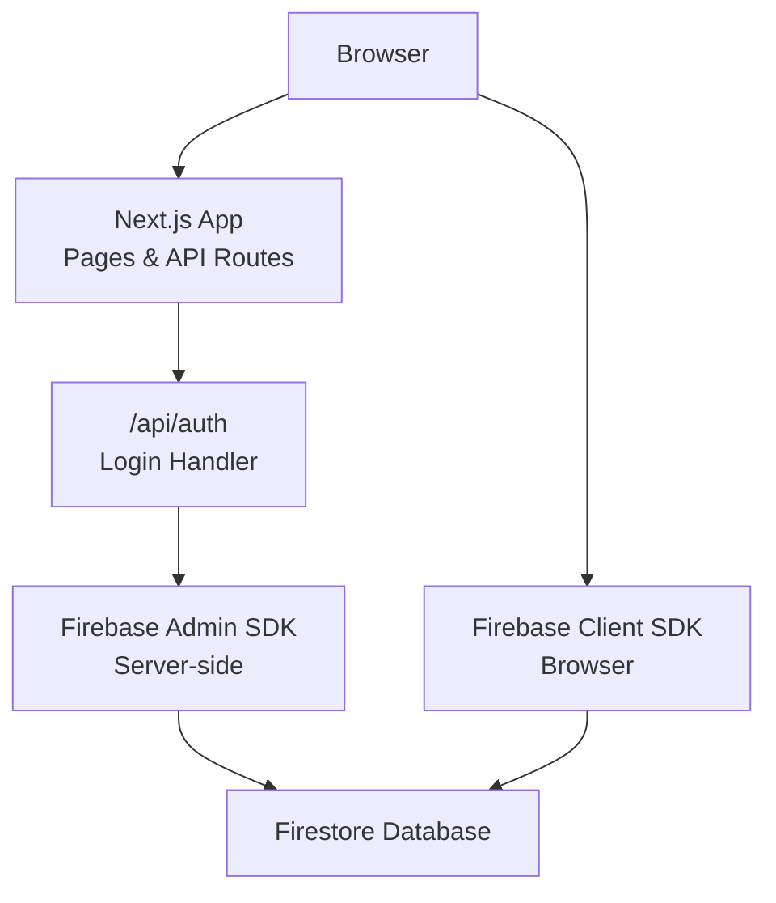

# Getting Started

<cite>
**Referenced Files in This Document**
- [README.md](file://README.md)
- [package.json](file://package.json)
- [.env.local.example](file://.env.local.example)
- [firebase.json](file://firebase.json)
- [FIREBASE_SETUP_INSTRUCTIONS.md](file://FIREBASE_SETUP_INSTRUCTIONS.md)
- [FIREBASE_TROUBLESHOOTING.md](file://FIREBASE_TROUBLESHOOTING.md)
- [next.config.ts](file://next.config.ts)
- [tsconfig.json](file://tsconfig.json)
- [lib/firebase.ts](file://lib/firebase.ts)
- [lib/firebaseAdmin.ts](file://lib/firebaseAdmin.ts)
- [scripts/setup-firebase.js](file://scripts/setup-firebase.js)
- [lib/auth.tsx](file://lib/auth.tsx)
- [middleware.ts](file://middleware.ts)
- [lib/validators.ts](file://lib/validators.ts)
- [app/api/auth/route.ts](file://app/api/auth/route.ts)
- [firestore.rules](file://firestore.rules)
- [ROLE_BASED_ACCESS_CONTROL.md](file://ROLE_BASED_ACCESS_CONTROL.md)
</cite>

## Table of Contents
1. [Introduction](#introduction)
2. [Prerequisites](#prerequisites)
3. [Installation and Setup](#installation-and-setup)
4. [Environment Variables](#environment-variables)
5. [Firebase Project Setup](#firebase-project-setup)
6. [Running the Development Server](#running-the-development-server)
7. [Initial User Account Creation and First-Time Login](#initial-user-account-creation-and-first-time-login)
8. [Accessing Dashboards by Role](#accessing-dashboards-by-role)
9. [Verification and Troubleshooting](#verification-and-troubleshooting)
10. [Architecture Overview](#architecture-overview)
11. [Conclusion](#conclusion)

## Introduction
This guide helps you install and run the SAMPA Cooperative Management System locally. It covers prerequisites, environment configuration, Firebase setup, dependency installation, and running the development server. You will also learn how to create an initial user, log in, and navigate to role-specific dashboards.

## Prerequisites
- Node.js installed on your machine
- npm or yarn installed
- Git for cloning the repository
- A Firebase project ready for setup

**Section sources**
- [README.md](file://README.md#L1-L37)
- [package.json](file://package.json#L1-L53)

## Installation and Setup
Follow these steps to clone the repository and install dependencies:

1. Clone the repository to your local machine.
2. Navigate to the project directory.
3. Install dependencies using your preferred package manager:
   - npm: `npm ci`
   - yarn: `yarn install`
   - pnpm: `pnpm install`
   - bun: `bun install`

Notes:
- The project uses Next.js and TypeScript.
- The repository includes a setup script to assist with Firebase configuration.

**Section sources**
- [README.md](file://README.md#L1-L37)
- [package.json](file://package.json#L1-L53)

## Environment Variables
The application reads Firebase configuration from environment variables. Use the provided example as a reference and create your own `.env.local` file.

- Reference example: [.env.local.example](file://.env.local.example#L1-L10)
- The example shows keys for Firebase Admin SDK credentials and client SDK configuration.

Important:
- The example demonstrates how to format the private key with escaped newline characters.
- Ensure the private key remains on a single line with `\n` characters.

**Section sources**
- [.env.local.example](file://.env.local.example#L1-L10)

## Firebase Project Setup
Complete the following Firebase setup steps:

1. Create or select a Firebase project in the Firebase Console.
2. Enable the Email/Password Authentication provider.
3. Create a Firestore database in locked mode.
4. Configure Firestore security rules.
5. Generate a Firebase Admin SDK service account key:
   - Go to Project Settings → Service Accounts → Generate new private key.
   - Download the JSON file and extract the values.
6. Update your `.env.local` with the extracted values.
7. Optionally, add a Firebase web app for client SDK configuration.

Notes:
- The project’s Firebase configuration is defined in [firebase.json](file://firebase.json#L1-L9).
- Security rules are defined in [firestore.rules](file://firestore.rules#L1-L19).
- Use the setup script to assist with configuration: [scripts/setup-firebase.js](file://scripts/setup-firebase.js#L1-L93).
- For detailed setup instructions, refer to [FIREBASE_SETUP_INSTRUCTIONS.md](file://FIREBASE_SETUP_INSTRUCTIONS.md#L1-L63).

**Section sources**
- [firebase.json](file://firebase.json#L1-L9)
- [firestore.rules](file://firestore.rules#L1-L19)
- [FIREBASE_SETUP_INSTRUCTIONS.md](file://FIREBASE_SETUP_INSTRUCTIONS.md#L1-L63)
- [scripts/setup-firebase.js](file://scripts/setup-firebase.js#L1-L93)

## Running the Development Server
Start the Next.js development server:

- Use one of the following commands:
  - `npm run dev`
  - `yarn dev`
  - `pnpm dev`
  - `bun dev`

Open your browser to http://localhost:3000 to access the application.

Notes:
- The project’s scripts and configuration are defined in [package.json](file://package.json#L1-L53).
- Next.js configuration is minimal in [next.config.ts](file://next.config.ts#L1-L8).
- TypeScript configuration is defined in [tsconfig.json](file://tsconfig.json#L1-L35).

**Section sources**
- [README.md](file://README.md#L1-L37)
- [package.json](file://package.json#L1-L53)
- [next.config.ts](file://next.config.ts#L1-L8)
- [tsconfig.json](file://tsconfig.json#L1-L35)

## Initial User Account Creation and First-Time Login
There are two ways to create a user and log in:

Option A: Self-registration (member)
- Register as a new member via the registration page.
- The system assigns the default role of “member”.
- Log in using your credentials.

Option B: Admin-created user
- An administrator creates a user with a chosen role.
- The system stores a hashed password and marks the account as ready to log in.
- Log in using your credentials.

After successful login, the system redirects you to your role-specific dashboard.

Notes:
- Authentication logic and role-based redirection are implemented in [lib/auth.tsx](file://lib/auth.tsx#L158-L682).
- The authentication API route is defined in [app/api/auth/route.ts](file://app/api/auth/route.ts#L1-L295).
- Role-based access control is documented in [ROLE_BASED_ACCESS_CONTROL.md](file://ROLE_BASED_ACCESS_CONTROL.md#L1-L89).

**Section sources**
- [lib/auth.tsx](file://lib/auth.tsx#L158-L682)
- [app/api/auth/route.ts](file://app/api/auth/route.ts#L1-L295)
- [ROLE_BASED_ACCESS_CONTROL.md](file://ROLE_BASED_ACCESS_CONTROL.md#L1-L89)

## Accessing Dashboards by Role
The system redirects users to role-specific dashboards after login. Supported roles and their dashboards include:

- Admin roles:
  - Admin → /admin/dashboard
  - Secretary → /admin/secretary/home
  - Chairman → /admin/chairman/home
  - Vice Chairman → /admin/vice-chairman/home
  - Manager → /admin/manager/home
  - Treasurer → /admin/treasurer/home
  - Board of Directors → /admin/bod/home
- User roles:
  - Member → /dashboard
  - Driver → /driver/dashboard
  - Operator → /operator/dashboard

Notes:
- Dashboard paths are determined by the helper function [getDashboardPath](file://lib/auth.tsx#L112-L156).
- Route validation and protection are enforced by the middleware and validators:
  - Middleware: [middleware.ts](file://middleware.ts#L1-L62)
  - Validators: [lib/validators.ts](file://lib/validators.ts#L1-L236)

**Section sources**
- [lib/auth.tsx](file://lib/auth.tsx#L112-L156)
- [middleware.ts](file://middleware.ts#L1-L62)
- [lib/validators.ts](file://lib/validators.ts#L1-L236)
- [ROLE_BASED_ACCESS_CONTROL.md](file://ROLE_BASED_ACCESS_CONTROL.md#L1-L89)

## Verification and Troubleshooting
Verify your installation and troubleshoot common issues:

- Verify Firebase configuration:
  - Run the setup script to check and update credentials: `npm run setup-firebase`
  - Confirm environment variables are set correctly in `.env.local`.
  - Restart the development server after updating environment variables.

- Test connectivity:
  - Use the Firebase test script: `npm run test-firebase`

- Troubleshoot authentication:
  - Review the Firebase troubleshooting guide for common issues and solutions.
  - Check server logs for initialization messages and error stack traces.
  - Use browser developer tools to inspect network requests, console errors, and cookies.

- Additional resources:
  - Firebase setup instructions: [FIREBASE_SETUP_INSTRUCTIONS.md](file://FIREBASE_SETUP_INSTRUCTIONS.md#L1-L63)
  - Firebase troubleshooting guide: [FIREBASE_TROUBLESHOOTING.md](file://FIREBASE_TROUBLESHOOTING.md#L1-L177)

**Section sources**
- [FIREBASE_TROUBLESHOOTING.md](file://FIREBASE_TROUBLESHOOTING.md#L1-L177)
- [FIREBASE_SETUP_INSTRUCTIONS.md](file://FIREBASE_SETUP_INSTRUCTIONS.md#L1-L63)
- [scripts/setup-firebase.js](file://scripts/setup-firebase.js#L1-L93)

## Architecture Overview
The system integrates Next.js with Firebase for authentication and data persistence. The client initializes Firebase with environment variables, while server-side operations use the Firebase Admin SDK. Middleware enforces role-based access control, and the authentication API validates credentials against Firestore.

**Diagram sources**
- [lib/firebase.ts](file://lib/firebase.ts#L1-L309)
- [lib/firebaseAdmin.ts](file://lib/firebaseAdmin.ts#L1-L277)
- [app/api/auth/route.ts](file://app/api/auth/route.ts#L1-L295)
- [middleware.ts](file://middleware.ts#L1-L62)

## Conclusion
You are now ready to run the SAMPA Cooperative Management System locally. Ensure Firebase is configured, environment variables are set, and the development server is running. Create an initial user, log in, and verify that you are redirected to the correct dashboard based on your role. Use the troubleshooting resources if you encounter issues.