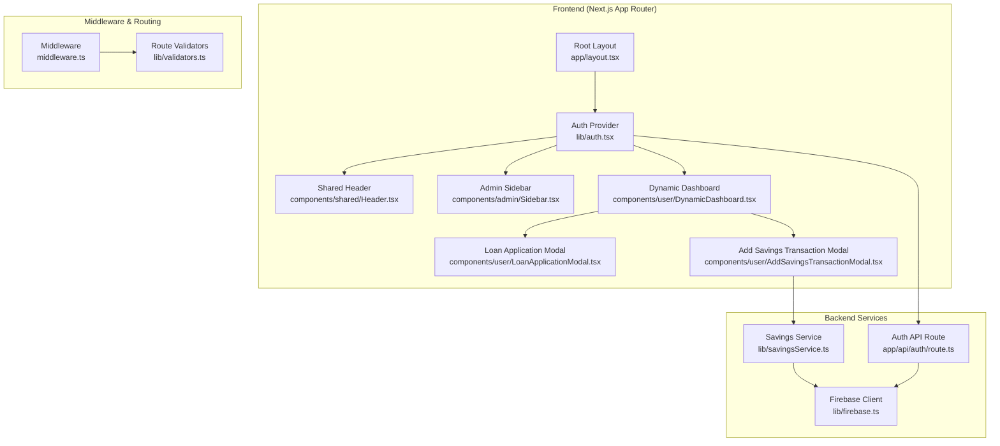
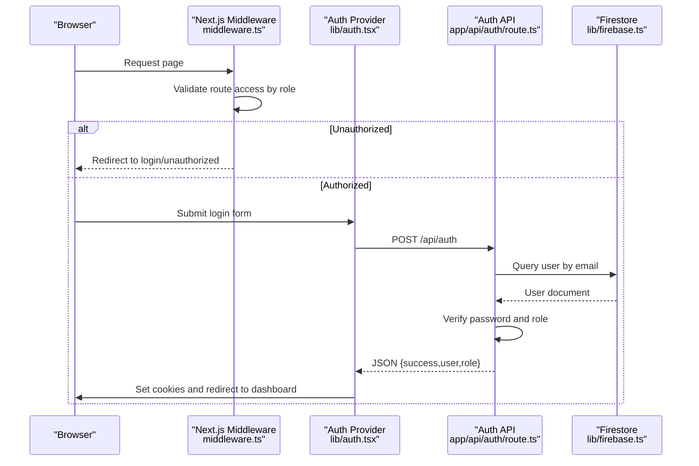
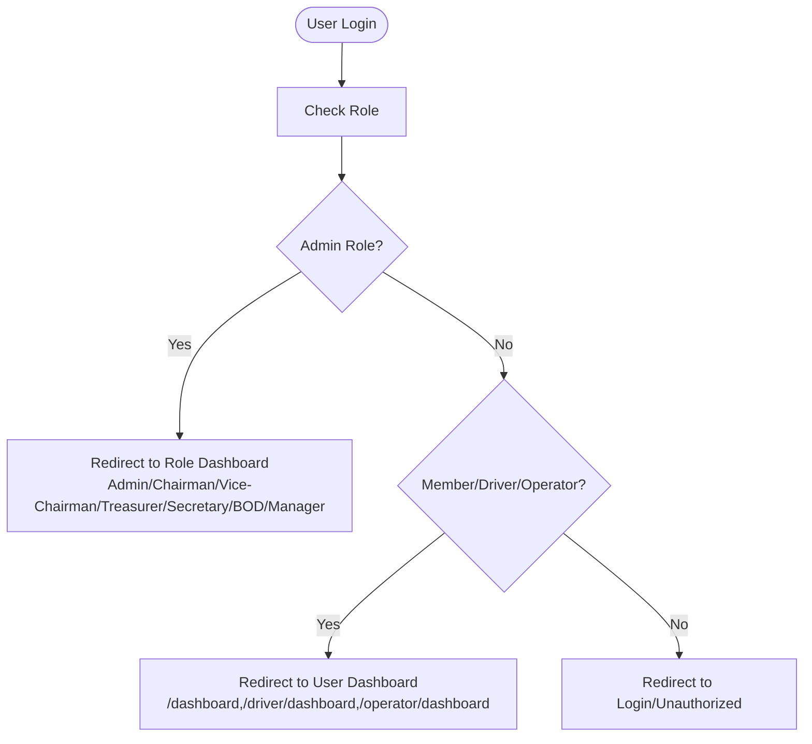
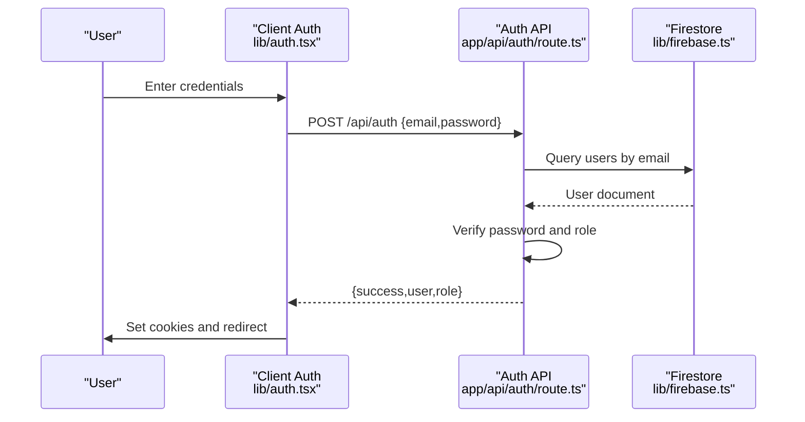
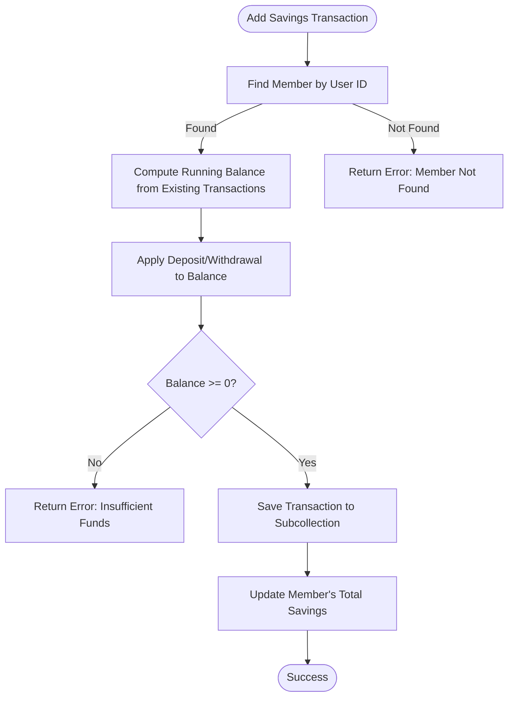
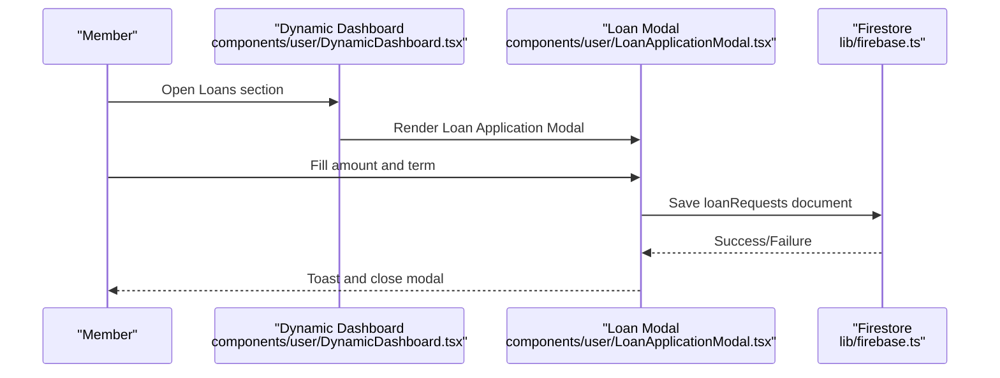
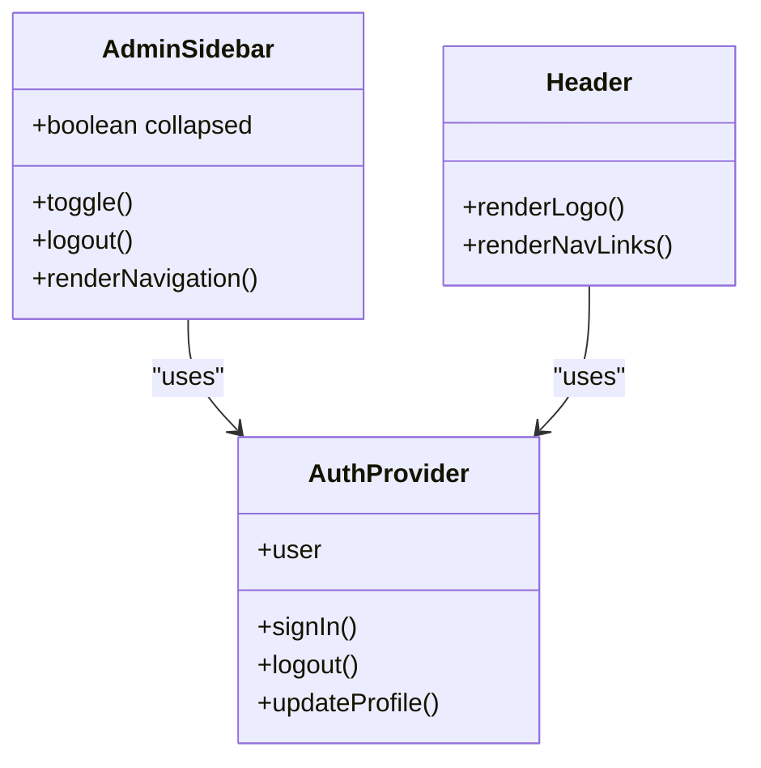
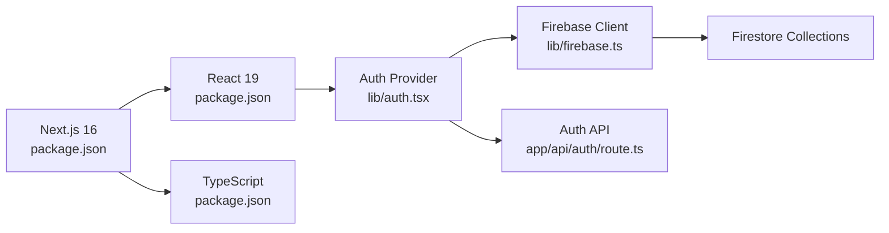

# Project Overview

<cite>
**Referenced Files in This Document**
- [README.md](file://README.md)
- [package.json](file://package.json)
- [middleware.ts](file://middleware.ts)
- [lib/firebase.ts](file://lib/firebase.ts)
- [lib/auth.tsx](file://lib/auth.tsx)
- [lib/validators.ts](file://lib/validators.ts)
- [ROLE_BASED_ACCESS_CONTROL.md](file://ROLE_BASED_ACCESS_CONTROL.md)
- [components/admin/Sidebar.tsx](file://components/admin/Sidebar.tsx)
- [components/shared/Header.tsx](file://components/shared/Header.tsx)
- [app/layout.tsx](file://app/layout.tsx)
- [app/api/auth/route.ts](file://app/api/auth/route.ts)
- [components/user/DynamicDashboard.tsx](file://components/user/DynamicDashboard.tsx)
- [components/user/LoanApplicationModal.tsx](file://components/user/LoanApplicationModal.tsx)
- [components/user/AddSavingsTransactionModal.tsx](file://components/user/AddSavingsTransactionModal.tsx)
- [lib/savingsService.ts](file://lib/savingsService.ts)
</cite>

## Table of Contents
1. [Introduction](#introduction)
2. [Project Structure](#project-structure)
3. [Core Components](#core-components)
4. [Architecture Overview](#architecture-overview)
5. [Detailed Component Analysis](#detailed-component-analysis)
6. [Dependency Analysis](#dependency-analysis)
7. [Performance Considerations](#performance-considerations)
8. [Troubleshooting Guide](#troubleshooting-guide)
9. [Conclusion](#conclusion)

## Introduction
SAMPA Cooperative Management System is a full-stack cooperative financial management platform designed to streamline operations for credit unions and cooperatives. The system centralizes member services around two primary financial pillars: member loans and savings accounts. It provides automated workflows, real-time data synchronization, comprehensive reporting capabilities, and robust role-based access control to serve diverse stakeholder roles including Admin, Chairman, Vice-Chairman, Treasurer, Secretary, Board of Directors, Manager, Driver, Operator, and Member.

The platform’s mission is to reduce administrative overhead, improve transparency, and enhance member engagement through intuitive dashboards, standardized procedures, and secure, scalable infrastructure.

## Project Structure
The project follows Next.js 16 App Router conventions with a clear separation of concerns:
- Frontend pages and layouts under app/
- Shared and role-specific UI components under components/
- Business logic and services under lib/
- Middleware-based route protection under middleware.ts
- Firebase client and admin utilities under lib/firebase.ts and lib/firebaseAdmin.ts
- API routes under app/api/ for server-side authentication and integrations

**Diagram sources**
- [app/layout.tsx](file://app/layout.tsx#L22-L36)
- [lib/auth.tsx](file://lib/auth.tsx#L158-L680)
- [components/shared/Header.tsx](file://components/shared/Header.tsx#L1-L26)
- [components/admin/Sidebar.tsx](file://components/admin/Sidebar.tsx#L1-L279)
- [components/user/DynamicDashboard.tsx](file://components/user/DynamicDashboard.tsx#L1-L149)
- [components/user/LoanApplicationModal.tsx](file://components/user/LoanApplicationModal.tsx#L1-L200)
- [components/user/AddSavingsTransactionModal.tsx](file://components/user/AddSavingsTransactionModal.tsx#L1-L221)
- [middleware.ts](file://middleware.ts#L1-L62)
- [lib/validators.ts](file://lib/validators.ts#L1-L236)
- [app/api/auth/route.ts](file://app/api/auth/route.ts#L1-L295)
- [lib/firebase.ts](file://lib/firebase.ts#L1-L309)
- [lib/savingsService.ts](file://lib/savingsService.ts#L1-L455)

**Section sources**
- [README.md](file://README.md#L1-L37)
- [package.json](file://package.json#L1-L53)
- [app/layout.tsx](file://app/layout.tsx#L1-L37)
- [middleware.ts](file://middleware.ts#L1-L62)

## Core Components
- Authentication and Authorization
  - Client-side Auth Provider manages session state, cookies, and role-aware routing.
  - Server-side Auth API validates credentials against Firestore, enforces role checks, and updates last login timestamps.
  - Middleware enforces route access based on user roles and prevents cross-role navigation.

- Firebase Integration
  - Centralized Firestore client with typed helpers for CRUD operations and queries.
  - Admin utilities enable server-side Firestore operations for secure validation and updates.

- Role-Based Access Control
  - Unified validator functions define allowed routes per role and enforce role-specific dashboards.
  - Role mapping supports Admin, Chairman, Vice-Chairman, Treasurer, Secretary, Board of Directors, Manager, Driver, Operator, and Member.

- User Experience
  - Shared Header and collapsible Admin Sidebar adapt to user roles.
  - Dynamic Dashboard aggregates reminders and events filtered by role and status.
  - Modals streamline common tasks: loan applications and savings transactions.

**Section sources**
- [lib/auth.tsx](file://lib/auth.tsx#L1-L682)
- [app/api/auth/route.ts](file://app/api/auth/route.ts#L1-L295)
- [middleware.ts](file://middleware.ts#L1-L62)
- [lib/validators.ts](file://lib/validators.ts#L1-L236)
- [ROLE_BASED_ACCESS_CONTROL.md](file://ROLE_BASED_ACCESS_CONTROL.md#L1-L89)
- [components/admin/Sidebar.tsx](file://components/admin/Sidebar.tsx#L1-L279)
- [components/shared/Header.tsx](file://components/shared/Header.tsx#L1-L26)
- [components/user/DynamicDashboard.tsx](file://components/user/DynamicDashboard.tsx#L1-L149)

## Architecture Overview
The system employs a layered architecture:
- Presentation Layer: Next.js App Router pages and components.
- Service Layer: React components and services encapsulate business logic (e.g., savings transactions).
- Data Access Layer: Firebase client and admin utilities provide secure Firestore operations.
- Security Layer: Middleware and validators enforce role-based routing; API routes validate credentials server-side.

**Diagram sources**
- [middleware.ts](file://middleware.ts#L1-L62)
- [lib/auth.tsx](file://lib/auth.tsx#L197-L348)
- [app/api/auth/route.ts](file://app/api/auth/route.ts#L48-L264)
- [lib/firebase.ts](file://lib/firebase.ts#L90-L182)

## Detailed Component Analysis

### Multi-Role Architecture
The system defines distinct dashboards and navigation paths for each role, ensuring appropriate access and reducing accidental cross-role navigation.

**Diagram sources**
- [lib/validators.ts](file://lib/validators.ts#L199-L235)
- [lib/auth.tsx](file://lib/auth.tsx#L112-L156)

**Section sources**
- [ROLE_BASED_ACCESS_CONTROL.md](file://ROLE_BASED_ACCESS_CONTROL.md#L9-L24)
- [lib/validators.ts](file://lib/validators.ts#L1-L236)
- [lib/auth.tsx](file://lib/auth.tsx#L112-L156)

### Authentication Flow
The authentication flow combines client-side state management with server-side validation for security and reliability.

**Diagram sources**
- [lib/auth.tsx](file://lib/auth.tsx#L197-L348)
- [app/api/auth/route.ts](file://app/api/auth/route.ts#L48-L264)
- [lib/firebase.ts](file://lib/firebase.ts#L115-L146)

**Section sources**
- [lib/auth.tsx](file://lib/auth.tsx#L197-L348)
- [app/api/auth/route.ts](file://app/api/auth/route.ts#L48-L264)

### Savings Transactions Service
The savings service encapsulates atomic updates to member savings, ensuring consistency between individual transactions and aggregated totals.

**Diagram sources**
- [lib/savingsService.ts](file://lib/savingsService.ts#L237-L342)

**Section sources**
- [lib/savingsService.ts](file://lib/savingsService.ts#L1-L455)

### Loan Application Workflow
Members can apply for loans using a guided modal that validates amounts against plan limits and persists requests to Firestore.

**Diagram sources**
- [components/user/DynamicDashboard.tsx](file://components/user/DynamicDashboard.tsx#L36-L149)
- [components/user/LoanApplicationModal.tsx](file://components/user/LoanApplicationModal.tsx#L33-L98)
- [lib/firebase.ts](file://lib/firebase.ts#L90-L113)

**Section sources**
- [components/user/LoanApplicationModal.tsx](file://components/user/LoanApplicationModal.tsx#L1-L200)
- [lib/firebase.ts](file://lib/firebase.ts#L90-L113)

### Administrative Dashboards and Sidebars
Admin and officer dashboards provide role-specific navigation and actions, with collapsible sidebars and logout controls.

**Diagram sources**
- [components/admin/Sidebar.tsx](file://components/admin/Sidebar.tsx#L92-L279)
- [components/shared/Header.tsx](file://components/shared/Header.tsx#L1-L26)
- [lib/auth.tsx](file://lib/auth.tsx#L158-L680)

**Section sources**
- [components/admin/Sidebar.tsx](file://components/admin/Sidebar.tsx#L1-L279)
- [components/shared/Header.tsx](file://components/shared/Header.tsx#L1-L26)
- [lib/auth.tsx](file://lib/auth.tsx#L158-L680)

## Dependency Analysis
The system’s dependencies emphasize a modern React stack with Firebase for persistence and Next.js for routing and SSR/SSG.

**Diagram sources**
- [package.json](file://package.json#L16-L40)
- [lib/auth.tsx](file://lib/auth.tsx#L1-L682)
- [lib/firebase.ts](file://lib/firebase.ts#L1-L309)
- [app/api/auth/route.ts](file://app/api/auth/route.ts#L1-L295)

**Section sources**
- [package.json](file://package.json#L1-L53)
- [lib/auth.tsx](file://lib/auth.tsx#L1-L682)
- [lib/firebase.ts](file://lib/firebase.ts#L1-L309)

## Performance Considerations
- Client hydration and cookie parsing are optimized to avoid unnecessary re-renders and to minimize blocking operations.
- Firestore operations leverage typed helpers and defensive checks to reduce runtime errors and retries.
- Middleware selectively validates routes and short-circuits for static assets and API routes to minimize overhead.
- Savings calculations compute balances incrementally and fall back to cached totals when available.

[No sources needed since this section provides general guidance]

## Troubleshooting Guide
Common issues and resolutions:
- Authentication failures
  - Verify request payload format and content-type for POST /api/auth.
  - Confirm user exists and has a valid role assigned; otherwise, redirect to login or unauthorized.
- Route access errors
  - Ensure cookies contain authenticated UID and userRole; middleware enforces role-specific paths.
  - Use test scripts to validate role-based routing behavior.
- Firebase connectivity
  - Confirm environment variables and client initialization; use connection test helpers.
  - Review Firestore indexes and rules for query performance and access.

**Section sources**
- [app/api/auth/route.ts](file://app/api/auth/route.ts#L48-L264)
- [middleware.ts](file://middleware.ts#L1-L62)
- [lib/firebase.ts](file://lib/firebase.ts#L62-L87)
- [ROLE_BASED_ACCESS_CONTROL.md](file://ROLE_BASED_ACCESS_CONTROL.md#L63-L89)

## Conclusion
SAMPA Cooperative Management System delivers a cohesive, secure, and scalable platform for cooperative financial operations. Its multi-role architecture, middleware-driven security, and modular services enable efficient loan and savings management while maintaining compliance and usability. The combination of Next.js App Router, TypeScript, and Firebase provides a robust foundation for future enhancements, including advanced reporting, audit trails, and expanded automation.