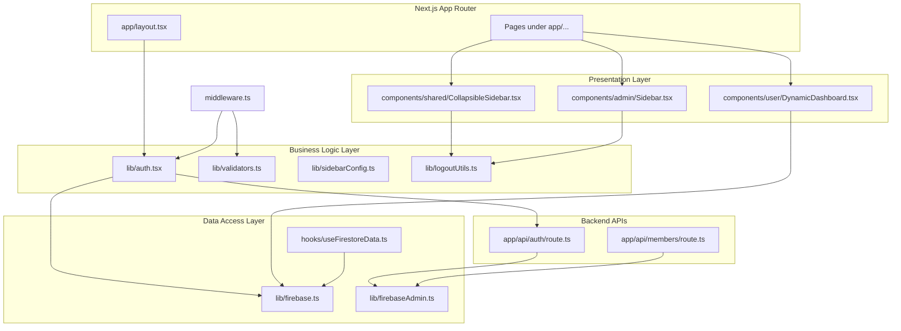
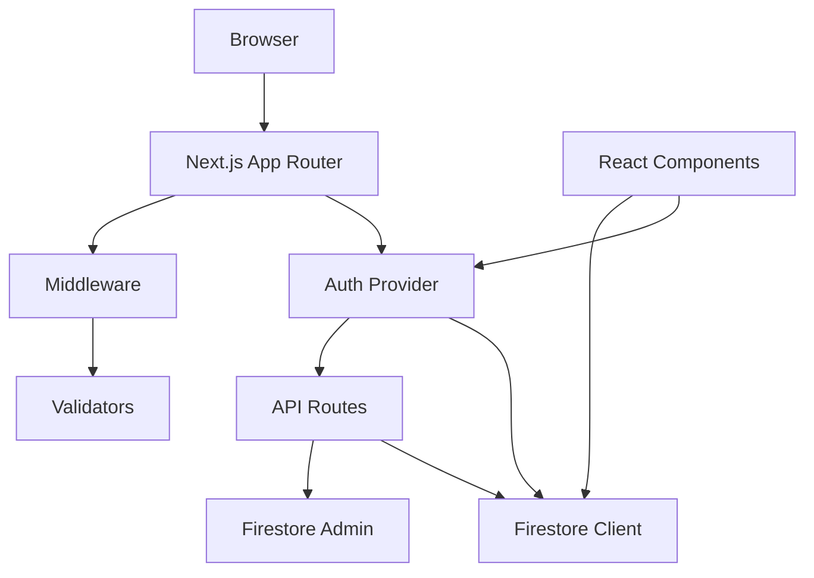
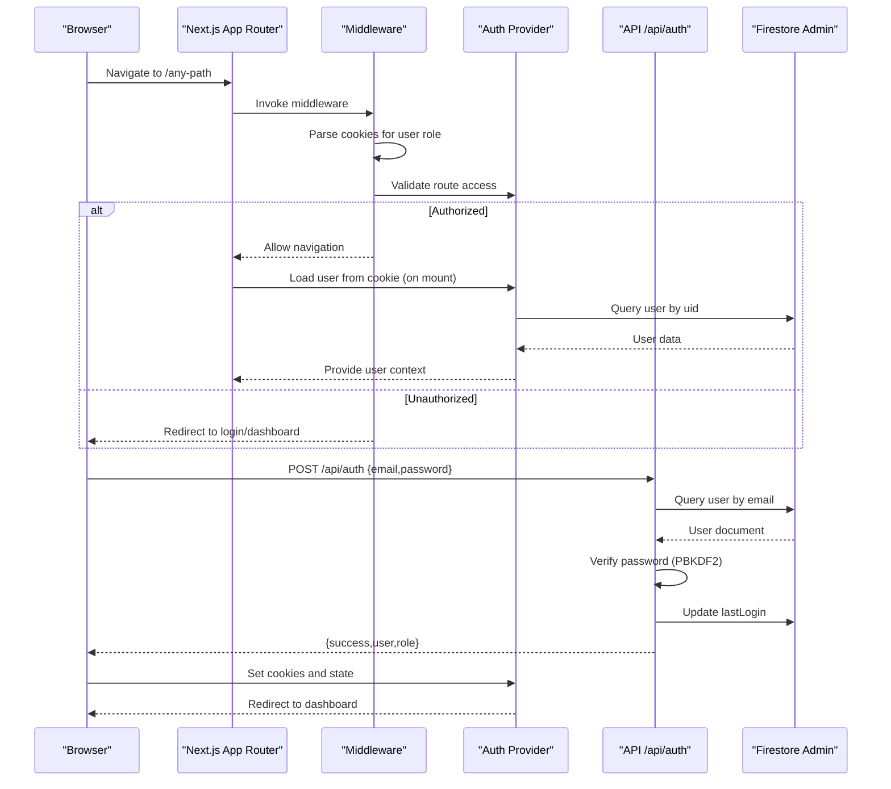
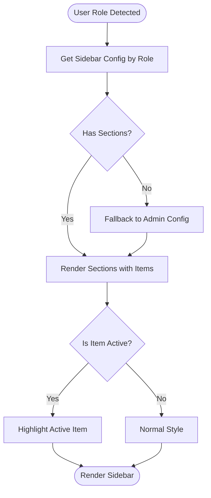
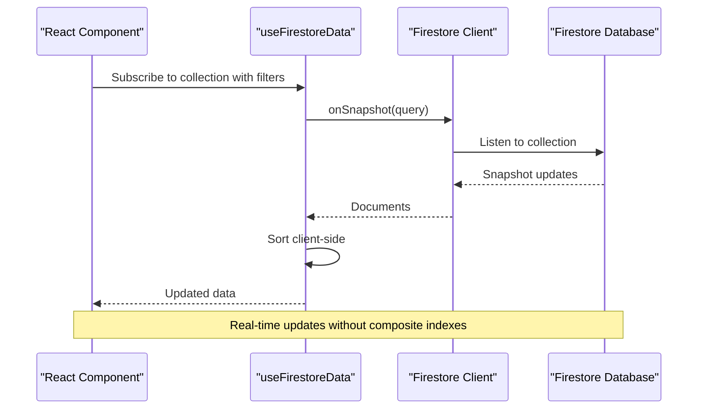
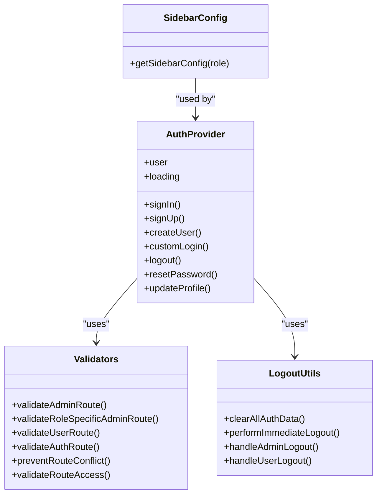
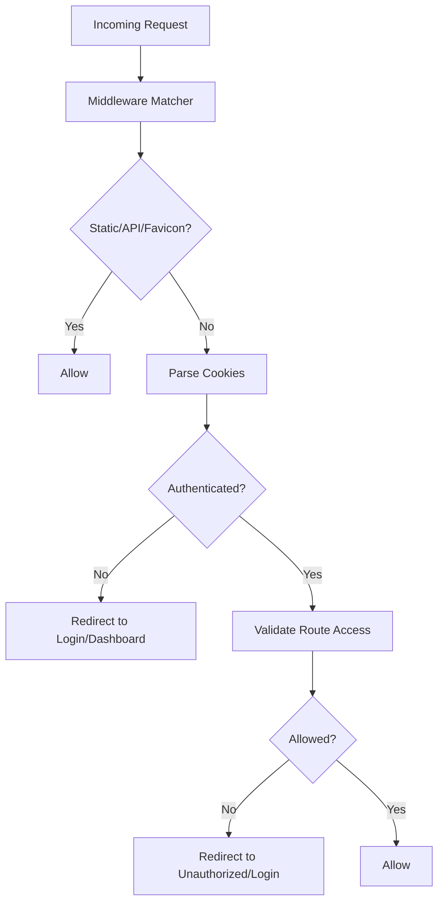
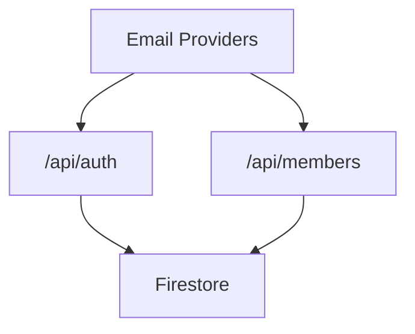
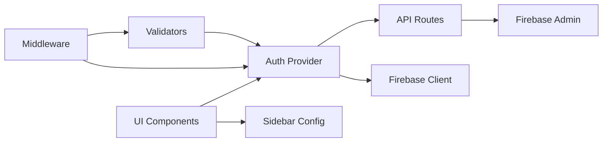
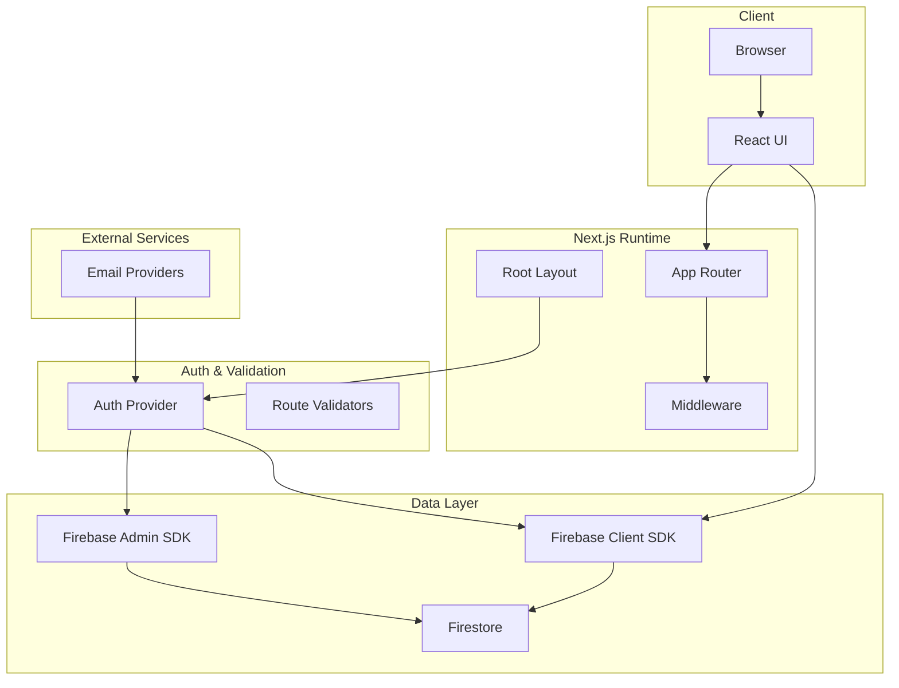

# System Architecture

<cite>
**Referenced Files in This Document**
- [middleware.ts](file://middleware.ts)
- [app/layout.tsx](file://app/layout.tsx)
- [lib/auth.tsx](file://lib/auth.tsx)
- [lib/validators.ts](file://lib/validators.ts)
- [lib/firebase.ts](file://lib/firebase.ts)
- [lib/firebaseAdmin.ts](file://lib/firebaseAdmin.ts)
- [lib/sidebarConfig.ts](file://lib/sidebarConfig.ts)
- [lib/logoutUtils.ts](file://lib/logoutUtils.ts)
- [components/shared/CollapsibleSidebar.tsx](file://components/shared/CollapsibleSidebar.tsx)
- [components/admin/Sidebar.tsx](file://components/admin/Sidebar.tsx)
- [components/user/DynamicDashboard.tsx](file://components/user/DynamicDashboard.tsx)
- [hooks/useFirestoreData.ts](file://hooks/useFirestoreData.ts)
- [app/api/auth/route.ts](file://app/api/auth/route.ts)
- [app/api/members/route.ts](file://app/api/members/route.ts)
- [firestore.rules](file://firestore.rules)
- [package.json](file://package.json)
</cite>

## Table of Contents
1. [Introduction](#introduction)
2. [Project Structure](#project-structure)
3. [Core Components](#core-components)
4. [Architecture Overview](#architecture-overview)
5. [Detailed Component Analysis](#detailed-component-analysis)
6. [Dependency Analysis](#dependency-analysis)
7. [Performance Considerations](#performance-considerations)
8. [Troubleshooting Guide](#troubleshooting-guide)
9. [Conclusion](#conclusion)
10. [Appendices](#appendices)

## Introduction
This document describes the architectural design of the SAMPA Cooperative Management System built with Next.js App Router. The system uses middleware-based routing and Firebase for backend services. The architecture follows a layered approach:
- Presentation Layer: React components organized under Next.js App Router pages and layouts
- Business Logic Layer: TypeScript services and utilities for authentication, validation, and data access
- Data Access Layer: Firebase client SDK for real-time UI updates and Firebase Admin SDK for server-side operations

Authentication relies on a custom login flow with cookies for session state, middleware-based route protection, and role-based access control. Navigation uses collapsible sidebars with role-specific configurations. Real-time data synchronization is achieved via Firestore listeners and serverless API routes.

## Project Structure
The project is organized around Next.js App Router conventions:
- app/: Page-based routes and nested layouts
- components/: Reusable UI components (shared, admin, user)
- hooks/: Custom React hooks for data fetching
- lib/: Shared libraries for Firebase, auth, validators, sidebar configuration, and utilities
- app/api/*: Serverless API routes for backend operations
- middleware.ts: Global middleware for route protection and redirects
- firestore.rules: Security rules for Firestore

**Diagram sources**
- [app/layout.tsx](file://app/layout.tsx#L22-L37)
- [lib/auth.tsx](file://lib/auth.tsx#L158-L680)
- [lib/validators.ts](file://lib/validators.ts#L199-L236)
- [lib/firebase.ts](file://lib/firebase.ts#L1-L309)
- [lib/firebaseAdmin.ts](file://lib/firebaseAdmin.ts#L1-L277)
- [components/shared/CollapsibleSidebar.tsx](file://components/shared/CollapsibleSidebar.tsx#L74-L156)
- [components/admin/Sidebar.tsx](file://components/admin/Sidebar.tsx#L92-L279)
- [components/user/DynamicDashboard.tsx](file://components/user/DynamicDashboard.tsx#L36-L149)
- [hooks/useFirestoreData.ts](file://hooks/useFirestoreData.ts#L19-L151)
- [app/api/auth/route.ts](file://app/api/auth/route.ts#L48-L264)
- [app/api/members/route.ts](file://app/api/members/route.ts#L26-L179)
- [middleware.ts](file://middleware.ts#L5-L56)

**Section sources**
- [app/layout.tsx](file://app/layout.tsx#L22-L37)
- [middleware.ts](file://middleware.ts#L5-L56)

## Core Components
- Middleware-based routing and protection: Validates access per role and redirects unauthorized users to appropriate dashboards or login pages.
- Authentication provider: Manages session state via cookies, exposes login/signup/update/logout functions, and centralizes logout behavior.
- Validators: Enforce role-specific route access and prevent cross-role dashboard access.
- Firebase integrations: Client SDK for real-time UI updates and Admin SDK for server-side operations.
- Sidebar configuration: Role-based navigation with collapsible sections and icons.
- Custom hooks: Firestore data fetching with client-side sorting and real-time listeners.
- API routes: Login, members, and other serverless endpoints.

**Section sources**
- [middleware.ts](file://middleware.ts#L5-L56)
- [lib/auth.tsx](file://lib/auth.tsx#L158-L680)
- [lib/validators.ts](file://lib/validators.ts#L199-L236)
- [lib/firebase.ts](file://lib/firebase.ts#L90-L307)
- [lib/firebaseAdmin.ts](file://lib/firebaseAdmin.ts#L111-L266)
- [lib/sidebarConfig.ts](file://lib/sidebarConfig.ts#L259-L262)
- [hooks/useFirestoreData.ts](file://hooks/useFirestoreData.ts#L19-L151)
- [app/api/auth/route.ts](file://app/api/auth/route.ts#L48-L264)
- [app/api/members/route.ts](file://app/api/members/route.ts#L26-L179)

## Architecture Overview
The system uses a layered architecture:
- Presentation Layer: React components and layouts under Next.js App Router
- Business Logic Layer: Auth provider, validators, and utilities
- Data Access Layer: Firebase client SDK and Admin SDK
- Backend APIs: Serverless routes for authentication and administrative operations

**Diagram sources**
- [middleware.ts](file://middleware.ts#L5-L56)
- [lib/auth.tsx](file://lib/auth.tsx#L158-L680)
- [lib/validators.ts](file://lib/validators.ts#L199-L236)
- [lib/firebase.ts](file://lib/firebase.ts#L90-L307)
- [lib/firebaseAdmin.ts](file://lib/firebaseAdmin.ts#L111-L266)
- [app/api/auth/route.ts](file://app/api/auth/route.ts#L48-L264)

## Detailed Component Analysis

### Authentication Architecture
The authentication system combines:
- Client-side Auth Provider: Manages user state, login/logout, and profile updates
- Middleware: Reads cookies to determine user identity and role, enforces route access
- Validators: Validate access to admin/user routes and prevent dashboard conflicts
- API Route: Handles login, password verification, and user metadata retrieval
- Logout Utilities: Centralized logout with cookie/session cleanup and immediate redirect

**Diagram sources**
- [middleware.ts](file://middleware.ts#L5-L56)
- [lib/auth.tsx](file://lib/auth.tsx#L164-L195)
- [lib/validators.ts](file://lib/validators.ts#L199-L236)
- [app/api/auth/route.ts](file://app/api/auth/route.ts#L48-L264)
- [lib/firebaseAdmin.ts](file://lib/firebaseAdmin.ts#L150-L194)

**Section sources**
- [lib/auth.tsx](file://lib/auth.tsx#L158-L680)
- [middleware.ts](file://middleware.ts#L5-L56)
- [lib/validators.ts](file://lib/validators.ts#L199-L236)
- [app/api/auth/route.ts](file://app/api/auth/route.ts#L48-L264)
- [lib/logoutUtils.ts](file://lib/logoutUtils.ts#L16-L93)

### Navigation Architecture
Navigation uses collapsible sidebars with role-specific configurations:
- Shared Sidebar (user): Fixed set of links for general user tasks
- Admin Sidebar: Role-based sections and items, with collapsible dropdowns
- Sidebar Config: Centralized mapping of roles to navigation sections and items

**Diagram sources**
- [lib/sidebarConfig.ts](file://lib/sidebarConfig.ts#L259-L262)
- [components/shared/CollapsibleSidebar.tsx](file://components/shared/CollapsibleSidebar.tsx#L74-L156)
- [components/admin/Sidebar.tsx](file://components/admin/Sidebar.tsx#L92-L279)

**Section sources**
- [lib/sidebarConfig.ts](file://lib/sidebarConfig.ts#L259-L262)
- [components/shared/CollapsibleSidebar.tsx](file://components/shared/CollapsibleSidebar.tsx#L74-L156)
- [components/admin/Sidebar.tsx](file://components/admin/Sidebar.tsx#L92-L279)

### Data Flow Architecture
Real-time synchronization between Firestore and React components:
- Client hook: Subscribes to Firestore collections with filters and client-side sorting
- Dynamic Dashboard: Fetches reminders and events filtered by role and status
- API routes: Serve administrative data and user CRUD operations

**Diagram sources**
- [hooks/useFirestoreData.ts](file://hooks/useFirestoreData.ts#L19-L151)
- [lib/firebase.ts](file://lib/firebase.ts#L90-L307)
- [components/user/DynamicDashboard.tsx](file://components/user/DynamicDashboard.tsx#L48-L137)

**Section sources**
- [hooks/useFirestoreData.ts](file://hooks/useFirestoreData.ts#L19-L151)
- [lib/firebase.ts](file://lib/firebase.ts#L90-L307)
- [components/user/DynamicDashboard.tsx](file://components/user/DynamicDashboard.tsx#L48-L137)

### Component Composition Patterns
- Provider Pattern: Auth provider wraps the app to supply user context to all components
- Factory Pattern: Role-based dashboard path resolution and sidebar configuration selection
- Hook Composition: Custom hooks encapsulate Firestore subscription logic and data transformations

**Diagram sources**
- [lib/auth.tsx](file://lib/auth.tsx#L158-L680)
- [lib/validators.ts](file://lib/validators.ts#L9-L236)
- [lib/sidebarConfig.ts](file://lib/sidebarConfig.ts#L259-L262)
- [lib/logoutUtils.ts](file://lib/logoutUtils.ts#L16-L93)

**Section sources**
- [lib/auth.tsx](file://lib/auth.tsx#L158-L680)
- [lib/validators.ts](file://lib/validators.ts#L9-L236)
- [lib/sidebarConfig.ts](file://lib/sidebarConfig.ts#L259-L262)
- [lib/logoutUtils.ts](file://lib/logoutUtils.ts#L16-L93)

### Security Architecture
- Middleware-based route protection: Excludes static assets and API routes, validates cookies, and enforces role-based access
- Validators: Prevent cross-role access and enforce dashboard-specific restrictions
- Firebase Admin SDK: Server-side operations for login and user management
- Firestore rules: Current configuration allows read/write for all (placeholder); intended for development only
- Session management: Cookies store authenticated user identity and role; logout clears cookies and sessions

**Diagram sources**
- [middleware.ts](file://middleware.ts#L5-L56)
- [lib/validators.ts](file://lib/validators.ts#L199-L236)
- [lib/logoutUtils.ts](file://lib/logoutUtils.ts#L41-L85)
- [firestore.rules](file://firestore.rules#L15-L17)

**Section sources**
- [middleware.ts](file://middleware.ts#L5-L56)
- [lib/validators.ts](file://lib/validators.ts#L199-L236)
- [lib/firebaseAdmin.ts](file://lib/firebaseAdmin.ts#L111-L266)
- [firestore.rules](file://firestore.rules#L1-L19)
- [lib/logoutUtils.ts](file://lib/logoutUtils.ts#L16-L93)

### Integration Patterns
- Email services: Dependencies include email providers for notifications and communication
- External services: API routes integrate with Firestore for user and member data operations

**Diagram sources**
- [package.json](file://package.json#L17-L39)
- [app/api/auth/route.ts](file://app/api/auth/route.ts#L48-L264)
- [app/api/members/route.ts](file://app/api/members/route.ts#L26-L179)

**Section sources**
- [package.json](file://package.json#L16-L52)
- [app/api/auth/route.ts](file://app/api/auth/route.ts#L48-L264)
- [app/api/members/route.ts](file://app/api/members/route.ts#L26-L179)

## Dependency Analysis
The system exhibits clear separation of concerns:
- Presentation depends on Auth Provider and Sidebar configuration
- Auth Provider depends on Firebase client SDK and API routes
- Validators depend on Auth Provider and role utilities
- API routes depend on Firebase Admin SDK and Firestore
- Middleware orchestrates Auth Provider and Validators

**Diagram sources**
- [lib/auth.tsx](file://lib/auth.tsx#L158-L680)
- [lib/validators.ts](file://lib/validators.ts#L199-L236)
- [lib/firebase.ts](file://lib/firebase.ts#L90-L307)
- [lib/firebaseAdmin.ts](file://lib/firebaseAdmin.ts#L111-L266)
- [middleware.ts](file://middleware.ts#L5-L56)

**Section sources**
- [lib/auth.tsx](file://lib/auth.tsx#L158-L680)
- [lib/validators.ts](file://lib/validators.ts#L199-L236)
- [lib/firebase.ts](file://lib/firebase.ts#L90-L307)
- [lib/firebaseAdmin.ts](file://lib/firebaseAdmin.ts#L111-L266)
- [middleware.ts](file://middleware.ts#L5-L56)

## Performance Considerations
- Real-time listeners: useFirestoreData leverages onSnapshot for automatic updates; client-side sorting avoids composite indexes
- Middleware efficiency: Early-exit for static resources and API routes reduces unnecessary processing
- Cookie-based session: Lightweight session storage via cookies minimizes server load
- Admin SDK caching: Firebase Admin initializes once and reuses the Firestore instance
- Recommendations:
  - Add pagination for large collections
  - Optimize queries with server-side filtering
  - Implement debounced search and lazy loading for heavy lists
  - Monitor Firestore read/write units and adjust indexing strategy

[No sources needed since this section provides general guidance]

## Troubleshooting Guide
Common issues and resolutions:
- Firebase Admin initialization failures: Verify environment variables and service account credentials
- Firestore rules blocking access: Review and tighten rules; current development rules allow all
- Middleware redirect loops: Ensure cookies are set correctly and validators return expected paths
- Logout inconsistencies: Use centralized logout utilities to clear cookies and sessions

**Section sources**
- [lib/firebaseAdmin.ts](file://lib/firebaseAdmin.ts#L13-L108)
- [firestore.rules](file://firestore.rules#L1-L19)
- [lib/logoutUtils.ts](file://lib/logoutUtils.ts#L16-L93)

## Conclusion
The SAMPA Cooperative Management System employs a clean, layered architecture leveraging Next.js App Router, middleware-based routing, and Firebase for both client-side real-time updates and server-side operations. The authentication provider, validators, and role-based navigation components work together to deliver a secure, scalable, and maintainable platform. While the current Firestore rules are permissive for development, they should be hardened before production deployment.

[No sources needed since this section summarizes without analyzing specific files]

## Appendices

### System Context Diagram
High-level view of internal components and external integrations.

**Diagram sources**
- [app/layout.tsx](file://app/layout.tsx#L22-L37)
- [middleware.ts](file://middleware.ts#L5-L56)
- [lib/auth.tsx](file://lib/auth.tsx#L158-L680)
- [lib/validators.ts](file://lib/validators.ts#L199-L236)
- [lib/firebase.ts](file://lib/firebase.ts#L90-L307)
- [lib/firebaseAdmin.ts](file://lib/firebaseAdmin.ts#L111-L266)
- [package.json](file://package.json#L17-L39)