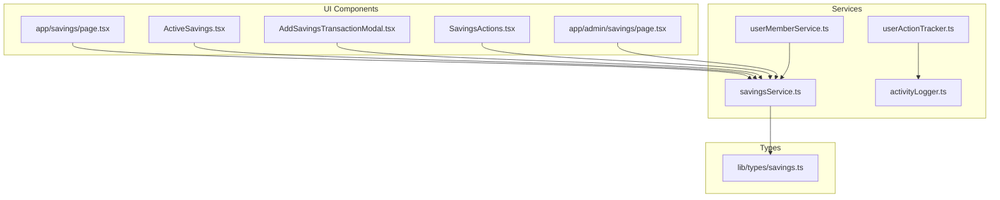
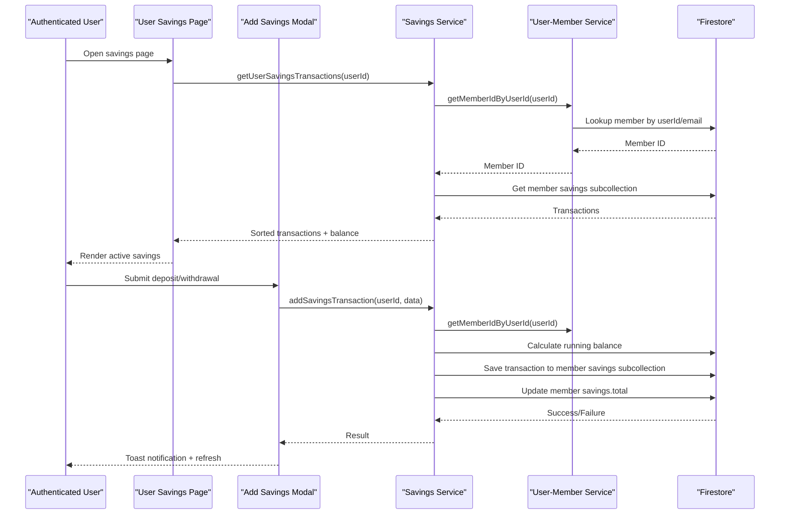
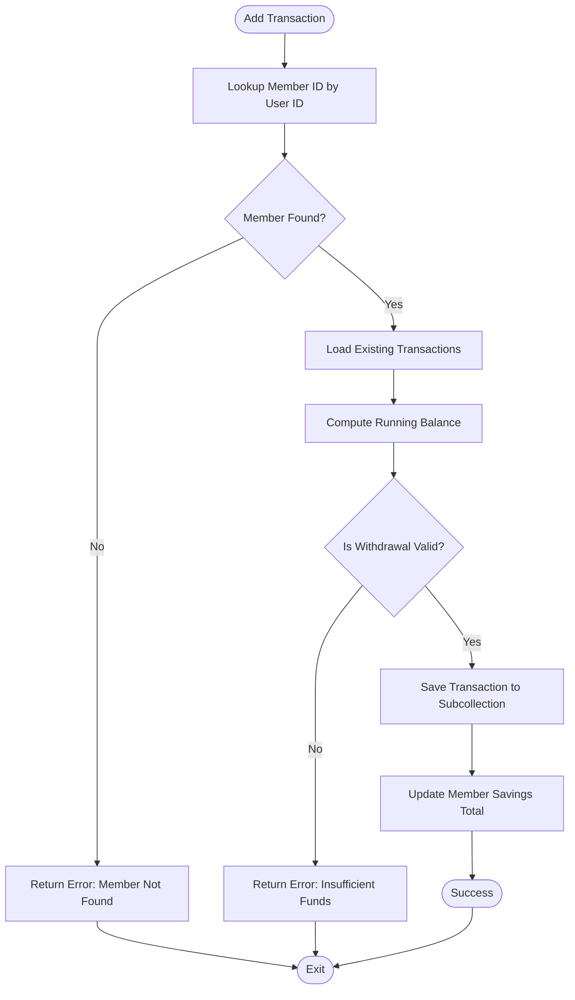
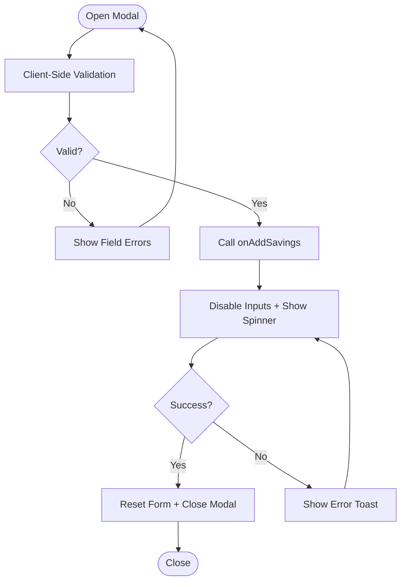
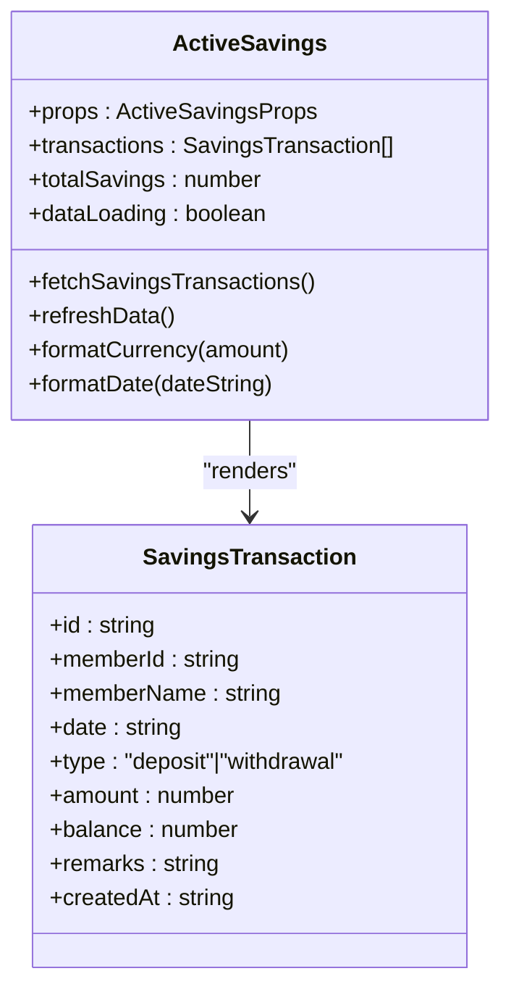
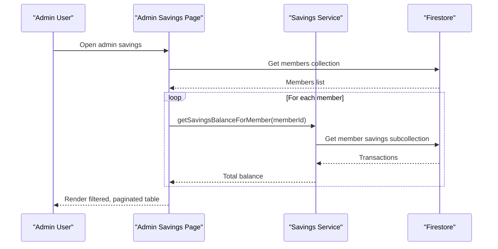
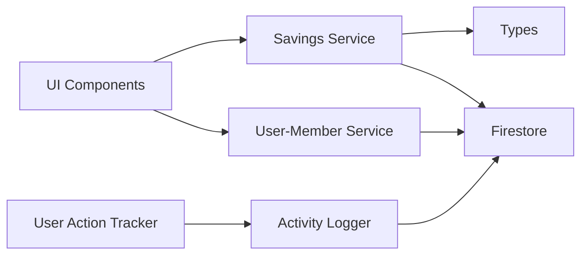

# Savings Account Management

<cite>
**Referenced Files in This Document**
- [savingsService.ts](file://lib/savingsService.ts)
- [userMemberService.ts](file://lib/userMemberService.ts)
- [ActiveSavings.tsx](file://components/user/ActiveSavings.tsx)
- [AddSavingsTransactionModal.tsx](file://components/user/AddSavingsTransactionModal.tsx)
- [SavingsActions.tsx](file://components/user/actions/SavingsActions.tsx)
- [savings/page.tsx](file://app/savings/page.tsx)
- [admin/savings/page.tsx](file://app/admin/savings/page.tsx)
- [savings/types.ts](file://lib/types/savings.ts)
- [activityLogger.ts](file://lib/activityLogger.ts)
- [userActionTracker.ts](file://lib/userActionTracker.ts)
</cite>

## Table of Contents
1. [Introduction](#introduction)
2. [Project Structure](#project-structure)
3. [Core Components](#core-components)
4. [Architecture Overview](#architecture-overview)
5. [Detailed Component Analysis](#detailed-component-analysis)
6. [Dependency Analysis](#dependency-analysis)
7. [Performance Considerations](#performance-considerations)
8. [Troubleshooting Guide](#troubleshooting-guide)
9. [Conclusion](#conclusion)

## Introduction
This document describes the Savings Account Management system within the SAMPA Cooperative Platform. It covers account creation and member linking, transaction modal interfaces for deposits and withdrawals, active savings display, atomic transaction processing, member-to-user linking logic, error handling, security measures, audit trails, and reconciliation procedures.

## Project Structure
The savings system spans three primary layers:
- Services: Business logic for savings operations and user-member linking
- UI Components: User-facing screens for viewing and managing savings
- Types: Shared data contracts for transactions and savings records



**Diagram sources**
- [savingsService.ts](file://lib/savingsService.ts#L1-L455)
- [userMemberService.ts](file://lib/userMemberService.ts#L1-L287)
- [ActiveSavings.tsx](file://components/user/ActiveSavings.tsx#L1-L270)
- [AddSavingsTransactionModal.tsx](file://components/user/AddSavingsTransactionModal.tsx#L1-L221)
- [SavingsActions.tsx](file://components/user/actions/SavingsActions.tsx#L1-L237)
- [savings/page.tsx](file://app/savings/page.tsx#L1-L382)
- [admin/savings/page.tsx](file://app/admin/savings/page.tsx#L1-L652)
- [savings/types.ts](file://lib/types/savings.ts#L1-L20)
- [activityLogger.ts](file://lib/activityLogger.ts#L1-L165)
- [userActionTracker.ts](file://lib/userActionTracker.ts#L1-L118)

**Section sources**
- [savingsService.ts](file://lib/savingsService.ts#L1-L455)
- [userMemberService.ts](file://lib/userMemberService.ts#L1-L287)
- [ActiveSavings.tsx](file://components/user/ActiveSavings.tsx#L1-L270)
- [AddSavingsTransactionModal.tsx](file://components/user/AddSavingsTransactionModal.tsx#L1-L221)
- [SavingsActions.tsx](file://components/user/actions/SavingsActions.tsx#L1-L237)
- [savings/page.tsx](file://app/savings/page.tsx#L1-L382)
- [admin/savings/page.tsx](file://app/admin/savings/page.tsx#L1-L652)
- [savings/types.ts](file://lib/types/savings.ts#L1-L20)
- [activityLogger.ts](file://lib/activityLogger.ts#L1-L165)
- [userActionTracker.ts](file://lib/userActionTracker.ts#L1-L118)

## Core Components
- Savings Service: Provides atomic transaction processing, balance calculations, and member lookup
- User-Member Service: Ensures consistent user and member records and validates/repairs links
- UI Components: Display active savings, manage transactions, and present admin views
- Types: Defines transaction and savings data contracts
- Audit Logging: Tracks user actions for compliance and reconciliation

Key responsibilities:
- Atomic transaction processing to prevent double-spending
- Member-to-user linkage via consistent IDs
- Form validation and user feedback
- Balance computation and caching
- Audit trail generation for all savings operations

**Section sources**
- [savingsService.ts](file://lib/savingsService.ts#L237-L342)
- [userMemberService.ts](file://lib/userMemberService.ts#L23-L92)
- [ActiveSavings.tsx](file://components/user/ActiveSavings.tsx#L16-L95)
- [AddSavingsTransactionModal.tsx](file://components/user/AddSavingsTransactionModal.tsx#L15-L98)
- [savings/types.ts](file://lib/types/savings.ts#L1-L20)
- [activityLogger.ts](file://lib/activityLogger.ts#L20-L43)

## Architecture Overview
The system follows a layered architecture:
- UI Layer: Next.js pages and React components
- Service Layer: TypeScript modules encapsulating business logic
- Data Layer: Firestore collections for users, members, savings, and activity logs



**Diagram sources**
- [savings/page.tsx](file://app/savings/page.tsx#L39-L160)
- [AddSavingsTransactionModal.tsx](file://components/user/AddSavingsTransactionModal.tsx#L68-L96)
- [savingsService.ts](file://lib/savingsService.ts#L237-L342)
- [userMemberService.ts](file://lib/userMemberService.ts#L21-L135)

## Detailed Component Analysis

### Savings Service
The savings service encapsulates atomic transaction processing and balance management:
- Member lookup by user ID with fallback strategies
- Running balance calculation from existing transactions
- Validation to prevent negative balances for withdrawals
- Dual-write pattern: transaction stored in member subcollection and aggregate updated in member document



**Diagram sources**
- [savingsService.ts](file://lib/savingsService.ts#L237-L342)

**Section sources**
- [savingsService.ts](file://lib/savingsService.ts#L21-L135)
- [savingsService.ts](file://lib/savingsService.ts#L237-L342)
- [savingsService.ts](file://lib/savingsService.ts#L347-L422)
- [savingsService.ts](file://lib/savingsService.ts#L427-L454)

### Member-to-User Linking Logic
The system ensures a single source of truth for user identification:
- Consistent user ID generation from email
- Parallel creation of user and member documents with identical IDs
- Automatic validation and healing of links on login
- Synchronization of updates across both collections

```mermaid
sequenceDiagram
participant Auth as "Firebase Auth"
participant Link as "User-Member Service"
participant Users as "users Collection"
participant Members as "members Collection"
Auth->>Link : validateAndHealUserMemberLink(userId)
Link->>Users : Get user document
Users-->>Link : User data
Link->>Members : Get member document
alt Member exists
Link->>Members : Validate userId/email
alt Link invalid
Link->>Members : Update userId/email
Members-->>Link : Success
end
else Member missing
Link->>Members : Create member with userId/email
Members-->>Link : Success
end
Link-->>Auth : Validated/Healed data
```

**Diagram sources**
- [userMemberService.ts](file://lib/userMemberService.ts#L99-L198)

**Section sources**
- [userMemberService.ts](file://lib/userMemberService.ts#L14-L16)
- [userMemberService.ts](file://lib/userMemberService.ts#L23-L92)
- [userMemberService.ts](file://lib/userMemberService.ts#L99-L198)
- [userMemberService.ts](file://lib/userMemberService.ts#L205-L221)
- [userMemberService.ts](file://lib/userMemberService.ts#L246-L287)

### Transaction Modal Interface
The modal provides a controlled form for deposits and withdrawals:
- Form validation for amount positivity and withdrawal limits
- Real-time balance display
- Error messaging and user feedback
- Controlled submission flow



**Diagram sources**
- [AddSavingsTransactionModal.tsx](file://components/user/AddSavingsTransactionModal.tsx#L26-L96)

**Section sources**
- [AddSavingsTransactionModal.tsx](file://components/user/AddSavingsTransactionModal.tsx#L15-L98)
- [AddSavingsTransactionModal.tsx](file://components/user/AddSavingsTransactionModal.tsx#L98-L221)

### Active Savings Display Component
The Active Savings component renders current account status and recent transactions:
- Fetches transactions and calculates balance
- Supports refresh and visibility-based re-fetching
- Formats currency and dates for Philippine locale
- Handles loading states and empty states



**Diagram sources**
- [ActiveSavings.tsx](file://components/user/ActiveSavings.tsx#L16-L95)
- [savings/types.ts](file://lib/types/savings.ts#L1-L11)

**Section sources**
- [ActiveSavings.tsx](file://components/user/ActiveSavings.tsx#L16-L95)
- [ActiveSavings.tsx](file://components/user/ActiveSavings.tsx#L97-L179)
- [ActiveSavings.tsx](file://components/user/ActiveSavings.tsx#L186-L269)
- [savings/types.ts](file://lib/types/savings.ts#L1-L11)

### Admin Savings Management
The admin view aggregates member savings with filtering and pagination:
- Loads members and computes total savings per member
- Supports global and column-specific filters
- Provides printable reports and navigation to member details



**Diagram sources**
- [admin/savings/page.tsx](file://app/admin/savings/page.tsx#L37-L159)
- [savingsService.ts](file://lib/savingsService.ts#L427-L454)

**Section sources**
- [admin/savings/page.tsx](file://app/admin/savings/page.tsx#L10-L652)

### Legacy Savings Actions (User Portal)
The legacy component provides direct deposit/withdrawal forms:
- Tabbed interface for deposit/withdrawal
- Basic validation and user feedback
- Direct Firestore writes to member savings subcollection

**Section sources**
- [SavingsActions.tsx](file://components/user/actions/SavingsActions.tsx#L13-L120)
- [SavingsActions.tsx](file://components/user/actions/SavingsActions.tsx#L130-L237)

## Dependency Analysis
The system exhibits clear separation of concerns:
- UI components depend on services for data operations
- Services depend on Firestore abstraction and types
- Audit logging is decoupled and optional
- User-member service acts as a bridge between authentication and membership



**Diagram sources**
- [savingsService.ts](file://lib/savingsService.ts#L1-L455)
- [userMemberService.ts](file://lib/userMemberService.ts#L1-L287)
- [activityLogger.ts](file://lib/activityLogger.ts#L1-L165)
- [userActionTracker.ts](file://lib/userActionTracker.ts#L1-L118)

**Section sources**
- [savingsService.ts](file://lib/savingsService.ts#L1-L455)
- [userMemberService.ts](file://lib/userMemberService.ts#L1-L287)
- [activityLogger.ts](file://lib/activityLogger.ts#L1-L165)
- [userActionTracker.ts](file://lib/userActionTracker.ts#L1-L118)

## Performance Considerations
- Balance calculation: The service recomputes balances from transactions; consider caching totals in member documents for large histories
- Queries: Admin page performs per-member balance queries; batch operations could reduce latency
- UI responsiveness: Modals disable inputs during processing to prevent concurrent submissions
- Pagination: Admin views paginate results to limit DOM and network overhead

## Troubleshooting Guide
Common issues and resolutions:
- Member not found for user: Verify user-member linkage and auto-healing logic
  - Check user ID generation and email normalization
  - Confirm userId field presence in member documents
- Insufficient funds on withdrawal: Validate client-side balance and server-side calculation
- Transaction save failures: Review Firestore write permissions and service error handling
- Audit logging failures: Ensure activityLogs collection exists and indexes are configured

Operational checks:
- Use admin savings page to verify computed totals
- Monitor toast notifications for immediate feedback
- Validate Firestore indexes for activity logs and member queries

**Section sources**
- [savingsService.ts](file://lib/savingsService.ts#L242-L255)
- [savingsService.ts](file://lib/savingsService.ts#L291-L294)
- [admin/savings/page.tsx](file://app/admin/savings/page.tsx#L128-L138)
- [activityLogger.ts](file://lib/activityLogger.ts#L20-L43)

## Conclusion
The Savings Account Management system integrates robust member-to-user linking, atomic transaction processing, and comprehensive UI components. It provides real-time balance displays, strict validation, and audit logging to support transparency and compliance. The modular architecture enables maintainability and future enhancements such as batch operations and advanced reporting.