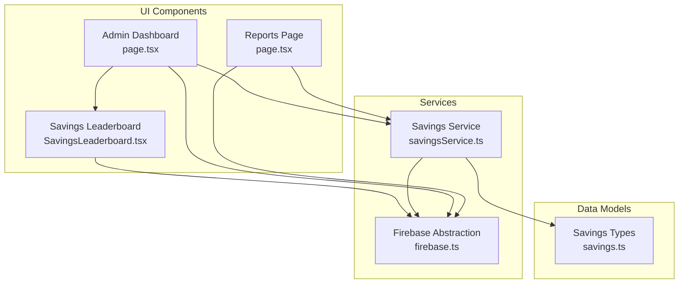
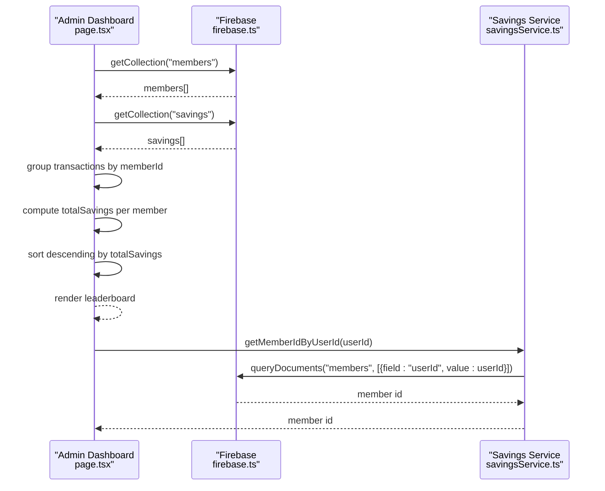
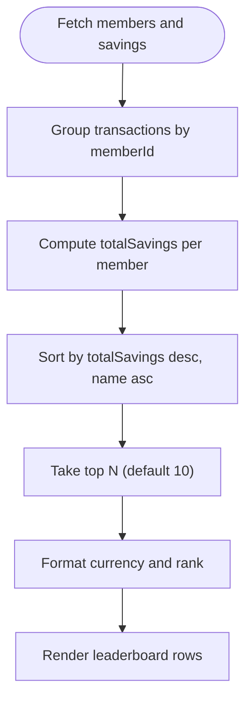
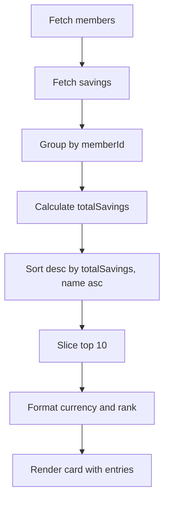
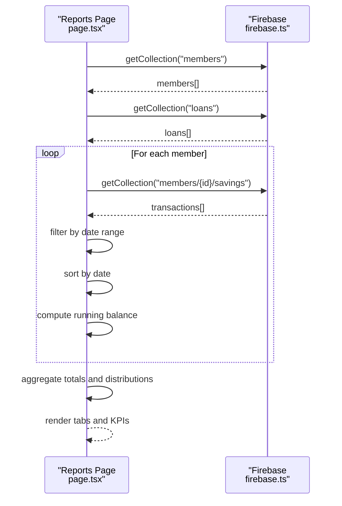
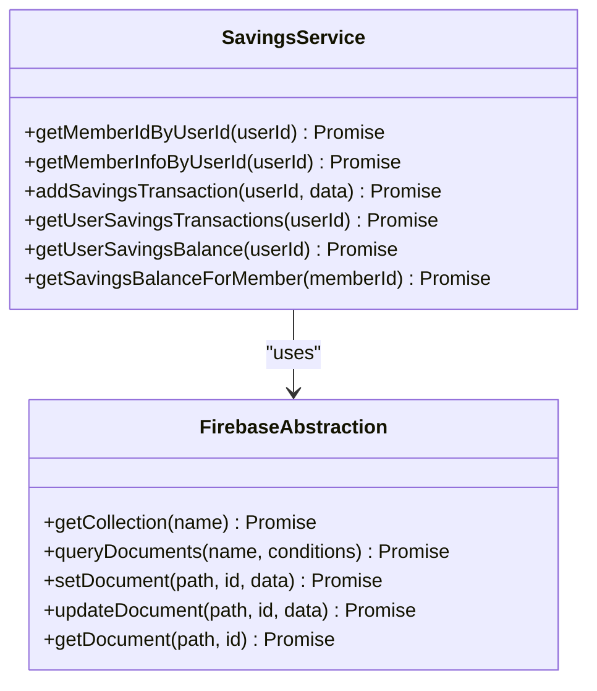
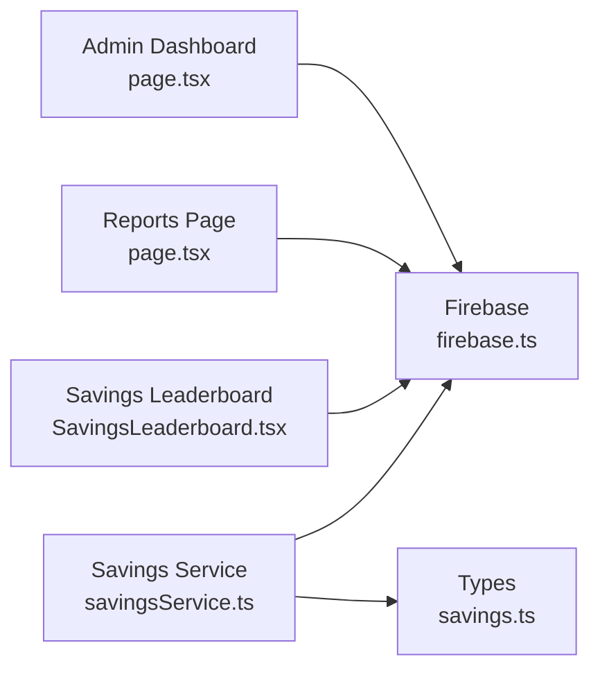

# Savings Leaderboard & Analytics

<cite>
**Referenced Files in This Document**
- [SavingsLeaderboard.tsx](file://components/admin/SavingsLeaderboard.tsx)
- [savingsService.ts](file://lib/savingsService.ts)
- [firebase.ts](file://lib/firebase.ts)
- [page.tsx](file://app/admin/dashboard/page.tsx)
- [page.tsx](file://app/admin/reports/page.tsx)
- [savings.ts](file://lib/types/savings.ts)
- [page.tsx](file://app/dashboard/page.tsx)
</cite>

## Table of Contents
1. [Introduction](#introduction)
2. [Project Structure](#project-structure)
3. [Core Components](#core-components)
4. [Architecture Overview](#architecture-overview)
5. [Detailed Component Analysis](#detailed-component-analysis)
6. [Dependency Analysis](#dependency-analysis)
7. [Performance Considerations](#performance-considerations)
8. [Troubleshooting Guide](#troubleshooting-guide)
9. [Conclusion](#conclusion)

## Introduction
This document explains the Savings Leaderboard and Analytics system, focusing on how member savings performance is calculated, ranked, and displayed. It covers the leaderboard ranking algorithm, real-time data processing, sorting criteria, display formatting by cooperative roles, and the analytics dashboard components that summarize cooperative financial health. It also documents data aggregation functions, filtering and sorting capabilities, visualization components, and export functionality for financial reporting.

## Project Structure
The Savings Leaderboard and Analytics system spans several components:
- Admin dashboard with integrated savings leaderboard and charts
- Reports page with comprehensive analytics and export functionality
- Savings service utilities for transaction processing and member lookups
- Firebase abstraction layer for Firestore operations
- Savings leaderboard component for lightweight displays

**Diagram sources**
- [page.tsx](file://app/admin/dashboard/page.tsx#L88-L799)
- [page.tsx](file://app/admin/reports/page.tsx#L29-L737)
- [SavingsLeaderboard.tsx](file://components/admin/SavingsLeaderboard.tsx#L32-L213)
- [savingsService.ts](file://lib/savingsService.ts#L1-L455)
- [firebase.ts](file://lib/firebase.ts#L89-L307)
- [savings.ts](file://lib/types/savings.ts#L1-L20)

**Section sources**
- [page.tsx](file://app/admin/dashboard/page.tsx#L1-L799)
- [page.tsx](file://app/admin/reports/page.tsx#L1-L737)
- [SavingsLeaderboard.tsx](file://components/admin/SavingsLeaderboard.tsx#L1-L213)
- [savingsService.ts](file://lib/savingsService.ts#L1-L455)
- [firebase.ts](file://lib/firebase.ts#L1-L309)
- [savings.ts](file://lib/types/savings.ts#L1-L20)

## Core Components
- Savings Leaderboard (Admin Dashboard): Aggregates savings transactions across collections, computes totals per member, sorts by total savings descending, and displays top performers with role-aware formatting.
- Savings Leaderboard (Standalone Component): Lightweight leaderboard that fetches members and savings data, computes totals, sorts, and formats currency.
- Reports Page: Comprehensive analytics with filters for date range and role, aggregations for members, savings, and loans, and printable export.
- Savings Service: Provides member lookup by user ID, atomic savings transaction processing, and balance calculation helpers.
- Firebase Abstraction: Centralized Firestore operations with robust error handling and validation.

**Section sources**
- [page.tsx](file://app/admin/dashboard/page.tsx#L68-L799)
- [SavingsLeaderboard.tsx](file://components/admin/SavingsLeaderboard.tsx#L20-L132)
- [page.tsx](file://app/admin/reports/page.tsx#L29-L231)
- [savingsService.ts](file://lib/savingsService.ts#L21-L454)
- [firebase.ts](file://lib/firebase.ts#L89-L307)

## Architecture Overview
The system retrieves data from Firestore collections, normalizes and aggregates savings transactions, and renders interactive dashboards and reports. Real-time updates occur when components re-run their data-fetching effects.

**Diagram sources**
- [page.tsx](file://app/admin/dashboard/page.tsx#L164-L525)
- [firebase.ts](file://lib/firebase.ts#L148-L182)
- [savingsService.ts](file://lib/savingsService.ts#L21-L135)

## Detailed Component Analysis

### Savings Leaderboard (Admin Dashboard)
- Data sources: members and savings collections
- Aggregation: sums deposits and subtracts withdrawals per member
- Sorting: total savings descending; name ascending for ties
- Display: top 10 with role-aware badges and currency formatting
- Filtering: time period filter (all/daily/monthly/yearly) applied to leaderboard subset

**Diagram sources**
- [page.tsx](file://app/admin/dashboard/page.tsx#L341-L502)

**Section sources**
- [page.tsx](file://app/admin/dashboard/page.tsx#L68-L799)

### Standalone Savings Leaderboard Component
- Data sources: members and savings collections
- Aggregation: sums deposits and subtracts withdrawals per member
- Sorting: total savings descending; name ascending for ties
- Display: top 10 with gradient styling for podium positions and currency formatting

**Diagram sources**
- [SavingsLeaderboard.tsx](file://components/admin/SavingsLeaderboard.tsx#L36-L123)

**Section sources**
- [SavingsLeaderboard.tsx](file://components/admin/SavingsLeaderboard.tsx#L1-L213)

### Reports Page Analytics
- Filters: date range (start/end) and role filter (all/member/driver/operator)
- Data processing:
  - Members: active/inactive counts and role distribution
  - Savings: per-member running balance computed from chronologically sorted transactions within date range
  - Loans: counts, amounts, and status distribution
- Rendering: KPI cards, tables, and placeholder charts
- Export: Print functionality generates a PDF-like HTML report

**Diagram sources**
- [page.tsx](file://app/admin/reports/page.tsx#L40-L231)
- [firebase.ts](file://lib/firebase.ts#L148-L182)

**Section sources**
- [page.tsx](file://app/admin/reports/page.tsx#L1-L737)

### Savings Service Utilities
- Member lookup by user ID with fallback strategies (userId field, email, decoded email, name)
- Atomic savings transaction creation with balance validation and member total update
- Balance retrieval from member document or transaction history

**Diagram sources**
- [savingsService.ts](file://lib/savingsService.ts#L21-L454)
- [firebase.ts](file://lib/firebase.ts#L89-L307)

**Section sources**
- [savingsService.ts](file://lib/savingsService.ts#L1-L455)
- [firebase.ts](file://lib/firebase.ts#L1-L309)

### Data Models
- SavingsTransaction: standardized transaction model with amount, type, and balance
- MemberSavings: aggregated savings summary for reporting

**Section sources**
- [savings.ts](file://lib/types/savings.ts#L1-L20)

## Dependency Analysis
The system exhibits clear separation of concerns:
- UI components depend on Firebase abstraction for data access
- Services encapsulate business logic and Firestore interactions
- Reports and dashboards share common data sources and processing patterns

**Diagram sources**
- [page.tsx](file://app/admin/dashboard/page.tsx#L88-L799)
- [page.tsx](file://app/admin/reports/page.tsx#L29-L737)
- [SavingsLeaderboard.tsx](file://components/admin/SavingsLeaderboard.tsx#L32-L213)
- [savingsService.ts](file://lib/savingsService.ts#L1-L455)
- [firebase.ts](file://lib/firebase.ts#L89-L307)
- [savings.ts](file://lib/types/savings.ts#L1-L20)

**Section sources**
- [page.tsx](file://app/admin/dashboard/page.tsx#L1-L799)
- [page.tsx](file://app/admin/reports/page.tsx#L1-L737)
- [SavingsLeaderboard.tsx](file://components/admin/SavingsLeaderboard.tsx#L1-L213)
- [savingsService.ts](file://lib/savingsService.ts#L1-L455)
- [firebase.ts](file://lib/firebase.ts#L1-L309)
- [savings.ts](file://lib/types/savings.ts#L1-L20)

## Performance Considerations
- Data fetching: Components fetch all members and savings data; consider pagination or indexed queries for large datasets.
- Sorting and aggregation: Client-side sorting and reductions are efficient for moderate sizes; consider server-side aggregation for very large collections.
- Currency formatting: Uses locale-aware formatting; ensure consistent locale configuration.
- Real-time updates: Current implementation recomputes on mount; consider caching and incremental updates for frequent refresh scenarios.

[No sources needed since this section provides general guidance]

## Troubleshooting Guide
Common issues and resolutions:
- Missing or invalid member ID during savings processing: The system logs warnings and skips invalid entries; verify member document fields (id, uid, email).
- Insufficient funds on withdrawal: Transaction validation prevents negative balances; ensure sufficient savings before withdrawal.
- Empty or partial savings data: Graceful fallbacks return zero balances or empty lists; confirm Firestore collections and security rules.
- Role-based display inconsistencies: Formatting depends on role fields; ensure consistent role values across documents.

**Section sources**
- [page.tsx](file://app/admin/dashboard/page.tsx#L341-L502)
- [savingsService.ts](file://lib/savingsService.ts#L292-L294)
- [firebase.ts](file://lib/firebase.ts#L174-L181)

## Conclusion
The Savings Leaderboard and Analytics system provides a robust foundation for cooperative financial oversight. It aggregates savings data, ranks members, and presents actionable insights through dashboards and reports. Extending the system with server-side aggregations, advanced filtering, and chart visualizations would further enhance scalability and user experience.