# Savings Management System

<cite>
**Referenced Files in This Document**
- [savingsService.ts](file://lib/savingsService.ts)
- [transactionReceiptService.ts](file://lib/transactionReceiptService.ts)
- [SavingsActions.tsx](file://components/user/actions/SavingsActions.tsx)
- [AddSavingsModal.tsx](file://components/admin/AddSavingsModal.tsx)
- [AddSavingsTransactionModal.tsx](file://components/user/AddSavingsTransactionModal.tsx)
- [ActiveSavings.tsx](file://components/user/ActiveSavings.tsx)
- [SavingsLeaderboard.tsx](file://components/admin/SavingsLeaderboard.tsx)
- [SavingsRecords.tsx](file://components/admin/SavingsRecords.tsx)
- [ReportsAndAnalytics.tsx](file://components/admin/ReportsAndAnalytics.tsx)
- [savings.ts](file://lib/types/savings.ts)
- [member.ts](file://lib/types/member.ts)
- [page.tsx](file://app/savings/page.tsx)
- [page.tsx](file://app/admin/savings/page.tsx)
- [page.tsx](file://app/admin/savings/member/[id]/page.tsx)
</cite>

## Update Summary
**Changes Made**
- Enhanced savings transaction processing with automatic email receipt functionality for deposit transactions, integrated with the new transaction receipt system for comprehensive member communication
- Added comprehensive transaction receipt system with EmailJS integration, receipt number generation, and email logging capabilities
- Updated savings service to automatically send email receipts for eligible transactions with robust error handling
- Integrated transaction receipt service with support for both savings deposits and loan payments
- Enhanced form validation and user experience with confirmation dialogs for critical operations
- Added email configuration management through Firestore systemConfig collection

## Table of Contents
1. [Introduction](#introduction)
2. [Project Structure](#project-structure)
3. [Core Components](#core-components)
4. [Architecture Overview](#architecture-overview)
5. [Detailed Component Analysis](#detailed-component-analysis)
6. [Enhanced Transaction Processing](#enhanced-transaction-processing)
7. [Transaction Receipt System](#transaction-receipt-system)
8. [Savings Records Management](#savings-records-management)
9. [Dependency Analysis](#dependency-analysis)
10. [Performance Considerations](#performance-considerations)
11. [Troubleshooting Guide](#troubleshooting-guide)
12. [Conclusion](#conclusion)

## Introduction
This document describes the Savings Management System within the SAMPA Cooperative Management Platform. It covers savings account creation and management, transaction processing (deposits, withdrawals), balance calculations, reporting capabilities, the savings leaderboard, integration with loan eligibility, payment history tracking, and administrative dashboards. The system now includes enhanced savings records management with comprehensive transaction tracking, automated savings credit calculations, sophisticated deposit control number generation for enhanced auditability, and an integrated transaction receipt system with automatic email notifications for member communication.

## Project Structure
The savings system spans client-side pages, reusable UI components, and backend-like services that encapsulate Firestore interactions. Key areas:
- Types define the data contracts for savings transactions and member savings summaries.
- Services provide centralized logic for member resolution, transaction persistence, balance computation, and email receipt generation.
- Pages orchestrate UI flows for users and administrators.
- Components encapsulate reusable UI for transactions, balances, and leaderboards.
- **New**: Transaction receipt service provides comprehensive email notification system with EmailJS integration.
- **New**: Enhanced savings service integrates automatic email receipt functionality for eligible transactions.
- **New**: SavingsRecords component provides comprehensive savings account management with detailed transaction tracking.
- **New**: Enhanced AddSavingsTransactionModal introduces deposit control number generation and confirmation modals.

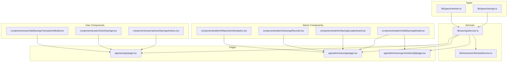

**Diagram sources**
- [savingsService.ts](file://lib/savingsService.ts#L1-L534)
- [transactionReceiptService.ts](file://lib/transactionReceiptService.ts#L1-L636)
- [SavingsActions.tsx](file://components/user/actions/SavingsActions.tsx#L1-L237)
- [AddSavingsModal.tsx](file://components/admin/AddSavingsModal.tsx#L1-L217)
- [AddSavingsTransactionModal.tsx](file://components/user/AddSavingsTransactionModal.tsx#L1-L371)
- [ActiveSavings.tsx](file://components/user/ActiveSavings.tsx#L1-L270)
- [SavingsLeaderboard.tsx](file://components/admin/SavingsLeaderboard.tsx#L1-L213)
- [SavingsRecords.tsx](file://components/admin/SavingsRecords.tsx#L1-L350)
- [ReportsAndAnalytics.tsx](file://components/admin/ReportsAndAnalytics.tsx#L1-L334)
- [savings.ts](file://lib/types/savings.ts#L1-L21)
- [member.ts](file://lib/types/member.ts#L1-L56)
- [page.tsx](file://app/savings/page.tsx#L1-L382)
- [page.tsx](file://app/admin/savings/page.tsx#L1-L652)
- [page.tsx](file://app/admin/savings/member/[id]/page.tsx#L1-L638)

**Section sources**
- [savingsService.ts](file://lib/savingsService.ts#L1-L534)
- [transactionReceiptService.ts](file://lib/transactionReceiptService.ts#L1-L636)
- [savings.ts](file://lib/types/savings.ts#L1-L21)
- [member.ts](file://lib/types/member.ts#L1-L56)
- [page.tsx](file://app/savings/page.tsx#L1-L382)
- [page.tsx](file://app/admin/savings/page.tsx#L1-L652)
- [page.tsx](file://app/admin/savings/member/[id]/page.tsx#L1-L638)

## Core Components
- Savings transaction model: Defines fields for transaction identification, member linkage, type, amount, running balance, remarks, and timestamps.
- Member savings summary: Aggregates member totals and metadata for reporting and leaderboards.
- Savings service: Centralizes member resolution, transaction persistence, balance calculation, and automatic email receipt generation.
- Transaction receipt service: Provides comprehensive email notification system with EmailJS integration, receipt number generation, and email logging capabilities.
- User transaction actions: Handles deposit and withdrawal submissions from the member portal.
- Admin transaction modal: Enables administrators to add deposits/withdrawals with validation against current balance.
- Active savings display: Renders recent transactions and current balance for members.
- Savings leaderboard: Computes and displays top savers across the cooperative.
- **New**: Enhanced AddSavingsTransactionModal: Advanced transaction processing with deposit control number generation, confirmation modals, and comprehensive form validation.
- **New**: SavingsRecords component: Comprehensive savings account management with detailed transaction tracking and automated savings credit calculations.
- **New**: ReportsAndAnalytics component: Financial analytics and reporting capabilities for administrative oversight.

**Section sources**
- [savings.ts](file://lib/types/savings.ts#L1-L21)
- [savingsService.ts](file://lib/savingsService.ts#L237-L342)
- [transactionReceiptService.ts](file://lib/transactionReceiptService.ts#L100-L130)
- [SavingsActions.tsx](file://components/user/actions/SavingsActions.tsx#L20-L120)
- [AddSavingsModal.tsx](file://components/admin/AddSavingsModal.tsx#L12-L92)
- [ActiveSavings.tsx](file://components/user/ActiveSavings.tsx#L16-L50)
- [SavingsLeaderboard.tsx](file://components/admin/SavingsLeaderboard.tsx#L32-L123)
- [AddSavingsTransactionModal.tsx](file://components/user/AddSavingsTransactionModal.tsx#L15-L150)
- [SavingsRecords.tsx](file://components/admin/SavingsRecords.tsx#L27-L127)
- [ReportsAndAnalytics.tsx](file://components/admin/ReportsAndAnalytics.tsx#L31-L165)

## Architecture Overview
The system follows a layered architecture with enhanced transaction receipt capabilities:
- Presentation layer: Next.js pages and React components for user and admin experiences.
- Service layer: TypeScript modules encapsulating Firestore interactions, business logic, and email notification services.
- Data layer: Firestore collections for members, member savings subcollections, aggregated member totals, and email logs.

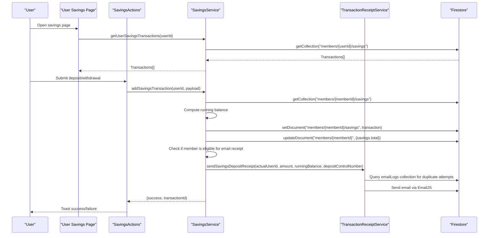

**Diagram sources**
- [page.tsx](file://app/savings/page.tsx#L30-L110)
- [SavingsActions.tsx](file://components/user/actions/SavingsActions.tsx#L20-L120)
- [savingsService.ts](file://lib/savingsService.ts#L237-L342)
- [transactionReceiptService.ts](file://lib/transactionReceiptService.ts#L408-L476)

## Detailed Component Analysis

### Savings Transaction Model and Member Savings Summary
- SavingsTransaction: Enforces strict typing for transaction attributes including identifiers, amounts, balances, and timestamps.
- MemberSavings: Provides a summarized view for reporting and leaderboards with member identity, role, total savings, status, and last updated timestamp.

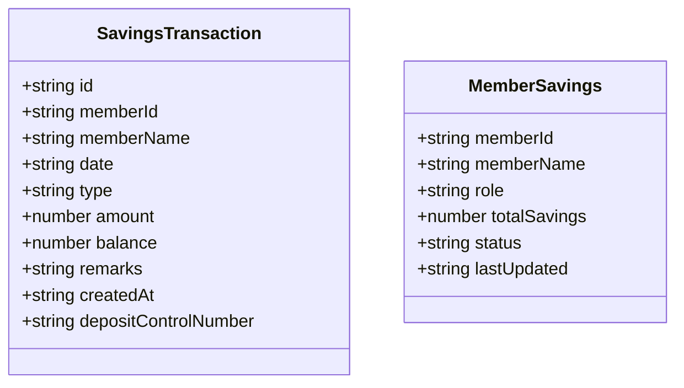

**Diagram sources**
- [savings.ts](file://lib/types/savings.ts#L1-L21)

**Section sources**
- [savings.ts](file://lib/types/savings.ts#L1-L21)

### Savings Service: Member Resolution, Transactions, Balances, and Email Receipts
Key responsibilities:
- Member resolution: Resolves user IDs to member IDs using multiple fallback strategies (direct lookup, email match, name match).
- Atomic transaction processing: Calculates running balance, validates withdrawals, persists transaction, and updates aggregate member savings.
- Balance retrieval: Returns cached aggregate savings when available; otherwise computes from transactions.
- **Updated**: Automatic email receipt generation: Sends email notifications for eligible savings deposits with comprehensive error handling and logging.

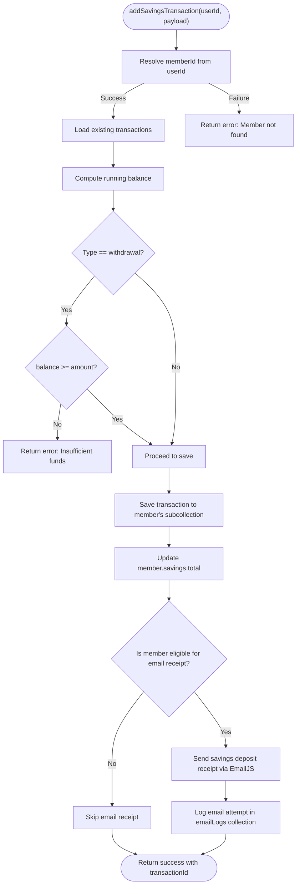

**Diagram sources**
- [savingsService.ts](file://lib/savingsService.ts#L237-L342)
- [transactionReceiptService.ts](file://lib/transactionReceiptService.ts#L408-L476)

**Section sources**
- [savingsService.ts](file://lib/savingsService.ts#L21-L135)
- [savingsService.ts](file://lib/savingsService.ts#L237-L342)
- [savingsService.ts](file://lib/savingsService.ts#L347-L422)
- [savingsService.ts](file://lib/savingsService.ts#L427-L489)

### Transaction Receipt Service: Email Notification System
**New** - The transaction receipt service provides comprehensive email notification capabilities with EmailJS integration, receipt number generation, and email logging.

Key features:
- **EmailJS Integration**: Supports both Firestore-based configuration and environment variable fallback for EmailJS settings.
- **Receipt Number Generation**: Creates unique receipt numbers in the format `SMP-YYYYMMDD-XXXX` for all transactions.
- **Email Logging**: Maintains email logs in the `emailLogs` collection to prevent duplicate email attempts.
- **User Details Resolution**: Retrieves recipient information from both users and members collections with comprehensive fallback strategies.
- **Transaction Type Support**: Handles both savings deposits and loan payments with appropriate email templates.
- **Error Handling**: Robust error handling with detailed logging and graceful degradation when email services are unavailable.

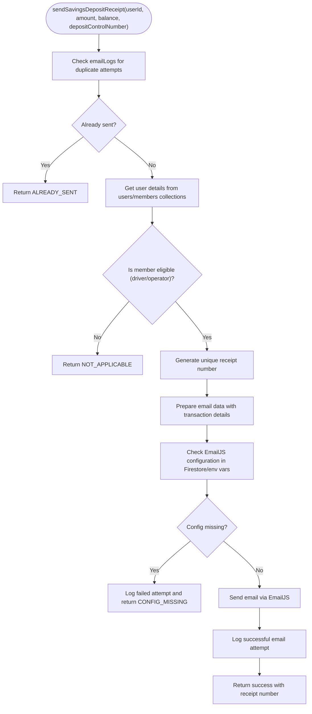

**Diagram sources**
- [transactionReceiptService.ts](file://lib/transactionReceiptService.ts#L408-L476)
- [transactionReceiptService.ts](file://lib/transactionReceiptService.ts#L132-L153)

**Section sources**
- [transactionReceiptService.ts](file://lib/transactionReceiptService.ts#L1-L636)

### User Transaction Actions: Deposits and Withdrawals
- Deposit flow: Validates amount, constructs transaction payload, writes to Firestore under the member's subcollection, and triggers automatic email receipt for eligible members.
- Withdrawal flow: Validates amount against current balance, constructs transaction payload, writes to Firestore.

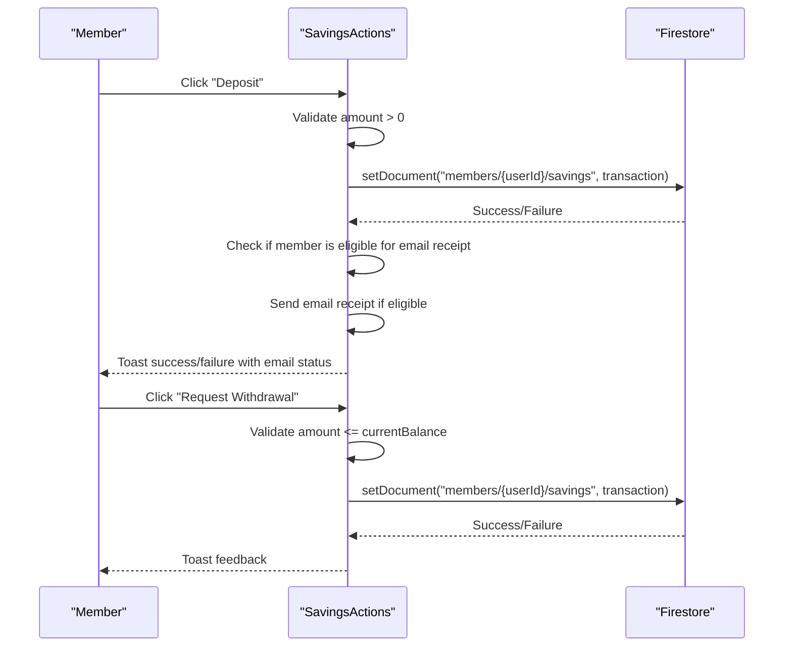

**Diagram sources**
- [SavingsActions.tsx](file://components/user/actions/SavingsActions.tsx#L20-L120)
- [savingsService.ts](file://lib/savingsService.ts#L370-L412)

**Section sources**
- [SavingsActions.tsx](file://components/user/actions/SavingsActions.tsx#L13-L120)

### Admin Transaction Modal: Controlled Additions
- Validates amount positivity and withdrawal limits against current balance.
- Submits transaction via the savings service, refreshing UI upon success.
- **Updated**: Automatically sends email receipts for eligible members when administrators add transactions.

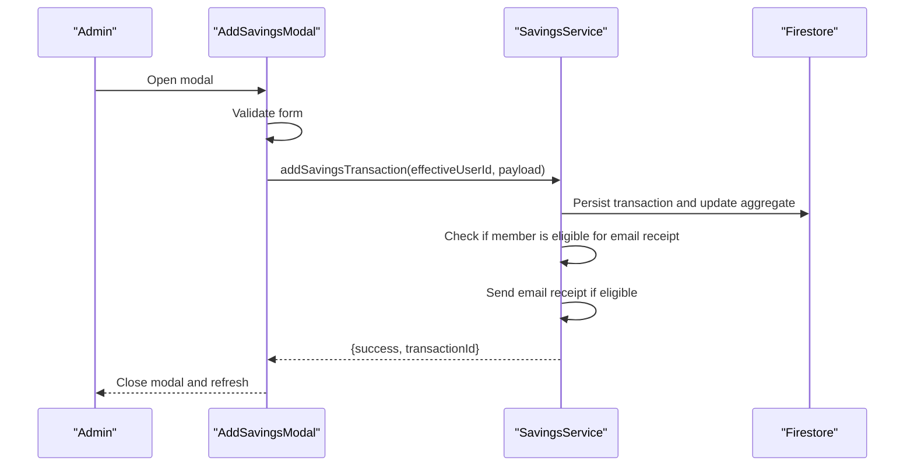

**Diagram sources**
- [AddSavingsModal.tsx](file://components/admin/AddSavingsModal.tsx#L12-L92)
- [page.tsx](file://app/admin/savings/member/[id]/page.tsx#L106-L147)
- [savingsService.ts](file://lib/savingsService.ts#L370-L412)

**Section sources**
- [AddSavingsModal.tsx](file://components/admin/AddSavingsModal.tsx#L12-L92)
- [page.tsx](file://app/admin/savings/member/[id]/page.tsx#L106-L147)

### Active Savings Display: Recent Transactions and Balance
- Fetches transactions and sorts by date (newest first).
- Computes and displays current balance, recent transactions, and provides refresh capability.

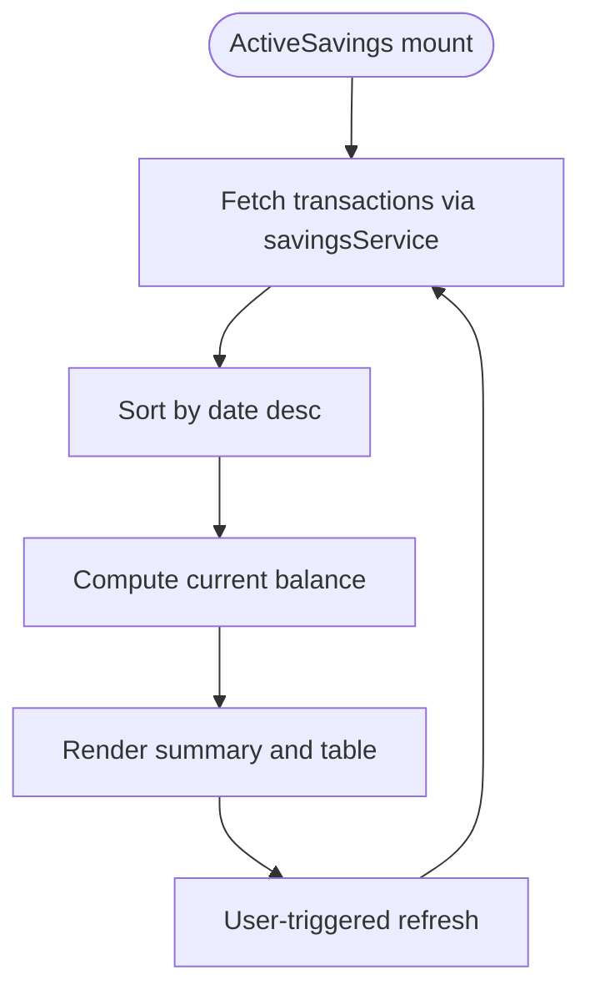

**Diagram sources**
- [ActiveSavings.tsx](file://components/user/ActiveSavings.tsx#L22-L50)

**Section sources**
- [ActiveSavings.tsx](file://components/user/ActiveSavings.tsx#L16-L95)

### Savings Leaderboard: Rankings and Motivational Insights
- Gathers all members and calculates total savings per member by aggregating transactions.
- Ranks top 10 members and renders with visual indicators for top 3 positions.

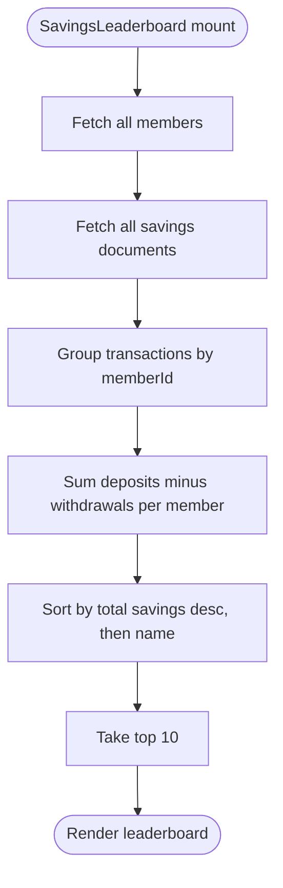

**Diagram sources**
- [SavingsLeaderboard.tsx](file://components/admin/SavingsLeaderboard.tsx#L36-L123)

**Section sources**
- [SavingsLeaderboard.tsx](file://components/admin/SavingsLeaderboard.tsx#L32-L123)

## Enhanced Transaction Processing

### AddSavingsTransactionModal: Advanced Transaction Processing
**Updated** - The AddSavingsTransactionModal now provides enhanced transaction processing with comprehensive validation, deposit control number generation, confirmation modals, and automatic email receipt functionality.

Key enhancements:
- **Deposit Control Number Generation**: Automatically generates unique deposit control numbers in the format `DC-{timestamp}-{random_chars}` for all deposit transactions.
- **Confirmation Modals**: Implements two-step confirmation process for critical operations, especially deposits, to prevent accidental transactions.
- **Enhanced Form Validation**: Comprehensive validation including amount positivity checks, withdrawal limit validation against current balance, and date validation.
- **Real-time Balance Display**: Shows current account balance to help users make informed decisions.
- **Loading States**: Provides visual feedback during transaction processing with spinner animations.
- **Error Handling**: Displays specific error messages for validation failures and provides user guidance.
- **Email Receipt Status**: Shows email receipt status for eligible members after successful transactions.

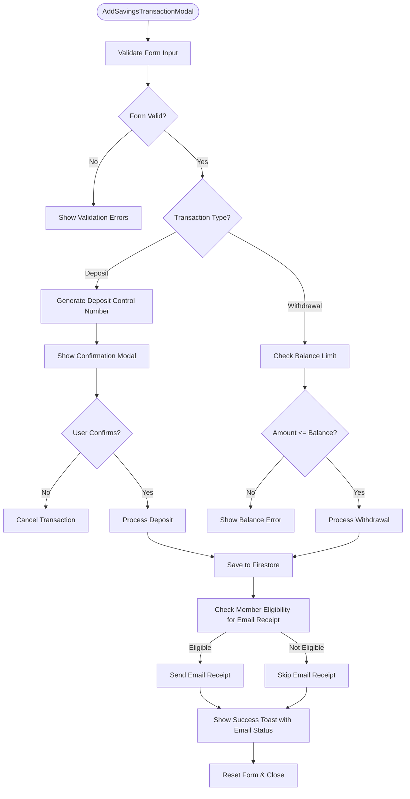

**Diagram sources**
- [AddSavingsTransactionModal.tsx](file://components/user/AddSavingsTransactionModal.tsx#L29-L150)
- [savingsService.ts](file://lib/savingsService.ts#L370-L412)

**Section sources**
- [AddSavingsTransactionModal.tsx](file://components/user/AddSavingsTransactionModal.tsx#L15-L371)

## Transaction Receipt System

### Transaction Receipt Service: Comprehensive Email Notification
**New** - The transaction receipt service provides a comprehensive email notification system with EmailJS integration, receipt number generation, and email logging capabilities.

Key features:
- **EmailJS Configuration Management**: Supports configuration from Firestore (`systemConfig/emailjs`) with fallback to environment variables for development and production environments.
- **Unique Receipt Number Generation**: Creates sequential receipt numbers in the format `SMP-YYYYMMDD-XXXX` for all transactions.
- **Duplicate Prevention**: Uses the `emailLogs` collection to prevent duplicate email attempts for the same transaction.
- **Comprehensive User Resolution**: Retrieves recipient information from both `users` and `members` collections with multiple fallback strategies.
- **Transaction Type Support**: Handles both savings deposits and loan payments with appropriate email templates and data structures.
- **Robust Error Handling**: Provides detailed error logging and graceful degradation when email services are unavailable.
- **Email Logging**: Maintains comprehensive logs in the `emailLogs` collection for auditing and troubleshooting purposes.

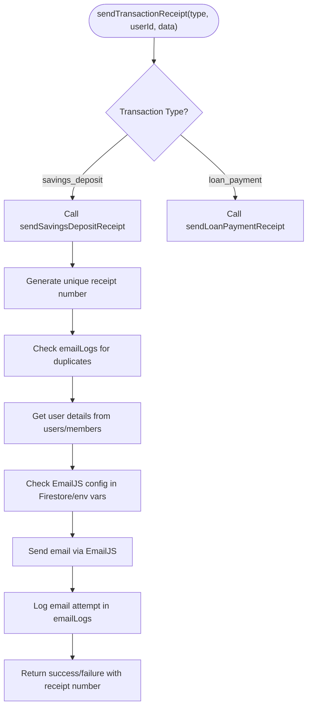

**Diagram sources**
- [transactionReceiptService.ts](file://lib/transactionReceiptService.ts#L605-L635)
- [transactionReceiptService.ts](file://lib/transactionReceiptService.ts#L408-L476)

**Section sources**
- [transactionReceiptService.ts](file://lib/transactionReceiptService.ts#L1-L636)

### Email Configuration Management
**New** - The system supports flexible email configuration management through Firestore and environment variables.

Key features:
- **Firestore Configuration**: Stores EmailJS credentials in `systemConfig/emailjs` document with automatic caching and fallback mechanisms.
- **Environment Variable Fallback**: Automatically falls back to environment variables when Firestore configuration is unavailable.
- **Development/Production Flexibility**: Allows different configurations for development and production environments.
- **Configuration Validation**: Provides clear error messages when EmailJS configuration is missing or incomplete.
- **Setup Script**: Includes automated setup script to configure EmailJS credentials in Firestore.

**Section sources**
- [transactionReceiptService.ts](file://lib/transactionReceiptService.ts#L8-L56)
- [transactionReceiptService.ts](file://lib/transactionReceiptService.ts#L58-L81)

## Savings Records Management

### SavingsRecords Component: Comprehensive Savings Management
**New** - The SavingsRecords component provides comprehensive savings account management with detailed transaction tracking and automated savings credit calculations.

Key features:
- **Real-time savings aggregation**: Fetches members and savings transactions to calculate total savings per member.
- **Advanced filtering**: Supports search by member name/email and pagination for efficient navigation.
- **Automated calculations**: Automatically computes running balances and last transaction dates.
- **Member details modal**: Provides detailed view of individual member savings with formatted currency display.
- **Responsive design**: Mobile-friendly interface with intuitive pagination controls.
- **Enhanced data visualization**: Displays savings totals with proper currency formatting and last transaction dates.

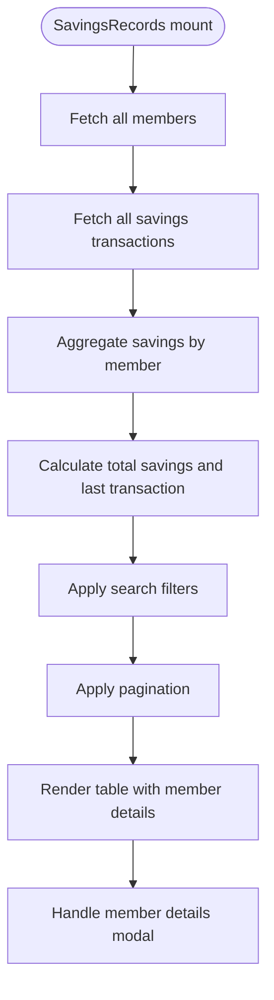

**Diagram sources**
- [SavingsRecords.tsx](file://components/admin/SavingsRecords.tsx#L40-L127)

**Section sources**
- [SavingsRecords.tsx](file://components/admin/SavingsRecords.tsx#L27-L350)

### ReportsAndAnalytics Component: Financial Analytics
**New** - The ReportsAndAnalytics component provides comprehensive financial analytics and reporting capabilities for administrative oversight.

Key features:
- **Dashboard statistics**: Displays key financial metrics including total members, total collected, active loans, and money disbursed.
- **Visual charts**: Provides bar charts for monthly trends and pie charts for loan status distribution.
- **Financial overview**: Shows receivables, pending approvals, and overdue payments with color-coded indicators.
- **Responsive design**: Adapts to different screen sizes with mobile-friendly layouts.

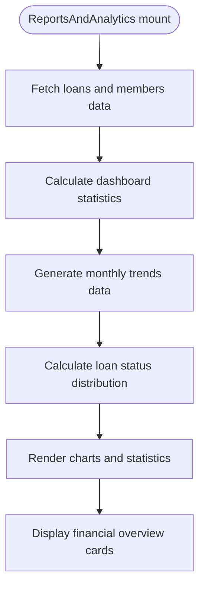

**Diagram sources**
- [ReportsAndAnalytics.tsx](file://components/admin/ReportsAndAnalytics.tsx#L50-L165)

**Section sources**
- [ReportsAndAnalytics.tsx](file://components/admin/ReportsAndAnalytics.tsx#L31-L334)

### User Savings Page: Comprehensive Transaction History
- Loads member ID, retrieves transactions, normalizes dates, sorts newest first, and computes totals.
- Provides pagination controls and summary statistics.

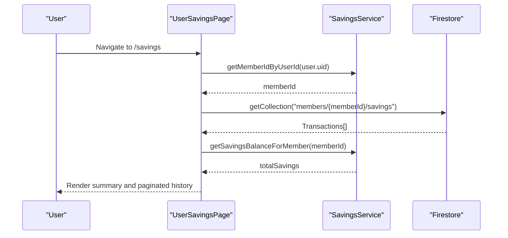

**Diagram sources**
- [page.tsx](file://app/savings/page.tsx#L39-L110)

**Section sources**
- [page.tsx](file://app/savings/page.tsx#L30-L110)

### Admin Savings Management: Member Views and Reporting
- Admin dashboard lists members with filters and savings totals.
- Member details page shows full transaction history with running balances and printing capabilities.

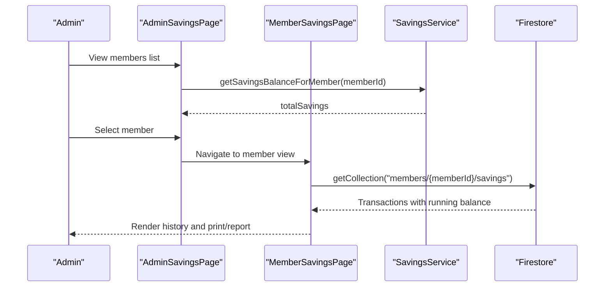

**Diagram sources**
- [page.tsx](file://app/admin/savings/page.tsx#L128-L159)
- [page.tsx](file://app/admin/savings/member/[id]/page.tsx#L53-L104)

**Section sources**
- [page.tsx](file://app/admin/savings/page.tsx#L10-L240)
- [page.tsx](file://app/admin/savings/member/[id]/page.tsx#L16-L104)

## Dependency Analysis
- Types drive service and component contracts ensuring consistent data shapes.
- SavingsService depends on Firestore utilities, transaction receipt service, and is consumed by pages and components.
- **Updated**: TransactionReceiptService provides EmailJS integration and email logging capabilities.
- Admin and user components share common modal and service logic for transaction handling.
- **New**: SavingsRecords component integrates with Firestore to provide comprehensive savings tracking.
- **New**: ReportsAndAnalytics component provides financial insights through chart visualization.
- **New**: Enhanced AddSavingsTransactionModal provides advanced transaction processing capabilities with email receipt integration.

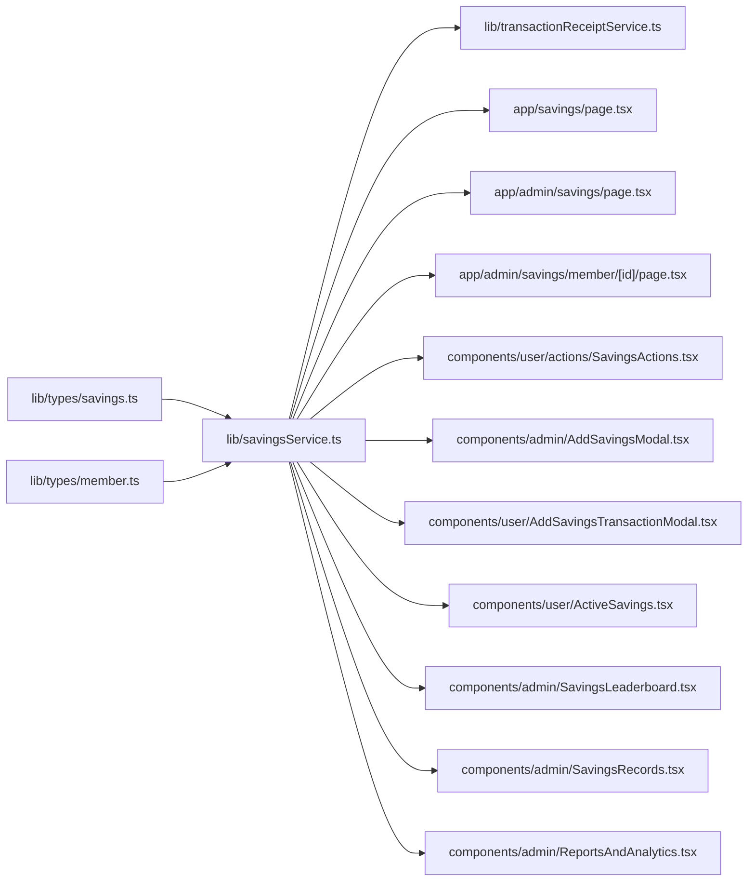

**Diagram sources**
- [savings.ts](file://lib/types/savings.ts#L1-L21)
- [member.ts](file://lib/types/member.ts#L1-L56)
- [savingsService.ts](file://lib/savingsService.ts#L1-L534)
- [transactionReceiptService.ts](file://lib/transactionReceiptService.ts#L1-L636)
- [page.tsx](file://app/savings/page.tsx#L1-L382)
- [page.tsx](file://app/admin/savings/page.tsx#L1-L652)
- [page.tsx](file://app/admin/savings/member/[id]/page.tsx#L1-L638)
- [SavingsActions.tsx](file://components/user/actions/SavingsActions.tsx#L1-L237)
- [AddSavingsModal.tsx](file://components/admin/AddSavingsModal.tsx#L1-L217)
- [AddSavingsTransactionModal.tsx](file://components/user/AddSavingsTransactionModal.tsx#L1-L371)
- [ActiveSavings.tsx](file://components/user/ActiveSavings.tsx#L1-L270)
- [SavingsLeaderboard.tsx](file://components/admin/SavingsLeaderboard.tsx#L1-L213)
- [SavingsRecords.tsx](file://components/admin/SavingsRecords.tsx#L1-L350)
- [ReportsAndAnalytics.tsx](file://components/admin/ReportsAndAnalytics.tsx#L1-L334)

**Section sources**
- [savingsService.ts](file://lib/savingsService.ts#L1-L534)
- [transactionReceiptService.ts](file://lib/transactionReceiptService.ts#L1-L636)
- [page.tsx](file://app/savings/page.tsx#L1-L382)
- [page.tsx](file://app/admin/savings/page.tsx#L1-L652)
- [page.tsx](file://app/admin/savings/member/[id]/page.tsx#L1-L638)

## Performance Considerations
- Running balance computation: The service recalculates balances from existing transactions. For large transaction histories, consider precomputing and storing balances to reduce repeated computations.
- Batch operations: When updating aggregates, ensure atomicity to avoid partial updates.
- Pagination: Use server-side pagination for large datasets to minimize client memory usage.
- Caching: Prefer retrieving aggregate totals from member documents when available to avoid heavy recomputation.
- **Updated**: Email receipt service implements caching for EmailJS configuration to avoid repeated Firestore queries.
- **Updated**: Duplicate email prevention reduces unnecessary EmailJS calls and improves system performance.
- **New**: Transaction receipt service uses efficient Firestore queries with proper indexing for email log lookups.
- **New**: SavingsRecords component uses efficient filtering and pagination to handle large member datasets.
- **New**: ReportsAndAnalytics component optimizes data fetching and chart rendering for better performance.
- **New**: Enhanced AddSavingsTransactionModal implements efficient form validation and state management.

## Troubleshooting Guide
Common issues and resolutions:
- Member not found during transaction: Verify user-to-member linkage and fallback mechanisms. Check logs for resolution attempts.
- Insufficient funds on withdrawal: Ensure client-side validation aligns with server-side checks; confirm current balance reflects latest transactions.
- Transaction not appearing: Confirm the correct member subcollection path and that transactions are sorted by date for accurate running balance.
- Admin filters not working: Validate filter logic and ensure member savings are computed before applying filters.
- **Updated**: Email receipt not sending: Check EmailJS configuration in Firestore (`systemConfig/emailjs`) or environment variables. Verify member eligibility (driver/operator) and email address availability.
- **Updated**: Duplicate email attempts: Check `emailLogs` collection for existing entries preventing duplicate emails.
- **Updated**: EmailJS configuration errors: Verify all required fields (publicKey, serviceId, receiptTemplateId) are present in Firestore configuration.
- **New**: Transaction receipt service errors: Check Firestore permissions for `emailLogs` collection and ensure proper indexing for transactionId queries.
- **New**: SavingsRecords loading errors**: Check Firestore permissions and ensure proper data structure for members and savings collections.
- **New**: ReportsAndAnalytics chart rendering issues: Verify data formatting and ensure required dependencies (recharts) are properly installed.
- **New**: Deposit control number generation failures: Check timestamp and random generation logic; ensure unique constraints are maintained.
- **New**: AddSavingsTransactionModal confirmation issues: Verify modal state management and ensure proper cleanup after transaction completion.

**Section sources**
- [savingsService.ts](file://lib/savingsService.ts#L21-L135)
- [transactionReceiptService.ts](file://lib/transactionReceiptService.ts#L132-L153)
- [SavingsActions.tsx](file://components/user/actions/SavingsActions.tsx#L68-L85)
- [page.tsx](file://app/admin/savings/page.tsx#L161-L240)
- [SavingsRecords.tsx](file://components/admin/SavingsRecords.tsx#L119-L127)
- [ReportsAndAnalytics.tsx](file://components/admin/ReportsAndAnalytics.tsx#L159-L165)
- [AddSavingsTransactionModal.tsx](file://components/user/AddSavingsTransactionModal.tsx#L120-L150)

## Conclusion
The Savings Management System provides a robust, user-friendly framework for managing cooperative member savings with enhanced transaction processing capabilities. It emphasizes accurate transaction processing, transparent reporting, administrative oversight through leaderboards, detailed member views, and comprehensive analytics. The addition of the SavingsRecords component enhances savings management with detailed transaction tracking and automated calculations, while the ReportsAndAnalytics component provides valuable financial insights through interactive charts and dashboards. The enhanced AddSavingsTransactionModal introduces sophisticated deposit control number generation and confirmation processes, significantly improving transaction security and auditability. 

**Updated**: The most significant enhancement is the integrated transaction receipt system with automatic email notifications for eligible members. The system now provides comprehensive member communication through EmailJS integration, with robust error handling, duplicate prevention, and detailed logging capabilities. This ensures that members receive timely notifications of their savings activities while maintaining system reliability and performance. The transaction receipt service supports both savings deposits and loan payments, with unique receipt number generation and flexible configuration management through Firestore and environment variables.

By leveraging typed models, centralized services, modular components, and comprehensive email notification capabilities, the system supports scalability and maintainability while delivering essential financial insights, operational controls, and enhanced member communication.