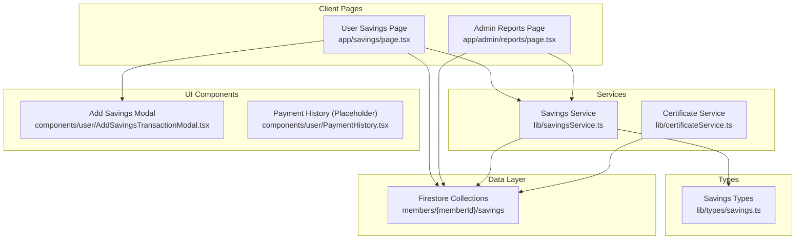
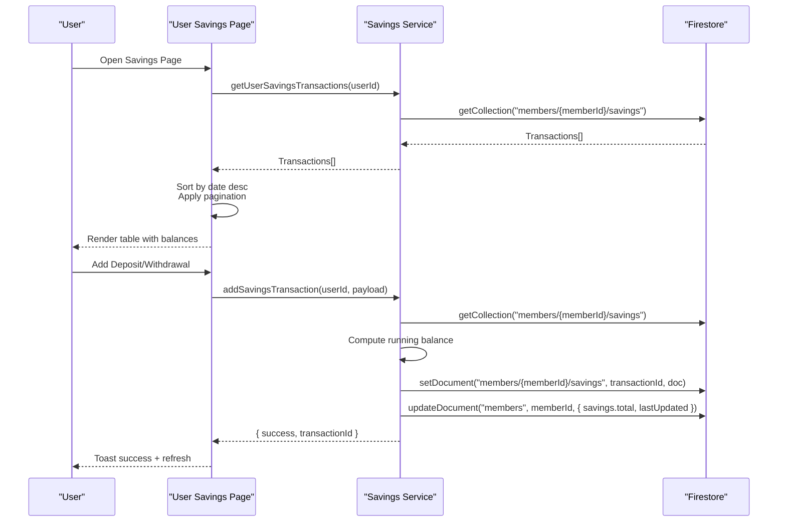
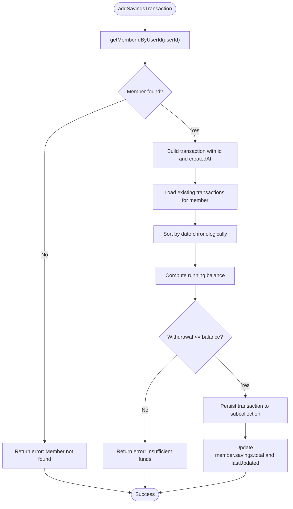
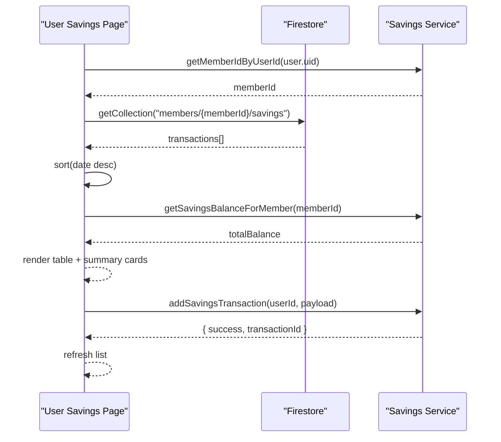
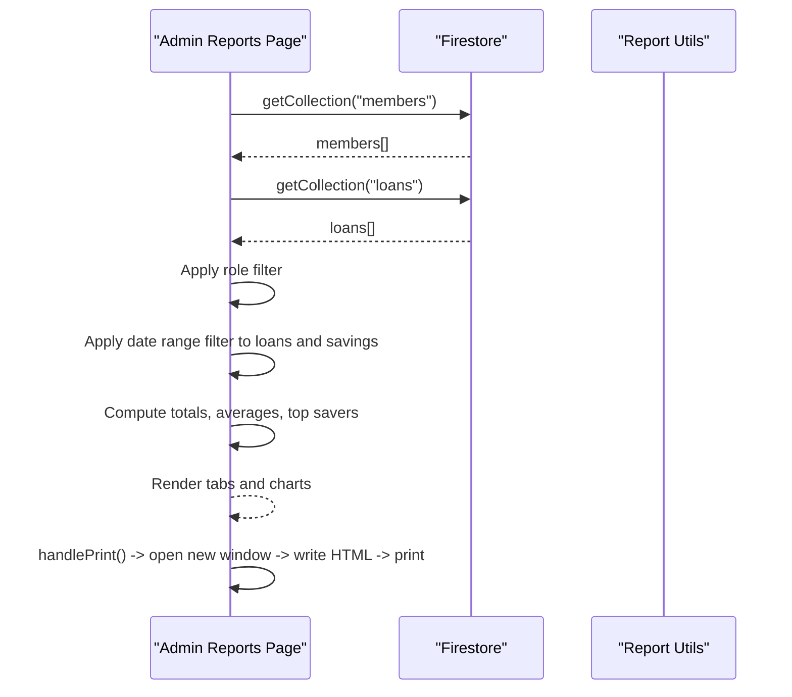
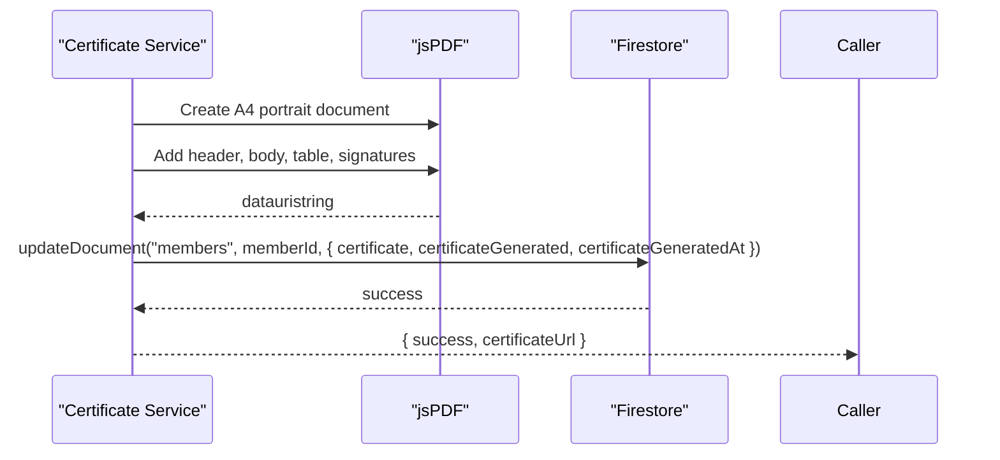
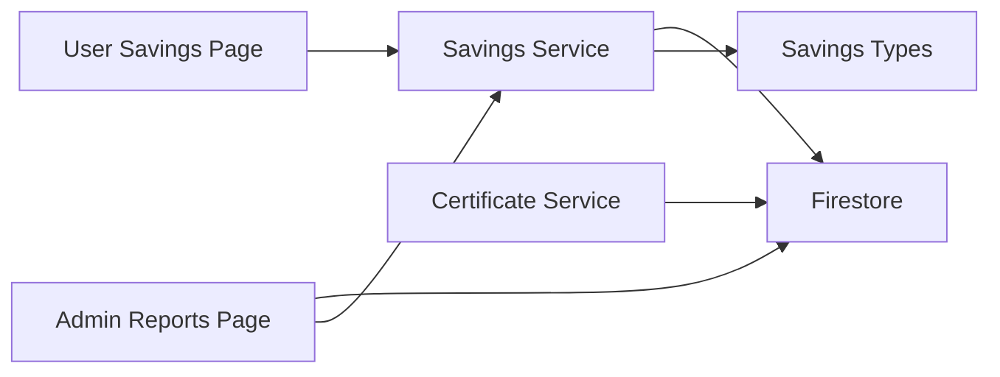

# Savings Reports & Transaction History

<cite>
**Referenced Files in This Document**
- [savingsService.ts](file://lib/savingsService.ts)
- [savings.ts](file://lib/types/savings.ts)
- [page.tsx](file://app/savings/page.tsx)
- [AddSavingsTransactionModal.tsx](file://components/user/AddSavingsTransactionModal.tsx)
- [PaymentHistory.tsx](file://components/user/PaymentHistory.tsx)
- [page.tsx](file://app/admin/reports/page.tsx)
- [certificateService.ts](file://lib/certificateService.ts)
- [README.md](file://components/admin/README.md)
- [PaginatedLoanRecords.tsx](file://components/admin/PaginatedLoanRecords.tsx)
</cite>

## Table of Contents
1. [Introduction](#introduction)
2. [Project Structure](#project-structure)
3. [Core Components](#core-components)
4. [Architecture Overview](#architecture-overview)
5. [Detailed Component Analysis](#detailed-component-analysis)
6. [Dependency Analysis](#dependency-analysis)
7. [Performance Considerations](#performance-considerations)
8. [Troubleshooting Guide](#troubleshooting-guide)
9. [Conclusion](#conclusion)
10. [Appendices](#appendices)

## Introduction
This document explains the Savings Reports and Transaction History system, focusing on:
- Payment history display with filtering, sorting, and pagination
- Report generation for printable statements and financial summaries
- Transaction history API endpoints and data export formats for external accounting systems
- Pagination and infinite scrolling mechanisms for large datasets
- Date range filtering, transaction type categorization, and balance reconciliation
- Receipt generation for deposit and withdrawal confirmations
- Examples of common report queries, bulk export operations, and integration with external financial software
- Data retention policies, archiving procedures, and compliance requirements for financial documentation

## Project Structure
The system spans client-side pages, services, and admin report pages:
- Savings transaction persistence and retrieval are handled by a dedicated service
- User-facing savings page renders transaction history with pagination and formatting
- Admin reports page aggregates financial summaries and prints printable reports
- Certificate service generates official membership certificates for compliance

**Diagram sources**
- [page.tsx](file://app/savings/page.tsx#L30-L110)
- [page.tsx](file://app/admin/reports/page.tsx#L40-L231)
- [savingsService.ts](file://lib/savingsService.ts#L1-L455)
- [certificateService.ts](file://lib/certificateService.ts#L1-L207)
- [savings.ts](file://lib/types/savings.ts#L1-L20)
- [AddSavingsTransactionModal.tsx](file://components/user/AddSavingsTransactionModal.tsx#L1-L221)
- [PaymentHistory.tsx](file://components/user/PaymentHistory.tsx#L1-L1)

**Section sources**
- [page.tsx](file://app/savings/page.tsx#L1-L382)
- [page.tsx](file://app/admin/reports/page.tsx#L1-L737)
- [savingsService.ts](file://lib/savingsService.ts#L1-L455)
- [certificateService.ts](file://lib/certificateService.ts#L1-L207)
- [savings.ts](file://lib/types/savings.ts#L1-L20)
- [AddSavingsTransactionModal.tsx](file://components/user/AddSavingsTransactionModal.tsx#L1-L221)
- [PaymentHistory.tsx](file://components/user/PaymentHistory.tsx#L1-L1)

## Core Components
- Savings Service: Provides member lookup, transaction creation with atomic balance calculation, and balance retrieval
- Savings Types: Defines transaction and member savings data structures
- User Savings Page: Loads, sorts, paginates, and displays transaction history; supports adding deposits/withdrawals
- Admin Reports Page: Aggregates members, savings, and loans data; applies date-range and role filters; prints comprehensive reports
- Certificate Service: Generates membership certificates and persists them in Firestore
- Add Savings Transaction Modal: Validates and submits new transactions with real-time balance checks

**Section sources**
- [savingsService.ts](file://lib/savingsService.ts#L1-L455)
- [savings.ts](file://lib/types/savings.ts#L1-L20)
- [page.tsx](file://app/savings/page.tsx#L30-L110)
- [page.tsx](file://app/admin/reports/page.tsx#L40-L231)
- [certificateService.ts](file://lib/certificateService.ts#L10-L175)
- [AddSavingsTransactionModal.tsx](file://components/user/AddSavingsTransactionModal.tsx#L26-L96)

## Architecture Overview
The system integrates client-side rendering with Firestore for persistence and admin report generation for analytics.

**Diagram sources**
- [page.tsx](file://app/savings/page.tsx#L39-L110)
- [savingsService.ts](file://lib/savingsService.ts#L237-L342)

## Detailed Component Analysis

### Savings Service
Responsibilities:
- Resolve member ID from user ID via multiple strategies (userId field, email, decoded email, name)
- Atomic transaction creation with running balance computation and validation
- Retrieve user and member balances with fallback to transaction-derived totals
- Provide member-level balance aggregation

Key behaviors:
- Member resolution prioritizes direct member document match and user email correlation
- Transaction balance computed by chronological accumulation of deposits and withdrawals
- Aggregate member savings updated with non-negative constraint and last-updated timestamp

**Diagram sources**
- [savingsService.ts](file://lib/savingsService.ts#L237-L342)

**Section sources**
- [savingsService.ts](file://lib/savingsService.ts#L21-L135)
- [savingsService.ts](file://lib/savingsService.ts#L140-L232)
- [savingsService.ts](file://lib/savingsService.ts#L237-L342)
- [savingsService.ts](file://lib/savingsService.ts#L347-L422)
- [savingsService.ts](file://lib/savingsService.ts#L427-L454)

### Savings Types
Defines the shape of transaction and member savings records used across the system.

- SavingsTransaction: id, memberId, memberName, date, type, amount, balance, remarks, createdAt
- MemberSavings: memberId, memberName, role, totalSavings, status, lastUpdated

**Section sources**
- [savings.ts](file://lib/types/savings.ts#L1-L20)

### User Savings Page
Displays the current user’s transaction history with:
- Sorting by date descending
- Pagination with configurable page size
- Formatting for currency and dates
- Real-time balance computation and summary cards

Features:
- Fetches transactions from Firestore subcollection
- Calculates total deposits, withdrawals, and last updated date
- Supports adding transactions via modal and refresh

**Diagram sources**
- [page.tsx](file://app/savings/page.tsx#L39-L110)
- [page.tsx](file://app/savings/page.tsx#L112-L160)
- [savingsService.ts](file://lib/savingsService.ts#L237-L342)

**Section sources**
- [page.tsx](file://app/savings/page.tsx#L30-L110)
- [page.tsx](file://app/savings/page.tsx#L112-L160)
- [page.tsx](file://app/savings/page.tsx#L180-L210)

### Add Savings Transaction Modal
Validates inputs and enforces:
- Positive numeric amounts
- Withdrawal limits based on current balance
- Required date selection

On submit, delegates to the savings service and resets form on success.

**Section sources**
- [AddSavingsTransactionModal.tsx](file://components/user/AddSavingsTransactionModal.tsx#L26-L96)

### Payment History Component
A minimal placeholder component currently present in the repository. It can be extended to support advanced filtering, sorting, and search capabilities aligned with the user savings page.

**Section sources**
- [PaymentHistory.tsx](file://components/user/PaymentHistory.tsx#L1-L1)

### Admin Reports Page
Aggregates financial summaries and prints comprehensive reports:
- Members overview: total, active, inactive, role distribution
- Savings summary: total savings, average per member, top savers
- Loans summary: total applications, active loans, distributions by status
- Filters: date range and role filter
- Print functionality: generates a styled HTML report and triggers browser print

**Diagram sources**
- [page.tsx](file://app/admin/reports/page.tsx#L40-L231)
- [page.tsx](file://app/admin/reports/page.tsx#L233-L454)

**Section sources**
- [page.tsx](file://app/admin/reports/page.tsx#L29-L737)

### Certificate Service
Generates membership certificates as PDFs and stores them in Firestore:
- Creates a PDF with cooperative branding and member details
- Stores base64-encoded PDF in the member document
- Provides retrieval of certificate metadata

**Diagram sources**
- [certificateService.ts](file://lib/certificateService.ts#L10-L175)

**Section sources**
- [certificateService.ts](file://lib/certificateService.ts#L10-L175)
- [certificateService.ts](file://lib/certificateService.ts#L182-L207)

### Data Model and Storage
Savings transactions are stored in Firestore under each member’s subcollection with the following structure:
- Collection path: members/{memberId}/savings
- Fields: id, memberId, memberName, date, type, amount, balance, remarks, createdAt

**Section sources**
- [README.md](file://components/admin/README.md#L16-L29)

## Dependency Analysis
- User Savings Page depends on Savings Service and Firestore for transaction retrieval and submission
- Savings Service encapsulates member resolution and transaction persistence
- Admin Reports Page depends on Firestore for aggregated data and printing logic
- Certificate Service depends on jsPDF and Firestore for PDF generation and storage

**Diagram sources**
- [page.tsx](file://app/savings/page.tsx#L39-L110)
- [savingsService.ts](file://lib/savingsService.ts#L1-L455)
- [page.tsx](file://app/admin/reports/page.tsx#L40-L231)
- [certificateService.ts](file://lib/certificateService.ts#L1-L207)
- [savings.ts](file://lib/types/savings.ts#L1-L20)

**Section sources**
- [page.tsx](file://app/savings/page.tsx#L39-L110)
- [savingsService.ts](file://lib/savingsService.ts#L1-L455)
- [page.tsx](file://app/admin/reports/page.tsx#L40-L231)
- [certificateService.ts](file://lib/certificateService.ts#L1-L207)
- [savings.ts](file://lib/types/savings.ts#L1-L20)

## Performance Considerations
- Pagination: Implemented client-side slicing for manageable DOM rendering; recommended for large histories
- Sorting: Chronological sort performed on client; consider server-side ordering for very large datasets
- Balance computation: Running balance computed from transactions; keep transaction lists reasonably sized
- Report generation: Aggregates per-member balances via subcollections; ensure date-range filters reduce dataset size
- Printing: Large reports printed in-browser; consider server-side PDF generation for heavy loads

[No sources needed since this section provides general guidance]

## Troubleshooting Guide
Common issues and resolutions:
- Member not found during transaction: Verify user ID mapping and member document linkage
- Insufficient funds on withdrawal: Enforce client-side validation and service-side checks
- Empty transaction list: Confirm subcollection exists and user has permissions
- Report date filters not applied: Ensure date fields are normalized to timestamps before comparison
- Certificate generation failures: Validate jsPDF availability and Firestore write permissions

**Section sources**
- [savingsService.ts](file://lib/savingsService.ts#L21-L135)
- [savingsService.ts](file://lib/savingsService.ts#L291-L294)
- [AddSavingsTransactionModal.tsx](file://components/user/AddSavingsTransactionModal.tsx#L37-L41)
- [page.tsx](file://app/admin/reports/page.tsx#L76-L99)
- [certificateService.ts](file://lib/certificateService.ts#L168-L174)

## Conclusion
The Savings Reports and Transaction History system provides a robust foundation for managing member savings, generating financial reports, and issuing certificates. It leverages Firestore for scalable persistence, client-side pagination for performance, and admin-level analytics for oversight. Extending the payment history component and integrating server-side exports would further enhance scalability and compliance readiness.

[No sources needed since this section summarizes without analyzing specific files]

## Appendices

### API Endpoints and Data Export Formats
- Savings transaction creation endpoint: POST /api/savings/transaction
  - Request body: { type, amount, date, remarks, memberId, memberName }
  - Response: { success, transactionId }
- Savings transaction retrieval endpoint: GET /api/savings/transactions?userId={uid}
  - Response: SavingsTransaction[]
- Report generation endpoint: GET /api/reports/savings?startDate=&endDate=&role=
  - Response: { membersSummary, savingsSummary, loansSummary }
- Certificate retrieval endpoint: GET /api/certificate/{memberId}
  - Response: { certificateUrl, fullName, role, registrationDate }

Note: These endpoints are conceptual and align with the existing service and UI patterns. Implementations should mirror the service logic for member resolution, balance computation, and data export formatting.

[No sources needed since this section provides general guidance]

### Receipt Generation System
- Deposit/withdrawal confirmations: Generated via transaction creation flow; balances updated atomically
- Membership certificates: Generated as PDFs and stored in Firestore for later retrieval

**Section sources**
- [savingsService.ts](file://lib/savingsService.ts#L237-L342)
- [certificateService.ts](file://lib/certificateService.ts#L10-L175)

### Data Retention and Compliance
- Data retention: Maintain transaction history in Firestore subcollections indefinitely or per policy
- Archiving: Use date-range filters in reports to limit exposure; export reports for external systems
- Compliance: Certificates stored with metadata; ensure secure access controls and audit logs

[No sources needed since this section provides general guidance]