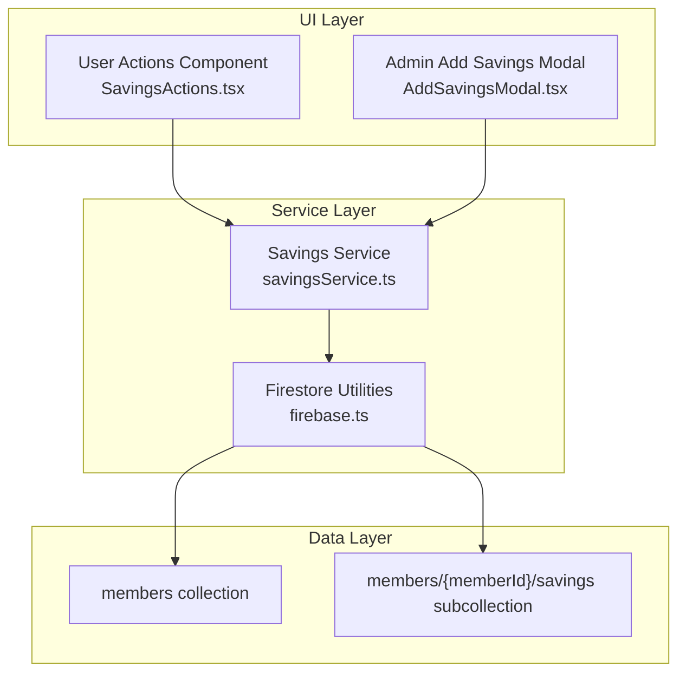
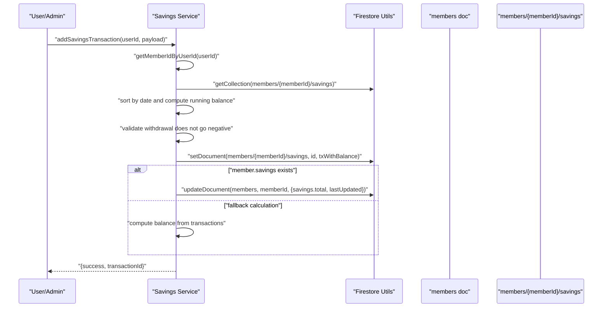
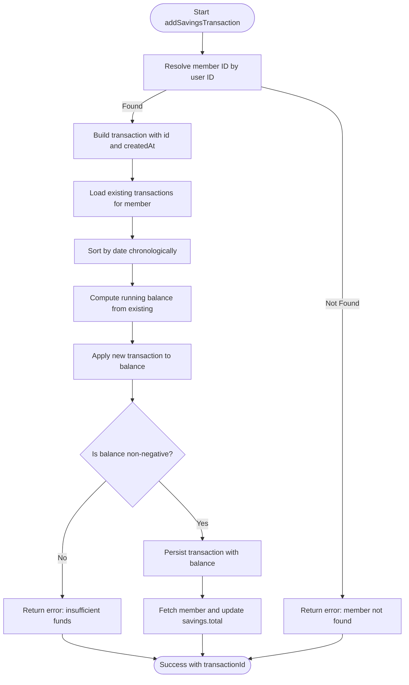
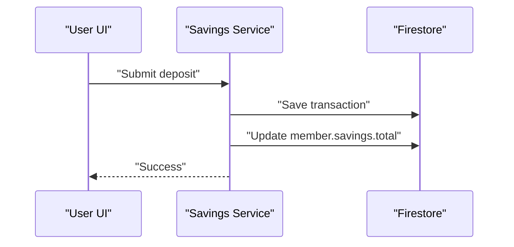
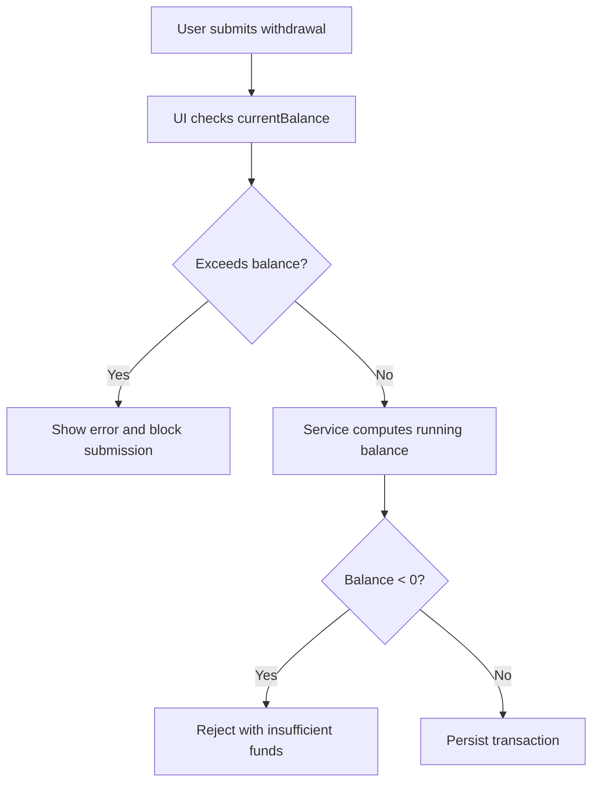
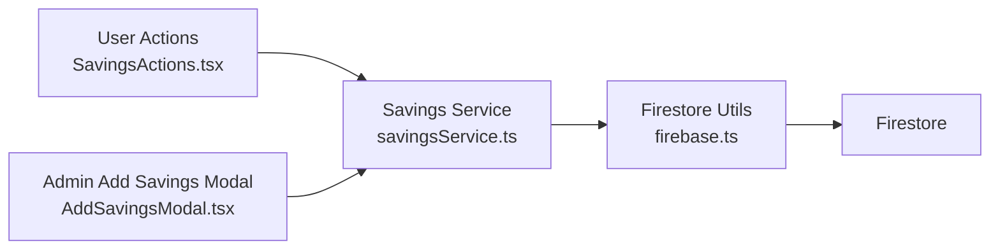

# Savings Transactions Processing

<cite>
**Referenced Files in This Document**
- [savingsService.ts](file://lib/savingsService.ts)
- [firebase.ts](file://lib/firebase.ts)
- [savings.ts](file://lib/types/savings.ts)
- [SavingsActions.tsx](file://components/user/actions/SavingsActions.tsx)
- [AddSavingsModal.tsx](file://components/admin/AddSavingsModal.tsx)
- [admin README.md](file://components/admin/README.md)
- [page.tsx (Admin Reports)](file://app/admin/reports/page.tsx)
- [page.tsx (Savings Dashboard)](file://app/savings/page.tsx)
- [test-savings-consistency.js](file://test-savings-consistency.js)
- [test-savings-functionality.js](file://test-savings-functionality.js)
</cite>

## Table of Contents
1. [Introduction](#introduction)
2. [Project Structure](#project-structure)
3. [Core Components](#core-components)
4. [Architecture Overview](#architecture-overview)
5. [Detailed Component Analysis](#detailed-component-analysis)
6. [Dependency Analysis](#dependency-analysis)
7. [Performance Considerations](#performance-considerations)
8. [Troubleshooting Guide](#troubleshooting-guide)
9. [Conclusion](#conclusion)
10. [Appendices](#appendices)

## Introduction
This document explains the Savings Transactions Processing system, focusing on atomic transaction operations, validation logic, transaction ID generation, timestamps, sequential ordering, running balance computation, Firestore patterns, metadata structure, and performance considerations. It also covers workflows, error scenarios, and recovery procedures.

## Project Structure
The savings system spans client-side UI components, a centralized service layer, and Firestore-backed persistence:
- UI entry points for user and admin actions
- A service layer that encapsulates Firestore operations and business logic
- Firestore collections organized per member for subcollections of transactions
- Shared TypeScript types for transaction metadata

**Diagram sources**
- [SavingsActions.tsx](file://components/user/actions/SavingsActions.tsx#L1-L237)
- [AddSavingsModal.tsx](file://components/admin/AddSavingsModal.tsx#L1-L217)
- [savingsService.ts](file://lib/savingsService.ts#L1-L455)
- [firebase.ts](file://lib/firebase.ts#L90-L307)

**Section sources**
- [savingsService.ts](file://lib/savingsService.ts#L1-L455)
- [firebase.ts](file://lib/firebase.ts#L1-L309)
- [admin README.md](file://components/admin/README.md#L16-L29)

## Core Components
- Savings Service: Provides transaction creation, balance retrieval, and member resolution utilities.
- Firestore Utilities: Encapsulate CRUD operations and validation helpers.
- UI Components: User and admin interfaces to submit transactions and manage savings.
- Types: Strongly typed transaction and member savings metadata.

Key responsibilities:
- Atomic transaction creation with running balance calculation
- Overdraft prevention via preflight checks
- Transaction ID generation and timestamp management
- Sequential ordering via chronological sorting
- Aggregate balance maintenance and fallback calculation

**Section sources**
- [savingsService.ts](file://lib/savingsService.ts#L237-L342)
- [firebase.ts](file://lib/firebase.ts#L90-L307)
- [savings.ts](file://lib/types/savings.ts#L1-L20)
- [SavingsActions.tsx](file://components/user/actions/SavingsActions.tsx#L20-L120)
- [AddSavingsModal.tsx](file://components/admin/AddSavingsModal.tsx#L22-L92)

## Architecture Overview
The system ensures data integrity by computing balances locally against persisted transactions and persisting both the transaction and the member’s aggregate total. While the current implementation performs local balance computation and updates the aggregate, it does not wrap the entire operation in a single Firestore transaction. This introduces potential race conditions for concurrent writers.

**Diagram sources**
- [savingsService.ts](file://lib/savingsService.ts#L237-L342)
- [firebase.ts](file://lib/firebase.ts#L148-L240)

## Detailed Component Analysis

### Savings Service: addSavingsTransaction
Responsibilities:
- Resolve member ID from user ID using robust fallbacks
- Construct transaction with generated ID and timestamp
- Compute running balance by sorting existing transactions chronologically
- Enforce overdraft prevention
- Persist transaction and update member aggregate savings

**Diagram sources**
- [savingsService.ts](file://lib/savingsService.ts#L237-L342)

**Section sources**
- [savingsService.ts](file://lib/savingsService.ts#L237-L342)

### Transaction Validation Logic
- Amount validation: Positive numeric amounts enforced in UI and backend
- Overdraft prevention: Local balance computed before write; withdrawal rejected if negative
- Member linkage: Robust resolution of member ID from user ID via multiple strategies

**Section sources**
- [SavingsActions.tsx](file://components/user/actions/SavingsActions.tsx#L27-L85)
- [AddSavingsModal.tsx](file://components/admin/AddSavingsModal.tsx#L22-L45)
- [savingsService.ts](file://lib/savingsService.ts#L291-L294)

### Transaction ID Generation and Timestamp Management
- ID pattern: Concatenation of type, timestamp, and random suffix for uniqueness
- Timestamp: ISO string recorded as created timestamp
- Ordering: Transactions are sorted by date to compute running balance

**Section sources**
- [savingsService.ts](file://lib/savingsService.ts#L258-L262)
- [savingsService.ts](file://lib/savingsService.ts#L269-L272)

### Running Balance Calculation
- Chronological processing: Existing transactions are sorted by date
- Balance accumulation: Deposits add, withdrawals subtract
- Finalization: New transaction’s balance reflects cumulative total

**Section sources**
- [savingsService.ts](file://lib/savingsService.ts#L264-L300)

### Firestore Patterns and Race Conditions
Current behavior:
- Separate operations: load → compute → save → update aggregate
- No single Firestore transaction wrapping the whole update

Implications:
- Concurrent writes may race when multiple clients update the same member’s transactions
- Risk of inconsistent aggregate totals if updates interleave

Recommended improvement:
- Wrap the load-compute-save-aggregate-update sequence in a Firestore transaction to guarantee atomicity and consistency.

**Section sources**
- [savingsService.ts](file://lib/savingsService.ts#L303-L335)
- [firebase.ts](file://lib/firebase.ts#L90-L113)

### Transaction Metadata Structure and Field Validation
Fields stored per transaction:
- id, memberId, memberName, date, type, amount, balance, remarks, createdAt

Validation rules observed:
- type constrained to deposit or withdrawal
- amount validated as positive numeric
- balance derived and stored after computation
- createdAt stored as ISO timestamp

**Section sources**
- [savings.ts](file://lib/types/savings.ts#L1-L11)
- [admin README.md](file://components/admin/README.md#L16-L29)
- [savingsService.ts](file://lib/savingsService.ts#L258-L300)

### Data Transformation Processes
- UI to service: Form payloads transformed into transaction objects with computed fields
- Service to persistence: Transaction enriched with balance and timestamps, written to subcollection
- Aggregate reconciliation: Member document savings updated with total and lastUpdated

**Section sources**
- [SavingsActions.tsx](file://components/user/actions/SavingsActions.tsx#L35-L49)
- [AddSavingsModal.tsx](file://components/admin/AddSavingsModal.tsx#L73-L78)
- [savingsService.ts](file://lib/savingsService.ts#L313-L335)

### Examples of Workflows and Error Scenarios

#### Deposit Workflow
- User submits deposit via UI
- Service computes running balance and persists transaction
- Aggregate savings updated

**Diagram sources**
- [SavingsActions.tsx](file://components/user/actions/SavingsActions.tsx#L20-L66)
- [savingsService.ts](file://lib/savingsService.ts#L303-L335)

#### Overdraft Prevention Scenario
- User attempts withdrawal exceeding current balance
- UI validates balance before submission
- Service enforces overdraft prevention during computation

**Diagram sources**
- [SavingsActions.tsx](file://components/user/actions/SavingsActions.tsx#L68-L120)
- [savingsService.ts](file://lib/savingsService.ts#L291-L294)

#### Recovery Procedures
- If aggregate update fails, balance can be recalculated from subcollection transactions
- UI should refresh to reflect latest state
- Audit logs and reports can cross-check totals across views

**Section sources**
- [savingsService.ts](file://lib/savingsService.ts#L382-L422)
- [page.tsx (Admin Reports)](file://app/admin/reports/page.tsx#L132-L180)

## Dependency Analysis
High-level dependencies:
- UI components depend on authentication and service layer
- Savings Service depends on Firestore utilities
- Firestore utilities encapsulate Firestore SDK calls and validation

**Diagram sources**
- [SavingsActions.tsx](file://components/user/actions/SavingsActions.tsx#L1-L237)
- [AddSavingsModal.tsx](file://components/admin/AddSavingsModal.tsx#L1-L217)
- [savingsService.ts](file://lib/savingsService.ts#L1-L455)
- [firebase.ts](file://lib/firebase.ts#L90-L307)

**Section sources**
- [savingsService.ts](file://lib/savingsService.ts#L1-L455)
- [firebase.ts](file://lib/firebase.ts#L1-L309)

## Performance Considerations
- Sorting and balance recomputation: O(n log n) due to sorting plus O(n) scan; acceptable for typical histories
- Recommendations:
  - Indexes: Ensure date-based indexes on savings subcollections for efficient chronological queries
  - Pagination: Implement pagination for large histories in UI and server-side processing
  - Batch writes: Group related updates and minimize round-trips
  - Caching: Cache recent aggregates and invalidate on write
  - Concurrency control: Use Firestore transactions to serialize conflicting updates

[No sources needed since this section provides general guidance]

## Troubleshooting Guide
Common issues and resolutions:
- Member not found by user ID: Verify user-to-member linkage and fallbacks
- Insufficient funds on withdrawal: Ensure UI and service validations align
- Inconsistent aggregate totals: Recalculate from subcollection and reconcile
- Firestore permission errors: Review rules and collection access

**Section sources**
- [savingsService.ts](file://lib/savingsService.ts#L242-L255)
- [savingsService.ts](file://lib/savingsService.ts#L291-L294)
- [firebase.ts](file://lib/firebase.ts#L174-L179)
- [firebase.ts](file://lib/firebase.ts#L232-L237)

## Conclusion
The Savings Transactions Processing system provides a clear path for deposits and withdrawals with local running balance computation and aggregate updates. To ensure strong consistency under concurrency, wrap the end-to-end update in a Firestore transaction. With proper indexing, pagination, and validation, the system scales effectively while maintaining data integrity across user and admin views.

## Appendices

### Transaction Metadata Reference
- Fields: id, memberId, memberName, date, type, amount, balance, remarks, createdAt
- Constraints: type is deposit or withdrawal; amount is positive; balance reflects cumulative total

**Section sources**
- [savings.ts](file://lib/types/savings.ts#L1-L11)
- [admin README.md](file://components/admin/README.md#L16-L29)

### Testing and Validation Scripts
- Savings consistency and functionality tests assist in verifying end-to-end behavior across admin and user dashboards.

**Section sources**
- [test-savings-consistency.js](file://test-savings-consistency.js#L1-L23)
- [test-savings-functionality.js](file://test-savings-functionality.js#L1-L54)