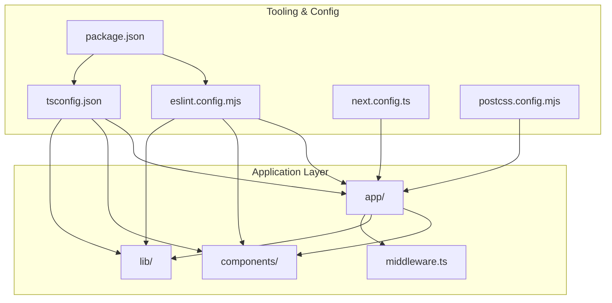
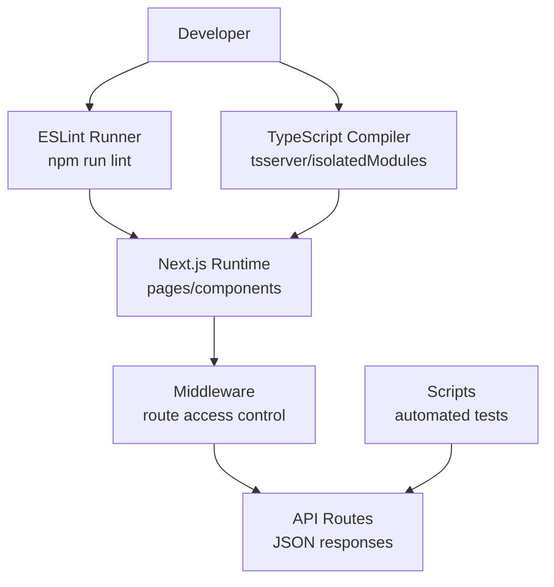
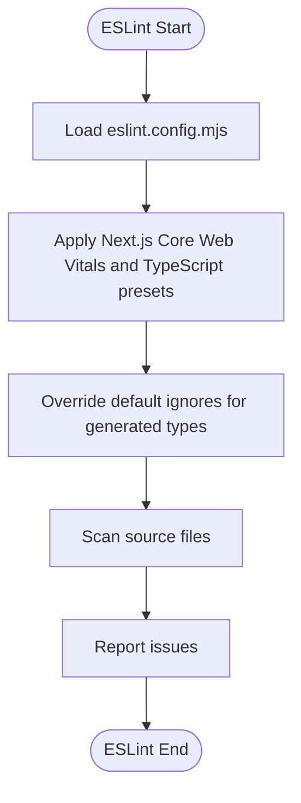
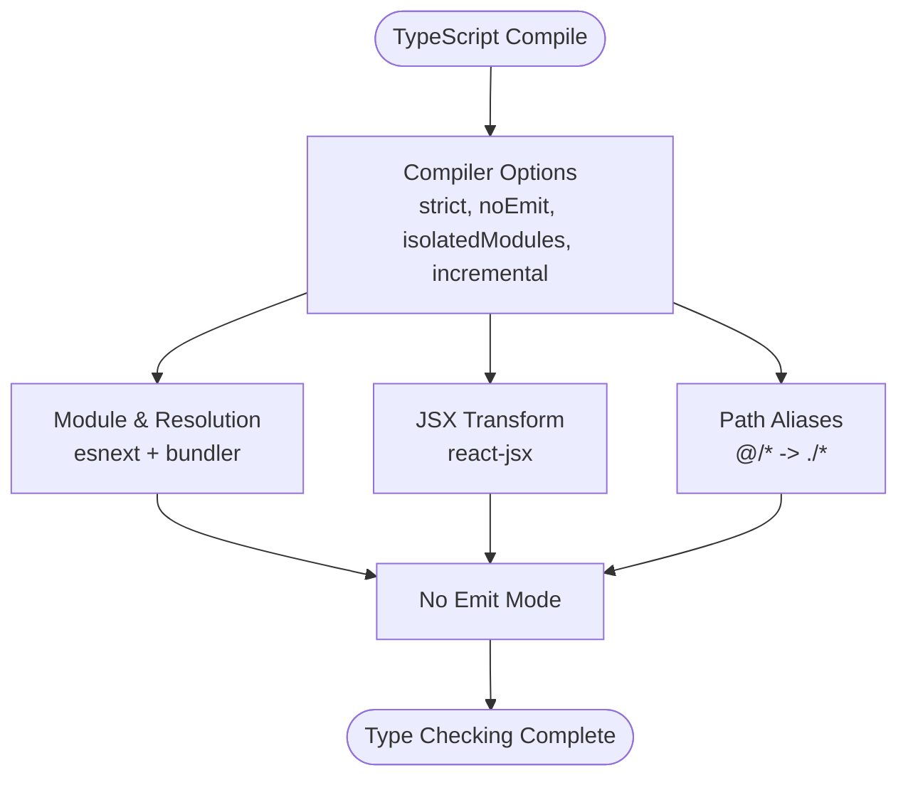
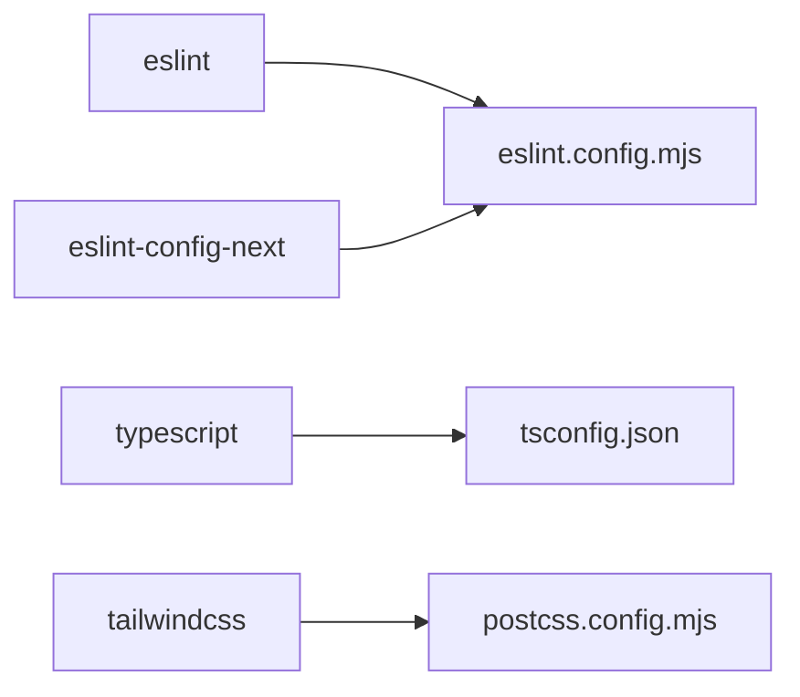

# Code Quality Standards

<cite>
**Referenced Files in This Document**
- [eslint.config.mjs](file://eslint.config.mjs)
- [tsconfig.json](file://tsconfig.json)
- [package.json](file://package.json)
- [next.config.ts](file://next.config.ts)
- [postcss.config.mjs](file://postcss.config.mjs)
- [components/admin/Header.tsx](file://components/admin/Header.tsx)
- [lib/firebase.ts](file://lib/firebase.ts)
- [lib/validators.ts](file://lib/validators.ts)
- [lib/auth.tsx](file://lib/auth.tsx)
- [middleware.ts](file://middleware.ts)
- [app/api/test-json/route.ts](file://app/api/test-json/route.ts)
- [scripts/test-api-routes.js](file://scripts/test-api-routes.js)
</cite>

## Table of Contents
1. [Introduction](#introduction)
2. [Project Structure](#project-structure)
3. [Core Components](#core-components)
4. [Architecture Overview](#architecture-overview)
5. [Detailed Component Analysis](#detailed-component-analysis)
6. [Dependency Analysis](#dependency-analysis)
7. [Performance Considerations](#performance-considerations)
8. [Troubleshooting Guide](#troubleshooting-guide)
9. [Conclusion](#conclusion)
10. [Appendices](#appendices)

## Introduction
This document defines code quality standards for the SAMPA Cooperative Management System. It consolidates ESLint configuration, TypeScript compiler settings, and development scripts that enforce consistent style, correctness, and maintainability across React, TypeScript, and Next.js application layers. It also outlines naming conventions, architectural patterns, and practical integration steps for automated quality checks and continuous improvement.

## Project Structure
The project follows a Next.js App Router structure with a clear separation of concerns:
- Application pages and layouts under app/
- Shared and role-specific components under components/
- Client and server utilities under lib/
- Middleware for route-level access control under middleware.ts
- API routes under app/api/
- Scripts for operational tasks under scripts/

**Diagram sources**
- [eslint.config.mjs](file://eslint.config.mjs#L1-L19)
- [tsconfig.json](file://tsconfig.json#L1-L35)
- [package.json](file://package.json#L1-L53)
- [next.config.ts](file://next.config.ts#L1-L8)
- [postcss.config.mjs](file://postcss.config.mjs#L1-L8)
- [middleware.ts](file://middleware.ts#L1-L62)

**Section sources**
- [eslint.config.mjs](file://eslint.config.mjs#L1-L19)
- [tsconfig.json](file://tsconfig.json#L1-L35)
- [package.json](file://package.json#L1-L53)
- [next.config.ts](file://next.config.ts#L1-L8)
- [postcss.config.mjs](file://postcss.config.mjs#L1-L8)

## Core Components
This section documents the foundational quality tools and their configuration.

- ESLint configuration
  - Uses Next.js recommended configs for Core Web Vitals and TypeScript.
  - Overrides default ignores to include development artifacts and Next.js generated types.
  - Exports a single ESLint configuration array.

- TypeScript configuration
  - Strict type checking enabled.
  - ES2017 target with DOM and ESNext libraries.
  - Bundler module resolution and isolated modules for fast builds.
  - Path aliases mapped via tsconfig.json.
  - Includes Next.js generated types for type safety.

- Package scripts
  - Dev, build, and start for Next.js lifecycle.
  - Lint script invokes ESLint.
  - Operational scripts for Firebase and data validation tasks.

- PostCSS/Tailwind
  - Tailwind PostCSS plugin configured for styling pipeline.

**Section sources**
- [eslint.config.mjs](file://eslint.config.mjs#L1-L19)
- [tsconfig.json](file://tsconfig.json#L1-L35)
- [package.json](file://package.json#L5-L14)
- [postcss.config.mjs](file://postcss.config.mjs#L1-L8)

## Architecture Overview
The code quality architecture integrates linting, type checking, and runtime validations across the application.

**Diagram sources**
- [package.json](file://package.json#L5-L14)
- [tsconfig.json](file://tsconfig.json#L1-L35)
- [middleware.ts](file://middleware.ts#L1-L62)
- [app/api/test-json/route.ts](file://app/api/test-json/route.ts#L79-L116)
- [scripts/test-api-routes.js](file://scripts/test-api-routes.js#L50-L104)

## Detailed Component Analysis

### ESLint Configuration and Rule Enforcement
- Configuration composition
  - Extends Next.js Core Web Vitals and TypeScript presets.
  - Overrides global ignores to exclude Next.js generated types and build artifacts from linting.
- Practical implications
  - Ensures React and Next.js conventions are followed.
  - Catches potential runtime issues early via TypeScript rules.
  - Reduces noise from generated files.

**Diagram sources**
- [eslint.config.mjs](file://eslint.config.mjs#L5-L16)

**Section sources**
- [eslint.config.mjs](file://eslint.config.mjs#L1-L19)

### TypeScript Configuration and Compilation Settings
- Strictness and performance
  - strict: true enables comprehensive type checks.
  - noEmit: true prevents emitting JS, relying on Next.js and tsserver.
  - isolatedModules: true for fast incremental type-checking.
  - incremental: true accelerates repeated type-checks.
- Module and resolution
  - module: esnext and moduleResolution: bundler align with Next.js and modern bundlers.
  - resolveJsonModule: true supports importing JSON.
- JSX and paths
  - jsx: react-jsx aligns with React 18+ JSX transform.
  - paths: @/* maps to repository root for clean imports.

**Diagram sources**
- [tsconfig.json](file://tsconfig.json#L2-L24)

**Section sources**
- [tsconfig.json](file://tsconfig.json#L1-L35)

### Naming Conventions and Architectural Patterns
- File naming
  - React components: PascalCase.tsx (e.g., components/admin/Header.tsx).
  - Utilities: camelCase.ts (e.g., lib/firebase.ts, lib/validators.ts).
  - API routes: route.ts under app/api/<name>/ (e.g., app/api/test-json/route.ts).
- Imports and exports
  - Prefer explicit relative imports for local modules.
  - Use path aliases (@/*) consistently for readability.
- Component structure
  - Client components marked with "use client".
  - Props are strongly typed with interfaces.
- Middleware and routing
  - Middleware validates route access and redirects appropriately.
  - API routes return structured JSON responses.

**Section sources**
- [components/admin/Header.tsx](file://components/admin/Header.tsx#L1-L105)
- [lib/firebase.ts](file://lib/firebase.ts#L1-L309)
- [lib/validators.ts](file://lib/validators.ts#L1-L236)
- [middleware.ts](file://middleware.ts#L1-L62)
- [app/api/test-json/route.ts](file://app/api/test-json/route.ts#L79-L116)

### Linting Rules for React, TypeScript, and Next.js
- React and Next.js
  - Enforced via Next.js ESLint presets included in eslint.config.mjs.
  - Core Web Vitals rules help maintain performance-sensitive code.
- TypeScript
  - Strict typing enforced by tsconfig.json.
  - No emit mode ensures type-only checks during development.
- Next.js App Router
  - Pages and components under app/ benefit from Next.js-specific lint rules.

**Section sources**
- [eslint.config.mjs](file://eslint.config.mjs#L1-L19)
- [tsconfig.json](file://tsconfig.json#L7-L8)

### Code Formatting Guidelines
- Indentation and spacing
  - Use spaces; avoid tabs.
  - Keep lines under 100 characters where possible.
- Imports
  - Group external, internal, and sibling imports; separate with blank lines.
  - Use path aliases (@/*) for internal modules.
- Components
  - One component per file; export default function.
  - Type props explicitly; avoid any where possible.
- API routes
  - Return structured JSON with consistent keys.
  - Validate inputs and return appropriate HTTP semantics.

[No sources needed since this section provides general guidance]

### Custom Rule Creation and Integration
- Creating custom rules
  - Extend ESLint configuration arrays and add plugin-based rules.
  - Integrate with pre-commit hooks to run linting before commits.
- Example integration points
  - Pre-commit hook runs npm run lint.
  - IDE ESLint extension provides real-time feedback.

[No sources needed since this section provides general guidance]

### Automated Quality Checks and CI
- Local checks
  - npm run lint to validate styles and types.
  - tsserver/isolatedModules for fast type-checking feedback.
- Scripted tests
  - scripts/test-api-routes.js validates API JSON responses.
- Continuous integration
  - Configure CI to run lint and type checks on pull requests.
  - Gate merges until checks pass.

**Section sources**
- [package.json](file://package.json#L5-L14)
- [scripts/test-api-routes.js](file://scripts/test-api-routes.js#L50-L104)

### Code Review Processes
- Checklist
  - Lint passes and no type errors.
  - Component props are typed and validated.
  - Middleware and API routes return JSON with clear messages.
  - Security: no hardcoded secrets; environment variables used.
- Collaboration
  - Use pull request templates to document changes.
  - Require at least one reviewer familiar with the affected area.

[No sources needed since this section provides general guidance]

## Dependency Analysis
Quality tooling dependencies and their roles:
- ESLint and Next.js presets
  - eslint and eslint-config-next provide lint rules for React and Next.js.
- TypeScript
  - TypeScript compiler enforces strict type checking.
- PostCSS and Tailwind
  - Tailwind PostCSS plugin for styling pipeline.

**Diagram sources**
- [package.json](file://package.json#L47-L50)
- [eslint.config.mjs](file://eslint.config.mjs#L1-L3)
- [tsconfig.json](file://tsconfig.json#L1-L35)
- [postcss.config.mjs](file://postcss.config.mjs#L1-L8)

**Section sources**
- [package.json](file://package.json#L41-L51)

## Performance Considerations
- Strict mode and isolated modules
  - Improve type-checking speed and reliability.
- Next.js bundler resolution
  - Aligns with modern bundling for faster builds.
- Middleware filtering
  - Excludes static assets and API routes from middleware processing to reduce overhead.

**Section sources**
- [tsconfig.json](file://tsconfig.json#L11-L13)
- [middleware.ts](file://middleware.ts#L8-L16)

## Troubleshooting Guide
- ESLint issues
  - Verify eslint.config.mjs includes Next.js presets and overrides ignores correctly.
  - Run npm run lint to surface issues; fix or suppress intentionally.
- TypeScript errors
  - Ensure tsconfig.json strict mode and noEmit settings match development workflow.
  - Confirm path aliases are consistent across files.
- API route JSON responses
  - Use scripts/test-api-routes.js to validate API endpoints return JSON.
  - Inspect app/api/test-json/route.ts for expected response shapes.

**Section sources**
- [eslint.config.mjs](file://eslint.config.mjs#L5-L16)
- [tsconfig.json](file://tsconfig.json#L7-L8)
- [scripts/test-api-routes.js](file://scripts/test-api-routes.js#L50-L104)
- [app/api/test-json/route.ts](file://app/api/test-json/route.ts#L79-L116)

## Conclusion
The SAMPA Cooperative Management System enforces code quality through a combination of Next.js ESLint presets, strict TypeScript configuration, and targeted development scripts. By adhering to the naming conventions, architectural patterns, and automated checks outlined here, contributors can maintain a consistent, reliable, and scalable codebase.

## Appendices

### Practical Examples Index
- ESLint configuration reference
  - [eslint.config.mjs](file://eslint.config.mjs#L5-L16)
- TypeScript configuration reference
  - [tsconfig.json](file://tsconfig.json#L2-L24)
- Package scripts reference
  - [package.json](file://package.json#L5-L14)
- Component example
  - [components/admin/Header.tsx](file://components/admin/Header.tsx#L37-L43)
- Utility example
  - [lib/firebase.ts](file://lib/firebase.ts#L90-L113)
- Middleware example
  - [middleware.ts](file://middleware.ts#L5-L56)
- API route example
  - [app/api/test-json/route.ts](file://app/api/test-json/route.ts#L79-L116)
- Automated test example
  - [scripts/test-api-routes.js](file://scripts/test-api-routes.js#L50-L104)