# Integration Testing

<cite>
**Referenced Files in This Document**
- [full-system-test.js](file://scripts/full-system-test.js)
- [test-api-routes.js](file://scripts/test-api-routes.js)
- [test-firestore.js](file://scripts/test-firestore.js)
- [test-auth-flow.js](file://scripts/test-auth-flow.js)
- [test-firebase.js](file://scripts/test-firebase.js)
- [test-firestore-connection.js](file://scripts/test-firestore-connection.js)
- [test-login-api.js](file://scripts/test-login-api.js)
- [test-user-member-service.js](file://scripts/test-user-member-service.js)
- [route.ts](file://app/api/auth/route.ts)
- [route.improved.ts](file://app/api/auth/route.improved.ts)
- [route.ts](file://app/api/test/route.ts)
- [route.ts](file://app/api/test-json/route.ts)
- [firebase.ts](file://lib/firebase.ts)
- [firebaseAdmin.ts](file://lib/firebaseAdmin.ts)
- [apiUtils.ts](file://lib/apiUtils.ts)
</cite>

## Table of Contents
1. [Introduction](#introduction)
2. [Project Structure](#project-structure)
3. [Core Components](#core-components)
4. [Architecture Overview](#architecture-overview)
5. [Detailed Component Analysis](#detailed-component-analysis)
6. [Dependency Analysis](#dependency-analysis)
7. [Performance Considerations](#performance-considerations)
8. [Troubleshooting Guide](#troubleshooting-guide)
9. [Conclusion](#conclusion)
10. [Appendices](#appendices)

## Introduction
This document provides comprehensive integration testing guidance for the SAMPA Cooperative Management System. It focuses on three core testing scripts:
- full-system-test.js: Verifies role-based access control and authentication flows across all major user roles.
- test-api-routes.js: Validates API endpoint JSON responses, request/response handling, and data validation.
- test-firestore.js: Tests Firestore database connectivity, operations, and basic data retrieval.

It also covers integration testing patterns for Next.js API routes, Firebase Firestore connections, and authentication flows. Practical examples demonstrate testing strategies for loan management, savings transactions, and member registration workflows, along with guidance for real-time updates, database consistency, API reliability, debugging, and performance testing.

## Project Structure
The integration tests are organized under the scripts directory and complement Next.js API routes and Firebase utilities located in lib/. The primary areas covered are:
- Authentication API routes under app/api/auth/
- Test API routes under app/api/test/ and app/api/test-json/
- Firebase client and admin utilities under lib/firebase.ts and lib/firebaseAdmin.ts
- Supporting API utilities under lib/apiUtils.ts

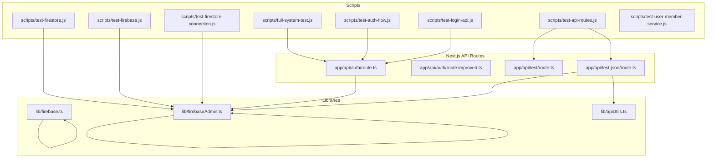

**Diagram sources**
- [full-system-test.js](file://scripts/full-system-test.js#L1-L239)
- [test-api-routes.js](file://scripts/test-api-routes.js#L1-L104)
- [test-firestore.js](file://scripts/test-firestore.js#L1-L44)
- [test-auth-flow.js](file://scripts/test-auth-flow.js#L1-L149)
- [test-firebase.js](file://scripts/test-firebase.js#L1-L102)
- [test-firestore-connection.js](file://scripts/test-firestore-connection.js#L1-L102)
- [test-login-api.js](file://scripts/test-login-api.js#L1-L58)
- [route.ts](file://app/api/auth/route.ts#L1-L295)
- [route.improved.ts](file://app/api/auth/route.improved.ts#L1-L228)
- [route.ts](file://app/api/test/route.ts#L1-L59)
- [route.ts](file://app/api/test-json/route.ts#L1-L137)
- [firebase.ts](file://lib/firebase.ts#L1-L309)
- [firebaseAdmin.ts](file://lib/firebaseAdmin.ts#L1-L277)
- [apiUtils.ts](file://lib/apiUtils.ts#L1-L109)

**Section sources**
- [full-system-test.js](file://scripts/full-system-test.js#L1-L239)
- [test-api-routes.js](file://scripts/test-api-routes.js#L1-L104)
- [test-firestore.js](file://scripts/test-firestore.js#L1-L44)
- [test-auth-flow.js](file://scripts/test-auth-flow.js#L1-L149)
- [test-firebase.js](file://scripts/test-firebase.js#L1-L102)
- [test-firestore-connection.js](file://scripts/test-firestore-connection.js#L1-L102)
- [test-login-api.js](file://scripts/test-login-api.js#L1-L58)
- [test-user-member-service.js](file://scripts/test-user-member-service.js#L1-L39)
- [route.ts](file://app/api/auth/route.ts#L1-L295)
- [route.improved.ts](file://app/api/auth/route.improved.ts#L1-L228)
- [route.ts](file://app/api/test/route.ts#L1-L59)
- [route.ts](file://app/api/test-json/route.ts#L1-L137)
- [firebase.ts](file://lib/firebase.ts#L1-L309)
- [firebaseAdmin.ts](file://lib/firebaseAdmin.ts#L1-L277)
- [apiUtils.ts](file://lib/apiUtils.ts#L1-L109)

## Core Components
This section outlines the core integration testing components and their responsibilities.

- full-system-test.js
  - Purpose: Comprehensive role-based access control verification across all user roles.
  - Key behaviors: Role validation, dashboard path determination, and pass/fail reporting.
  - Outputs: Console logs indicating success or failure per role and summary statistics.

- test-api-routes.js
  - Purpose: Validates API endpoints return JSON responses consistently.
  - Key behaviors: Iterates through predefined routes, checks Content-Type header, and inspects response shape.
  - Outputs: Per-route status, content-type, JSON detection, and aggregated pass/fail counts.

- test-firestore.js
  - Purpose: Tests Firestore connectivity and basic read operations.
  - Key behaviors: Initializes Firebase Admin SDK using environment variables, connects to Firestore, and retrieves a sample document.
  - Outputs: Document count and data inspection results.

**Section sources**
- [full-system-test.js](file://scripts/full-system-test.js#L1-L239)
- [test-api-routes.js](file://scripts/test-api-routes.js#L1-L104)
- [test-firestore.js](file://scripts/test-firestore.js#L1-L44)

## Architecture Overview
The integration testing architecture ties together scripts, Next.js API routes, and Firebase utilities. The flow below illustrates how tests exercise the system end-to-end.

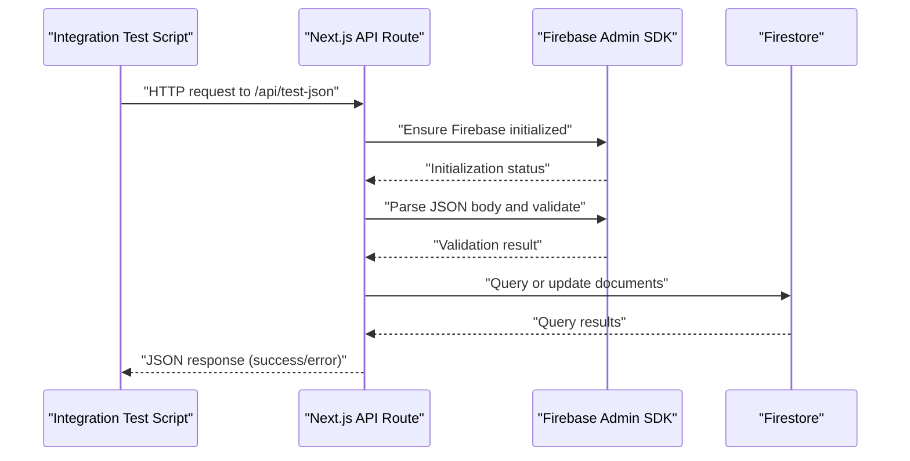

**Diagram sources**
- [test-api-routes.js](file://scripts/test-api-routes.js#L1-L104)
- [route.ts](file://app/api/test-json/route.ts#L1-L137)
- [firebaseAdmin.ts](file://lib/firebaseAdmin.ts#L1-L277)

## Detailed Component Analysis

### Full System Test: Role-Based Access Control
The full-system-test.js script simulates the entire authentication and redirection flow for multiple roles. It validates:
- Role existence and normalization
- Correct dashboard path assignment
- Error handling for invalid roles

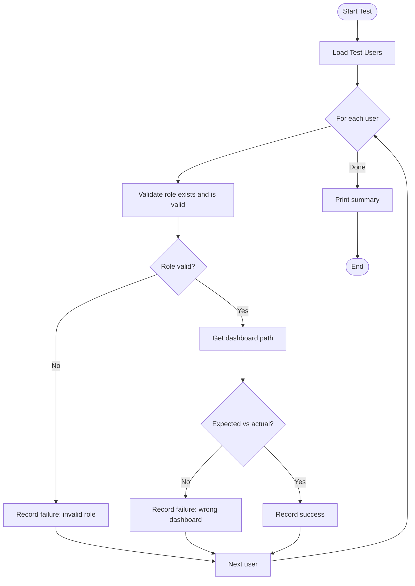

**Diagram sources**
- [full-system-test.js](file://scripts/full-system-test.js#L1-L239)

**Section sources**
- [full-system-test.js](file://scripts/full-system-test.js#L1-L239)

### API Route JSON Response Validation
The test-api-routes.js script systematically tests API endpoints for JSON compliance and response correctness. It:
- Sends HTTP requests to multiple routes
- Checks Content-Type header for application/json
- Parses and validates JSON responses
- Reports pass/fail counts

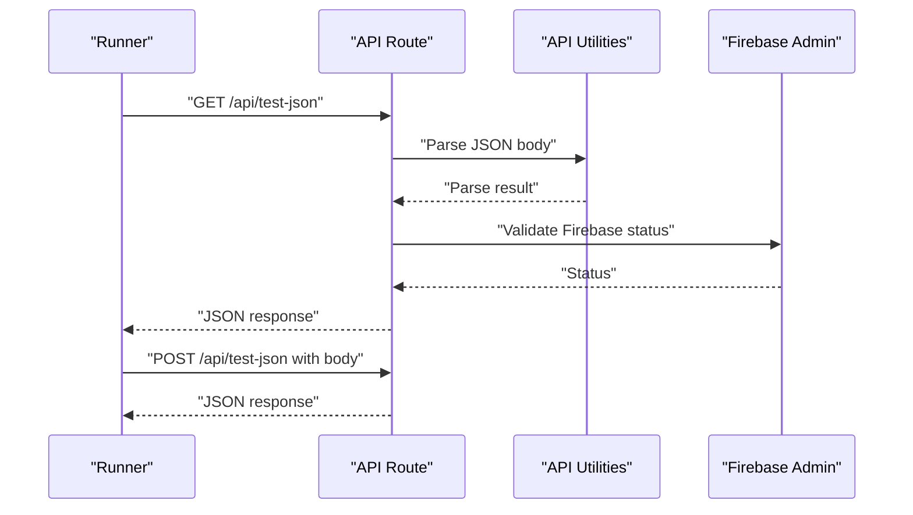

**Diagram sources**
- [test-api-routes.js](file://scripts/test-api-routes.js#L1-L104)
- [route.ts](file://app/api/test-json/route.ts#L1-L137)
- [apiUtils.ts](file://lib/apiUtils.ts#L1-L109)
- [firebaseAdmin.ts](file://lib/firebaseAdmin.ts#L1-L277)

**Section sources**
- [test-api-routes.js](file://scripts/test-api-routes.js#L1-L104)
- [route.ts](file://app/api/test-json/route.ts#L1-L137)
- [apiUtils.ts](file://lib/apiUtils.ts#L1-L109)
- [firebaseAdmin.ts](file://lib/firebaseAdmin.ts#L1-L277)

### Firestore Connectivity and Operations
The test-firestore.js script initializes Firebase Admin SDK and performs a basic Firestore read operation to verify connectivity.

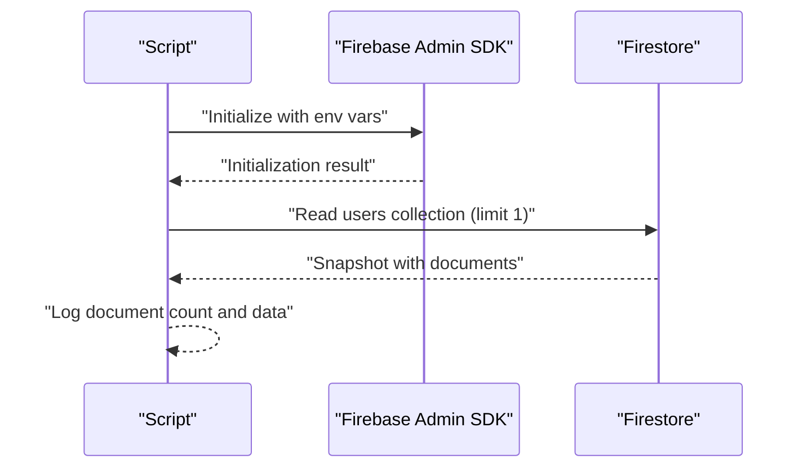

**Diagram sources**
- [test-firestore.js](file://scripts/test-firestore.js#L1-L44)
- [firebaseAdmin.ts](file://lib/firebaseAdmin.ts#L1-L277)

**Section sources**
- [test-firestore.js](file://scripts/test-firestore.js#L1-L44)
- [firebaseAdmin.ts](file://lib/firebaseAdmin.ts#L1-L277)

### Authentication Flow Testing
The test-auth-flow.js script simulates login and dashboard redirection for various roles, validating expected behavior.

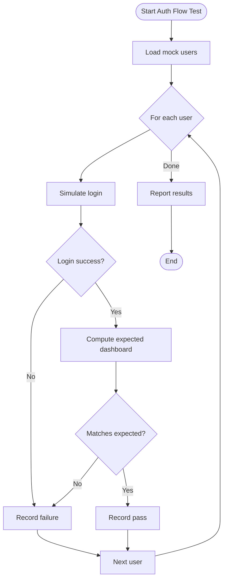

**Diagram sources**
- [test-auth-flow.js](file://scripts/test-auth-flow.js#L1-L149)

**Section sources**
- [test-auth-flow.js](file://scripts/test-auth-flow.js#L1-L149)

### Firebase Connection Verification
The test-firebase.js script validates Firebase Admin SDK configuration and performs basic Firestore operations, including cleanup.

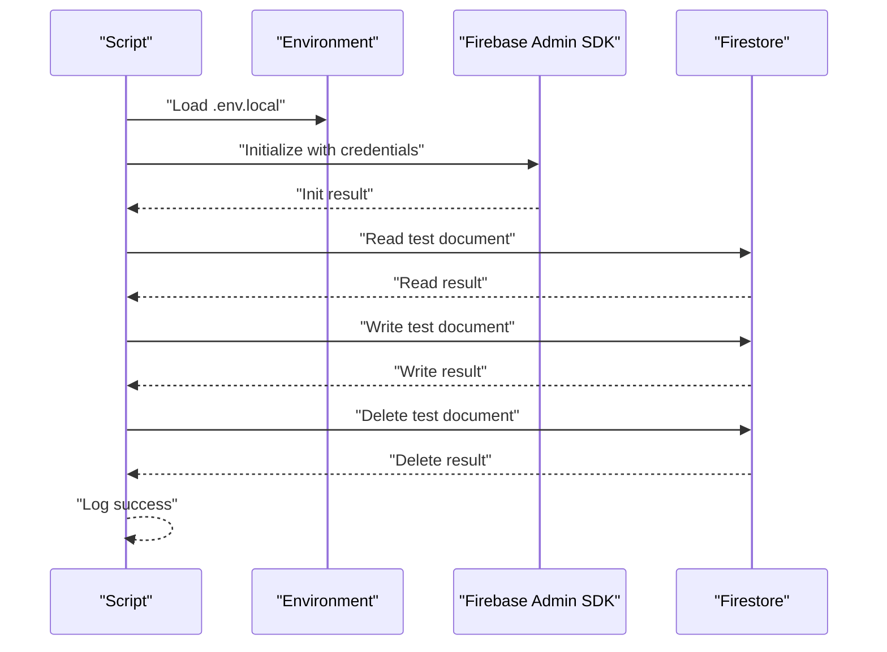

**Diagram sources**
- [test-firebase.js](file://scripts/test-firebase.js#L1-L102)
- [firebaseAdmin.ts](file://lib/firebaseAdmin.ts#L1-L277)

**Section sources**
- [test-firebase.js](file://scripts/test-firebase.js#L1-L102)
- [firebaseAdmin.ts](file://lib/firebaseAdmin.ts#L1-L277)

### Firestore Connection Test (Alternative)
The test-firestore-connection.js script demonstrates listing collections and retrieving sample documents from users and members collections.

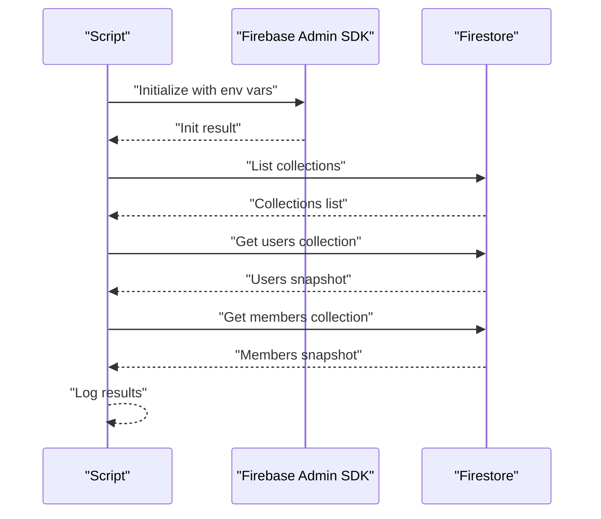

**Diagram sources**
- [test-firestore-connection.js](file://scripts/test-firestore-connection.js#L1-L102)
- [firebaseAdmin.ts](file://lib/firebaseAdmin.ts#L1-L277)

**Section sources**
- [test-firestore-connection.js](file://scripts/test-firestore-connection.js#L1-L102)
- [firebaseAdmin.ts](file://lib/firebaseAdmin.ts#L1-L277)

### Login API Endpoint Verification
The test-login-api.js script outlines expectations for the login API endpoint, focusing on request validation, error handling, success responses, and JSON formatting.

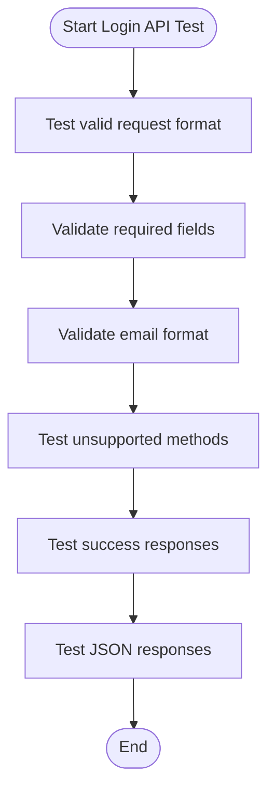

**Diagram sources**
- [test-login-api.js](file://scripts/test-login-api.js#L1-L58)
- [route.ts](file://app/api/auth/route.ts#L1-L295)

**Section sources**
- [test-login-api.js](file://scripts/test-login-api.js#L1-L58)
- [route.ts](file://app/api/auth/route.ts#L1-L295)

### User-Member Service Function Testing
The test-user-member-service.js script tests user ID generation functions without requiring Firebase Admin.

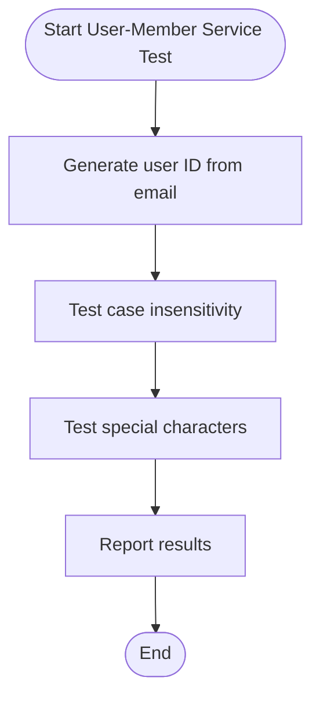

**Diagram sources**
- [test-user-member-service.js](file://scripts/test-user-member-service.js#L1-L39)

**Section sources**
- [test-user-member-service.js](file://scripts/test-user-member-service.js#L1-L39)

## Dependency Analysis
The integration tests depend on Next.js API routes and Firebase utilities. The following diagram shows key dependencies.

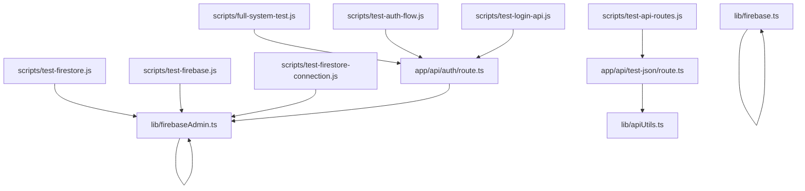

**Diagram sources**
- [full-system-test.js](file://scripts/full-system-test.js#L1-L239)
- [test-api-routes.js](file://scripts/test-api-routes.js#L1-L104)
- [test-firestore.js](file://scripts/test-firestore.js#L1-L44)
- [test-auth-flow.js](file://scripts/test-auth-flow.js#L1-L149)
- [test-firebase.js](file://scripts/test-firebase.js#L1-L102)
- [test-firestore-connection.js](file://scripts/test-firestore-connection.js#L1-L102)
- [test-login-api.js](file://scripts/test-login-api.js#L1-L58)
- [route.ts](file://app/api/auth/route.ts#L1-L295)
- [route.ts](file://app/api/test-json/route.ts#L1-L137)
- [firebaseAdmin.ts](file://lib/firebaseAdmin.ts#L1-L277)
- [apiUtils.ts](file://lib/apiUtils.ts#L1-L109)
- [firebase.ts](file://lib/firebase.ts#L1-L309)

**Section sources**
- [full-system-test.js](file://scripts/full-system-test.js#L1-L239)
- [test-api-routes.js](file://scripts/test-api-routes.js#L1-L104)
- [test-firestore.js](file://scripts/test-firestore.js#L1-L44)
- [test-auth-flow.js](file://scripts/test-auth-flow.js#L1-L149)
- [test-firebase.js](file://scripts/test-firebase.js#L1-L102)
- [test-firestore-connection.js](file://scripts/test-firestore-connection.js#L1-L102)
- [test-login-api.js](file://scripts/test-login-api.js#L1-L58)
- [route.ts](file://app/api/auth/route.ts#L1-L295)
- [route.ts](file://app/api/test-json/route.ts#L1-L137)
- [firebaseAdmin.ts](file://lib/firebaseAdmin.ts#L1-L277)
- [apiUtils.ts](file://lib/apiUtils.ts#L1-L109)
- [firebase.ts](file://lib/firebase.ts#L1-L309)

## Performance Considerations
- Minimize external network calls in tests by mocking or stubbing APIs where appropriate.
- Batch Firestore queries to reduce round trips and improve throughput.
- Use environment-specific configurations to avoid unnecessary overhead in local testing.
- Implement retry logic for transient failures in database operations.
- Monitor response times and error rates for API endpoints to identify bottlenecks.

## Troubleshooting Guide
Common issues and resolutions for integration test failures:

- Firebase Admin Initialization Errors
  - Symptoms: Initialization failures or missing credentials.
  - Actions: Verify environment variables in .env.local, regenerate service account keys, and restart the development server.

- API Response Type Mismatches
  - Symptoms: Non-JSON responses or inconsistent error structures.
  - Actions: Ensure all API routes return JSON using standardized utilities and validate request bodies.

- Authentication Flow Failures
  - Symptoms: Incorrect dashboard redirection or role validation errors.
  - Actions: Confirm role normalization and expected dashboard mappings align with system logic.

- Firestore Connectivity Issues
  - Symptoms: Connection timeouts or permission denied errors.
  - Actions: Check Firestore rules, verify collection names, and confirm database availability.

- Real-Time Updates and Consistency
  - Symptoms: Stale data or missed updates.
  - Actions: Implement client-side listeners, validate write transactions, and monitor for eventual consistency.

**Section sources**
- [test-firebase.js](file://scripts/test-firebase.js#L1-L102)
- [test-firestore.js](file://scripts/test-firestore.js#L1-L44)
- [test-firestore-connection.js](file://scripts/test-firestore-connection.js#L1-L102)
- [route.ts](file://app/api/auth/route.ts#L1-L295)
- [route.ts](file://app/api/test-json/route.ts#L1-L137)
- [apiUtils.ts](file://lib/apiUtils.ts#L1-L109)
- [firebaseAdmin.ts](file://lib/firebaseAdmin.ts#L1-L277)

## Conclusion
The integration testing suite for the SAMPA Cooperative Management System provides robust coverage of authentication, API endpoints, and Firestore connectivity. By leveraging the provided scripts and understanding the underlying architecture, teams can ensure reliable system behavior, consistent JSON responses, and accurate role-based access control. Adopting the troubleshooting and performance recommendations will further strengthen the reliability and maintainability of the system.

## Appendices
- Practical Examples
  - Loan Management Workflow: Use test-api-routes.js to validate endpoints for loan applications and requests, ensuring JSON responses and proper validation.
  - Savings Transactions: Validate savings-related endpoints with test-api-routes.js and confirm Firestore updates via test-firestore.js.
  - Member Registration: Verify registration flows by checking API responses and Firestore writes using the provided scripts.

- Testing Strategies
  - Real-Time Updates: Implement client-side listeners and validate event ordering and consistency.
  - Database Consistency: Use transactional writes and verify atomicity across related documents.
  - API Reliability: Employ retry mechanisms and circuit breakers for transient failures.

- Debugging Approaches
  - Enable verbose logging in API routes and scripts.
  - Use environment-specific configurations for isolated testing.
  - Validate error handling paths and ensure consistent JSON responses.