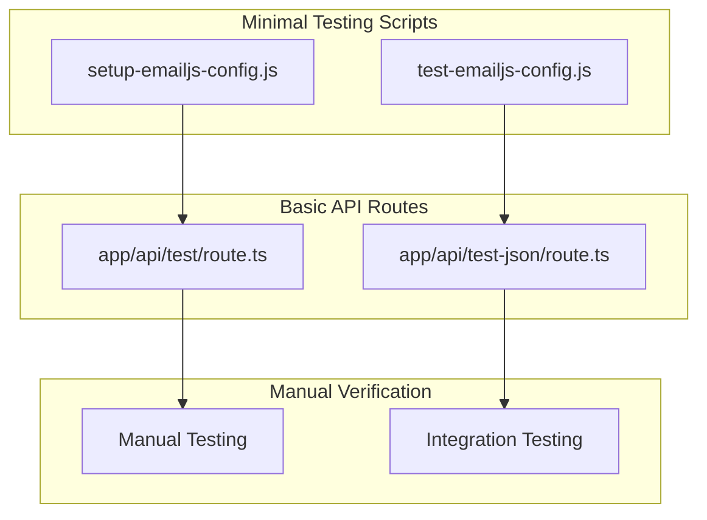
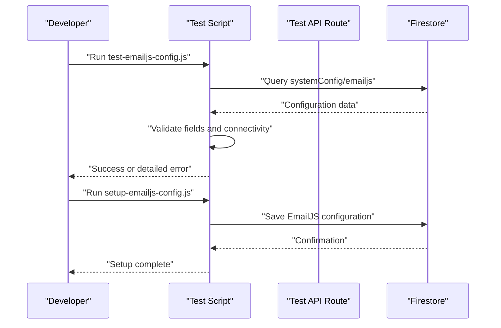

# Test Automation Scripts

<cite>
**Referenced Files in This Document**
- [setup-emailjs-config.js](file://scripts/setup-emailjs-config.js)
- [test-emailjs-config.js](file://scripts/test-emailjs-config.js)
- [route.ts](file://app/api/test/route.ts)
- [route.ts](file://app/api/test-json/route.ts)
- [package.json](file://package.json)
- [README.md](file://README.md)
</cite>

## Update Summary
**Changes Made**
- Updated to reflect the significant reduction in test automation infrastructure
- Removed comprehensive documentation of deleted test scripts (debug-member-records.js, deploy-activity-logs-indexes.js, deploy-loan-indexes.js, detailed-member-diagnostic.js, diagnose-firebase.js, etc.)
- Streamlined documentation to focus on current minimal testing capabilities
- Updated architecture overview to reflect simplified testing approach
- Revised troubleshooting guide to match current available scripts

## Table of Contents
1. [Introduction](#introduction)
2. [Current Testing Infrastructure](#current-testing-infrastructure)
3. [Available Test Scripts](#available-test-scripts)
4. [Basic API Testing](#basic-api-testing)
5. [EmailJS Configuration Testing](#emailjs-configuration-testing)
6. [Testing Architecture](#testing-architecture)
7. [Migration from Deleted Scripts](#migration-from-deleted-scripts)
8. [Troubleshooting Guide](#troubleshooting-guide)
9. [Best Practices](#best-practices)
10. [Future Considerations](#future-considerations)

## Introduction
This document describes the current minimal test automation infrastructure for the SAMPA Cooperative Management System. Due to recent architectural changes, the comprehensive suite of automated testing scripts has been streamlined and moved toward manual verification and integrated testing approaches. The system now focuses on essential configuration validation and basic API functionality testing.

**Updated** The extensive test automation suite including debug-member-records.js, deploy-activity-logs-indexes.js, deploy-loan-indexes.js, detailed-member-diagnostic.js, diagnose-firebase.js, test-all-users-auth.js, full-system-test.js, test-auth-flow.js, test-api-routes.js, test-firestore.js, and many others has been removed as part of a testing infrastructure consolidation effort.

## Current Testing Infrastructure
The testing infrastructure has been significantly reduced to focus on essential configuration and basic functionality validation:

**Diagram sources**
- [setup-emailjs-config.js:1-79](file://scripts/setup-emailjs-config.js#L1-L79)
- [test-emailjs-config.js:1-69](file://scripts/test-emailjs-config.js#L1-L69)
- [route.ts:1-59](file://app/api/test/route.ts#L1-L59)
- [route.ts:1-137](file://app/api/test-json/route.ts#L1-L137)

**Section sources**
- [setup-emailjs-config.js:1-79](file://scripts/setup-emailjs-config.js#L1-L79)
- [test-emailjs-config.js:1-69](file://scripts/test-emailjs-config.js#L1-L69)
- [route.ts:1-59](file://app/api/test/route.ts#L1-L59)
- [route.ts:1-137](file://app/api/test-json/route.ts#L1-L137)

## Available Test Scripts

### EmailJS Configuration Scripts
The system now includes two focused scripts for EmailJS configuration management:

#### setup-emailjs-config.js
Purpose: Configures EmailJS credentials in Firestore database
- Initializes Firebase with environment variables or defaults
- Validates placeholder values and warns about them
- Saves configuration to Firestore systemConfig collection
- Provides step-by-step credential setup guidance

#### test-emailjs-config.js
Purpose: Validates EmailJS configuration in Firestore
- Checks if configuration document exists
- Verifies all required fields are present
- Confirms Firestore connectivity
- Provides actionable error messages for resolution

**Section sources**
- [setup-emailjs-config.js:1-79](file://scripts/setup-emailjs-config.js#L1-L79)
- [test-emailjs-config.js:1-69](file://scripts/test-emailjs-config.js#L1-L69)

## Basic API Testing
The system maintains minimal API testing capabilities through dedicated test routes:

### Simple Test Route (GET/POST)
Located at `/api/test` - provides basic endpoint validation:
- GET: Returns success status with timestamp
- POST: Echoes request body back with success indicator
- Method validation: Properly handles unsupported methods

### Advanced Test Route (Comprehensive JSON Handling)
Located at `/api/test-json` - demonstrates best practices:
- JSON response consistency across all scenarios
- Comprehensive error handling and validation
- Firebase initialization status checking
- Multiple test action scenarios (success, validation errors, various HTTP statuses)

**Section sources**
- [route.ts:1-59](file://app/api/test/route.ts#L1-L59)
- [route.ts:1-137](file://app/api/test-json/route.ts#L1-L137)

## Testing Architecture
The current testing approach follows a simplified architecture:

**Diagram sources**
- [test-emailjs-config.js:19-66](file://scripts/test-emailjs-config.js#L19-L66)
- [setup-emailjs-config.js:28-78](file://scripts/setup-emailjs-config.js#L28-L78)

**Section sources**
- [test-emailjs-config.js:1-69](file://scripts/test-emailjs-config.js#L1-L69)
- [setup-emailjs-config.js:1-79](file://scripts/setup-emailjs-config.js#L1-L79)

## Migration from Deleted Scripts
The removal of comprehensive test automation scripts requires adaptation to new testing approaches:

### What Was Removed
- Multi-user authentication validation scripts
- Full system access control testing
- API endpoint comprehensive validation
- Firestore connectivity and operation tests
- Search functionality validation
- Role-based routing tests
- Environment configuration validation
- Performance and load testing scripts

### How to Adapt
1. **Manual Verification**: Rely on manual testing procedures for complex scenarios
2. **Integrated Testing**: Incorporate testing into application workflows
3. **CI/CD Integration**: Use existing deployment pipelines for validation
4. **Component Testing**: Implement testing at the component level within the application
5. **Database Testing**: Use application-level tests for Firestore operations

### Benefits of Streamlined Approach
- Reduced maintenance overhead
- Simplified deployment processes
- Better integration with development workflows
- Lower resource consumption
- Faster iteration cycles

## Troubleshooting Guide

### EmailJS Configuration Issues
**Problem**: Missing or invalid EmailJS configuration
- Run `node scripts/test-emailjs-config.js` to diagnose issues
- Check Firestore document `systemConfig/emailjs` exists
- Verify all required fields (publicKey, serviceId, receiptTemplateId)
- Use `node scripts/setup-emailjs-config.js` to reconfigure

**Problem**: Placeholder values detected
- Script automatically warns about placeholder credentials
- Update script with actual EmailJS credentials
- Set environment variables for production deployments

### API Test Route Issues
**Problem**: Test routes not responding
- Ensure Next.js development server is running
- Verify routes are accessible at `/api/test` and `/api/test-json`
- Check server logs for error messages
- Validate CORS settings if testing from browser

**Problem**: JSON response format issues
- Test routes are designed to always return JSON
- Check request body formatting for POST requests
- Verify Content-Type headers are set correctly

### General Testing Issues
**Problem**: Scripts failing due to environment
- Ensure Firebase credentials are configured
- Verify Firestore connectivity
- Check Node.js version compatibility
- Validate script execution permissions

**Section sources**
- [test-emailjs-config.js:19-66](file://scripts/test-emailjs-config.js#L19-L66)
- [setup-emailjs-config.js:28-78](file://scripts/setup-emailjs-config.js#L28-L78)
- [route.ts:1-59](file://app/api/test/route.ts#L1-L59)
- [route.ts:1-137](file://app/api/test-json/route.ts#L1-L137)

## Best Practices

### Current Testing Approach
1. **Manual Testing**: Perform thorough manual verification for critical functionality
2. **Integration Testing**: Test features as integrated components rather than isolated units
3. **Environment Validation**: Use existing deployment pipelines for environment verification
4. **Incremental Testing**: Add tests incrementally as features develop

### EmailJS Configuration Best Practices
1. **Credential Management**: Store EmailJS credentials securely in environment variables
2. **Configuration Validation**: Regularly test EmailJS configuration using provided scripts
3. **Template Management**: Keep EmailJS templates synchronized with application requirements
4. **Error Handling**: Implement robust error handling for email sending operations

### API Testing Best Practices
1. **Consistent Response Format**: Maintain JSON response consistency across all endpoints
2. **Error Handling**: Implement comprehensive error handling and validation
3. **Documentation**: Keep API documentation updated with test results
4. **Monitoring**: Monitor API performance and reliability

## Future Considerations
The streamlined testing approach provides flexibility for future enhancements:

### Potential Enhancements
1. **Component-Level Testing**: Implement React component testing frameworks
2. **Database Testing**: Add comprehensive Firestore testing utilities
3. **Performance Monitoring**: Integrate performance testing into CI/CD pipelines
4. **Automated Integration Tests**: Develop automated integration testing framework

### Migration Path
1. **Assess Requirements**: Evaluate testing needs for specific features
2. **Choose Approach**: Select appropriate testing methodology (manual, integrated, or automated)
3. **Implement Gradually**: Add testing capabilities incrementally
4. **Maintain Balance**: Balance testing comprehensiveness with development speed

### Technology Considerations
1. **Framework Selection**: Choose testing frameworks that integrate well with Next.js
2. **CI/CD Integration**: Ensure testing fits into existing deployment pipelines
3. **Resource Planning**: Consider testing infrastructure costs and complexity
4. **Team Training**: Provide training for team members on testing methodologies

**Section sources**
- [README.md:1-37](file://README.md#L1-L37)
- [package.json:1-53](file://package.json#L1-L53)