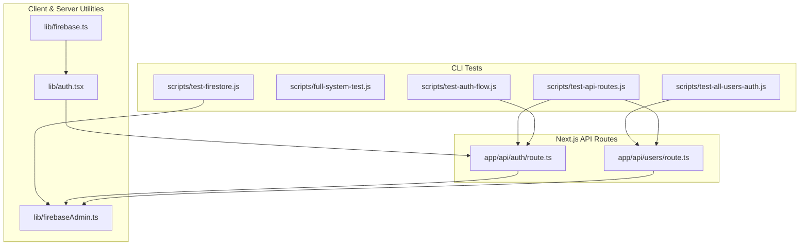
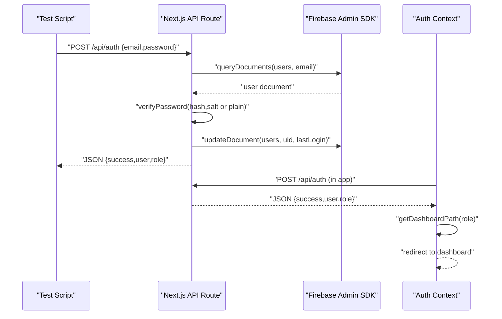
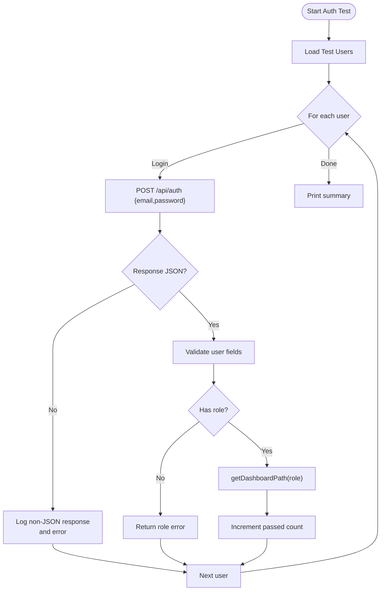
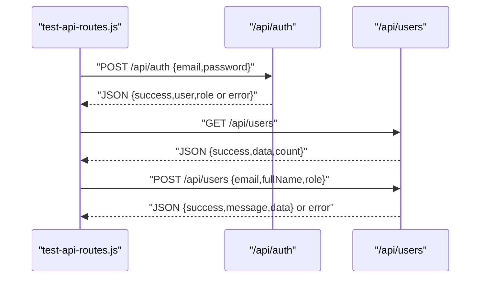
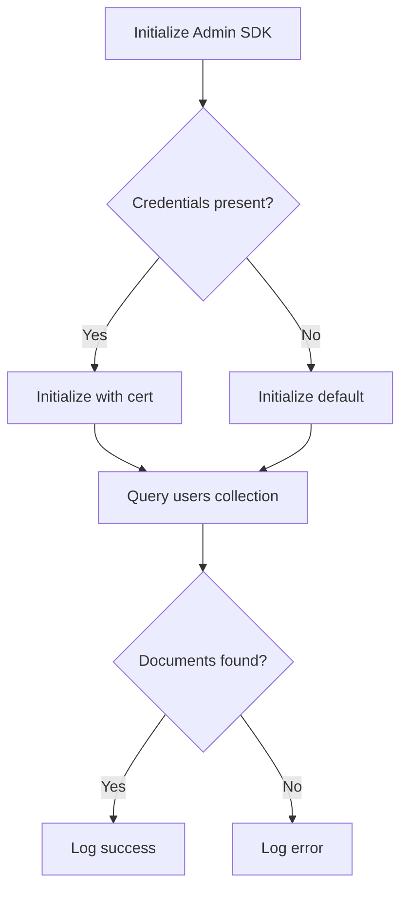
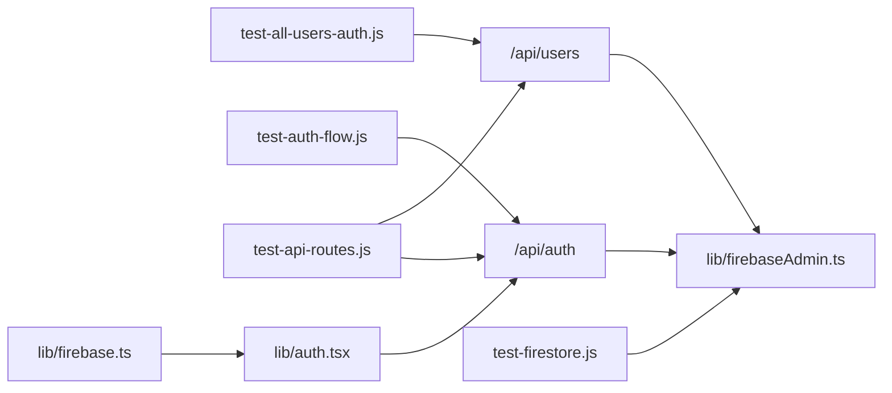

# Testing & Quality Assurance

<cite>
**Referenced Files in This Document**
- [eslint.config.mjs](file://eslint.config.mjs)
- [package.json](file://package.json)
- [scripts/test-all-users-auth.js](file://scripts/test-all-users-auth.js)
- [scripts/full-system-test.js](file://scripts/full-system-test.js)
- [scripts/test-api-routes.js](file://scripts/test-api-routes.js)
- [scripts/test-auth-flow.js](file://scripts/test-auth-flow.js)
- [scripts/test-firestore.js](file://scripts/test-firestore.js)
- [app/api/auth/route.ts](file://app/api/auth/route.ts)
- [app/api/users/route.ts](file://app/api/users/route.ts)
- [lib/auth.tsx](file://lib/auth.tsx)
- [lib/firebase.ts](file://lib/firebase.ts)
- [lib/firebaseAdmin.ts](file://lib/firebaseAdmin.ts)
</cite>

## Table of Contents
1. [Introduction](#introduction)
2. [Project Structure](#project-structure)
3. [Core Components](#core-components)
4. [Architecture Overview](#architecture-overview)
5. [Detailed Component Analysis](#detailed-component-analysis)
6. [Dependency Analysis](#dependency-analysis)
7. [Performance Considerations](#performance-considerations)
8. [Troubleshooting Guide](#troubleshooting-guide)
9. [Conclusion](#conclusion)
10. [Appendices](#appendices)

## Introduction
This document provides comprehensive testing and quality assurance guidance for the SAMPA Cooperative Management System. It covers unit testing, integration testing, and end-to-end testing strategies, details the test scripts for authentication, API routes, and Firestore operations, and outlines ESLint configuration and code quality standards. It also includes best practices for Next.js applications, Firebase integration testing, React component testing, CI/CD pipelines, and testing approaches for performance, security, and accessibility.

## Project Structure
The testing ecosystem is organized around:
- Test scripts under scripts/ for CLI-driven verification of authentication, API routes, and Firestore connectivity
- Next.js API routes under app/api/ implementing JSON-first responses suitable for automated testing
- Client-side authentication logic under lib/auth.tsx and Firebase utilities under lib/firebase.ts and lib/firebaseAdmin.ts
- ESLint configuration enforcing Next.js and TypeScript standards

**Diagram sources**
- [scripts/test-all-users-auth.js](file://scripts/test-all-users-auth.js#L1-L128)
- [scripts/full-system-test.js](file://scripts/full-system-test.js#L1-L239)
- [scripts/test-api-routes.js](file://scripts/test-api-routes.js#L1-L104)
- [scripts/test-auth-flow.js](file://scripts/test-auth-flow.js#L1-L149)
- [scripts/test-firestore.js](file://scripts/test-firestore.js#L1-L44)
- [app/api/auth/route.ts](file://app/api/auth/route.ts#L1-L295)
- [app/api/users/route.ts](file://app/api/users/route.ts#L1-L126)
- [lib/auth.tsx](file://lib/auth.tsx#L1-L682)
- [lib/firebase.ts](file://lib/firebase.ts#L1-L309)
- [lib/firebaseAdmin.ts](file://lib/firebaseAdmin.ts#L1-L277)

**Section sources**
- [eslint.config.mjs](file://eslint.config.mjs#L1-L19)
- [package.json](file://package.json#L1-L53)

## Core Components
- Authentication API route: Implements JSON-first responses, input validation, password verification, role validation, and user-member linkage validation.
- Users API route: Returns JSON success/error responses and supports GET and POST with validation helpers.
- Client authentication context: Provides sign-in/sign-up flows, role-based dashboard resolution, and robust error handling for non-JSON responses.
- Firebase utilities: Client SDK wrapper with connection validation and standardized CRUD operations; Admin SDK wrapper for server-side operations with initialization checks and error propagation.
- Test scripts: Standalone Node.js scripts validating authentication workflows, API JSON responses, Firestore connectivity, and role-based redirection.

**Section sources**
- [app/api/auth/route.ts](file://app/api/auth/route.ts#L1-L295)
- [app/api/users/route.ts](file://app/api/users/route.ts#L1-L126)
- [lib/auth.tsx](file://lib/auth.tsx#L1-L682)
- [lib/firebase.ts](file://lib/firebase.ts#L1-L309)
- [lib/firebaseAdmin.ts](file://lib/firebaseAdmin.ts#L1-L277)
- [scripts/test-all-users-auth.js](file://scripts/test-all-users-auth.js#L1-L128)
- [scripts/full-system-test.js](file://scripts/full-system-test.js#L1-L239)
- [scripts/test-api-routes.js](file://scripts/test-api-routes.js#L1-L104)
- [scripts/test-auth-flow.js](file://scripts/test-auth-flow.js#L1-L149)
- [scripts/test-firestore.js](file://scripts/test-firestore.js#L1-L44)

## Architecture Overview
The testing architecture leverages:
- JSON-first API design ensuring predictable responses for automated tests
- Client-side auth context orchestrating login, role-based routing, and error handling
- Server-side Admin SDK for secure Firestore operations
- CLI test scripts simulating user flows and validating system behavior

**Diagram sources**
- [app/api/auth/route.ts](file://app/api/auth/route.ts#L48-L264)
- [lib/auth.tsx](file://lib/auth.tsx#L197-L348)
- [lib/firebaseAdmin.ts](file://lib/firebaseAdmin.ts#L150-L194)

## Detailed Component Analysis

### Authentication Workflow Testing
The authentication workflow is validated through:
- test-auth-flow.js: Simulates login and dashboard redirection for predefined test users
- test-all-users-auth.js: Fetches users from /api/users and validates role-based redirection logic
- full-system-test.js: Comprehensive role-based access control simulation with validation and error handling
- app/api/auth/route.ts: Implements JSON responses, input validation, password verification, role validation, and user-member linkage validation
- lib/auth.tsx: Client-side sign-in, error handling for non-JSON responses, and role-based redirection

**Diagram sources**
- [scripts/test-auth-flow.js](file://scripts/test-auth-flow.js#L109-L146)
- [scripts/test-all-users-auth.js](file://scripts/test-all-users-auth.js#L80-L125)
- [scripts/full-system-test.js](file://scripts/full-system-test.js#L180-L236)
- [app/api/auth/route.ts](file://app/api/auth/route.ts#L48-L264)
- [lib/auth.tsx](file://lib/auth.tsx#L111-L156)

**Section sources**
- [scripts/test-auth-flow.js](file://scripts/test-auth-flow.js#L1-L149)
- [scripts/test-all-users-auth.js](file://scripts/test-all-users-auth.js#L1-L128)
- [scripts/full-system-test.js](file://scripts/full-system-test.js#L1-L239)
- [app/api/auth/route.ts](file://app/api/auth/route.ts#L1-L295)
- [lib/auth.tsx](file://lib/auth.tsx#L1-L682)

### API Endpoint Testing
The API route tester validates JSON responses across multiple endpoints:
- test-api-routes.js: Tests GET/POST on example routes, auth route, users route, and JSON validation endpoints
- app/api/auth/route.ts: Ensures JSON responses for all HTTP methods and error statuses
- app/api/users/route.ts: Returns JSON success/error envelopes with consistent structure

**Diagram sources**
- [scripts/test-api-routes.js](file://scripts/test-api-routes.js#L50-L101)
- [app/api/auth/route.ts](file://app/api/auth/route.ts#L48-L264)
- [app/api/users/route.ts](file://app/api/users/route.ts#L18-L126)

**Section sources**
- [scripts/test-api-routes.js](file://scripts/test-api-routes.js#L1-L104)
- [app/api/auth/route.ts](file://app/api/auth/route.ts#L1-L295)
- [app/api/users/route.ts](file://app/api/users/route.ts#L1-L126)

### Firestore Operation Testing
Firestore connectivity and operations are verified by:
- test-firestore.js: Initializes Admin SDK and queries a sample document from the users collection
- lib/firebaseAdmin.ts: Provides server-side Firestore utilities with initialization checks and standardized CRUD operations
- lib/firebase.ts: Client-side Firestore wrapper with connection validation and CRUD helpers

**Diagram sources**
- [scripts/test-firestore.js](file://scripts/test-firestore.js#L25-L42)
- [lib/firebaseAdmin.ts](file://lib/firebaseAdmin.ts#L13-L108)
- [lib/firebase.ts](file://lib/firebase.ts#L62-L87)

**Section sources**
- [scripts/test-firestore.js](file://scripts/test-firestore.js#L1-L44)
- [lib/firebaseAdmin.ts](file://lib/firebaseAdmin.ts#L1-L277)
- [lib/firebase.ts](file://lib/firebase.ts#L1-L309)

### ESLint Configuration and Code Quality Standards
- ESLint configuration extends Next.js core-web-vitals and TypeScript configs, overriding default ignores to include build artifacts and Next.js internal folders
- Enforce consistent linting across the codebase with TypeScript and Next.js best practices

**Section sources**
- [eslint.config.mjs](file://eslint.config.mjs#L1-L19)
- [package.json](file://package.json#L9-L9)

## Dependency Analysis
The testing suite depends on:
- Next.js API routes for JSON responses
- Firebase Admin SDK for server-side Firestore operations
- Client-side auth context for login flows and role-based routing
- Environment variables for Firebase credentials

**Diagram sources**
- [scripts/test-all-users-auth.js](file://scripts/test-all-users-auth.js#L15-L24)
- [scripts/test-auth-flow.js](file://scripts/test-auth-flow.js#L44-L76)
- [scripts/test-api-routes.js](file://scripts/test-api-routes.js#L62-L70)
- [scripts/test-firestore.js](file://scripts/test-firestore.js#L23-L42)
- [app/api/auth/route.ts](file://app/api/auth/route.ts#L1-L295)
- [app/api/users/route.ts](file://app/api/users/route.ts#L1-L126)
- [lib/auth.tsx](file://lib/auth.tsx#L197-L348)
- [lib/firebase.ts](file://lib/firebase.ts#L1-L309)
- [lib/firebaseAdmin.ts](file://lib/firebaseAdmin.ts#L1-L277)

**Section sources**
- [scripts/test-all-users-auth.js](file://scripts/test-all-users-auth.js#L1-L128)
- [scripts/test-auth-flow.js](file://scripts/test-auth-flow.js#L1-L149)
- [scripts/test-api-routes.js](file://scripts/test-api-routes.js#L1-L104)
- [scripts/test-firestore.js](file://scripts/test-firestore.js#L1-L44)
- [app/api/auth/route.ts](file://app/api/auth/route.ts#L1-L295)
- [app/api/users/route.ts](file://app/api/users/route.ts#L1-L126)
- [lib/auth.tsx](file://lib/auth.tsx#L1-L682)
- [lib/firebase.ts](file://lib/firebase.ts#L1-L309)
- [lib/firebaseAdmin.ts](file://lib/firebaseAdmin.ts#L1-L277)

## Performance Considerations
- API route tests should avoid heavy computations and focus on response validation
- Firestore tests should limit query sizes and use minimal projections
- Authentication tests should mock or stub external dependencies to reduce latency
- Use caching for repeated reads in test suites where appropriate

## Troubleshooting Guide
Common issues and resolutions:
- Non-JSON responses from API routes: The client-side auth context detects non-JSON responses and logs descriptive errors; ensure API routes return JSON for all paths
- Firebase Admin initialization failures: Verify environment variables and credentials; the Admin SDK logs initialization errors and marks initialization as failed
- Role validation errors: Confirm user roles are correctly set and normalized; the auth route enforces valid roles and returns clear error messages
- Content-type mismatches: The API route tests check content-type headers and handle HTML responses gracefully

**Section sources**
- [lib/auth.tsx](file://lib/auth.tsx#L226-L248)
- [lib/firebaseAdmin.ts](file://lib/firebaseAdmin.ts#L68-L88)
- [app/api/auth/route.ts](file://app/api/auth/route.ts#L177-L192)
- [scripts/test-api-routes.js](file://scripts/test-api-routes.js#L20-L41)

## Conclusion
The SAMPA Cooperative Management System employs a robust testing strategy centered on JSON-first API design, comprehensive authentication workflows, and reliable Firestore operations. The provided scripts and utilities enable effective unit, integration, and end-to-end validation. Adhering to ESLint standards and following the outlined best practices ensures maintainable, secure, and high-quality code.

## Appendices

### Testing Best Practices for Next.js Applications
- Prefer JSON responses in API routes for deterministic testing
- Validate input early and return structured error objects
- Centralize error handling and ensure consistent status codes
- Use environment variables for secrets and initialize SDKs conditionally

### Firebase Integration Testing
- Initialize Admin SDK with explicit credentials in test environments
- Validate Firestore connection before running tests
- Use small, controlled datasets for tests and clean up after execution
- Mock or stub external services to isolate tests

### React Component Testing
- Test user interactions and state transitions
- Mock authentication context and Firebase utilities
- Verify role-based rendering and navigation
- Validate error boundaries and loading states

### Continuous Integration Testing
- Automate API route tests against a staging database
- Run Firestore connectivity tests with configured credentials
- Integrate ESLint checks in CI pipelines
- Schedule periodic smoke tests for authentication and critical flows

### Performance, Security, and Accessibility Testing
- Performance: Measure API latency and memory usage; optimize queries and caching
- Security: Validate CORS, rate limiting, and input sanitization; audit authentication flows
- Accessibility: Use automated tools to scan for WCAG compliance; test keyboard navigation and screen reader support