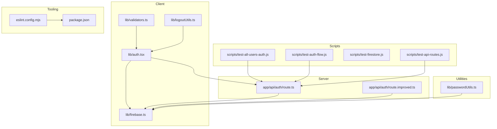
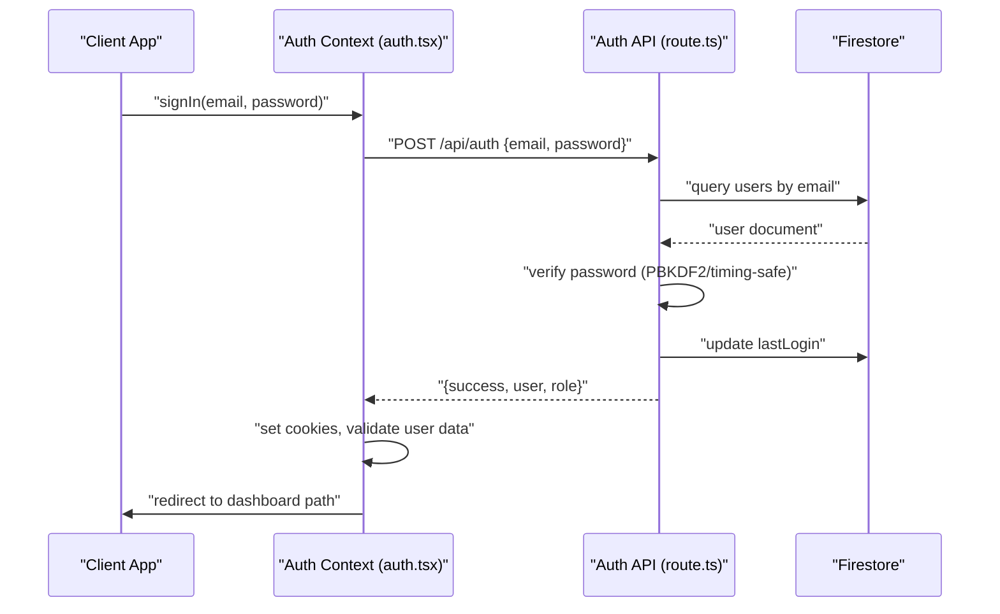
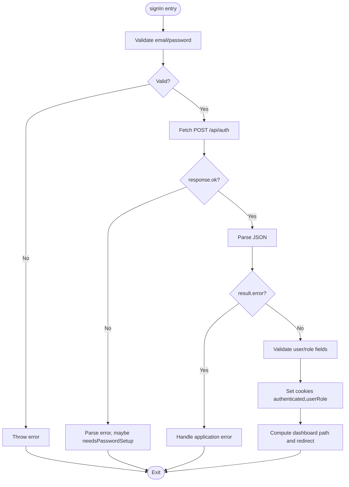
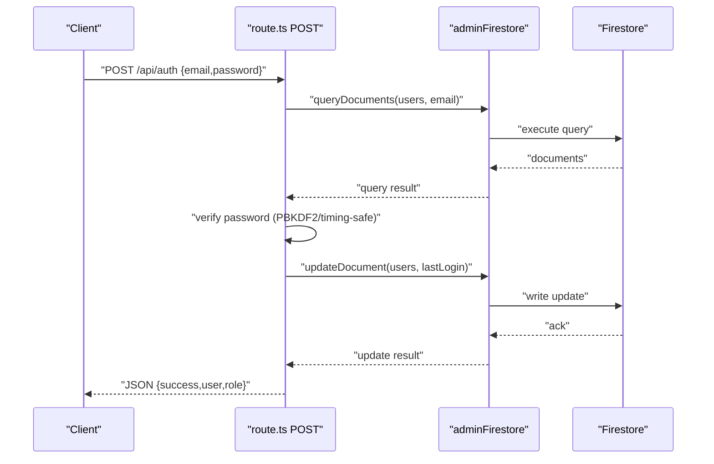
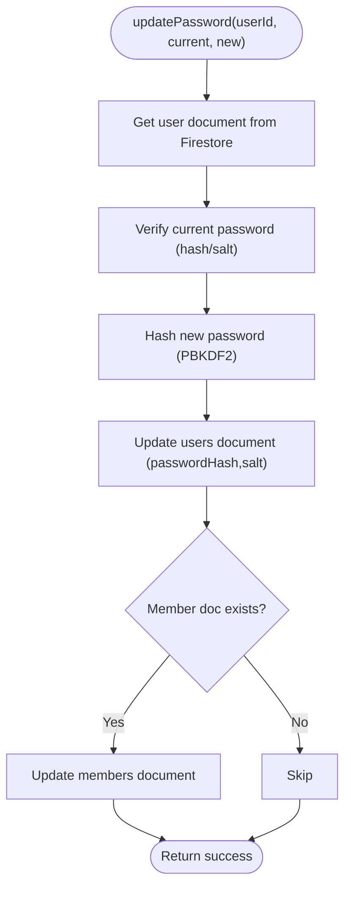
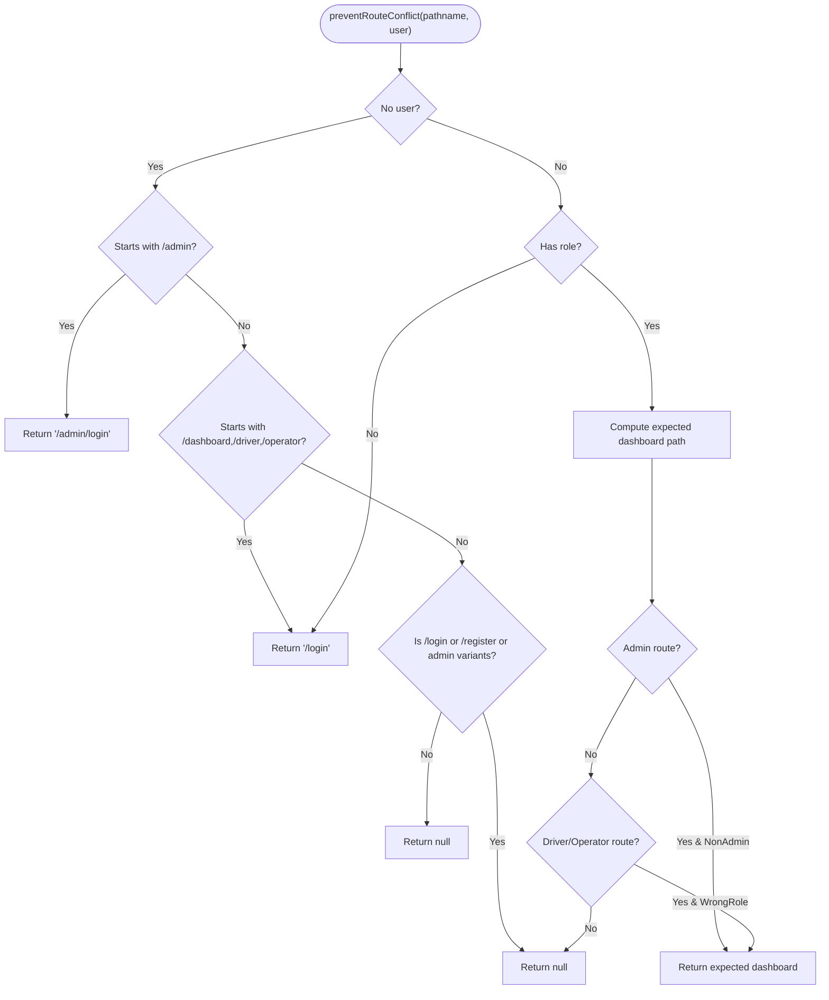
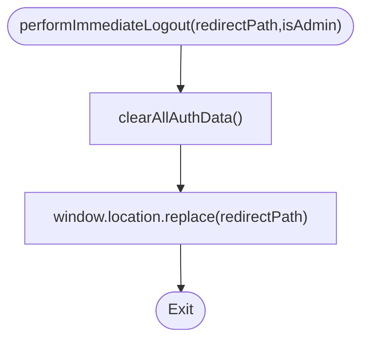
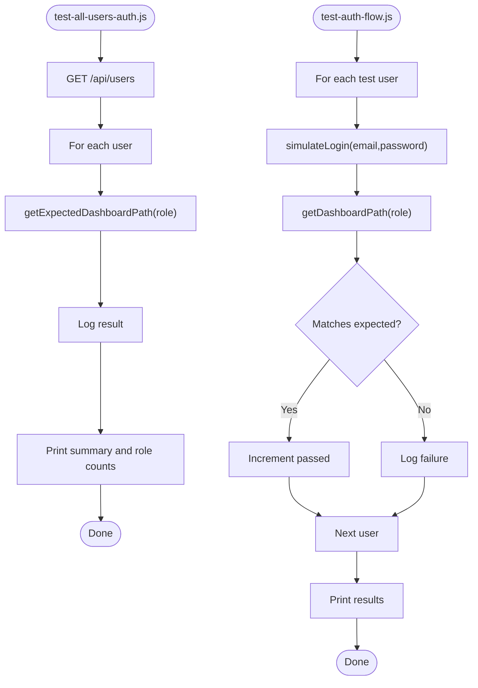
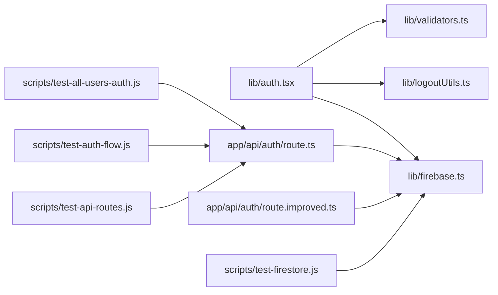

# Unit Testing Strategies

<cite>
**Referenced Files in This Document**
- [test-all-users-auth.js](file://scripts/test-all-users-auth.js)
- [test-auth-flow.js](file://scripts/test-auth-flow.js)
- [eslint.config.mjs](file://eslint.config.mjs)
- [auth.tsx](file://lib/auth.tsx)
- [firebase.ts](file://lib/firebase.ts)
- [passwordUtils.ts](file://lib/passwordUtils.ts)
- [validators.ts](file://lib/validators.ts)
- [logoutUtils.ts](file://lib/logoutUtils.ts)
- [route.ts](file://app/api/auth/route.ts)
- [route.improved.ts](file://app/api/auth/route.improved.ts)
- [test-firestore.js](file://scripts/test-firestore.js)
- [test-api-routes.js](file://scripts/test-api-routes.js)
- [package.json](file://package.json)
</cite>

## Table of Contents
1. [Introduction](#introduction)
2. [Project Structure](#project-structure)
3. [Core Components](#core-components)
4. [Architecture Overview](#architecture-overview)
5. [Detailed Component Analysis](#detailed-component-analysis)
6. [Dependency Analysis](#dependency-analysis)
7. [Performance Considerations](#performance-considerations)
8. [Troubleshooting Guide](#troubleshooting-guide)
9. [Conclusion](#conclusion)
10. [Appendices](#appendices)

## Introduction
This document presents unit testing strategies for the SAMPA Cooperative Management System with a focus on authentication. It explains how to validate authentication mechanisms across all user roles, how to test login/logout flows and session management, and how to validate role-based access control. It also covers the ESLint configuration that enforces code quality standards, testing patterns for React components, Firebase authentication functions, and utility modules. Practical examples demonstrate unit test implementation for authentication logic, user validation functions, and security checks, along with common testing challenges and debugging techniques.

## Project Structure
The testing and authentication ecosystem spans several areas:
- Scripts for end-to-end and integration-style tests
- Client-side authentication context and utilities
- Server-side API routes for authentication
- Firebase client and admin utilities
- Validation and routing helpers
- Linting configuration for code quality

**Diagram sources**
- [test-all-users-auth.js](file://scripts/test-all-users-auth.js#L1-L128)
- [test-auth-flow.js](file://scripts/test-auth-flow.js#L1-L149)
- [auth.tsx](file://lib/auth.tsx#L1-L682)
- [validators.ts](file://lib/validators.ts#L1-L236)
- [logoutUtils.ts](file://lib/logoutUtils.ts#L1-L93)
- [firebase.ts](file://lib/firebase.ts#L1-L309)
- [route.ts](file://app/api/auth/route.ts#L1-L295)
- [route.improved.ts](file://app/api/auth/route.improved.ts#L1-L228)
- [passwordUtils.ts](file://lib/passwordUtils.ts#L1-L146)
- [test-firestore.js](file://scripts/test-firestore.js#L1-L44)
- [test-api-routes.js](file://scripts/test-api-routes.js#L1-L104)
- [eslint.config.mjs](file://eslint.config.mjs#L1-L19)
- [package.json](file://package.json#L1-L53)

**Section sources**
- [test-all-users-auth.js](file://scripts/test-all-users-auth.js#L1-L128)
- [test-auth-flow.js](file://scripts/test-auth-flow.js#L1-L149)
- [auth.tsx](file://lib/auth.tsx#L1-L682)
- [route.ts](file://app/api/auth/route.ts#L1-L295)
- [route.improved.ts](file://app/api/auth/route.improved.ts#L1-L228)
- [firebase.ts](file://lib/firebase.ts#L1-L309)
- [validators.ts](file://lib/validators.ts#L1-L236)
- [logoutUtils.ts](file://lib/logoutUtils.ts#L1-L93)
- [passwordUtils.ts](file://lib/passwordUtils.ts#L1-L146)
- [test-firestore.js](file://scripts/test-firestore.js#L1-L44)
- [test-api-routes.js](file://scripts/test-api-routes.js#L1-L104)
- [eslint.config.mjs](file://eslint.config.mjs#L1-L19)
- [package.json](file://package.json#L1-L53)

## Core Components
- Authentication context and flows (React client)
  - Provides sign-in, sign-up, custom login, logout, and profile update
  - Manages cookies and redirects based on roles
  - Exposes helper to compute dashboard paths from roles
- Server-side authentication API
  - Validates input, queries Firestore, verifies password, sets last login, returns JSON
  - Ensures consistent JSON responses and handles errors gracefully
- Firebase utilities
  - Client-side initialization and Firestore helpers
  - Admin-side helpers for robust server-side operations
- Validation and routing helpers
  - Role-based access control and route conflict prevention
- Logout utilities
  - Centralized, immediate logout with cookie/session cleanup
- Password utilities
  - PBKDF2-based hashing and verification with timing-safe comparisons
- Test scripts
  - End-to-end-like tests for authentication flows and API JSON responses
  - Firestore connectivity tests

**Section sources**
- [auth.tsx](file://lib/auth.tsx#L1-L682)
- [route.ts](file://app/api/auth/route.ts#L1-L295)
- [route.improved.ts](file://app/api/auth/route.improved.ts#L1-L228)
- [firebase.ts](file://lib/firebase.ts#L1-L309)
- [validators.ts](file://lib/validators.ts#L1-L236)
- [logoutUtils.ts](file://lib/logoutUtils.ts#L1-L93)
- [passwordUtils.ts](file://lib/passwordUtils.ts#L1-L146)
- [test-all-users-auth.js](file://scripts/test-all-users-auth.js#L1-L128)
- [test-auth-flow.js](file://scripts/test-auth-flow.js#L1-L149)
- [test-api-routes.js](file://scripts/test-api-routes.js#L1-L104)
- [test-firestore.js](file://scripts/test-firestore.js#L1-L44)

## Architecture Overview
The authentication flow integrates client and server components. The client triggers sign-in, receives a JSON response, validates it, sets cookies, and redirects to the appropriate dashboard. The server validates credentials against Firestore, performs security checks, and returns structured JSON.

**Diagram sources**
- [auth.tsx](file://lib/auth.tsx#L197-L348)
- [route.ts](file://app/api/auth/route.ts#L48-L264)
- [firebase.ts](file://lib/firebase.ts#L90-L307)

## Detailed Component Analysis

### Authentication Context (React)
Key responsibilities:
- Sign-in with input validation, API call, response parsing, cookie setting, and redirect
- Custom login with similar flow and special handling for password-setup-required
- Sign-up with hashing, document creation, and cookie setting
- Logout with immediate cleanup and redirection
- Dashboard path computation from role

**Diagram sources**
- [auth.tsx](file://lib/auth.tsx#L197-L348)

**Section sources**
- [auth.tsx](file://lib/auth.tsx#L197-L348)
- [auth.tsx](file://lib/auth.tsx#L356-L514)
- [auth.tsx](file://lib/auth.tsx#L516-L561)
- [auth.tsx](file://lib/auth.tsx#L621-L635)
- [auth.tsx](file://lib/auth.tsx#L111-L156)

### Authentication API Routes
Two implementations are present:
- route.ts: Comprehensive server-side authentication with PBKDF2 verification, role validation, last login update, and JSON responses
- route.improved.ts: Alternative implementation with explicit Firebase initialization check and genericized error messages

**Diagram sources**
- [route.ts](file://app/api/auth/route.ts#L48-L264)
- [firebase.ts](file://lib/firebase.ts#L90-L307)

**Section sources**
- [route.ts](file://app/api/auth/route.ts#L48-L264)
- [route.improved.ts](file://app/api/auth/route.improved.ts#L22-L197)

### Password Utilities
Implements PBKDF2-based hashing and verification with timing-safe comparison to mitigate timing attacks. Used by both client (sign-up) and server (login) flows.

**Diagram sources**
- [passwordUtils.ts](file://lib/passwordUtils.ts#L4-L62)

**Section sources**
- [passwordUtils.ts](file://lib/passwordUtils.ts#L64-L122)
- [passwordUtils.ts](file://lib/passwordUtils.ts#L124-L146)

### Validation and Routing Helpers
Provide role-based access control and route conflict prevention. They compute expected dashboard paths and enforce access rules.

**Diagram sources**
- [validators.ts](file://lib/validators.ts#L112-L191)

**Section sources**
- [validators.ts](file://lib/validators.ts#L9-L19)
- [validators.ts](file://lib/validators.ts#L27-L60)
- [validators.ts](file://lib/validators.ts#L199-L235)

### Logout Utilities
Centralized logout utilities clear cookies, localStorage, and sessionStorage, then force immediate redirect.

**Diagram sources**
- [logoutUtils.ts](file://lib/logoutUtils.ts#L16-L50)

**Section sources**
- [logoutUtils.ts](file://lib/logoutUtils.ts#L16-L50)

### Test Scripts: Authentication Coverage
- test-all-users-auth.js
  - Fetches all users from the users API
  - Computes expected dashboard path per role and logs pass/fail
  - Summarizes role distribution
- test-auth-flow.js
  - Simulates login for predefined test users
  - Verifies dashboard path resolution per role
  - Reports pass/fail counts

**Diagram sources**
- [test-all-users-auth.js](file://scripts/test-all-users-auth.js#L11-L125)
- [test-auth-flow.js](file://scripts/test-auth-flow.js#L109-L146)

**Section sources**
- [test-all-users-auth.js](file://scripts/test-all-users-auth.js#L1-L128)
- [test-auth-flow.js](file://scripts/test-auth-flow.js#L1-L149)

### API JSON Response Testing
- test-api-routes.js
  - Tests multiple routes and methods
  - Verifies content-type is application/json
  - Parses and validates presence of success property

**Section sources**
- [test-api-routes.js](file://scripts/test-api-routes.js#L1-L104)

### Firestore Connectivity Testing
- test-firestore.js
  - Initializes Firebase Admin SDK with environment credentials
  - Executes a simple Firestore query to verify connectivity

**Section sources**
- [test-firestore.js](file://scripts/test-firestore.js#L1-L44)

## Dependency Analysis
- Client depends on:
  - Auth context for authentication operations
  - Validators for access control
  - Logout utilities for session cleanup
  - Firebase client for Firestore operations
- Server depends on:
  - Firebase Admin for Firestore operations
  - Password utilities for verification
- Test scripts depend on:
  - API routes for JSON response validation
  - Firestore connectivity for backend verification

**Diagram sources**
- [auth.tsx](file://lib/auth.tsx#L1-L682)
- [validators.ts](file://lib/validators.ts#L1-L236)
- [logoutUtils.ts](file://lib/logoutUtils.ts#L1-L93)
- [firebase.ts](file://lib/firebase.ts#L1-L309)
- [route.ts](file://app/api/auth/route.ts#L1-L295)
- [route.improved.ts](file://app/api/auth/route.improved.ts#L1-L228)
- [test-all-users-auth.js](file://scripts/test-all-users-auth.js#L1-L128)
- [test-auth-flow.js](file://scripts/test-auth-flow.js#L1-L149)
- [test-api-routes.js](file://scripts/test-api-routes.js#L1-L104)
- [test-firestore.js](file://scripts/test-firestore.js#L1-L44)

**Section sources**
- [auth.tsx](file://lib/auth.tsx#L1-L682)
- [validators.ts](file://lib/validators.ts#L1-L236)
- [logoutUtils.ts](file://lib/logoutUtils.ts#L1-L93)
- [firebase.ts](file://lib/firebase.ts#L1-L309)
- [route.ts](file://app/api/auth/route.ts#L1-L295)
- [route.improved.ts](file://app/api/auth/route.improved.ts#L1-L228)
- [test-all-users-auth.js](file://scripts/test-all-users-auth.js#L1-L128)
- [test-auth-flow.js](file://scripts/test-auth-flow.js#L1-L149)
- [test-api-routes.js](file://scripts/test-api-routes.js#L1-L104)
- [test-firestore.js](file://scripts/test-firestore.js#L1-L44)

## Performance Considerations
- Prefer client-side caching for computed dashboard paths to reduce repeated computations.
- Batch Firestore operations where possible to minimize round trips.
- Use non-blocking updates (e.g., last login timestamp) to avoid delaying authentication responses.
- Minimize synchronous DOM operations during redirects to prevent UI jank.

## Troubleshooting Guide
Common testing challenges and debugging techniques:
- API returns HTML instead of JSON
  - Cause: Server misconfiguration or runtime error returning HTML
  - Fix: Use test-api-routes.js to verify content-type and inspect raw response
  - Reference: [test-api-routes.js](file://scripts/test-api-routes.js#L37-L41)
- Missing success property in response
  - Cause: Non-standard response format
  - Fix: Ensure server always returns JSON with success/error fields
  - Reference: [test-api-routes.js](file://scripts/test-api-routes.js#L31-L36)
- Authentication failures due to invalid role
  - Cause: User lacks role or role is invalid
  - Fix: Validate role in server route and return appropriate error
  - Reference: [route.ts](file://app/api/auth/route.ts#L165-L192)
- Password verification mismatches
  - Cause: Hash/salt mismatch or legacy plain-text fallback
  - Fix: Ensure PBKDF2 verification and timing-safe comparison
  - Reference: [route.ts](file://app/api/auth/route.ts#L142-L163), [passwordUtils.ts](file://lib/passwordUtils.ts#L94-L122)
- Session persistence issues
  - Cause: Cookies not set or cleared incorrectly
  - Fix: Use logout utilities to clear cookies and localStorage
  - Reference: [logoutUtils.ts](file://lib/logoutUtils.ts#L16-L32), [auth.tsx](file://lib/auth.tsx#L314-L322)
- Firestore connectivity errors
  - Cause: Missing credentials or rules
  - Fix: Initialize Firebase Admin with environment variables and verify rules
  - Reference: [test-firestore.js](file://scripts/test-firestore.js#L5-L21), [firebase.ts](file://lib/firebase.ts#L62-L87)

**Section sources**
- [test-api-routes.js](file://scripts/test-api-routes.js#L31-L41)
- [route.ts](file://app/api/auth/route.ts#L165-L192)
- [passwordUtils.ts](file://lib/passwordUtils.ts#L94-L122)
- [logoutUtils.ts](file://lib/logoutUtils.ts#L16-L32)
- [auth.tsx](file://lib/auth.tsx#L314-L322)
- [test-firestore.js](file://scripts/test-firestore.js#L5-L21)
- [firebase.ts](file://lib/firebase.ts#L62-L87)

## Conclusion
The SAMPA Cooperative Management System employs a layered authentication strategy with robust client-side context, server-side API routes, and supporting utilities. The provided test scripts validate authentication flows, API JSON responses, and Firestore connectivity. Adhering to the outlined testing patterns and troubleshooting techniques ensures reliable authentication behavior across all user roles.

## Appendices

### ESLint Configuration and Code Quality Standards
- ESLint configuration extends Next.js core-web-vitals and TypeScript configs
- Ignores Next.js build artifacts and related directories
- Enforced via npm script lint

**Section sources**
- [eslint.config.mjs](file://eslint.config.mjs#L1-L19)
- [package.json](file://package.json#L9-L9)

### Practical Unit Testing Patterns
- React components
  - Mock context providers and dependencies
  - Test render-time effects (cookies, redirects) with spies
  - Validate dashboard path computation via exported helper
- Firebase functions
  - Stub Firestore methods to return controlled results
  - Test error paths and success paths independently
- Utility modules
  - Use deterministic inputs for hashing and timing-safe comparisons
  - Validate edge cases (empty role, invalid role, mismatched lengths)

### Guidelines for Mocking External Dependencies
- Use minimal mocks for APIs and Firestore
- Isolate network calls behind small utility modules
- Prefer deterministic test data and predictable timestamps

### Testing Asynchronous Operations
- Wrap async operations with timeouts and proper error assertions
- Validate state transitions (loading -> success/error)
- Ensure cleanup of side effects (cookies, timers)

### Validating Authentication State Management
- Verify cookies are set on successful login
- Confirm user state is updated and accessible to consumers
- Test logout clears state and redirects appropriately