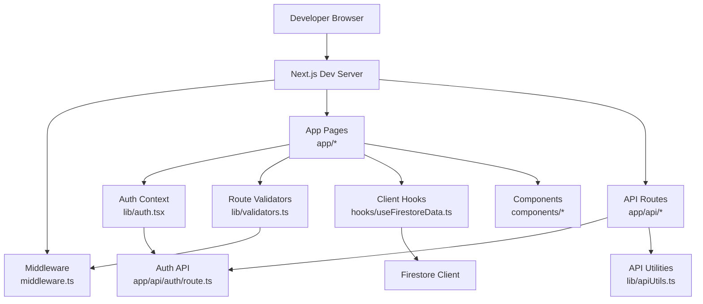
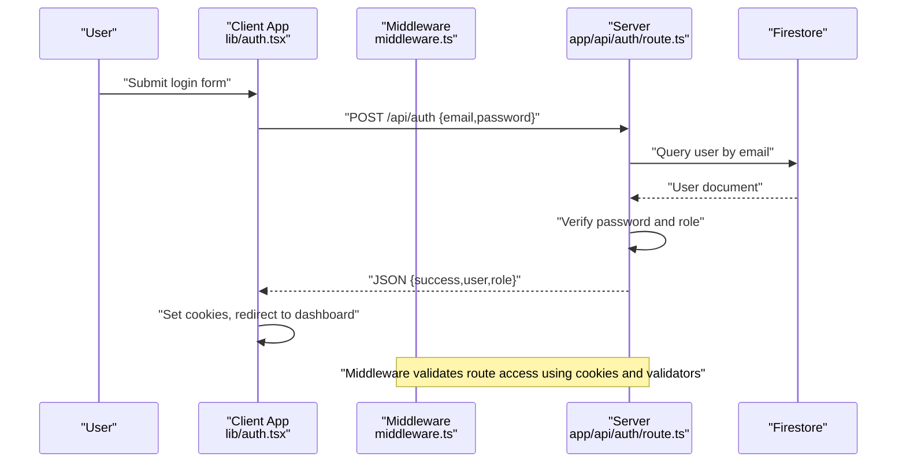
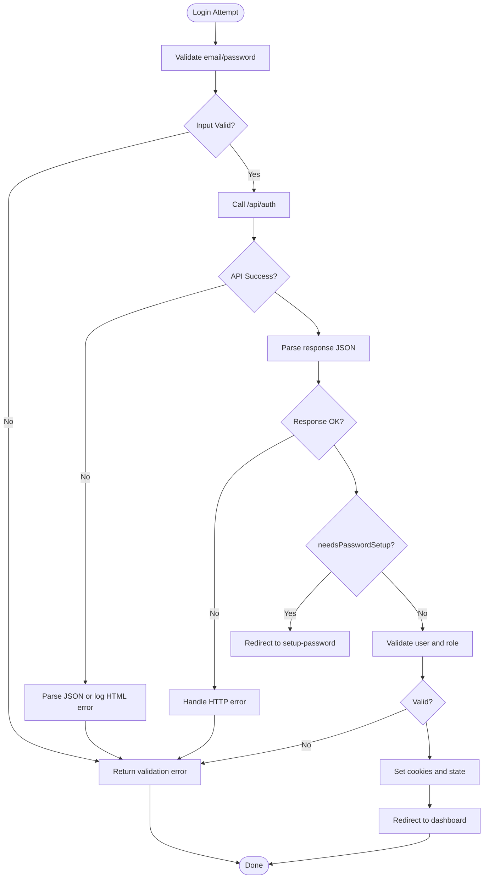
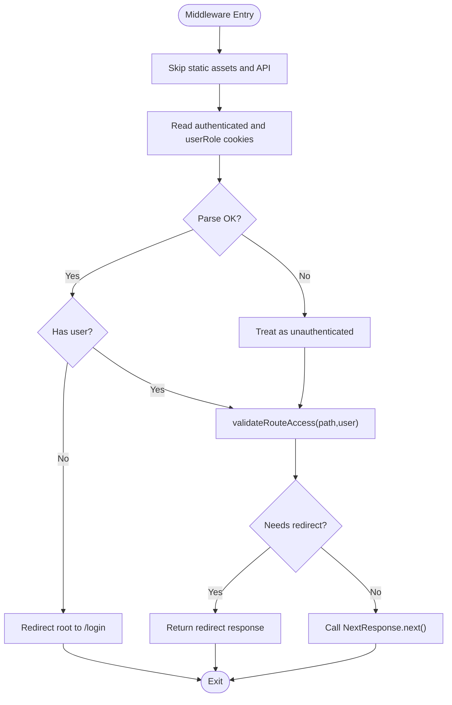
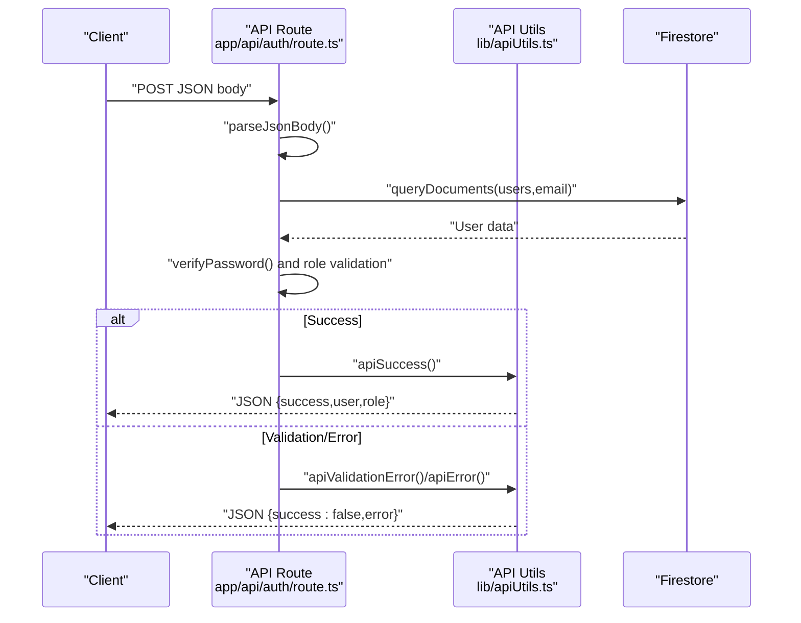
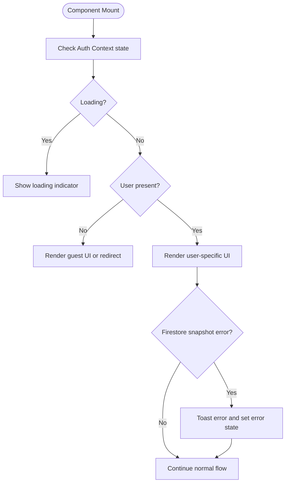
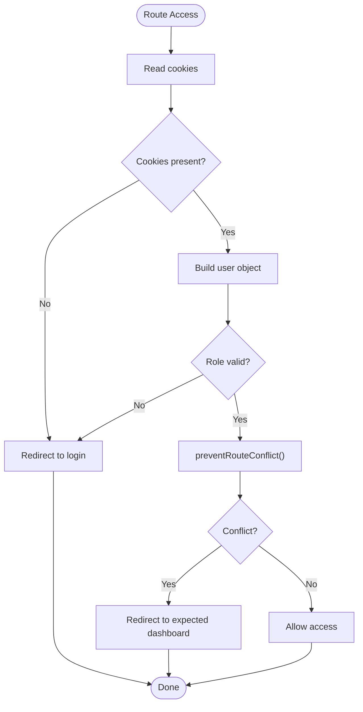
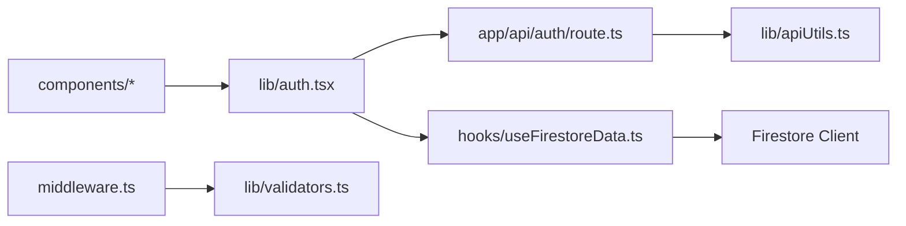

# Application Debugging

<cite>
**Referenced Files in This Document**
- [README.md](file://README.md)
- [package.json](file://package.json)
- [next.config.ts](file://next.config.ts)
- [middleware.ts](file://middleware.ts)
- [lib/auth.tsx](file://lib/auth.tsx)
- [lib/validators.ts](file://lib/validators.ts)
- [lib/apiUtils.ts](file://lib/apiUtils.ts)
- [lib/activityLogger.ts](file://lib/activityLogger.ts)
- [lib/userActionTracker.ts](file://lib/userActionTracker.ts)
- [app/api/auth/route.ts](file://app/api/auth/route.ts)
- [hooks/useFirestoreData.ts](file://hooks/useFirestoreData.ts)
- [components/admin/Header.tsx](file://components/admin/Header.tsx)
- [scripts/test-auth-flow.js](file://scripts/test-auth-flow.js)
- [scripts/test-api-routes.js](file://scripts/test-api-routes.js)
- [scripts/diagnose-firebase.js](file://scripts/diagnose-firebase.js)
</cite>

## Table of Contents
1. [Introduction](#introduction)
2. [Project Structure](#project-structure)
3. [Core Components](#core-components)
4. [Architecture Overview](#architecture-overview)
5. [Detailed Component Analysis](#detailed-component-analysis)
6. [Dependency Analysis](#dependency-analysis)
7. [Performance Considerations](#performance-considerations)
8. [Troubleshooting Guide](#troubleshooting-guide)
9. [Conclusion](#conclusion)
10. [Appendices](#appendices)

## Introduction
This document provides a comprehensive debugging guide for the SAMPA Cooperative Management System built with Next.js. It focuses on diagnosing and resolving common issues across route resolution, middleware execution, API endpoints, authentication flows, component rendering, and runtime environments. It also covers logging, error tracking, monitoring, and performance optimization strategies tailored to this codebase.

## Project Structure
The project follows a Next.js App Router structure with:
- App directory for pages and API routes under app/
- Shared libraries under lib/
- Client-side hooks under hooks/
- Reusable components under components/
- Utility scripts under scripts/

**Diagram sources**
- [middleware.ts](file://middleware.ts#L1-L62)
- [lib/auth.tsx](file://lib/auth.tsx#L1-L682)
- [lib/validators.ts](file://lib/validators.ts#L1-L236)
- [lib/apiUtils.ts](file://lib/apiUtils.ts#L1-L109)
- [app/api/auth/route.ts](file://app/api/auth/route.ts#L1-L295)
- [hooks/useFirestoreData.ts](file://hooks/useFirestoreData.ts#L1-L182)
- [components/admin/Header.tsx](file://components/admin/Header.tsx#L1-L105)

**Section sources**
- [README.md](file://README.md#L1-L37)
- [package.json](file://package.json#L1-L53)
- [next.config.ts](file://next.config.ts#L1-L8)

## Core Components
- Authentication Context: Centralizes login, logout, and user state management with robust client-side logging and redirection logic.
- Middleware: Enforces route access control using cookie-based user identity and validator utilities.
- API Utilities: Standardizes JSON responses and error handling for all API routes.
- Auth API Route: Implements secure login with password verification, role validation, and user-member linkage checks.
- Firestore Hook: Provides real-time data with client-side sorting and error handling.
- Activity Logging and Action Tracking: Centralized logging for user actions with fallbacks for resilience.

**Section sources**
- [lib/auth.tsx](file://lib/auth.tsx#L1-L682)
- [middleware.ts](file://middleware.ts#L1-L62)
- [lib/apiUtils.ts](file://lib/apiUtils.ts#L1-L109)
- [app/api/auth/route.ts](file://app/api/auth/route.ts#L1-L295)
- [hooks/useFirestoreData.ts](file://hooks/useFirestoreData.ts#L1-L182)
- [lib/activityLogger.ts](file://lib/activityLogger.ts#L1-L165)
- [lib/userActionTracker.ts](file://lib/userActionTracker.ts#L1-L118)

## Architecture Overview
The system integrates client-side authentication with server-side API validation and Firestore data access. Middleware intercepts requests to enforce access control, while the Auth Context manages session cookies and redirects. API routes return standardized JSON responses and log internal errors for debugging.

**Diagram sources**
- [lib/auth.tsx](file://lib/auth.tsx#L197-L348)
- [app/api/auth/route.ts](file://app/api/auth/route.ts#L48-L264)
- [middleware.ts](file://middleware.ts#L5-L56)
- [lib/validators.ts](file://lib/validators.ts#L199-L235)

## Detailed Component Analysis

### Authentication Flow Debugging
Common issues: incorrect credentials, missing password setup, invalid role, cookie parsing errors, and redirect loops.

**Diagram sources**
- [lib/auth.tsx](file://lib/auth.tsx#L197-L348)
- [app/api/auth/route.ts](file://app/api/auth/route.ts#L48-L264)

Practical debugging steps:
- Inspect client-side network tab for /api/auth POST payload and response.
- Verify content-type is application/json; if HTML is returned, check server logs.
- Confirm cookies “authenticated” and “userRole” are set after successful login.
- Use the authentication flow test script to simulate role-based redirection.

**Section sources**
- [lib/auth.tsx](file://lib/auth.tsx#L197-L348)
- [app/api/auth/route.ts](file://app/api/auth/route.ts#L48-L264)
- [scripts/test-auth-flow.js](file://scripts/test-auth-flow.js#L109-L149)

### Middleware Execution Errors
Issues: unmatched matcher, cookie parsing exceptions, and incorrect redirects.

**Diagram sources**
- [middleware.ts](file://middleware.ts#L5-L56)
- [lib/validators.ts](file://lib/validators.ts#L199-L235)

Debugging tips:
- Temporarily log the pathname and cookie values to confirm parsing.
- Adjust matcher configuration if API routes are blocked unintentionally.
- Validate that getDashboardPath returns expected paths for roles.

**Section sources**
- [middleware.ts](file://middleware.ts#L5-L56)
- [lib/validators.ts](file://lib/validators.ts#L98-L104)

### API Endpoint Debugging Strategies
Focus areas: request/response validation, error handling patterns, and data flow.

**Diagram sources**
- [app/api/auth/route.ts](file://app/api/auth/route.ts#L48-L264)
- [lib/apiUtils.ts](file://lib/apiUtils.ts#L8-L109)

Validation checklist:
- Ensure all routes return JSON; use standardized helpers.
- Validate required fields and content-type early.
- Log internal server errors without exposing sensitive details.
- Use the API route tester script to verify JSON responses across endpoints.

**Section sources**
- [lib/apiUtils.ts](file://lib/apiUtils.ts#L8-L109)
- [app/api/auth/route.ts](file://app/api/auth/route.ts#L48-L264)
- [scripts/test-api-routes.js](file://scripts/test-api-routes.js#L50-L104)

### Component Rendering Failures
Issues: missing user state, snapshot errors, and UI flickering during logout.

**Diagram sources**
- [lib/auth.tsx](file://lib/auth.tsx#L158-L195)
- [hooks/useFirestoreData.ts](file://hooks/useFirestoreData.ts#L65-L125)

Debugging tips:
- Verify Auth Context initializes cookies and sets user state.
- Inspect toast messages and error states from Firestore hooks.
- Check for UI flickering during logout and ensure immediate state clearing.

**Section sources**
- [lib/auth.tsx](file://lib/auth.tsx#L158-L195)
- [hooks/useFirestoreData.ts](file://hooks/useFirestoreData.ts#L65-L125)
- [components/admin/Header.tsx](file://components/admin/Header.tsx#L47-L59)

### Authentication Flow Debugging (Session, Roles, Redirect Loops)
Common symptoms: session not persisted, role mismatch causing repeated redirects, or infinite loops.

**Diagram sources**
- [middleware.ts](file://middleware.ts#L5-L56)
- [lib/validators.ts](file://lib/validators.ts#L112-L191)

Debugging steps:
- Confirm cookies are readable and decoded correctly.
- Validate role normalization and mapping to dashboard paths.
- Use preventRouteConflict to detect cross-role access attempts.
- Monitor redirect loops by logging current and expected dashboard paths.

**Section sources**
- [middleware.ts](file://middleware.ts#L5-L56)
- [lib/validators.ts](file://lib/validators.ts#L112-L191)
- [lib/auth.tsx](file://lib/auth.tsx#L111-L156)

### API Route Debugging Checklist
- Validate JSON body parsing and required fields.
- Ensure consistent HTTP status codes and JSON error payloads.
- Log internal errors without leaking details to clients.
- Test unsupported HTTP methods and return appropriate errors.

**Section sources**
- [lib/apiUtils.ts](file://lib/apiUtils.ts#L78-L109)
- [app/api/auth/route.ts](file://app/api/auth/route.ts#L267-L295)

### Component Debugging Checklist
- Verify Auth Context initialization and cookie handling.
- Inspect Firestore hook error states and snapshot processing.
- Confirm logout clears state and cookies promptly.
- Use toast notifications to surface transient errors.

**Section sources**
- [lib/auth.tsx](file://lib/auth.tsx#L621-L635)
- [hooks/useFirestoreData.ts](file://hooks/useFirestoreData.ts#L106-L116)
- [components/admin/Header.tsx](file://components/admin/Header.tsx#L47-L59)

### Development Environment and Build Issues
- Use the provided scripts to validate environment variables and API responses.
- Confirm Next.js dev server runs and hot reloads changes.
- Review lint and build scripts for TypeScript and ESLint configurations.

**Section sources**
- [scripts/diagnose-firebase.js](file://scripts/diagnose-firebase.js#L1-L61)
- [scripts/test-api-routes.js](file://scripts/test-api-routes.js#L50-L104)
- [package.json](file://package.json#L5-L14)

## Dependency Analysis
The system exhibits clear separation of concerns:
- Client-side Auth Context depends on API routes and cookie storage.
- Middleware depends on validators and cookie parsing.
- API routes depend on Firestore and API utilities.
- Components depend on Auth Context and Firestore hooks.

**Diagram sources**
- [lib/auth.tsx](file://lib/auth.tsx#L1-L682)
- [middleware.ts](file://middleware.ts#L1-L62)
- [lib/validators.ts](file://lib/validators.ts#L1-L236)
- [app/api/auth/route.ts](file://app/api/auth/route.ts#L1-L295)
- [lib/apiUtils.ts](file://lib/apiUtils.ts#L1-L109)
- [hooks/useFirestoreData.ts](file://hooks/useFirestoreData.ts#L1-L182)

**Section sources**
- [lib/auth.tsx](file://lib/auth.tsx#L1-L682)
- [middleware.ts](file://middleware.ts#L1-L62)
- [lib/validators.ts](file://lib/validators.ts#L1-L236)
- [app/api/auth/route.ts](file://app/api/auth/route.ts#L1-L295)
- [lib/apiUtils.ts](file://lib/apiUtils.ts#L1-L109)
- [hooks/useFirestoreData.ts](file://hooks/useFirestoreData.ts#L1-L182)

## Performance Considerations
- Client-side sorting in Firestore hooks avoids composite indexes but may impact large datasets; consider pagination or server-side filtering.
- Minimize heavy computations in render paths; memoize derived values.
- Use toast sparingly to avoid UI jank during frequent errors.
- Prefer replace navigation to avoid unnecessary history entries.

[No sources needed since this section provides general guidance]

## Troubleshooting Guide
Common scenarios and resolutions:
- Form submission errors: Inspect client-side fetch calls and ensure JSON responses; check standardized error payloads from API utilities.
- Data loading failures: Review Firestore snapshot error handling and toast messages; verify collection names and filters.
- Navigation issues: Validate middleware matcher and route access logic; confirm cookies and role mapping.
- Authentication loops: Log current and expected dashboard paths; ensure preventRouteConflict returns correct redirects.
- Environment issues: Run the Firebase diagnosis script to validate environment variables and credentials.

**Section sources**
- [lib/apiUtils.ts](file://lib/apiUtils.ts#L19-L34)
- [hooks/useFirestoreData.ts](file://hooks/useFirestoreData.ts#L106-L116)
- [middleware.ts](file://middleware.ts#L58-L62)
- [lib/validators.ts](file://lib/validators.ts#L112-L191)
- [scripts/diagnose-firebase.js](file://scripts/diagnose-firebase.js#L1-L61)

## Conclusion
This debugging guide consolidates practical workflows and diagnostic strategies for the SAMPA Cooperative Management System. By leveraging standardized logging, JSON-first API responses, middleware-based access control, and resilient client-side hooks, teams can systematically identify and resolve issues across routing, authentication, components, and runtime environments.

[No sources needed since this section summarizes without analyzing specific files]

## Appendices

### Step-by-Step Debugging Workflows
- Route Resolution Problems
  - Confirm middleware matcher excludes API routes and static assets.
  - Validate cookie presence and decoding; log user object construction.
  - Use preventRouteConflict to detect and resolve role-based access conflicts.

- Middleware Execution Errors
  - Temporarily log pathname and cookie values.
  - Adjust matcher configuration if API routes are blocked.
  - Verify getDashboardPath returns expected paths.

- Component Rendering Failures
  - Inspect Auth Context initialization and cookie handling.
  - Review Firestore hook snapshot errors and error states.
  - Ensure logout clears state and cookies promptly.

- API Endpoint Debugging
  - Validate JSON body parsing and required fields.
  - Ensure consistent JSON error responses with standardized helpers.
  - Test unsupported HTTP methods and return appropriate errors.

- Authentication Flows
  - Inspect client-side fetch calls and response parsing.
  - Confirm cookies “authenticated” and “userRole” are set.
  - Use authentication flow test script to simulate role-based redirection.

- Development Environment and Build
  - Run Firebase diagnosis script to validate environment variables.
  - Use API route tester script to verify JSON responses.
  - Confirm Next.js dev server and hot reload behavior.

**Section sources**
- [middleware.ts](file://middleware.ts#L5-L56)
- [lib/validators.ts](file://lib/validators.ts#L112-L191)
- [lib/auth.tsx](file://lib/auth.tsx#L197-L348)
- [hooks/useFirestoreData.ts](file://hooks/useFirestoreData.ts#L65-L125)
- [lib/apiUtils.ts](file://lib/apiUtils.ts#L78-L109)
- [scripts/test-auth-flow.js](file://scripts/test-auth-flow.js#L109-L149)
- [scripts/test-api-routes.js](file://scripts/test-api-routes.js#L50-L104)
- [scripts/diagnose-firebase.js](file://scripts/diagnose-firebase.js#L1-L61)