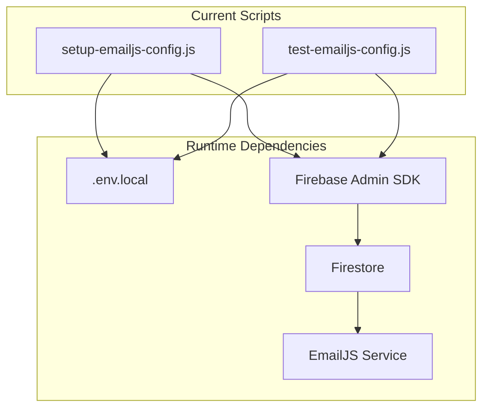
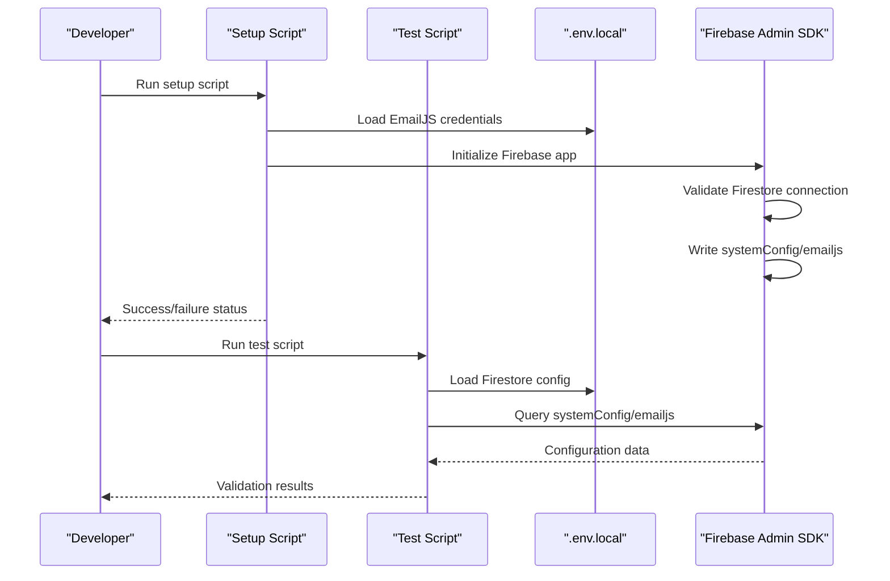
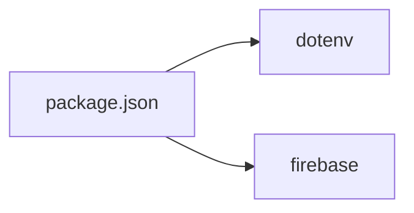

# Diagnostic Scripts & Tools

<cite>
**Referenced Files in This Document**
- [setup-emailjs-config.js](file://scripts/setup-emailjs-config.js)
- [test-emailjs-config.js](file://scripts/test-emailjs-config.js)
- [package.json](file://package.json)
</cite>

## Update Summary
**Changes Made**
- Removed references to non-existent diagnostic scripts (diagnose-firebase.js, debug-member-records.js, test-all-users-auth.js, test-firestore-connection.js, full-system-test.js, frontend-firestore-test.js, detailed-member-diagnostic.js, test-firebase.js, test-firestore.js, verify-auth-flow.js, verify-enhanced-auth-flow.js, test-auth-flow.js, test-api-routes.js)
- Updated project structure to reflect the current minimal script inventory
- Revised architecture overview to focus on the remaining EmailJS configuration scripts
- Removed troubleshooting sections for non-existent diagnostic capabilities
- Updated dependency analysis to reflect current script dependencies

## Table of Contents
1. [Introduction](#introduction)
2. [Project Structure](#project-structure)
3. [Core Components](#core-components)
4. [Architecture Overview](#architecture-overview)
5. [Detailed Component Analysis](#detailed-component-analysis)
6. [Dependency Analysis](#dependency-analysis)
7. [Performance Considerations](#performance-considerations)
8. [Troubleshooting Guide](#troubleshooting-guide)
9. [Conclusion](#conclusion)
10. [Appendices](#appendices)

## Introduction
This document describes the current diagnostic and configuration scripts used in the SAMPA Cooperative Management System. The repository has been streamlined to focus on essential operational scripts, particularly EmailJS configuration management. The current diagnostic tooling is limited to:
- EmailJS configuration setup and validation
- Basic Firebase connectivity verification for EmailJS operations
- Environment variable validation for EmailJS credentials

**Important Note**: Many comprehensive diagnostic scripts previously documented (including Firebase environment diagnosis, member records integrity testing, authentication flow validation, and system-wide connectivity testing) have been removed from this repository. The current script inventory reflects a focused approach to EmailJS configuration management.

## Project Structure
The diagnostic tooling is now limited to the scripts directory, which contains only EmailJS configuration management utilities. These scripts complement the Next.js application and Firebase integration for email functionality.

**Diagram sources**
- [setup-emailjs-config.js:1-79](file://scripts/setup-emailjs-config.js#L1-L79)
- [test-emailjs-config.js:1-69](file://scripts/test-emailjs-config.js#L1-L69)

**Section sources**
- [setup-emailjs-config.js:1-79](file://scripts/setup-emailjs-config.js#L1-L79)
- [test-emailjs-config.js:1-69](file://scripts/test-emailjs-config.js#L1-L69)

## Core Components
The current diagnostic tooling consists of two focused scripts for EmailJS configuration management:

### EmailJS Configuration Setup
- Initializes Firebase app with environment variables
- Validates EmailJS credential placeholders
- Writes configuration to Firestore systemConfig collection
- Provides detailed logging of setup process and results

### EmailJS Configuration Testing
- Connects to Firestore to validate EmailJS configuration exists
- Checks for required configuration fields (publicKey, serviceId, receiptTemplateId)
- Reports missing fields and provides remediation guidance
- Logs configuration details with sensitive data masked

**Section sources**
- [setup-emailjs-config.js:1-79](file://scripts/setup-emailjs-config.js#L1-L79)
- [test-emailjs-config.js:1-69](file://scripts/test-emailjs-config.js#L1-L69)

## Architecture Overview
The current diagnostic scripts operate as focused configuration management tools with minimal external dependencies. They leverage Firebase Admin SDK for Firestore operations and integrate with EmailJS services.

**Diagram sources**
- [setup-emailjs-config.js:28-78](file://scripts/setup-emailjs-config.js#L28-L78)
- [test-emailjs-config.js:19-66](file://scripts/test-emailjs-config.js#L19-L66)

## Detailed Component Analysis

### setup-emailjs-config.js
Purpose:
- Sets up EmailJS configuration in Firestore database
- Validates placeholder credentials and provides guidance for updates
- Creates systemConfig/emailjs document with timestamp and metadata

Execution parameters:
- None. Reads from environment variables and .env.local
- Requires NEXT_PUBLIC_FIREBASE_* and EMAILJS_* environment variables

Diagnostic capabilities:
- Validates EmailJS credential placeholders (contains 'YOUR_' pattern)
- Provides step-by-step guidance for obtaining EmailJS credentials
- Writes configuration with updatedAt timestamp and updatedBy field
- Handles Firestore write operations with error reporting

Output interpretation:
- ✅ indicates successful Firestore write operation
- ❌ indicates configuration errors or Firestore write failures
- ⚠️ indicates placeholder credentials detected

Prerequisites:
- .env.local with EmailJS credentials (EMAILJS_PUBLIC_KEY, EMAILJS_SERVICE_ID, EMAILJS_RECEIPT_TEMPLATE_ID)
- .env.local with Firebase Admin credentials
- Firestore database with write permissions

Usage example:
- node scripts/setup-emailjs-config.js

**Section sources**
- [setup-emailjs-config.js:1-79](file://scripts/setup-emailjs-config.js#L1-L79)

### test-emailjs-config.js
Purpose:
- Validates EmailJS configuration exists and is complete in Firestore
- Tests Firestore connectivity for EmailJS configuration access
- Provides detailed error reporting for missing configurations

Execution parameters:
- None. Reads from environment variables and .env.local

Diagnostic capabilities:
- Queries systemConfig/emailjs document in Firestore
- Validates presence of required fields (publicKey, serviceId, receiptTemplateId)
- Reports missing fields with specific error codes
- Provides remediation guidance for configuration issues

Output interpretation:
- ✅ indicates complete and valid configuration
- ❌ indicates missing document or missing configuration fields
- Provides specific guidance for each type of failure

Prerequisites:
- .env.local with Firebase Admin credentials
- Firestore database with read permissions
- Existing EmailJS configuration in systemConfig collection

Usage example:
- node scripts/test-emailjs-config.js

**Section sources**
- [test-emailjs-config.js:1-69](file://scripts/test-emailjs-config.js#L1-L69)

## Dependency Analysis
The current script inventory has minimal dependencies focused on EmailJS configuration:

- Runtime dependencies:
  - dotenv for loading .env.local environment variables
  - firebase for Firebase app initialization and Firestore operations
- Internal coupling:
  - Both scripts depend on Firebase configuration from environment variables
  - Both scripts assume Firestore collection structure (systemConfig/emailjs)

**Diagram sources**
- [package.json:16-39](file://package.json#L16-L39)

**Section sources**
- [package.json:16-39](file://package.json#L16-L39)

## Performance Considerations
- Both scripts perform single Firestore operations, minimizing execution time
- Environment variable loading occurs once per script execution
- No caching mechanisms needed for these simple configuration scripts
- Error handling is synchronous to provide immediate feedback

## Troubleshooting Guide

### EmailJS Configuration Issues
Common symptoms:
- Missing EmailJS configuration in Firestore
- Invalid or placeholder credentials detected
- Firestore read/write permission errors

Resolution steps:
- Run setup-emailjs-config.js to create/update configuration
- Verify environment variables are properly set in .env.local
- Check Firestore security rules allow read/write access to systemConfig collection
- Confirm EmailJS account is active and credentials are valid

Interpretation aids:
- setup-emailjs-config.js provides detailed guidance for obtaining EmailJS credentials
- test-emailjs-config.js reports specific missing fields and provides remediation steps

**Section sources**
- [setup-emailjs-config.js:36-50](file://scripts/setup-emailjs-config.js#L36-L50)
- [test-emailjs-config.js:28-52](file://scripts/test-emailjs-config.js#L28-L52)

### Firebase Connection Problems
Common symptoms:
- Firestore connection failures during setup or test
- Authentication errors with Firebase Admin credentials

Resolution steps:
- Verify Firebase Admin credentials in .env.local
- Check Firestore security rules allow access to systemConfig collection
- Confirm network connectivity to Firestore service
- Validate Firebase project configuration matches environment variables

**Section sources**
- [setup-emailjs-config.js:30-32](file://scripts/setup-emailjs-config.js#L30-L32)
- [test-emailjs-config.js:21-26](file://scripts/test-emailjs-config.js#L21-L26)

## Conclusion
The current diagnostic tooling has been streamlined to focus exclusively on EmailJS configuration management. While this represents a significant reduction from the comprehensive diagnostic suite previously documented, the remaining scripts provide essential functionality for EmailJS integration. The simplified approach reduces complexity while maintaining critical configuration validation capabilities.

## Appendices

### Execution Environments and Prerequisites
- Node.js runtime
- .env.local with EmailJS credentials (EMAILJS_PUBLIC_KEY, EMAILJS_SERVICE_ID, EMAILJS_RECEIPT_TEMPLATE_ID)
- .env.local with Firebase Admin credentials
- Running Next.js development server for API route tests
- Firebase project with Firestore database and appropriate security rules

**Section sources**
- [setup-emailjs-config.js:12-26](file://scripts/setup-emailjs-config.js#L12-L26)
- [test-emailjs-config.js:10-17](file://scripts/test-emailjs-config.js#L10-L17)

### Current Script Inventory
The repository now contains only two diagnostic-related scripts:

1. **setup-emailjs-config.js**: Complete EmailJS configuration setup with validation
2. **test-emailjs-config.js**: Configuration validation and testing

**Section sources**
- [setup-emailjs-config.js:1-79](file://scripts/setup-emailjs-config.js#L1-L79)
- [test-emailjs-config.js:1-69](file://scripts/test-emailjs-config.js#L1-L69)

### Removed Diagnostic Scripts
The following diagnostic scripts are no longer present in this repository:
- diagnose-firebase.js
- debug-member-records.js
- test-all-users-auth.js
- test-firestore-connection.js
- full-system-test.js
- frontend-firestore-test.js
- detailed-member-diagnostic.js
- test-firebase.js
- test-firestore.js
- verify-auth-flow.js
- verify-enhanced-auth-flow.js
- test-auth-flow.js
- test-api-routes.js

These scripts represented a comprehensive diagnostic suite that has been removed from the current codebase.