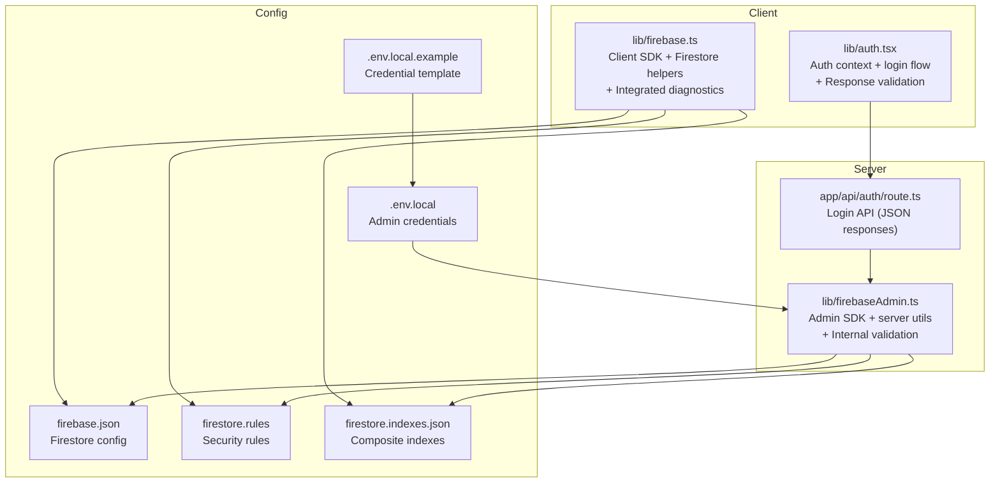
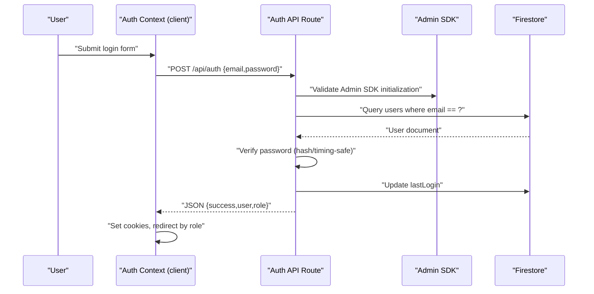
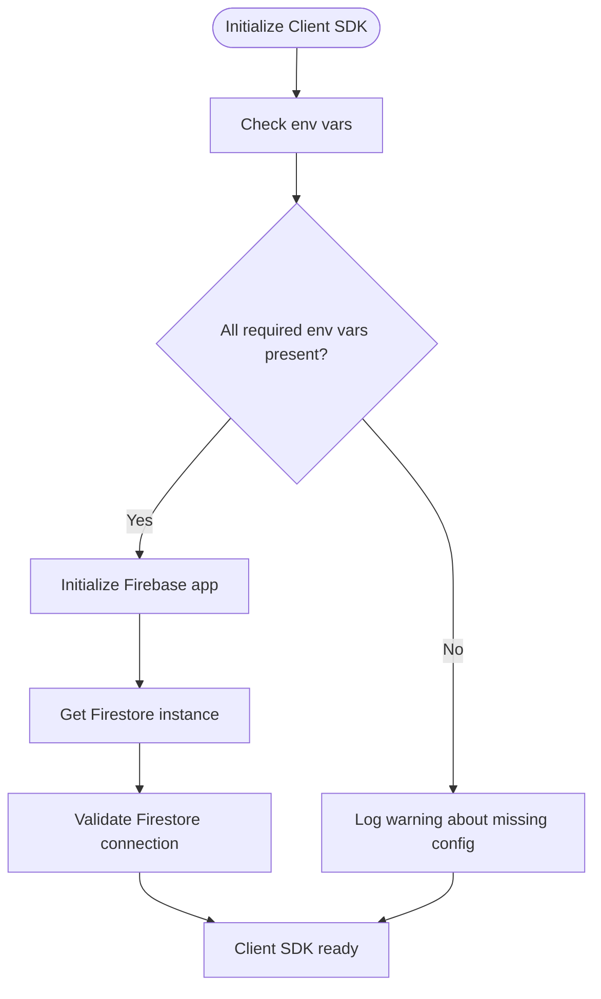
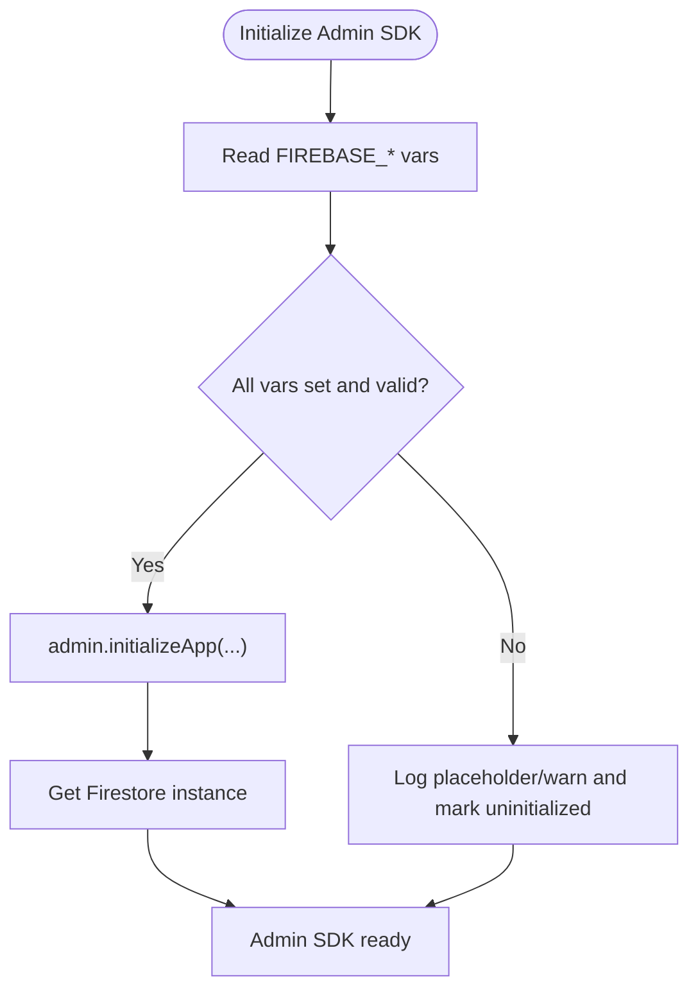
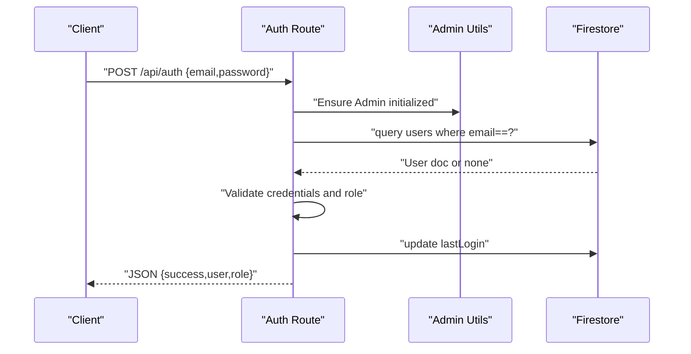
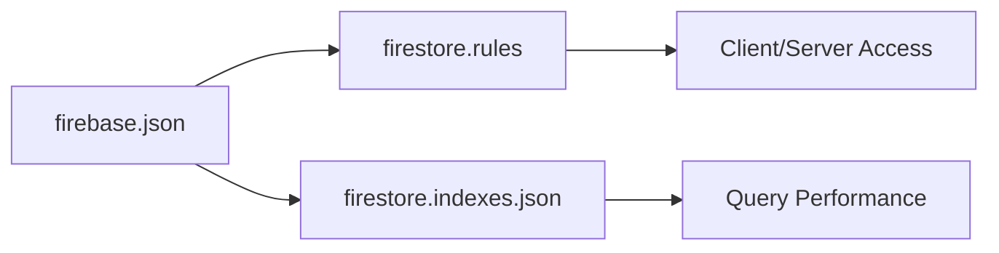
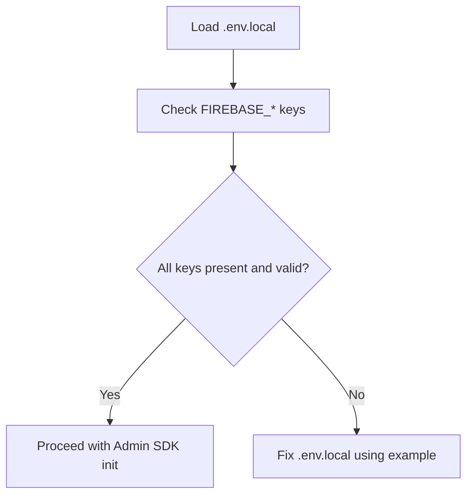
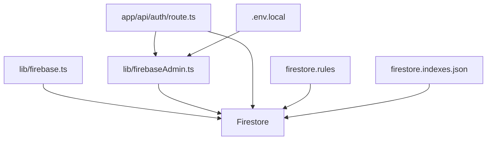

# Firebase Troubleshooting

<cite>
**Referenced Files in This Document**
- [lib/firebase.ts](file://lib/firebase.ts)
- [lib/firebaseAdmin.ts](file://lib/firebaseAdmin.ts)
- [lib/auth.tsx](file://lib/auth.tsx)
- [app/api/auth/route.ts](file://app/api/auth/route.ts)
- [firebase.json](file://firebase.json)
- [firestore.rules](file://firestore.rules)
- [firestore.indexes.json](file://firestore.indexes.json)
- [.env.local](file://.env.local)
- [.env.local.example](file://.env.local.example)
</cite>

## Update Summary
**Changes Made**
- Removed references to dropped documentation files: FIREBASE_SETUP_INSTRUCTIONS.md, FIX_FIREBASE_ERROR.md, FIX_ROUTE_ERROR.md, IMPLEMENTATION_SUMMARY.md, and ROLE_BASED_ACCESS_CONTROL.md
- Updated troubleshooting guidance to reflect internal documentation consolidation
- Removed external script references that are no longer maintained
- Streamlined troubleshooting sections to focus on current implementation

## Table of Contents
1. [Introduction](#introduction)
2. [Project Structure](#project-structure)
3. [Core Components](#core-components)
4. [Architecture Overview](#architecture-overview)
5. [Detailed Component Analysis](#detailed-component-analysis)
6. [Dependency Analysis](#dependency-analysis)
7. [Performance Considerations](#performance-considerations)
8. [Troubleshooting Guide](#troubleshooting-guide)
9. [Conclusion](#conclusion)
10. [Appendices](#appendices)

## Introduction
This document provides comprehensive Firebase troubleshooting guidance for the SAMPA Cooperative Management System. It focuses on diagnosing and resolving common Firebase authentication issues (login failures, token expiration symptoms, permission denied errors), Firestore connectivity problems (timeouts, query performance, security rule conflicts), and Firebase Admin SDK configuration errors (service account issues, initialization failures). The documentation reflects the current internal implementation and consolidates troubleshooting procedures within the codebase itself.

**Updated** Removed external documentation references as comprehensive Firebase troubleshooting documentation has been consolidated internally.

## Project Structure
The Firebase integration spans client-side and server-side modules, API routes, configuration files, and built-in diagnostic capabilities:
- Client SDK initialization and Firestore helpers with integrated error handling
- Admin SDK initialization and server-side Firestore utilities
- Authentication flow using a custom API route with JSON response format
- Firestore configuration and security rules
- Environment variables and internal setup validation
- Built-in diagnostic capabilities within the codebase

**Diagram sources**
- [lib/firebase.ts:1-345](file://lib/firebase.ts#L1-L345)
- [lib/firebaseAdmin.ts:1-277](file://lib/firebaseAdmin.ts#L1-L277)
- [lib/auth.tsx:1-706](file://lib/auth.tsx#L1-L706)
- [app/api/auth/route.ts:1-295](file://app/api/auth/route.ts#L1-L295)
- [firebase.json:1-9](file://firebase.json#L1-L9)
- [firestore.rules:1-19](file://firestore.rules#L1-L19)
- [firestore.indexes.json:1-97](file://firestore.indexes.json#L1-L97)
- [.env.local:1-9](file://.env.local#L1-L9)
- [.env.local.example:1-10](file://.env.local.example#L1-L10)

**Section sources**
- [lib/firebase.ts:1-345](file://lib/firebase.ts#L1-L345)
- [lib/firebaseAdmin.ts:1-277](file://lib/firebaseAdmin.ts#L1-L277)
- [lib/auth.tsx:1-706](file://lib/auth.tsx#L1-L706)
- [app/api/auth/route.ts:1-295](file://app/api/auth/route.ts#L1-L295)
- [firebase.json:1-9](file://firebase.json#L1-L9)
- [firestore.rules:1-19](file://firestore.rules#L1-L19)
- [firestore.indexes.json:1-97](file://firestore.indexes.json#L1-L97)
- [.env.local:1-9](file://.env.local#L1-L9)
- [.env.local.example:1-10](file://.env.local.example#L1-L10)

## Core Components
- Client SDK and Firestore helpers:
  - Initializes Firebase client-side with environment variables and validates configuration.
  - Provides Firestore wrappers for set/get/update/delete/query with robust error handling and specific messages for permission and argument errors.
  - Includes integrated connection validation and diagnostic capabilities.
- Admin SDK and server utilities:
  - Initializes Firebase Admin SDK server-side with strict validation of environment variables and placeholder detection.
  - Offers server-side Firestore utilities with input validation and detailed error reporting.
  - Provides internal initialization status checking and error reporting.
- Authentication flow:
  - Client-side auth context posts credentials to a server route that validates users against Firestore and returns role-aware JSON responses.
  - API route centralizes error handling and returns JSON consistently for all outcomes.
- Configuration and indexes:
  - Firestore configuration, security rules, and composite indexes define connectivity and query capabilities.
  - Development rules allow read/write access with production-ready configurations available.
- Environment variables:
  - Admin credentials and client SDK keys are loaded from .env.local with a documented example.

**Section sources**
- [lib/firebase.ts:1-345](file://lib/firebase.ts#L1-L345)
- [lib/firebaseAdmin.ts:1-277](file://lib/firebaseAdmin.ts#L1-L277)
- [lib/auth.tsx:1-706](file://lib/auth.tsx#L1-L706)
- [app/api/auth/route.ts:1-295](file://app/api/auth/route.ts#L1-L295)
- [firebase.json:1-9](file://firebase.json#L1-L9)
- [firestore.rules:1-19](file://firestore.rules#L1-L19)
- [firestore.indexes.json:1-97](file://firestore.indexes.json#L1-L97)
- [.env.local:1-9](file://.env.local#L1-L9)
- [.env.local.example:1-10](file://.env.local.example#L1-L10)

## Architecture Overview
The system separates concerns between client and server with integrated validation:
- Client SDK initializes and performs Firestore operations with built-in helpers.
- Admin SDK initializes server-side and powers the authentication API route with JSON responses.
- The auth API route queries Firestore, validates credentials, updates last login, and returns role-aware JSON responses.
- All components include internal diagnostic capabilities for troubleshooting.

**Diagram sources**
- [lib/auth.tsx:198-372](file://lib/auth.tsx#L198-L372)
- [app/api/auth/route.ts:48-264](file://app/api/auth/route.ts#L48-L264)
- [lib/firebaseAdmin.ts:13-108](file://lib/firebaseAdmin.ts#L13-L108)

## Detailed Component Analysis

### Client SDK Initialization and Firestore Helpers
- Validates presence of required Firebase config keys and warns on missing values.
- Initializes Firestore and Auth only client-side.
- Provides helper functions for CRUD and querying with explicit error handling and specific messages for permission and argument errors.
- Includes integrated connection validation and diagnostic capabilities.

**Diagram sources**
- [lib/firebase.ts:37-60](file://lib/firebase.ts#L37-L60)

**Section sources**
- [lib/firebase.ts:1-345](file://lib/firebase.ts#L1-L345)

### Admin SDK Initialization and Server Utilities
- Validates Admin SDK environment variables and rejects placeholder values.
- Initializes Admin SDK only if no apps exist, extracts credentials from environment, and handles initialization errors.
- Provides server-side Firestore utilities with input validation and consistent error responses.
- Includes internal initialization status checking and error reporting.

**Diagram sources**
- [lib/firebaseAdmin.ts:13-108](file://lib/firebaseAdmin.ts#L13-L108)

**Section sources**
- [lib/firebaseAdmin.ts:1-277](file://lib/firebaseAdmin.ts#L1-L277)

### Authentication Flow and API Route
- Client posts credentials to the auth route with JSON response validation.
- Server validates input, queries Firestore, verifies password, ensures role assignment, updates last login, and returns JSON with success and role.
- API route centralizes error handling and returns JSON for all outcomes with proper HTTP status codes.

**Diagram sources**
- [app/api/auth/route.ts:48-264](file://app/api/auth/route.ts#L48-L264)
- [lib/firebaseAdmin.ts:110-115](file://lib/firebaseAdmin.ts#L110-L115)

**Section sources**
- [lib/auth.tsx:198-372](file://lib/auth.tsx#L198-L372)
- [app/api/auth/route.ts:1-295](file://app/api/auth/route.ts#L1-L295)

### Firestore Configuration, Rules, and Indexes
- Firestore configuration defines database location and rule/index files.
- Security rules currently allow read/write for development; adjust for production.
- Composite indexes are defined for query performance on loanRequests and activityLogs.
- Development rules include automatic expiration warnings for security.

**Diagram sources**
- [firebase.json:1-9](file://firebase.json#L1-L9)
- [firestore.rules:1-19](file://firestore.rules#L1-L19)
- [firestore.indexes.json:1-97](file://firestore.indexes.json#L1-L97)

**Section sources**
- [firebase.json:1-9](file://firebase.json#L1-L9)
- [firestore.rules:1-19](file://firestore.rules#L1-L19)
- [firestore.indexes.json:1-97](file://firestore.indexes.json#L1-L97)

### Environment Variables and Setup
- Admin credentials are loaded from .env.local with a documented example.
- Internal validation provides detailed error messages for configuration issues.
- Placeholder detection prevents accidental development deployments.

**Diagram sources**
- [.env.local:1-9](file://.env.local#L1-L9)
- [.env.local.example:1-10](file://.env.local.example#L1-L10)
- [lib/firebaseAdmin.ts:27-89](file://lib/firebaseAdmin.ts#L27-L89)

**Section sources**
- [.env.local:1-9](file://.env.local#L1-L9)
- [.env.local.example:1-10](file://.env.local.example#L1-L10)
- [lib/firebaseAdmin.ts:1-277](file://lib/firebaseAdmin.ts#L1-L277)

## Dependency Analysis
- Client SDK depends on environment variables and initializes Firestore/Auth.
- Admin SDK depends on environment variables and initializes Firestore for server operations.
- Auth API route depends on Admin SDK and Firestore to validate users and update metadata.
- Firestore rules and indexes influence query performance and access.
- All components include internal dependency validation and error reporting.

**Diagram sources**
- [lib/firebase.ts:1-345](file://lib/firebase.ts#L1-L345)
- [lib/firebaseAdmin.ts:1-277](file://lib/firebaseAdmin.ts#L1-L277)
- [app/api/auth/route.ts:1-295](file://app/api/auth/route.ts#L1-L295)
- [firestore.rules:1-19](file://firestore.rules#L1-L19)
- [firestore.indexes.json:1-97](file://firestore.indexes.json#L1-L97)
- [.env.local:1-9](file://.env.local#L1-L9)

**Section sources**
- [lib/firebase.ts:1-345](file://lib/firebase.ts#L1-L345)
- [lib/firebaseAdmin.ts:1-277](file://lib/firebaseAdmin.ts#L1-L277)
- [app/api/auth/route.ts:1-295](file://app/api/auth/route.ts#L1-L295)
- [firestore.rules:1-19](file://firestore.rules#L1-L19)
- [firestore.indexes.json:1-97](file://firestore.indexes.json#L1-L97)
- [.env.local:1-9](file://.env.local#L1-L9)

## Performance Considerations
- Query performance: Ensure composite indexes exist for multi-field queries on loanRequests and activityLogs.
- Rule complexity: Simplify rules during development and gradually enforce stricter rules to avoid denial-of-service scenarios.
- Initialization overhead: Avoid reinitializing Admin SDK; reuse existing app instances.
- Client-side caching: Use Firestore helpers' return values to short-circuit repeated reads when appropriate.
- Response validation: Client-side JSON response validation prevents HTML error pages from breaking the authentication flow.

## Troubleshooting Guide

### Authentication Troubleshooting
Common symptoms and resolutions:
- Unable to detect a Project Id
  - Cause: Missing or placeholder Admin credentials.
  - Resolution: Regenerate service account key and update .env.local; restart server.
- Invalid credentials
  - Cause: Expired or incorrect service account key.
  - Resolution: Generate new key from Firebase Console and update .env.local.
- Login redirects and role-based routing
  - Cause: Missing role or malformed user data.
  - Resolution: Verify role assignment in users collection and ensure API returns role.
- JSON response format errors
  - Cause: Server returning HTML instead of JSON.
  - Resolution: Check server logs for initialization errors and ensure API route returns JSON.

**Updated** Removed external script references as troubleshooting infrastructure has been consolidated internally.

Diagnostic steps:
- Validate environment variables with internal Admin SDK validation.
- Test Admin SDK connectivity with built-in initialization status checks.
- Inspect server logs for initialization and authentication errors.
- Use client-side JSON response validation to catch format issues early.

**Section sources**
- [lib/firebaseAdmin.ts:13-108](file://lib/firebaseAdmin.ts#L13-L108)
- [lib/auth.tsx:214-257](file://lib/auth.tsx#L214-L257)
- [app/api/auth/route.ts:50-66](file://app/api/auth/route.ts#L50-L66)

### Firestore Connectivity and Query Issues
Common symptoms and resolutions:
- Permission denied errors
  - Cause: Security rules allow read/write or insufficient permissions.
  - Resolution: Tighten rules and verify user roles; test with simulator.
- Query requires index
  - Cause: Missing composite index for multi-field queries.
  - Resolution: Create the required index via provided URL or console.
- Connection timeouts
  - Cause: Network issues or unoptimized queries.
  - Resolution: Add indexes, optimize queries, and monitor latency.
- Client-side connection validation
  - Cause: Firestore not initialized properly.
  - Resolution: Check client SDK initialization and environment variables.

Diagnostic steps:
- Use built-in Firestore connection validation in client SDK.
- List collections and sample documents with Firestore helpers.
- Use Firestore helpers to test read/write operations and capture specific error messages.
- Check composite indexes configuration for query performance.

**Section sources**
- [firestore.rules:1-19](file://firestore.rules#L1-L19)
- [firestore.indexes.json:1-97](file://firestore.indexes.json#L1-L97)
- [lib/firebase.ts:62-87](file://lib/firebase.ts#L62-L87)
- [lib/firebase.ts:148-182](file://lib/firebase.ts#L148-L182)

### Admin SDK Configuration Errors
Common symptoms and resolutions:
- Initialization failed
  - Cause: Missing or placeholder credentials.
  - Resolution: Update .env.local with valid values; ensure private key format and escaped newlines.
- Database not initialized
  - Cause: Admin SDK not initialized before use.
  - Resolution: Ensure Admin SDK initialization runs before any Firestore operations.
- Internal validation failures
  - Cause: Environment variable issues or credential format problems.
  - Resolution: Check internal validation logs and fix credential format.

Diagnostic steps:
- Check Admin SDK initialization status with internal status checker.
- Confirm environment variables are loaded and not placeholders.
- Review initialization error messages for specific failure reasons.

**Section sources**
- [lib/firebaseAdmin.ts:13-108](file://lib/firebaseAdmin.ts#L13-L108)
- [lib/firebaseAdmin.ts:268-274](file://lib/firebaseAdmin.ts#L268-L274)
- [.env.local:1-9](file://.env.local#L1-L9)

### Debugging Techniques
- Server logs: Monitor Admin SDK initialization and API route execution with detailed error messages.
- Browser DevTools: Inspect network requests, console errors, and cookie handling.
- Firestore rules: Use simulator to test rule changes.
- Authentication flow: Validate role-based redirection and session persistence.
- Response validation: Client-side JSON validation catches format issues early.

**Section sources**
- [lib/auth.tsx:214-257](file://lib/auth.tsx#L214-L257)
- [app/api/auth/route.ts:250-263](file://app/api/auth/route.ts#L250-L263)

### Preventive Measures
- Configuration management
  - Keep environment variables in .env.local; never commit secrets.
  - Use the example file as a template for accurate key formatting.
  - Regularly validate Admin SDK initialization status.
- Monitoring
  - Monitor server logs for initialization and authentication errors.
  - Track Firestore query performance and index builds.
  - Implement client-side response validation.
- Best practices
  - Use composite indexes for multi-field queries.
  - Tighten Firestore rules progressively.
  - Validate and heal user-member linkages during login.
  - Ensure all API responses are properly formatted JSON.

**Section sources**
- [lib/firebaseAdmin.ts:68-89](file://lib/firebaseAdmin.ts#L68-L89)
- [lib/auth.tsx:332-353](file://lib/auth.tsx#L332-L353)
- [app/api/auth/route.ts:205-221](file://app/api/auth/route.ts#L205-L221)

## Conclusion
This guide consolidates Firebase troubleshooting for the SAMPA Cooperative Management System, covering authentication, Firestore connectivity, Admin SDK configuration, and debugging techniques. The implementation includes built-in diagnostic capabilities and internal validation that replaces external troubleshooting scripts. By leveraging the integrated error reporting, JSON response validation, and internal status checking, teams can quickly identify and resolve issues while maintaining reliable service with proper indexing and rule enforcement.

## Appendices

### Quick Reference: Common Errors and Fixes
- "Unable to detect a Project Id"
  - Fix: Regenerate service account key and update .env.local.
- "Invalid credentials"
  - Fix: Replace expired or incorrect private key.
- "Permission denied"
  - Fix: Adjust Firestore rules and verify user roles.
- "Query requires index"
  - Fix: Create the required composite index.
- "No response from server" or HTML error pages
  - Fix: Inspect server logs and ensure API route returns JSON.
- "Database not initialized"
  - Fix: Check Admin SDK initialization status and environment variables.

**Section sources**
- [lib/firebaseAdmin.ts:68-89](file://lib/firebaseAdmin.ts#L68-L89)
- [app/api/auth/route.ts:250-263](file://app/api/auth/route.ts#L250-L263)
- [lib/auth.tsx:228-249](file://lib/auth.tsx#L228-L249)