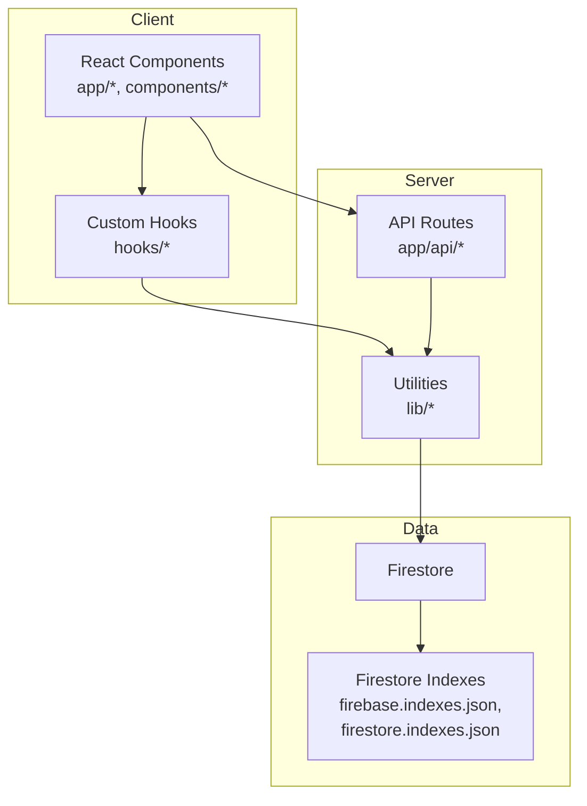
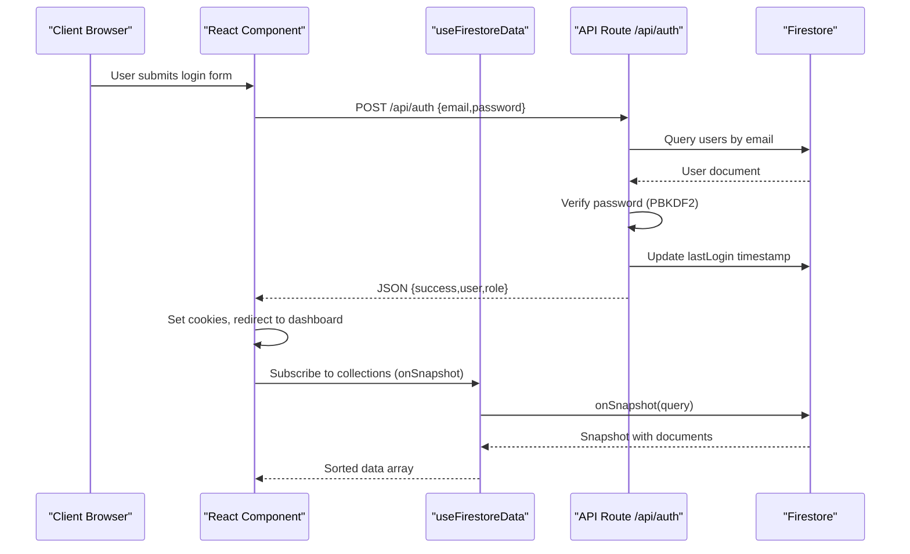
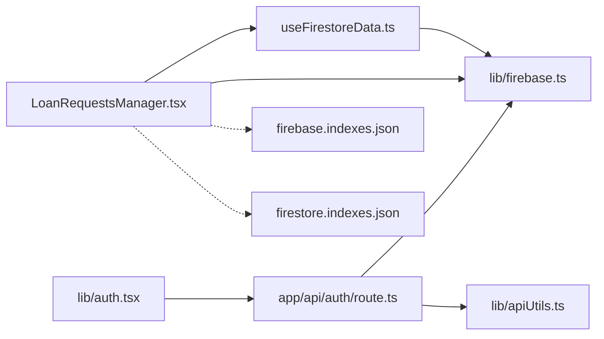

# Performance Optimization

<cite>
**Referenced Files in This Document**
- [package.json](file://package.json)
- [next.config.ts](file://next.config.ts)
- [firebase.indexes.json](file://firebase.indexes.json)
- [firestore.indexes.json](file://firestore.indexes.json)
- [lib/firebase.ts](file://lib/firebase.ts)
- [hooks/useFirestoreData.ts](file://hooks/useFirestoreData.ts)
- [lib/apiUtils.ts](file://lib/apiUtils.ts)
- [lib/auth.tsx](file://lib/auth.tsx)
- [app/api/auth/route.ts](file://app/api/auth/route.ts)
- [components/admin/LoanRequestsManager.tsx](file://components/admin/LoanRequestsManager.tsx)
- [components/admin/Pagination.tsx](file://components/admin/Pagination.tsx)
- [components/user/DynamicDashboard.tsx](file://components/user/DynamicDashboard.tsx)
- [lib/savingsService.ts](file://lib/savingsService.ts)
- [lib/certificateService.ts](file://lib/certificateService.ts)
- [lib/userMemberService.ts](file://lib/userMemberService.ts)
- [lib/userActionTracker.ts](file://lib/userActionTracker.ts)
- [scripts/deploy-loan-indexes.js](file://scripts/deploy-loan-indexes.js)
</cite>

## Table of Contents
1. [Introduction](#introduction)
2. [Project Structure](#project-structure)
3. [Core Components](#core-components)
4. [Architecture Overview](#architecture-overview)
5. [Detailed Component Analysis](#detailed-component-analysis)
6. [Dependency Analysis](#dependency-analysis)
7. [Performance Considerations](#performance-considerations)
8. [Troubleshooting Guide](#troubleshooting-guide)
9. [Conclusion](#conclusion)
10. [Appendices](#appendices)

## Introduction
This document provides comprehensive performance optimization guidance for the SAMPA Cooperative Management System. It focuses on Firestore query performance, API response optimization, client-side rendering and memory efficiency, monitoring and profiling, and scalability practices tailored to cooperative operations such as loan processing, member data updates, and dashboard rendering.

## Project Structure
The system follows a Next.js 16 app directory structure with:
- Client-side React components under app and components
- Serverless API routes under app/api
- Shared libraries under lib
- Custom hooks under hooks
- Scripts under scripts
- Configuration files for Firebase and Firestore indexes

**Diagram sources**
- [lib/firebase.ts](file://lib/firebase.ts#L1-L309)
- [hooks/useFirestoreData.ts](file://hooks/useFirestoreData.ts#L1-L182)
- [lib/apiUtils.ts](file://lib/apiUtils.ts#L1-L109)
- [app/api/auth/route.ts](file://app/api/auth/route.ts#L1-L295)
- [firebase.indexes.json](file://firebase.indexes.json#L1-L83)
- [firestore.indexes.json](file://firestore.indexes.json#L1-L83)

**Section sources**
- [package.json](file://package.json#L1-L53)
- [next.config.ts](file://next.config.ts#L1-L8)

## Core Components
- Firebase client initialization and Firestore wrapper for safe operations
- Real-time data hook with client-side sorting to reduce index overhead
- Authentication flow with standardized API responses and robust error handling
- Loan requests manager with pagination and client-side filtering
- Savings service with atomic updates and balance calculation
- Certificate generation service using jsPDF
- User-member linkage validation and healing for consistent IDs

**Section sources**
- [lib/firebase.ts](file://lib/firebase.ts#L1-L309)
- [hooks/useFirestoreData.ts](file://hooks/useFirestoreData.ts#L1-L182)
- [lib/apiUtils.ts](file://lib/apiUtils.ts#L1-L109)
- [lib/auth.tsx](file://lib/auth.tsx#L1-L682)
- [components/admin/LoanRequestsManager.tsx](file://components/admin/LoanRequestsManager.tsx#L1-L716)
- [lib/savingsService.ts](file://lib/savingsService.ts#L1-L455)
- [lib/certificateService.ts](file://lib/certificateService.ts#L1-L207)
- [lib/userMemberService.ts](file://lib/userMemberService.ts#L1-L287)

## Architecture Overview
The system integrates client-side React components with serverless API routes and Firestore. Authentication is handled via a custom login flow that validates credentials server-side and returns structured JSON responses. Real-time updates are achieved through Firestore onSnapshot listeners with optional client-side sorting.

**Diagram sources**
- [lib/auth.tsx](file://lib/auth.tsx#L197-L348)
- [app/api/auth/route.ts](file://app/api/auth/route.ts#L48-L264)
- [hooks/useFirestoreData.ts](file://hooks/useFirestoreData.ts#L65-L125)
- [lib/firebase.ts](file://lib/firebase.ts#L184-L240)

## Detailed Component Analysis

### Firestore Query Optimization
- Composite indexes for loan requests: status ASC with createdAt DESC, approvedAt DESC, rejectedAt DESC plus __name__ ASC to support efficient ordering and pagination.
- Client-side sorting in useFirestoreData avoids composite index requirements for non-key-field sorts, trading bandwidth for reduced index maintenance.
- Real-time listeners minimize repeated heavy queries; client-side sortData ensures correctness without server-side ordering constraints.

Recommendations:
- Prefer server-side orderBy for frequently accessed large datasets to leverage indexes.
- Limit returned fields using projection where feasible.
- Use pagination with cursor-based pagination for large lists.
- Monitor query costs and adjust indexes based on usage patterns.

**Section sources**
- [firebase.indexes.json](file://firebase.indexes.json#L1-L83)
- [firestore.indexes.json](file://firestore.indexes.json#L1-L83)
- [hooks/useFirestoreData.ts](file://hooks/useFirestoreData.ts#L32-L63)
- [components/admin/LoanRequestsManager.tsx](file://components/admin/LoanRequestsManager.tsx#L152-L244)

### API Response Optimization Strategies
- Standardized JSON responses with consistent success/error envelopes.
- Strict input validation and early exits to reduce unnecessary work.
- Centralized error handling that avoids exposing internal details.
- JSON parsing with explicit error handling to prevent silent failures.

Implementation highlights:
- apiSuccess, apiError, apiValidationError helpers ensure uniformity.
- parseJsonBody validates request bodies and returns structured errors.
- validateRequiredFields and validateEmailFormat enforce data quality.

**Section sources**
- [lib/apiUtils.ts](file://lib/apiUtils.ts#L8-L109)
- [app/api/auth/route.ts](file://app/api/auth/route.ts#L48-L264)

### Client-Side Performance Improvements
- Lazy loading: Use dynamic imports for heavy components (e.g., certificate generation).
- Bundle size optimization: Leverage Next.js defaults; remove unused dependencies.
- Rendering performance: Client-side sorting in useFirestoreData trades CPU for fewer indexes; consider virtualizing long lists.
- Pagination: Built-in Pagination component reduces DOM size per page.

Practical tips:
- Split large components into smaller chunks and load on demand.
- Memoize expensive computations and avoid re-sorting on every render.
- Use React.lazy and Suspense for non-critical views.

**Section sources**
- [components/admin/Pagination.tsx](file://components/admin/Pagination.tsx#L1-L141)
- [hooks/useFirestoreData.ts](file://hooks/useFirestoreData.ts#L32-L63)

### Memory Usage and Garbage Collection
- Real-time listeners: Ensure cleanup on component unmount to prevent leaks.
- Client-side sorting: Large arrays can increase memory pressure; consider server-side ordering for very large datasets.
- PDF generation: jsPDF operations can be memory-intensive; run off-main-thread or defer until needed.

Best practices:
- Always call unsubscribe on onSnapshot listeners.
- Avoid storing entire collections in state; keep only visible slices.
- Debounce or throttle frequent updates.

**Section sources**
- [hooks/useFirestoreData.ts](file://hooks/useFirestoreData.ts#L119-L125)
- [lib/certificateService.ts](file://lib/certificateService.ts#L10-L207)

### Monitoring and Profiling
- Activity logging: trackUserAction captures user actions with metadata for auditability.
- Client-side warnings: useFirestoreData displays toasts for configuration errors.
- Server-side logging: API routes log request parsing, validation, and database operations.

Recommended tools/metrics:
- Lighthouse for client-side performance audits.
- Next.js telemetry and profiler for SSR/ISR bottlenecks.
- Firebase Performance Monitoring for network and database tracing.
- Application performance monitoring (APM) for end-to-end latency.

**Section sources**
- [lib/userActionTracker.ts](file://lib/userActionTracker.ts#L10-L118)
- [hooks/useFirestoreData.ts](file://hooks/useFirestoreData.ts#L111-L116)
- [app/api/auth/route.ts](file://app/api/auth/route.ts#L48-L264)

### Real-Time Data Synchronization and Batch Operations
- Real-time listeners: onSnapshot provides near real-time updates with minimal latency.
- Atomic operations: savingsService performs balance calculations and updates in a controlled manner.
- Batch writes: For bulk updates, group Firestore writes and use transactions where appropriate.

Guidelines:
- Use transactions for interdependent updates.
- Defer non-critical updates to background tasks.
- Implement optimistic UI with rollback on failure.

**Section sources**
- [hooks/useFirestoreData.ts](file://hooks/useFirestoreData.ts#L82-L105)
- [lib/savingsService.ts](file://lib/savingsService.ts#L237-L342)

### Practical Examples and Solutions
- Slow loan processing:
  - Ensure required composite indexes are deployed.
  - Use server-side orderBy for large lists; avoid client-side sorting for massive datasets.
  - Implement pagination and search to reduce payload sizes.

- Delayed member data updates:
  - Confirm real-time listeners are active and unsubscribed on unmount.
  - Validate user-member linkage to prevent stale data.

- Dashboard rendering delays:
  - Virtualize long lists and lazy-load heavy charts.
  - Reduce initial payload by fetching only visible data.

**Section sources**
- [components/admin/LoanRequestsManager.tsx](file://components/admin/LoanRequestsManager.tsx#L10-L27)
- [hooks/useFirestoreData.ts](file://hooks/useFirestoreData.ts#L65-L125)
- [lib/userMemberService.ts](file://lib/userMemberService.ts#L99-L198)

## Dependency Analysis
The system’s performance depends on the interplay between client-side hooks, serverless routes, and Firestore indexes. Misalignment here can cause degraded UX or increased costs.

**Diagram sources**
- [hooks/useFirestoreData.ts](file://hooks/useFirestoreData.ts#L1-L182)
- [lib/firebase.ts](file://lib/firebase.ts#L1-L309)
- [components/admin/LoanRequestsManager.tsx](file://components/admin/LoanRequestsManager.tsx#L1-L716)
- [lib/auth.tsx](file://lib/auth.tsx#L1-L682)
- [app/api/auth/route.ts](file://app/api/auth/route.ts#L1-L295)
- [lib/apiUtils.ts](file://lib/apiUtils.ts#L1-L109)
- [firebase.indexes.json](file://firebase.indexes.json#L1-L83)
- [firestore.indexes.json](file://firestore.indexes.json#L1-L83)

**Section sources**
- [hooks/useFirestoreData.ts](file://hooks/useFirestoreData.ts#L1-L182)
- [components/admin/LoanRequestsManager.tsx](file://components/admin/LoanRequestsManager.tsx#L1-L716)
- [lib/auth.tsx](file://lib/auth.tsx#L1-L682)
- [app/api/auth/route.ts](file://app/api/auth/route.ts#L1-L295)
- [lib/apiUtils.ts](file://lib/apiUtils.ts#L1-L109)
- [firebase.indexes.json](file://firebase.indexes.json#L1-L83)
- [firestore.indexes.json](file://firestore.indexes.json#L1-L83)

## Performance Considerations
- Firestore indexing: Use scripts to deploy and maintain required composite indexes.
- Query patterns: Favor server-side ordering and filtering; minimize client-side transformations for large datasets.
- API reliability: Enforce strict JSON responses and validation to reduce retries and errors.
- Client rendering: Keep UI responsive by deferring heavy operations and virtualizing lists.
- Memory hygiene: Unsubscribe listeners, avoid retaining large arrays, and offload heavy computations.

[No sources needed since this section provides general guidance]

## Troubleshooting Guide
Common symptoms and resolutions:
- “failed-precondition” errors on loan requests:
  - Deploy required composite indexes using the provided script.
  - Verify index status in Firebase console.

- Slow dashboard loads:
  - Switch to server-side orderBy and pagination.
  - Lazy-load heavy components.

- Stale or missing member data:
  - Validate and heal user-member linkage on login.
  - Ensure real-time listeners are active and cleaned up.

- Authentication timeouts or mixed content-type responses:
  - Inspect API route logs and ensure JSON responses.
  - Check CORS and content-type headers.

**Section sources**
- [components/admin/LoanRequestsManager.tsx](file://components/admin/LoanRequestsManager.tsx#L10-L27)
- [scripts/deploy-loan-indexes.js](file://scripts/deploy-loan-indexes.js#L54-L93)
- [lib/userMemberService.ts](file://lib/userMemberService.ts#L99-L198)
- [lib/auth.tsx](file://lib/auth.tsx#L197-L348)
- [app/api/auth/route.ts](file://app/api/auth/route.ts#L48-L264)

## Conclusion
Optimizing SAMPA’s performance hinges on correct Firestore indexing, efficient query patterns, robust API responses, and mindful client-side rendering. By aligning indexes with query patterns, leveraging real-time listeners judiciously, and implementing structured monitoring, the system can scale reliably for cooperative management tasks.

[No sources needed since this section summarizes without analyzing specific files]

## Appendices

### Index Deployment Workflow
- Install Firebase CLI and authenticate.
- Run the deployment script to apply composite indexes.
- Monitor Firebase console for index build status.

**Section sources**
- [scripts/deploy-loan-indexes.js](file://scripts/deploy-loan-indexes.js#L16-L93)
- [firebase.indexes.json](file://firebase.indexes.json#L1-L83)
- [firestore.indexes.json](file://firestore.indexes.json#L1-L83)

### Load Testing and Baseline Establishment
- Establish baselines using synthetic loads simulating concurrent loan approvals and member updates.
- Measure p50/p95/p99 latencies for API routes and Firestore reads/writes.
- Introduce gradual scaling and monitor index build impact.

[No sources needed since this section provides general guidance]

### Monitoring Tools and Metrics
- Client: Lighthouse, Web Vitals, React DevTools Profiler.
- Serverless: Next.js logs, Firebase Functions logs.
- Data: Firestore query performance, index utilization.
- APM: End-to-end transaction traces and error rates.

[No sources needed since this section provides general guidance]