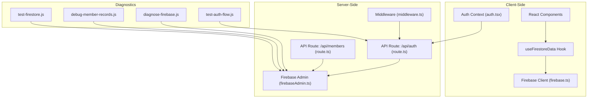
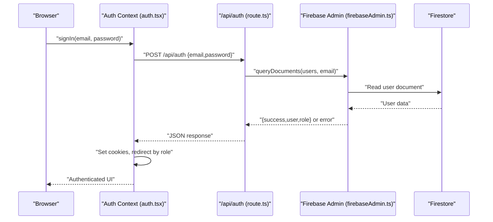
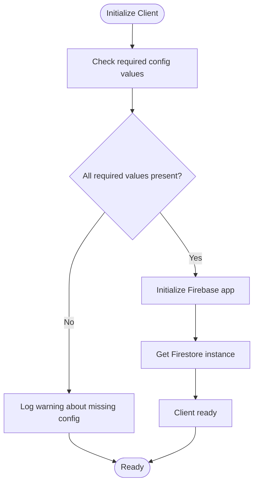
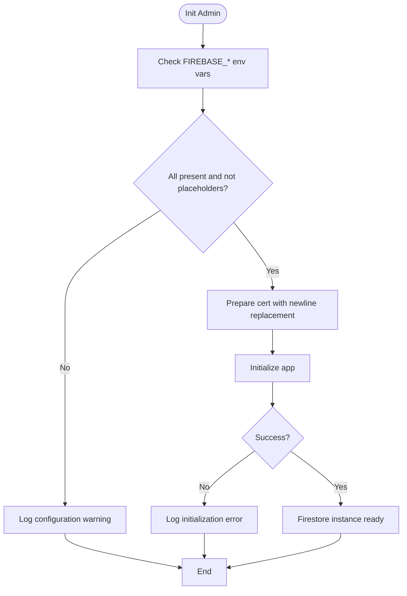
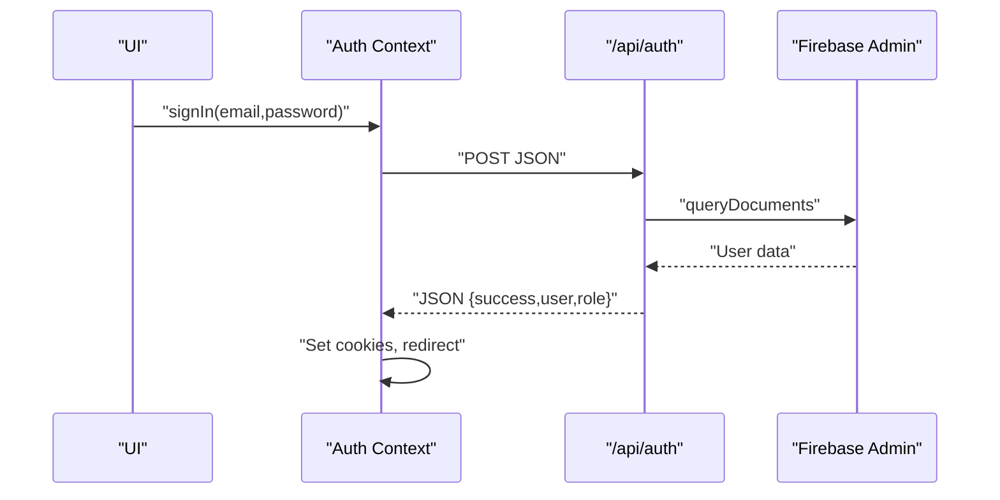
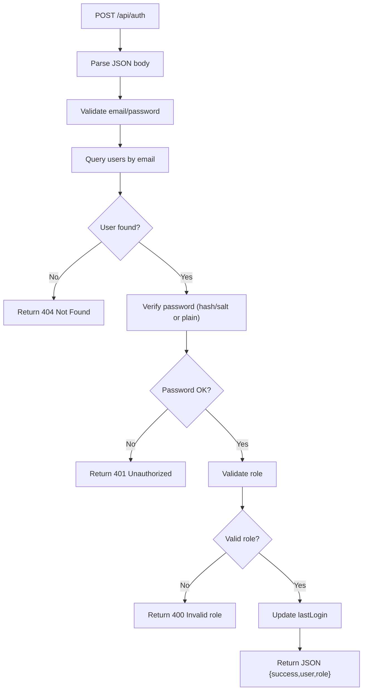
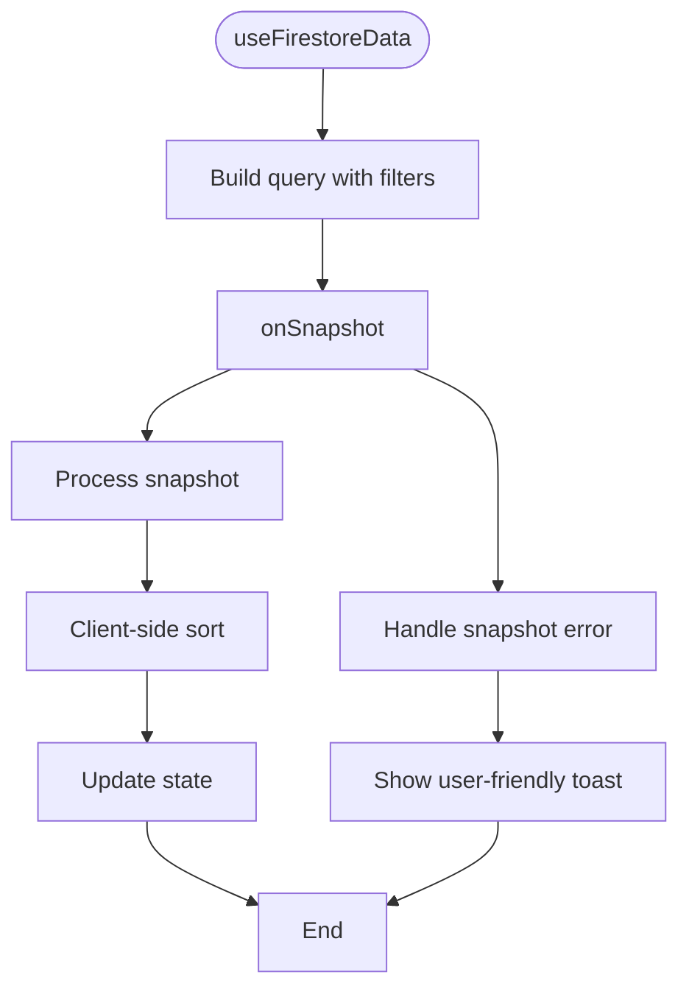
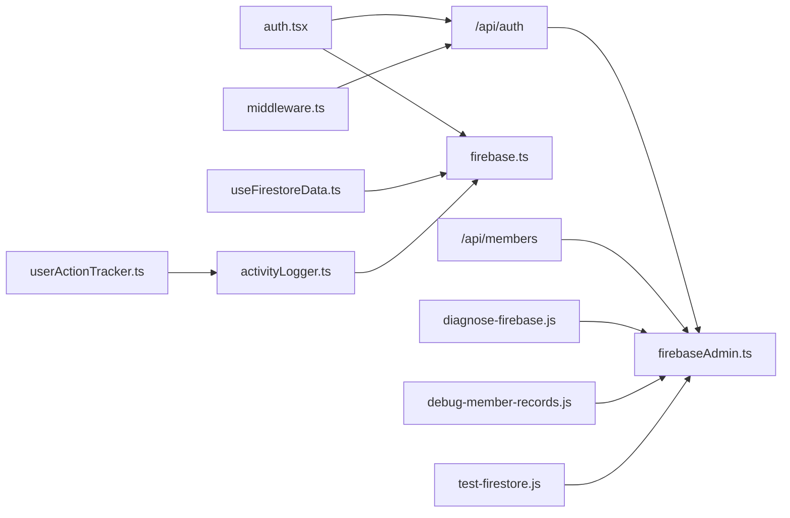

# Troubleshooting & Debugging

<cite>
**Referenced Files in This Document**
- [diagnose-firebase.js](file://scripts/diagnose-firebase.js)
- [debug-member-records.js](file://scripts/debug-member-records.js)
- [firebase.ts](file://lib/firebase.ts)
- [firebaseAdmin.ts](file://lib/firebaseAdmin.ts)
- [auth.tsx](file://lib/auth.tsx)
- [route.ts](file://app/api/auth/route.ts)
- [route.ts](file://app/api/members/route.ts)
- [useFirestoreData.ts](file://hooks/useFirestoreData.ts)
- [activityLogger.ts](file://lib/activityLogger.ts)
- [userActionTracker.ts](file://lib/userActionTracker.ts)
- [FIREBASE_TROUBLESHOOTING.md](file://docs/FIREBASE_TROUBLESHOOTING.md)
- [FIRESTORE_INDEXES.md](file://docs/FIRESTORE_INDEXES.md)
- [test-firestore.js](file://scripts/test-firestore.js)
- [test-auth-flow.js](file://scripts/test-auth-flow.js)
- [middleware.ts](file://middleware.ts)
</cite>

## Table of Contents
1. [Introduction](#introduction)
2. [Project Structure](#project-structure)
3. [Core Components](#core-components)
4. [Architecture Overview](#architecture-overview)
5. [Detailed Component Analysis](#detailed-component-analysis)
6. [Dependency Analysis](#dependency-analysis)
7. [Performance Considerations](#performance-considerations)
8. [Troubleshooting Guide](#troubleshooting-guide)
9. [Conclusion](#conclusion)
10. [Appendices](#appendices)

## Introduction
This document provides comprehensive troubleshooting and debugging guidance for the SAMPA Cooperative Management System. It focuses on Firebase-related issues (authentication, Firestore connectivity, and security rule conflicts), Next.js application diagnostics (API endpoints, component rendering), and operational scripts for diagnosing Firebase and validating member data. It also covers error handling patterns, logging and monitoring strategies, performance troubleshooting, and preventive measures to maintain system reliability and performance.

## Project Structure
The system integrates client-side Firebase SDK, server-side Firebase Admin SDK, Next.js API routes, and client-side hooks for real-time data. Diagnostic scripts and documentation support environment validation, connectivity checks, and role-based authentication flow verification.

**Diagram sources**
- [firebase.ts](file://lib/firebase.ts#L1-L309)
- [firebaseAdmin.ts](file://lib/firebaseAdmin.ts#L1-L277)
- [auth.tsx](file://lib/auth.tsx#L1-L682)
- [route.ts](file://app/api/auth/route.ts#L1-L295)
- [route.ts](file://app/api/members/route.ts#L1-L179)
- [useFirestoreData.ts](file://hooks/useFirestoreData.ts#L1-L182)
- [middleware.ts](file://middleware.ts#L1-L62)
- [diagnose-firebase.js](file://scripts/diagnose-firebase.js#L1-L61)
- [debug-member-records.js](file://scripts/debug-member-records.js#L1-L222)
- [test-firestore.js](file://scripts/test-firestore.js#L1-L44)
- [test-auth-flow.js](file://scripts/test-auth-flow.js#L1-L149)

**Section sources**
- [firebase.ts](file://lib/firebase.ts#L1-L309)
- [firebaseAdmin.ts](file://lib/firebaseAdmin.ts#L1-L277)
- [auth.tsx](file://lib/auth.tsx#L1-L682)
- [route.ts](file://app/api/auth/route.ts#L1-L295)
- [route.ts](file://app/api/members/route.ts#L1-L179)
- [useFirestoreData.ts](file://hooks/useFirestoreData.ts#L1-L182)
- [middleware.ts](file://middleware.ts#L1-L62)
- [diagnose-firebase.js](file://scripts/diagnose-firebase.js#L1-L61)
- [debug-member-records.js](file://scripts/debug-member-records.js#L1-L222)
- [test-firestore.js](file://scripts/test-firestore.js#L1-L44)
- [test-auth-flow.js](file://scripts/test-auth-flow.js#L1-L149)

## Core Components
- Firebase Client SDK (client-side): Initializes and validates Firestore connections, exposes safe wrappers for CRUD operations, and centralizes error handling.
- Firebase Admin SDK (server-side): Centralizes initialization with environment validation, provides robust query/update/set/get utilities, and logs initialization status.
- Authentication Context: Manages login, logout, role-based routing, and cookie-based session persistence; includes detailed logging and error handling.
- API Routes: Provide server-side authentication and member management with strict JSON responses, input validation, and error normalization.
- Real-time Data Hook: Provides client-side reactive data with client-side sorting and graceful error handling for snapshot listeners.
- Logging and Monitoring: Activity logging and user action tracking utilities for audit trails and diagnostics.
- Diagnostics Scripts: Automated checks for Firebase environment variables, Firestore connectivity, and member data validation.

**Section sources**
- [firebase.ts](file://lib/firebase.ts#L1-L309)
- [firebaseAdmin.ts](file://lib/firebaseAdmin.ts#L1-L277)
- [auth.tsx](file://lib/auth.tsx#L1-L682)
- [route.ts](file://app/api/auth/route.ts#L1-L295)
- [route.ts](file://app/api/members/route.ts#L1-L179)
- [useFirestoreData.ts](file://hooks/useFirestoreData.ts#L1-L182)
- [activityLogger.ts](file://lib/activityLogger.ts#L1-L165)
- [userActionTracker.ts](file://lib/userActionTracker.ts#L1-L118)
- [diagnose-firebase.js](file://scripts/diagnose-firebase.js#L1-L61)
- [debug-member-records.js](file://scripts/debug-member-records.js#L1-L222)

## Architecture Overview
The system follows a client-server split:
- Client-side uses Firebase Client SDK for UI interactions and real-time updates.
- Server-side uses Firebase Admin SDK for secure, privileged operations and API endpoints.
- Middleware enforces route access based on cookies and roles.
- API routes validate inputs, query Firestore, and return normalized JSON responses.
- Diagnostics scripts validate environment and connectivity independently of the app.

**Diagram sources**
- [auth.tsx](file://lib/auth.tsx#L197-L348)
- [route.ts](file://app/api/auth/route.ts#L48-L264)
- [firebaseAdmin.ts](file://lib/firebaseAdmin.ts#L111-L194)

**Section sources**
- [auth.tsx](file://lib/auth.tsx#L197-L348)
- [route.ts](file://app/api/auth/route.ts#L48-L264)
- [firebaseAdmin.ts](file://lib/firebaseAdmin.ts#L111-L194)

## Detailed Component Analysis

### Firebase Client SDK (firebase.ts)
- Initialization safeguards: checks for required config values, logs warnings for missing values, and avoids re-initialization.
- Connection validation: helper to validate Firestore availability and app reference.
- CRUD utilities: unified error handling, input validation, and normalized error messages including specific cases for permission and not-found errors.
- Connection testing: dedicated test function to verify Firestore availability.

**Diagram sources**
- [firebase.ts](file://lib/firebase.ts#L37-L60)

**Section sources**
- [firebase.ts](file://lib/firebase.ts#L37-L60)
- [firebase.ts](file://lib/firebase.ts#L62-L87)
- [firebase.ts](file://lib/firebase.ts#L90-L307)

### Firebase Admin SDK (firebaseAdmin.ts)
- Initialization: validates environment variables, rejects placeholders, replaces escaped newlines, logs detailed initialization outcomes.
- Utility functions: getDocument, queryDocuments, setDocument, getCollection with robust error handling and input validation.
- Initialization status: exposes isInitialized and getInitializationError for diagnostics.

**Diagram sources**
- [firebaseAdmin.ts](file://lib/firebaseAdmin.ts#L13-L108)

**Section sources**
- [firebaseAdmin.ts](file://lib/firebaseAdmin.ts#L13-L108)
- [firebaseAdmin.ts](file://lib/firebaseAdmin.ts#L111-L266)

### Authentication Context (auth.tsx)
- Login flow: validates inputs, calls /api/auth, parses JSON with fallbacks for non-JSON responses, sets cookies, tracks login, and redirects by role.
- Logout: clears state and cookies, tracks logout.
- Error handling: extensive logging, user-friendly messages, and safe fallbacks.

**Diagram sources**
- [auth.tsx](file://lib/auth.tsx#L197-L348)
- [route.ts](file://app/api/auth/route.ts#L48-L264)
- [firebaseAdmin.ts](file://lib/firebaseAdmin.ts#L111-L194)

**Section sources**
- [auth.tsx](file://lib/auth.tsx#L197-L348)
- [route.ts](file://app/api/auth/route.ts#L48-L264)

### API Routes
- Authentication route (/api/auth): strict input validation, normalized JSON responses, role validation, user-member linkage validation, and last login updates.
- Members route (/api/members): creates members with hashed passwords and filters members by role.

**Diagram sources**
- [route.ts](file://app/api/auth/route.ts#L48-L264)

**Section sources**
- [route.ts](file://app/api/auth/route.ts#L48-L264)
- [route.ts](file://app/api/members/route.ts#L25-L179)

### Real-time Data Hook (useFirestoreData.ts)
- Sets up onSnapshot listeners, applies filters, sorts client-side, and handles snapshot errors gracefully with user feedback.

**Diagram sources**
- [useFirestoreData.ts](file://hooks/useFirestoreData.ts#L65-L125)

**Section sources**
- [useFirestoreData.ts](file://hooks/useFirestoreData.ts#L65-L125)

### Logging and Monitoring (activityLogger.ts, userActionTracker.ts)
- Activity logging: stores structured logs with timestamps and metadata.
- Action tracking: wraps user actions with automatic logging and additional context.

**Section sources**
- [activityLogger.ts](file://lib/activityLogger.ts#L20-L165)
- [userActionTracker.ts](file://lib/userActionTracker.ts#L10-L118)

### Diagnostics Scripts
- diagnose-firebase.js: validates environment variables, detects placeholders, checks private key formatting and escaped newlines, and prints setup instructions.
- debug-member-records.js: simulates member fetching and filtering logic using Firebase Admin, processes members from either members or users collections, and logs results.

**Section sources**
- [diagnose-firebase.js](file://scripts/diagnose-firebase.js#L1-L61)
- [debug-member-records.js](file://scripts/debug-member-records.js#L1-L222)

## Dependency Analysis
- Client depends on Firebase Client SDK for UI operations.
- API routes depend on Firebase Admin SDK for secure operations.
- Auth Context depends on API routes and Firebase Client SDK.
- Middleware depends on validators and cookies for access control.
- Logging utilities depend on Firebase Client SDK for write operations.

**Diagram sources**
- [auth.tsx](file://lib/auth.tsx#L1-L682)
- [route.ts](file://app/api/auth/route.ts#L1-L295)
- [route.ts](file://app/api/members/route.ts#L1-L179)
- [firebase.ts](file://lib/firebase.ts#L1-L309)
- [firebaseAdmin.ts](file://lib/firebaseAdmin.ts#L1-L277)
- [useFirestoreData.ts](file://hooks/useFirestoreData.ts#L1-L182)
- [middleware.ts](file://middleware.ts#L1-L62)
- [activityLogger.ts](file://lib/activityLogger.ts#L1-L165)
- [userActionTracker.ts](file://lib/userActionTracker.ts#L1-L118)
- [diagnose-firebase.js](file://scripts/diagnose-firebase.js#L1-L61)
- [debug-member-records.js](file://scripts/debug-member-records.js#L1-L222)
- [test-firestore.js](file://scripts/test-firestore.js#L1-L44)

**Section sources**
- [auth.tsx](file://lib/auth.tsx#L1-L682)
- [route.ts](file://app/api/auth/route.ts#L1-L295)
- [route.ts](file://app/api/members/route.ts#L1-L179)
- [firebase.ts](file://lib/firebase.ts#L1-L309)
- [firebaseAdmin.ts](file://lib/firebaseAdmin.ts#L1-L277)
- [useFirestoreData.ts](file://hooks/useFirestoreData.ts#L1-L182)
- [middleware.ts](file://middleware.ts#L1-L62)
- [activityLogger.ts](file://lib/activityLogger.ts#L1-L165)
- [userActionTracker.ts](file://lib/userActionTracker.ts#L1-L118)
- [diagnose-firebase.js](file://scripts/diagnose-firebase.js#L1-L61)
- [debug-member-records.js](file://scripts/debug-member-records.js#L1-L222)
- [test-firestore.js](file://scripts/test-firestore.js#L1-L44)

## Performance Considerations
- Firestore indexing: Composite indexes are required for complex queries (e.g., loan requests). Use the documented indexes to avoid query errors and improve performance.
- Client-side sorting: The real-time hook performs client-side sorting to avoid composite index overhead; ensure datasets remain reasonable for smooth sorting.
- API response normalization: API routes return JSON consistently, reducing client-side parsing overhead and enabling predictable caching strategies.
- Logging overhead: Activity logs are written asynchronously; monitor frequency to avoid unnecessary writes.

[No sources needed since this section provides general guidance]

## Troubleshooting Guide

### Firebase Environment and Initialization
- Symptoms: Client fails to initialize, Admin SDK fails to initialize, or placeholder credentials detected.
- Resolution steps:
  - Run the Firebase diagnosis script to validate environment variables and private key formatting.
  - Ensure FIREBASE_PROJECT_ID, FIREBASE_CLIENT_EMAIL, and FIREBASE_PRIVATE_KEY are set and not placeholders.
  - Confirm private key is properly quoted and contains escaped newlines.
  - Restart the development server after updating .env.local.

**Section sources**
- [diagnose-firebase.js](file://scripts/diagnose-firebase.js#L1-L61)
- [FIREBASE_TROUBLESHOOTING.md](file://docs/FIREBASE_TROUBLESHOOTING.md#L1-L177)

### Firestore Connectivity and Security Rule Conflicts
- Symptoms: Permission denied errors, “query requires an index” errors, or collection not found.
- Resolution steps:
  - Use the Firestore test script to verify connectivity.
  - Review and deploy required composite indexes for query patterns.
  - Check Firestore rules for restrictive policies and temporarily relax during development.
  - Normalize error messages: permission-denied indicates rules or auth issues; NOT_FOUND indicates missing collection.

**Section sources**
- [test-firestore.js](file://scripts/test-firestore.js#L1-L44)
- [FIRESTORE_INDEXES.md](file://docs/FIRESTORE_INDEXES.md#L1-L110)
- [firebase.ts](file://lib/firebase.ts#L174-L180)
- [firebase.ts](file://lib/firebase.ts#L232-L238)

### Authentication Problems
- Symptoms: Login fails, role-based redirect issues, or session persistence problems.
- Resolution steps:
  - Verify /api/auth route is reachable and returns JSON.
  - Check that cookies (authenticated, userRole) are set and readable.
  - Validate user role exists and is valid; otherwise, redirect to login.
  - Use the authentication flow test script to simulate and validate role-based redirection.

**Section sources**
- [route.ts](file://app/api/auth/route.ts#L48-L264)
- [auth.tsx](file://lib/auth.tsx#L197-L348)
- [middleware.ts](file://middleware.ts#L1-L62)
- [test-auth-flow.js](file://scripts/test-auth-flow.js#L1-L149)

### API Endpoint Problems
- Symptoms: Non-JSON responses, HTTP errors, or inconsistent status codes.
- Resolution steps:
  - Inspect server logs for error stack traces and malformed responses.
  - Ensure API routes return JSON for all paths and normalize error messages.
  - Validate input bodies and content-type headers.

**Section sources**
- [route.ts](file://app/api/auth/route.ts#L250-L264)
- [route.ts](file://app/api/members/route.ts#L55-L64)

### Component Rendering Errors
- Symptoms: Snapshot listener failures, failed-precondition errors, or UI crashes.
- Resolution steps:
  - Use the real-time hook’s error handling to display user-friendly messages.
  - Check for missing indexes causing failed-precondition errors.
  - Validate Firestore initialization and network connectivity.

**Section sources**
- [useFirestoreData.ts](file://hooks/useFirestoreData.ts#L106-L116)

### Member Data Validation
- Symptoms: Missing members, inconsistent member/user linkage, or incorrect filtering.
- Resolution steps:
  - Run the member records debug script to simulate fetch and filter logic.
  - Validate that members are fetched from the correct collection or users with member roles.
  - Ensure archived/active filtering and search terms are applied safely.

**Section sources**
- [debug-member-records.js](file://scripts/debug-member-records.js#L37-L122)
- [debug-member-records.js](file://scripts/debug-member-records.js#L125-L176)

### Error Handling Patterns and Logging
- Patterns:
  - Always return JSON from API routes with explicit status codes.
  - Validate inputs early and return 4xx with clear messages.
  - Use normalized error messages for permission and query errors.
- Logging:
  - Track user actions with activity logs for auditability.
  - Use user action tracker helpers to wrap operations with logging.

**Section sources**
- [route.ts](file://app/api/auth/route.ts#L250-L264)
- [activityLogger.ts](file://lib/activityLogger.ts#L20-L43)
- [userActionTracker.ts](file://lib/userActionTracker.ts#L10-L47)

### Monitoring Approaches
- Server logs: Monitor initialization messages, authentication API calls, and error stack traces.
- Browser developer tools: Inspect Network tab for failed API requests, Console for JS errors, and Cookies for session persistence.
- Firestore rules: Use simulator to test rules during development.

**Section sources**
- [FIREBASE_TROUBLESHOOTING.md](file://docs/FIREBASE_TROUBLESHOOTING.md#L134-L150)

### Performance Troubleshooting
- Slow API responses:
  - Validate database connectivity and indexes.
  - Minimize payload sizes and avoid unnecessary computations in API routes.
- Database query optimization:
  - Deploy required composite indexes for query patterns.
  - Prefer server-side filtering over client-side filtering for large datasets.
- Memory usage analysis:
  - Monitor client-side sorting for large datasets; consider pagination or server-side filtering.

**Section sources**
- [FIRESTORE_INDEXES.md](file://docs/FIRESTORE_INDEXES.md#L71-L78)
- [useFirestoreData.ts](file://hooks/useFirestoreData.ts#L32-L63)

### Development Environment, Build, and Deployment Failures
- Environment variables:
  - Ensure .env.local contains all required Firebase variables and credentials.
- Build issues:
  - Restart development server after environment changes.
- Deployment:
  - Use Firebase CLI to deploy Firestore indexes and verify status before testing.

**Section sources**
- [FIREBASE_TROUBLESHOOTING.md](file://docs/FIREBASE_TROUBLESHOOTING.md#L166-L177)
- [FIRESTORE_INDEXES.md](file://docs/FIRESTORE_INDEXES.md#L66-L69)

## Conclusion
This guide consolidates Firebase troubleshooting, Next.js diagnostics, and operational scripts to resolve common issues efficiently. By validating environment variables, ensuring proper indexing, normalizing API responses, and leveraging logging and monitoring, teams can maintain system reliability and performance. Use the provided scripts and patterns to systematically diagnose and resolve issues across authentication, Firestore connectivity, and UI rendering.

[No sources needed since this section summarizes without analyzing specific files]

## Appendices

### Quick Reference: Common Errors and Fixes
- “Permission denied”: Check Firestore rules and user permissions; verify Admin SDK credentials.
- “Query requires an index”: Deploy required composite indexes; confirm field order and scope.
- “Invalid credentials”: Regenerate service account key; update .env.local; restart server.
- “No response from server”: Inspect API route logs; ensure JSON responses; validate content-type.
- “Snapshot failed-precondition”: Confirm indexes are enabled; check query scope and field ordering.

**Section sources**
- [FIREBASE_TROUBLESHOOTING.md](file://docs/FIREBASE_TROUBLESHOOTING.md#L134-L150)
- [FIRESTORE_INDEXES.md](file://docs/FIRESTORE_INDEXES.md#L90-L101)
- [route.ts](file://app/api/auth/route.ts#L250-L264)