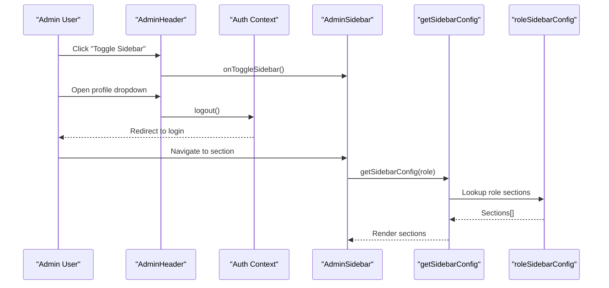
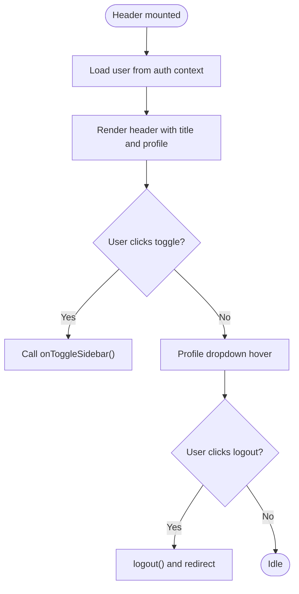
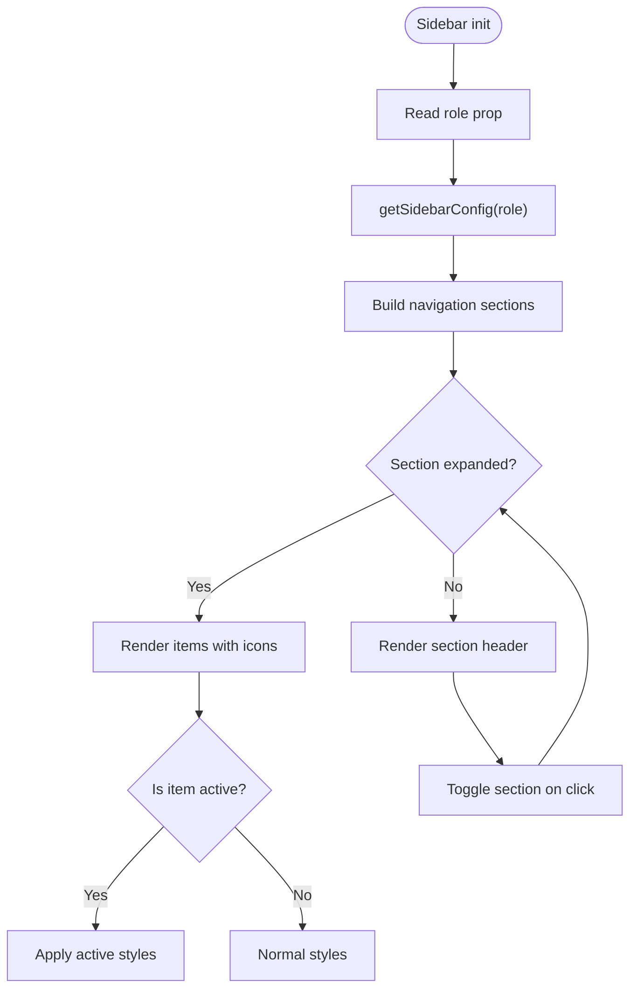
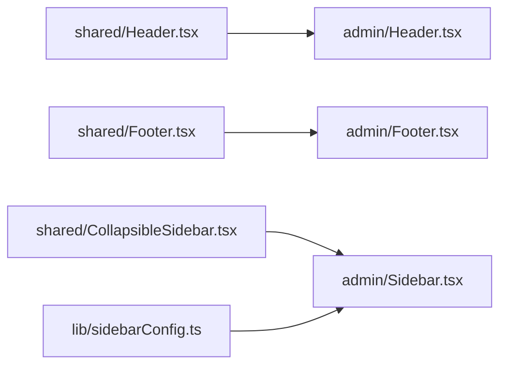
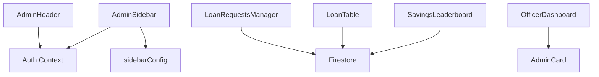

# Administrative Components

<cite>
**Referenced Files in This Document**
- [components/admin/index.ts](file://components/admin/index.ts)
- [components/admin/Header.tsx](file://components/admin/Header.tsx)
- [components/admin/Footer.tsx](file://components/admin/Footer.tsx)
- [components/admin/Card.tsx](file://components/admin/Card.tsx)
- [components/admin/Sidebar.tsx](file://components/admin/Sidebar.tsx)
- [components/shared/Header.tsx](file://components/shared/Header.tsx)
- [components/shared/Footer.tsx](file://components/shared/Footer.tsx)
- [components/shared/CollapsibleSidebar.tsx](file://components/shared/CollapsibleSidebar.tsx)
- [lib/sidebarConfig.ts](file://lib/sidebarConfig.ts)
- [lib/auth.tsx](file://lib/auth.tsx)
- [components/admin/OfficerDashboard.tsx](file://components/admin/OfficerDashboard.tsx)
- [components/admin/LoanRequestsTable.tsx](file://components/admin/LoanRequestsTable.tsx)
- [components/admin/LoanTable.tsx](file://components/admin/LoanTable.tsx)
- [components/admin/Pagination.tsx](file://components/admin/Pagination.tsx)
- [components/admin/SavingsLeaderboard.tsx](file://components/admin/SavingsLeaderboard.tsx)
- [components/admin/LoanRequestsManager.tsx](file://components/admin/LoanRequestsManager.tsx)
- [components/admin/MemberRegistrationModal.tsx](file://components/admin/MemberRegistrationModal.tsx)
- [components/admin/AddSavingsModal.tsx](file://components/admin/AddSavingsModal.tsx)
- [components/admin/README.md](file://components/admin/README.md)
</cite>

## Table of Contents
1. [Introduction](#introduction)
2. [Project Structure](#project-structure)
3. [Core Components](#core-components)
4. [Architecture Overview](#architecture-overview)
5. [Detailed Component Analysis](#detailed-component-analysis)
6. [Dependency Analysis](#dependency-analysis)
7. [Performance Considerations](#performance-considerations)
8. [Troubleshooting Guide](#troubleshooting-guide)
9. [Conclusion](#conclusion)
10. [Appendices](#appendices)

## Introduction
This document describes the Administrative Components used across the SAMPA Cooperative Management Platform’s officer dashboards. It focuses on the admin-specific Header, Footer, Card, and Sidebar components, along with supporting tables, modals, dashboards, and pagination utilities. It explains how these components adapt shared UI elements for administrative contexts, integrate with role-based navigation, and support cooperative operations such as member management, loan processing, and savings administration.

## Project Structure
The administrative UI is organized under components/admin with a barrel export index.ts that re-exports key components. Supporting role-based navigation is configured via lib/sidebarConfig.ts, while authentication and role-aware routing are handled in lib/auth.tsx. Shared UI components (non-admin) exist under components/shared and inform the design and behavior of admin counterparts.

```mermaid
graph TB
subgraph "Admin Components"
A_Index["components/admin/index.ts"]
A_Header["components/admin/Header.tsx"]
A_Footer["components/admin/Footer.tsx"]
A_Card["components/admin/Card.tsx"]
A_Sidebar["components/admin/Sidebar.tsx"]
A_Dashboard["components/admin/OfficerDashboard.tsx"]
A_LoanTable["components/admin/LoanTable.tsx"]
A_LoanRequestsTable["components/admin/LoanRequestsTable.tsx"]
A_Pagination["components/admin/Pagination.tsx"]
A_SavingsLeaderboard["components/admin/SavingsLeaderboard.tsx"]
A_AddSavingsModal["components/admin/AddSavingsModal.tsx"]
A_MemberRegModal["components/admin/MemberRegistrationModal.tsx"]
end
subgraph "Shared Components"
S_Header["components/shared/Header.tsx"]
S_Footer["components/shared/Footer.tsx"]
S_CollapsibleSidebar["components/shared/CollapsibleSidebar.tsx"]
end
subgraph "Libraries"
L_SidebarCfg["lib/sidebarConfig.ts"]
L_Auth["lib/auth.tsx"]
end
A_Index --> A_Header
A_Index --> A_Footer
A_Index --> A_Card
A_Index --> A_Sidebar
A_Index --> A_LoanTable
A_Index --> A_LoanRequestsTable
A_Index --> A_Pagination
A_Index --> A_SavingsLeaderboard
A_Index --> A_AddSavingsModal
A_Index --> A_MemberRegModal
A_Sidebar --> L_SidebarCfg
A_Header --> L_Auth
A_Dashboard --> A_Card
S_Header -. "inspiration/design" .- A_Header
S_Footer -. "inspiration/design" .- A_Footer
S_CollapsibleSidebar -. "inspiration/design" .- A_Sidebar
```

**Diagram sources**
- [components/admin/index.ts](file://components/admin/index.ts#L1-L11)
- [components/admin/Header.tsx](file://components/admin/Header.tsx#L1-L105)
- [components/admin/Footer.tsx](file://components/admin/Footer.tsx#L1-L23)
- [components/admin/Card.tsx](file://components/admin/Card.tsx#L1-L35)
- [components/admin/Sidebar.tsx](file://components/admin/Sidebar.tsx#L1-L279)
- [components/admin/OfficerDashboard.tsx](file://components/admin/OfficerDashboard.tsx#L1-L198)
- [components/admin/LoanTable.tsx](file://components/admin/LoanTable.tsx#L1-L339)
- [components/admin/LoanRequestsTable.tsx](file://components/admin/LoanRequestsTable.tsx#L1-L10)
- [components/admin/Pagination.tsx](file://components/admin/Pagination.tsx#L1-L141)
- [components/admin/SavingsLeaderboard.tsx](file://components/admin/SavingsLeaderboard.tsx#L1-L213)
- [components/admin/AddSavingsModal.tsx](file://components/admin/AddSavingsModal.tsx#L1-L217)
- [components/admin/MemberRegistrationModal.tsx](file://components/admin/MemberRegistrationModal.tsx#L1-L800)
- [components/shared/Header.tsx](file://components/shared/Header.tsx#L1-L26)
- [components/shared/Footer.tsx](file://components/shared/Footer.tsx#L1-L9)
- [components/shared/CollapsibleSidebar.tsx](file://components/shared/CollapsibleSidebar.tsx#L1-L156)
- [lib/sidebarConfig.ts](file://lib/sidebarConfig.ts#L1-L262)
- [lib/auth.tsx](file://lib/auth.tsx#L1-L682)

**Section sources**
- [components/admin/index.ts](file://components/admin/index.ts#L1-L11)
- [lib/sidebarConfig.ts](file://lib/sidebarConfig.ts#L1-L262)
- [lib/auth.tsx](file://lib/auth.tsx#L111-L156)

## Core Components
This section documents the primary admin UI building blocks and their responsibilities.

- Admin Header
  - Purpose: Top navigation bar for admin panels with sidebar toggle, branding, and user profile dropdown.
  - Key props: sidebarCollapsed, onToggleSidebar.
  - Behavior: Integrates with authentication to provide logout and displays user email.
  - Reference: [components/admin/Header.tsx](file://components/admin/Header.tsx#L37-L43)

- Admin Footer
  - Purpose: Fixed footer for admin panels with copyright and version info.
  - Behavior: Minimalist design with current year and panel version.
  - Reference: [components/admin/Footer.tsx](file://components/admin/Footer.tsx#L8-L22)

- Admin Card
  - Purpose: Reusable container for admin content with optional title and responsive padding.
  - Key props: title, children, className.
  - Reference: [components/admin/Card.tsx](file://components/admin/Card.tsx#L14-L22)

- Admin Sidebar
  - Purpose: Collapsible navigation for admin dashboards with role-based sections, dropdowns, and logout.
  - Key props: collapsed, onToggle, role.
  - Behavior: Uses roleSidebarConfig to render appropriate sections; supports collapsed/expanded states; highlights active route.
  - Reference: [components/admin/Sidebar.tsx](file://components/admin/Sidebar.tsx#L92-L96)

- Role-based Navigation
  - Configuration: roleSidebarConfig defines per-role sections and items.
  - Resolution: getSidebarConfig(role) returns the appropriate sections for rendering.
  - Reference: [lib/sidebarConfig.ts](file://lib/sidebarConfig.ts#L258-L262)

- Authentication and Role Routing
  - getDashboardPath(role) determines the initial admin dashboard URL per role.
  - Reference: [lib/auth.tsx](file://lib/auth.tsx#L111-L156)

**Section sources**
- [components/admin/Header.tsx](file://components/admin/Header.tsx#L25-L105)
- [components/admin/Footer.tsx](file://components/admin/Footer.tsx#L1-L23)
- [components/admin/Card.tsx](file://components/admin/Card.tsx#L1-L35)
- [components/admin/Sidebar.tsx](file://components/admin/Sidebar.tsx#L77-L279)
- [lib/sidebarConfig.ts](file://lib/sidebarConfig.ts#L29-L262)
- [lib/auth.tsx](file://lib/auth.tsx#L111-L156)

## Architecture Overview
The admin components integrate with role-based navigation and authentication to deliver a cohesive officer dashboard experience. The Sidebar dynamically renders sections based on the user’s role, while the Header and Footer provide consistent branding and user controls. Supporting components like LoanTable, SavingsLeaderboard, and Pagination enable data-heavy administrative tasks.

**Diagram sources**
- [components/admin/Header.tsx](file://components/admin/Header.tsx#L44-L59)
- [components/admin/Sidebar.tsx](file://components/admin/Sidebar.tsx#L92-L115)
- [lib/sidebarConfig.ts](file://lib/sidebarConfig.ts#L258-L262)

## Detailed Component Analysis

### Admin Header Component
- Responsibilities
  - Toggle sidebar via callback prop.
  - Display application title and user email.
  - Provide logout dropdown with icon.
- Integration
  - Uses useAuth for user state and logout.
  - Calls centralized logout utility for admin sessions.
- Accessibility and UX
  - Focusable elements and hover states for interactive elements.
  - Dropdown visibility controlled by state.

**Diagram sources**
- [components/admin/Header.tsx](file://components/admin/Header.tsx#L44-L103)
- [lib/auth.tsx](file://lib/auth.tsx#L621-L635)

**Section sources**
- [components/admin/Header.tsx](file://components/admin/Header.tsx#L25-L105)
- [lib/auth.tsx](file://lib/auth.tsx#L621-L635)

### Admin Footer Component
- Responsibilities
  - Fixed footer with copyright and version label.
  - Minimal styling to maintain contrast against admin red/blue palette.
- Usage
  - Included at the bottom of admin layouts to ensure consistent branding.

**Section sources**
- [components/admin/Footer.tsx](file://components/admin/Footer.tsx#L1-L23)

### Admin Card Component
- Responsibilities
  - Container with optional title bar and inner content area.
  - Consistent spacing and shadow for elevation.
- Extensibility
  - Accepts additional className for custom styling.
- Example usage
  - Used within OfficerDashboard to present metrics and quick actions.

**Section sources**
- [components/admin/Card.tsx](file://components/admin/Card.tsx#L1-L35)
- [components/admin/OfficerDashboard.tsx](file://components/admin/OfficerDashboard.tsx#L106-L139)

### Admin Sidebar Component
- Responsibilities
  - Collapsible navigation with role-aware sections.
  - Dropdown menus for grouped items.
  - Active route highlighting.
  - Bottom logout button.
- Behavior
  - Uses getSidebarConfig(role) to render sections.
  - Maintains expanded/collapsed state for sections.
  - Supports collapsed mode with minimal icons.
- Integration
  - Uses Lucide icons mapped by name.
  - Links navigate via Next.js Link.

**Diagram sources**
- [components/admin/Sidebar.tsx](file://components/admin/Sidebar.tsx#L92-L123)
- [lib/sidebarConfig.ts](file://lib/sidebarConfig.ts#L258-L262)

**Section sources**
- [components/admin/Sidebar.tsx](file://components/admin/Sidebar.tsx#L77-L279)
- [lib/sidebarConfig.ts](file://lib/sidebarConfig.ts#L29-L262)

### Supporting Components and Dashboards

#### OfficerDashboard
- Purpose: Role-specific dashboard displaying cooperative metrics and quick actions.
- Data: Fetches counts for members, active loans, and loan requests.
- Layout: Uses Admin Card for metric cards and quick action grid.

**Section sources**
- [components/admin/OfficerDashboard.tsx](file://components/admin/OfficerDashboard.tsx#L14-L198)

#### Loan Requests Management
- LoanRequestsTable
  - Thin wrapper delegating to LoanRequestsManager.
  - Reference: [components/admin/LoanRequestsTable.tsx](file://components/admin/LoanRequestsTable.tsx#L1-L10)

- LoanRequestsManager
  - Real-time listeners for pending/approved/rejected loan requests.
  - Tabbed interface with search and pagination.
  - Approval/rejection actions with Firestore updates.
  - Modal for detailed request view.

**Section sources**
- [components/admin/LoanRequestsTable.tsx](file://components/admin/LoanRequestsTable.tsx#L1-L10)
- [components/admin/LoanRequestsManager.tsx](file://components/admin/LoanRequestsManager.tsx#L64-L716)

#### LoanTable
- Purpose: Displays loan requests with approve/reject actions.
- Features: Status badges, currency/date formatting, processing indicators.
- Behavior: Updates Firestore on approve/reject and generates payment schedules.

**Section sources**
- [components/admin/LoanTable.tsx](file://components/admin/LoanTable.tsx#L59-L339)

#### Pagination
- Purpose: Pagination controls for lists with ellipsis and responsive design.
- Props: currentPage, totalPages, onPageChange.
- Behavior: Generates page buttons with current page highlighting.

**Section sources**
- [components/admin/Pagination.tsx](file://components/admin/Pagination.tsx#L11-L141)

#### SavingsLeaderboard
- Purpose: Displays top members by total savings with ranking and currency formatting.
- Data: Aggregates savings transactions and sorts top 10.
- Behavior: Loading skeleton and gradient styling for top ranks.

**Section sources**
- [components/admin/SavingsLeaderboard.tsx](file://components/admin/SavingsLeaderboard.tsx#L32-L213)

#### AddSavingsModal
- Purpose: Modal for adding deposit/withdrawal transactions with validation and current balance display.
- Validation: Ensures positive amounts and prevents over-withdrawals.

**Section sources**
- [components/admin/AddSavingsModal.tsx](file://components/admin/AddSavingsModal.tsx#L12-L217)

#### MemberRegistrationModal
- Purpose: Multi-step modal for registering new members with role-specific details.
- Validation: Comprehensive form validation with dynamic fields for operators’ jeepney plates.
- Integration: Uses user-member linking service and sends confirmation emails.

**Section sources**
- [components/admin/MemberRegistrationModal.tsx](file://components/admin/MemberRegistrationModal.tsx#L88-L800)

### Conceptual Overview
The admin components share a consistent design language with shared components. Admin Header/Footer mirror shared Header/Footer in structure and color scheme, while Admin Sidebar adapts shared CollapsibleSidebar’s collapsible behavior and navigation patterns to role-based sections.

**Diagram sources**
- [components/shared/Header.tsx](file://components/shared/Header.tsx#L4-L25)
- [components/shared/Footer.tsx](file://components/shared/Footer.tsx#L1-L9)
- [components/shared/CollapsibleSidebar.tsx](file://components/shared/CollapsibleSidebar.tsx#L74-L156)
- [components/admin/Header.tsx](file://components/admin/Header.tsx#L25-L105)
- [components/admin/Footer.tsx](file://components/admin/Footer.tsx#L1-L23)
- [components/admin/Sidebar.tsx](file://components/admin/Sidebar.tsx#L77-L279)
- [lib/sidebarConfig.ts](file://lib/sidebarConfig.ts#L29-L262)

## Dependency Analysis
- Admin components depend on:
  - Authentication context for user state and logout.
  - Role-based sidebar configuration for navigation.
  - Shared UI patterns for consistent design.
- Data components rely on Firestore utilities and real-time listeners.

**Diagram sources**
- [components/admin/Header.tsx](file://components/admin/Header.tsx#L44-L59)
- [components/admin/Sidebar.tsx](file://components/admin/Sidebar.tsx#L98-L115)
- [lib/sidebarConfig.ts](file://lib/sidebarConfig.ts#L258-L262)
- [components/admin/LoanRequestsManager.tsx](file://components/admin/LoanRequestsManager.tsx#L152-L255)
- [components/admin/LoanTable.tsx](file://components/admin/LoanTable.tsx#L69-L179)
- [components/admin/SavingsLeaderboard.tsx](file://components/admin/SavingsLeaderboard.tsx#L36-L123)
- [components/admin/OfficerDashboard.tsx](file://components/admin/OfficerDashboard.tsx#L106-L139)

**Section sources**
- [lib/auth.tsx](file://lib/auth.tsx#L621-L635)
- [lib/sidebarConfig.ts](file://lib/sidebarConfig.ts#L258-L262)
- [components/admin/LoanRequestsManager.tsx](file://components/admin/LoanRequestsManager.tsx#L152-L255)
- [components/admin/LoanTable.tsx](file://components/admin/LoanTable.tsx#L69-L179)
- [components/admin/SavingsLeaderboard.tsx](file://components/admin/SavingsLeaderboard.tsx#L36-L123)
- [components/admin/OfficerDashboard.tsx](file://components/admin/OfficerDashboard.tsx#L106-L139)

## Performance Considerations
- Real-time listeners: LoanRequestsManager sets up onSnapshot listeners for pending/approved/rejected requests. Ensure Firestore indexes exist to avoid “failed-precondition” errors.
- Pagination: Limit items per page to reduce DOM size and improve responsiveness.
- Currency/date formatting: Use locale-aware formatting sparingly; cache formatters if used frequently.
- Modals: Keep forms lightweight; defer heavy computations until submit.

[No sources needed since this section provides general guidance]

## Troubleshooting Guide
- Sidebar navigation issues
  - Verify role prop passed to AdminSidebar matches a configured role.
  - Confirm getSidebarConfig(role) returns sections for the given role.
  - References: [components/admin/Sidebar.tsx](file://components/admin/Sidebar.tsx#L101-L102), [lib/sidebarConfig.ts](file://lib/sidebarConfig.ts#L258-L262)

- Logout behavior
  - AdminHeader calls logout and redirects; ensure centralized logout clears cookies and state.
  - References: [components/admin/Header.tsx](file://components/admin/Header.tsx#L48-L59), [lib/auth.tsx](file://lib/auth.tsx#L621-L635)

- Loan requests not updating
  - Check Firestore indexes for loanRequests queries by status and timestamps.
  - References: [components/admin/LoanRequestsManager.tsx](file://components/admin/LoanRequestsManager.tsx#L10-L27)

- Savings leaderboard empty
  - Confirm savings collection exists and members have transactions; component filters invalid entries.
  - References: [components/admin/SavingsLeaderboard.tsx](file://components/admin/SavingsLeaderboard.tsx#L36-L123)

**Section sources**
- [components/admin/Sidebar.tsx](file://components/admin/Sidebar.tsx#L101-L115)
- [lib/sidebarConfig.ts](file://lib/sidebarConfig.ts#L258-L262)
- [components/admin/Header.tsx](file://components/admin/Header.tsx#L48-L59)
- [lib/auth.tsx](file://lib/auth.tsx#L621-L635)
- [components/admin/LoanRequestsManager.tsx](file://components/admin/LoanRequestsManager.tsx#L10-L27)
- [components/admin/SavingsLeaderboard.tsx](file://components/admin/SavingsLeaderboard.tsx#L36-L123)

## Conclusion
The administrative components provide a cohesive, role-aware interface for managing cooperative operations. They adapt shared UI patterns to admin contexts, enforce role-based navigation, and support data-heavy workflows such as loan approvals and savings tracking. Proper configuration of role-based navigation and Firestore indexes ensures smooth operation across dashboards.

[No sources needed since this section summarizes without analyzing specific files]

## Appendices

### Component Index Export Structure
- Purpose: Centralized exports for easy imports across admin pages.
- Exports include Header, Footer, Card, Sidebar, LoanTable, LoanRequestsTable, Pagination, SavingsLeaderboard, and several modals.

**Section sources**
- [components/admin/index.ts](file://components/admin/index.ts#L1-L11)

### Practical Usage Examples
- Role-specific dashboards
  - Use OfficerDashboard with role prop to render role-appropriate metrics and quick actions.
  - Reference: [components/admin/OfficerDashboard.tsx](file://components/admin/OfficerDashboard.tsx#L14-L198)

- Loan request approvals
  - Integrate LoanTable or LoanRequestsManager in admin loan pages to review and act on requests.
  - Reference: [components/admin/LoanTable.tsx](file://components/admin/LoanTable.tsx#L59-L339), [components/admin/LoanRequestsManager.tsx](file://components/admin/LoanRequestsManager.tsx#L64-L716)

- Savings administration
  - Use AddSavingsModal for adding transactions and SavingsLeaderboard for reporting.
  - Reference: [components/admin/AddSavingsModal.tsx](file://components/admin/AddSavingsModal.tsx#L12-L217), [components/admin/SavingsLeaderboard.tsx](file://components/admin/SavingsLeaderboard.tsx#L32-L213)

- Member onboarding
  - Use MemberRegistrationModal for multi-step registration with role-specific fields.
  - Reference: [components/admin/MemberRegistrationModal.tsx](file://components/admin/MemberRegistrationModal.tsx#L88-L800)

**Section sources**
- [components/admin/OfficerDashboard.tsx](file://components/admin/OfficerDashboard.tsx#L14-L198)
- [components/admin/LoanTable.tsx](file://components/admin/LoanTable.tsx#L59-L339)
- [components/admin/LoanRequestsManager.tsx](file://components/admin/LoanRequestsManager.tsx#L64-L716)
- [components/admin/AddSavingsModal.tsx](file://components/admin/AddSavingsModal.tsx#L12-L217)
- [components/admin/SavingsLeaderboard.tsx](file://components/admin/SavingsLeaderboard.tsx#L32-L213)
- [components/admin/MemberRegistrationModal.tsx](file://components/admin/MemberRegistrationModal.tsx#L88-L800)