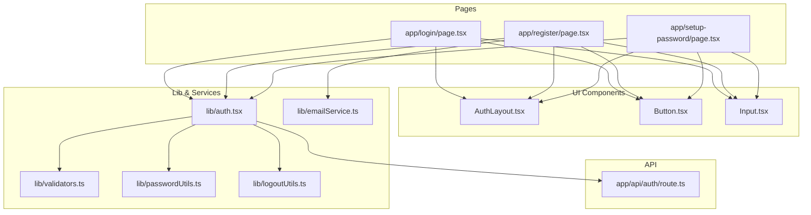
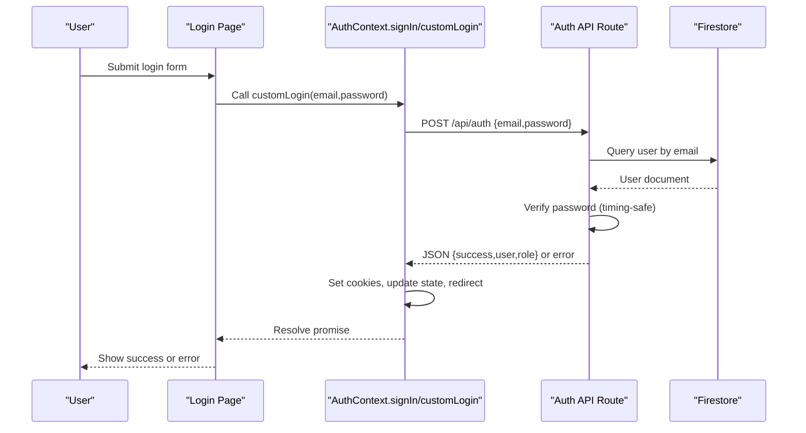
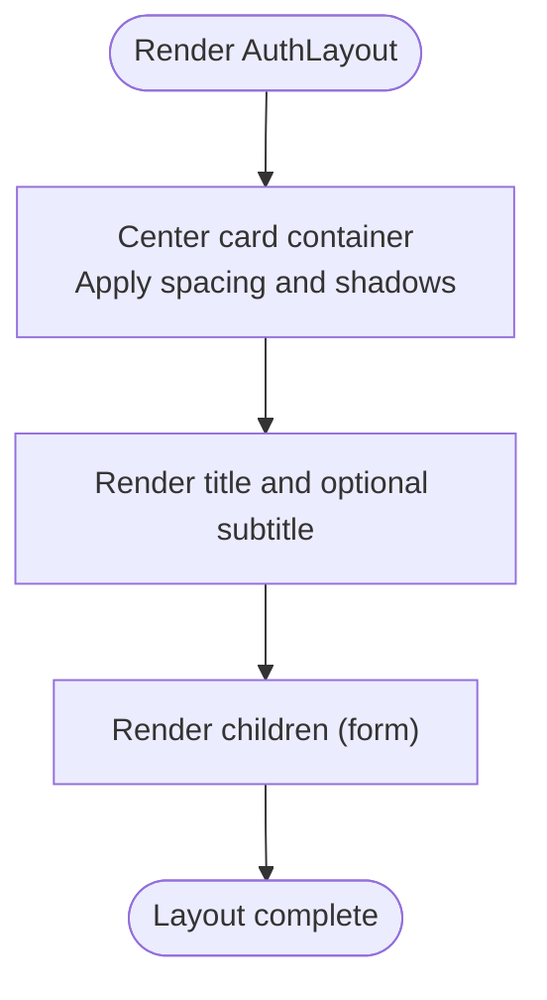
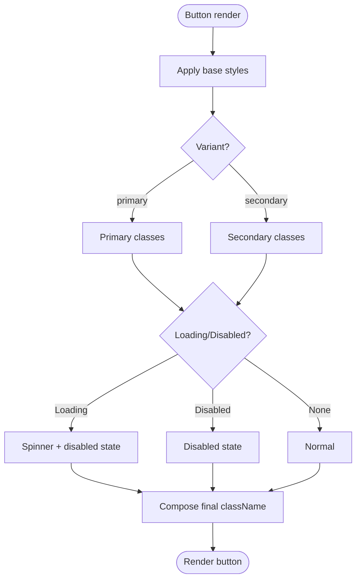
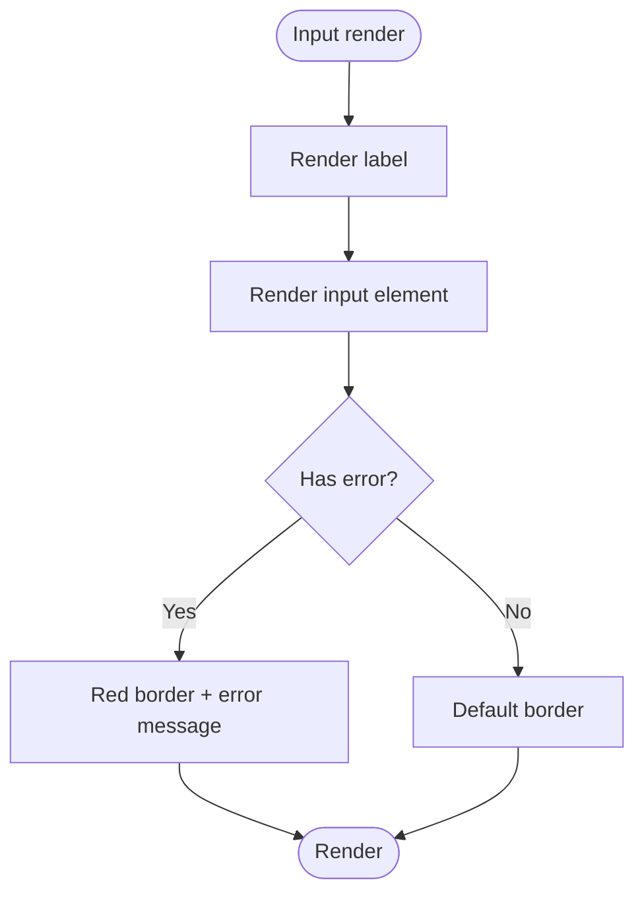
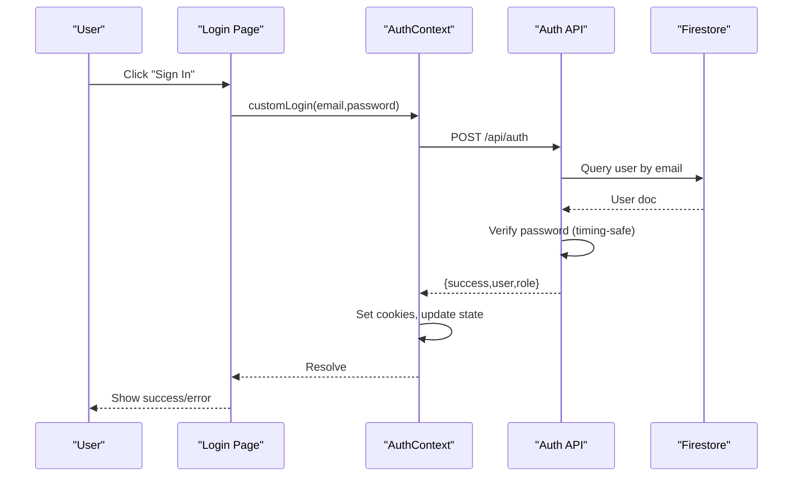
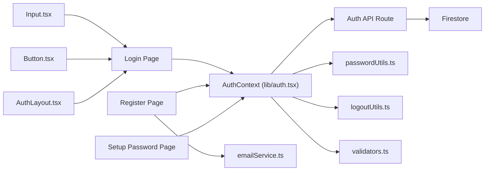

# Authentication Components

<cite>
**Referenced Files in This Document**
- [AuthLayout.tsx](file://components/auth/AuthLayout.tsx)
- [Button.tsx](file://components/auth/Button.tsx)
- [Input.tsx](file://components/auth/Input.tsx)
- [auth.tsx](file://lib/auth.tsx)
- [page.tsx (Login)](file://app/login/page.tsx)
- [page.tsx (Register)](file://app/register/page.tsx)
- [route.ts (Auth API)](file://app/api/auth/route.ts)
- [passwordUtils.ts](file://lib/passwordUtils.ts)
- [validators.ts](file://lib/validators.ts)
- [page.tsx (Setup Password)](file://app/setup-password/page.tsx)
- [logoutUtils.ts](file://lib/logoutUtils.ts)
- [emailService.ts](file://lib/emailService.ts)
</cite>

## Table of Contents
1. [Introduction](#introduction)
2. [Project Structure](#project-structure)
3. [Core Components](#core-components)
4. [Architecture Overview](#architecture-overview)
5. [Detailed Component Analysis](#detailed-component-analysis)
6. [Dependency Analysis](#dependency-analysis)
7. [Performance Considerations](#performance-considerations)
8. [Troubleshooting Guide](#troubleshooting-guide)
9. [Conclusion](#conclusion)

## Introduction
This document focuses on the Authentication Components that power secure user interactions in the SAMPA Cooperative Management Platform. It covers:
- The AuthLayout container for login and registration pages
- The Button component’s variants, states, accessibility, and integration with form validation
- The Input component’s field types, validation feedback, error handling, and security considerations for password fields
- Prop interfaces, styling patterns, and integration with the authentication context
- Practical examples of form implementations, validation patterns, and security best practices
- The component’s role in the overall authentication flow, error handling strategies, and user experience considerations

## Project Structure
The authentication UI components live under components/auth and are consumed by pages under app/login, app/register, and app/setup-password. The backend authentication logic is encapsulated in lib/auth and exposed via app/api/auth/route.ts. Supporting utilities include password hashing helpers, validators, logout utilities, and email services.

**Diagram sources**
- [AuthLayout.tsx](file://components/auth/AuthLayout.tsx#L1-L23)
- [Button.tsx](file://components/auth/Button.tsx#L1-L51)
- [Input.tsx](file://components/auth/Input.tsx#L1-L27)
- [page.tsx (Login)](file://app/login/page.tsx#L1-L223)
- [page.tsx (Register)](file://app/register/page.tsx#L1-L323)
- [page.tsx (Setup Password)](file://app/setup-password/page.tsx#L1-L207)
- [auth.tsx](file://lib/auth.tsx#L1-L682)
- [route.ts (Auth API)](file://app/api/auth/route.ts#L1-L295)
- [passwordUtils.ts](file://lib/passwordUtils.ts#L1-L146)
- [validators.ts](file://lib/validators.ts#L1-L236)
- [logoutUtils.ts](file://lib/logoutUtils.ts#L1-L93)
- [emailService.ts](file://lib/emailService.ts#L1-L113)

**Section sources**
- [AuthLayout.tsx](file://components/auth/AuthLayout.tsx#L1-L23)
- [Button.tsx](file://components/auth/Button.tsx#L1-L51)
- [Input.tsx](file://components/auth/Input.tsx#L1-L27)
- [page.tsx (Login)](file://app/login/page.tsx#L1-L223)
- [page.tsx (Register)](file://app/register/page.tsx#L1-L323)
- [page.tsx (Setup Password)](file://app/setup-password/page.tsx#L1-L207)
- [auth.tsx](file://lib/auth.tsx#L1-L682)
- [route.ts (Auth API)](file://app/api/auth/route.ts#L1-L295)
- [passwordUtils.ts](file://lib/passwordUtils.ts#L1-L146)
- [validators.ts](file://lib/validators.ts#L1-L236)
- [logoutUtils.ts](file://lib/logoutUtils.ts#L1-L93)
- [emailService.ts](file://lib/emailService.ts#L1-L113)

## Core Components
- AuthLayout: Provides a centered card layout with title/subtitle and wraps form content. It enforces a consistent responsive container and spacing.
- Button: A reusable button with primary/secondary variants, loading state, disabled state, and accessible markup. Integrates with forms and loaders.
- Input: A labeled input wrapper with inline error display, dynamic border coloring, and standard Tailwind classes for focus and ring states.

These components are used across Login, Registration, and Password Setup pages to maintain a cohesive UX and consistent validation feedback.

**Section sources**
- [AuthLayout.tsx](file://components/auth/AuthLayout.tsx#L1-L23)
- [Button.tsx](file://components/auth/Button.tsx#L1-L51)
- [Input.tsx](file://components/auth/Input.tsx#L1-L27)

## Architecture Overview
The authentication flow spans UI components, Next.js app router pages, a client-side AuthContext provider, and a serverless API route. The AuthContext abstracts authentication state and exposes methods to sign in, sign up, log out, and update profile. The API route validates credentials against Firestore, performs timing-safe password comparisons, and returns JSON responses. Password hashing and verification are implemented using Web Crypto and Node crypto for client and server respectively.

**Diagram sources**
- [page.tsx (Login)](file://app/login/page.tsx#L26-L79)
- [auth.tsx](file://lib/auth.tsx#L197-L348)
- [route.ts (Auth API)](file://app/api/auth/route.ts#L48-L264)

**Section sources**
- [page.tsx (Login)](file://app/login/page.tsx#L1-L223)
- [auth.tsx](file://lib/auth.tsx#L1-L682)
- [route.ts (Auth API)](file://app/api/auth/route.ts#L1-L295)

## Detailed Component Analysis

### AuthLayout Component
- Purpose: Container for authentication pages with centered card, title, optional subtitle, and child form content.
- Responsive design: Uses padding, max-width, and flex utilities to center and scale across devices.
- Props:
  - children: ReactNode
  - title: string
  - subtitle?: string
- Usage pattern: Wrapped around form elements in Login, Register, and Setup Password pages.

**Diagram sources**
- [AuthLayout.tsx](file://components/auth/AuthLayout.tsx#L9-L23)

**Section sources**
- [AuthLayout.tsx](file://components/auth/AuthLayout.tsx#L1-L23)
- [page.tsx (Login)](file://app/login/page.tsx#L153-L222)
- [page.tsx (Register)](file://app/register/page.tsx#L212-L322)
- [page.tsx (Setup Password)](file://app/setup-password/page.tsx#L138-L206)

### Button Component
- Variants:
  - primary: Red background with focus ring
  - secondary: Gray background with focus ring
- States:
  - isLoading: Disables button, shows spinner, reduces opacity
  - disabled: Inherits disabled state from native button attributes
- Accessibility:
  - Inherits native button semantics and attributes
  - Focus rings applied via Tailwind utilities
- Integration:
  - Used in Login, Register, and Setup Password forms
  - Accepts additional props (e.g., onClick, className) via spread

**Diagram sources**
- [Button.tsx](file://components/auth/Button.tsx#L8-L51)

**Section sources**
- [Button.tsx](file://components/auth/Button.tsx#L1-L51)
- [page.tsx (Login)](file://app/login/page.tsx#L204-L218)
- [page.tsx (Register)](file://app/register/page.tsx#L310-L312)
- [page.tsx (Setup Password)](file://app/setup-password/page.tsx#L190-L192)

### Input Component
- Props:
  - label: string
  - error?: string
  - ...input attributes (type, required, value, onChange, placeholder, etc.)
- Validation feedback:
  - Inline error text appears below the input when error is provided
  - Border color switches to red when error is present
  - Focus ring remains consistent for accessibility
- Security considerations for password fields:
  - Use type="password" to mask input
  - Combine with visibility toggle UX (as seen in Login page)
- Styling:
  - Consistent padding, border, rounded corners, and focus ring
  - Extends className to allow overrides

**Diagram sources**
- [Input.tsx](file://components/auth/Input.tsx#L8-L27)

**Section sources**
- [Input.tsx](file://components/auth/Input.tsx#L1-L27)
- [page.tsx (Login)](file://app/login/page.tsx#L158-L193)
- [page.tsx (Register)](file://app/register/page.tsx#L217-L308)
- [page.tsx (Setup Password)](file://app/setup-password/page.tsx#L143-L188)

### Authentication Context and Pages
- AuthContext (client):
  - Exposes signIn, customLogin, signUp, logout, resetPassword, updateProfile
  - Manages user state, loading, and cookies
  - Implements robust input validation, timing-safe comparisons, and role-based routing
- Login Page:
  - Uses Input and Button components
  - Calls customLogin and handles needsPasswordSetup flow
  - Provides “Forgot password” placeholder and password visibility toggle
- Register Page:
  - Client-side validation for form fields
  - Hashes password using PBKDF2 and stores salt/hash
  - Submits to Firestore and redirects to login
- Setup Password Page:
  - Receives email via URL, validates password, posts to /api/setup-password
  - Redirects to login on success

**Diagram sources**
- [page.tsx (Login)](file://app/login/page.tsx#L26-L79)
- [auth.tsx](file://lib/auth.tsx#L356-L514)
- [route.ts (Auth API)](file://app/api/auth/route.ts#L48-L264)

**Section sources**
- [auth.tsx](file://lib/auth.tsx#L1-L682)
- [page.tsx (Login)](file://app/login/page.tsx#L1-L223)
- [page.tsx (Register)](file://app/register/page.tsx#L1-L323)
- [page.tsx (Setup Password)](file://app/setup-password/page.tsx#L1-L207)
- [route.ts (Auth API)](file://app/api/auth/route.ts#L1-L295)

## Dependency Analysis
- UI components depend on Tailwind classes for styling and accessibility.
- Pages depend on AuthLayout, Input, and Button for consistent UX.
- AuthContext depends on:
  - Next.js router for navigation
  - Firestore client for user queries and updates
  - react-hot-toast for user feedback
  - logoutUtils for clearing auth state
  - passwordUtils for password operations
  - validators for role-based routing
- API route depends on:
  - Firebase Admin SDK for Firestore operations
  - Node crypto for PBKDF2 verification
  - Timing-safe comparison to prevent timing attacks
- emailService supports password setup emails and registration notifications.

**Diagram sources**
- [Input.tsx](file://components/auth/Input.tsx#L1-L27)
- [Button.tsx](file://components/auth/Button.tsx#L1-L51)
- [AuthLayout.tsx](file://components/auth/AuthLayout.tsx#L1-L23)
- [page.tsx (Login)](file://app/login/page.tsx#L1-L223)
- [page.tsx (Register)](file://app/register/page.tsx#L1-L323)
- [page.tsx (Setup Password)](file://app/setup-password/page.tsx#L1-L207)
- [auth.tsx](file://lib/auth.tsx#L1-L682)
- [route.ts (Auth API)](file://app/api/auth/route.ts#L1-L295)
- [passwordUtils.ts](file://lib/passwordUtils.ts#L1-L146)
- [validators.ts](file://lib/validators.ts#L1-L236)
- [logoutUtils.ts](file://lib/logoutUtils.ts#L1-L93)
- [emailService.ts](file://lib/emailService.ts#L1-L113)

**Section sources**
- [auth.tsx](file://lib/auth.tsx#L1-L682)
- [route.ts (Auth API)](file://app/api/auth/route.ts#L1-L295)
- [passwordUtils.ts](file://lib/passwordUtils.ts#L1-L146)
- [validators.ts](file://lib/validators.ts#L1-L236)
- [logoutUtils.ts](file://lib/logoutUtils.ts#L1-L93)
- [emailService.ts](file://lib/emailService.ts#L1-L113)

## Performance Considerations
- Client-side hashing uses Web Crypto for PBKDF2 with 100k iterations; keep this balance between security and responsiveness.
- API route uses timing-safe comparison to avoid timing attacks and reduce side-channel risks.
- Avoid unnecessary re-renders by passing memoized handlers and stable objects to Input and Button.
- Debounce or throttle network requests in forms to minimize redundant API calls.

[No sources needed since this section provides general guidance]

## Troubleshooting Guide
Common issues and resolutions:
- Login fails with “Invalid response from server”:
  - Ensure the Auth API route returns JSON and handles non-JSON responses gracefully.
  - Check content-type mismatches and server logs.
- “Password setup required”:
  - The API indicates needsPasswordSetup; redirect to setup-password with email param.
- “User role not assigned”:
  - Validate role in Firestore and ensure normalization to lowercase.
- Cookies not set:
  - Confirm cookie domain/path and SameSite policy; clearAllAuthData helps remove stale state.
- Password reset:
  - The current implementation throws a not-implemented error; integrate a secure token-based flow.

**Section sources**
- [auth.tsx](file://lib/auth.tsx#L213-L290)
- [route.ts (Auth API)](file://app/api/auth/route.ts#L128-L140)
- [logoutUtils.ts](file://lib/logoutUtils.ts#L16-L32)
- [emailService.ts](file://lib/emailService.ts#L42-L67)

## Conclusion
The Authentication Components provide a secure, accessible, and consistent foundation for user interactions across Login, Registration, and Password Setup. By combining robust client-side validation, secure hashing, timing-safe comparisons, and a clear separation of concerns between UI, context, and API, the platform delivers a reliable and user-friendly authentication experience.