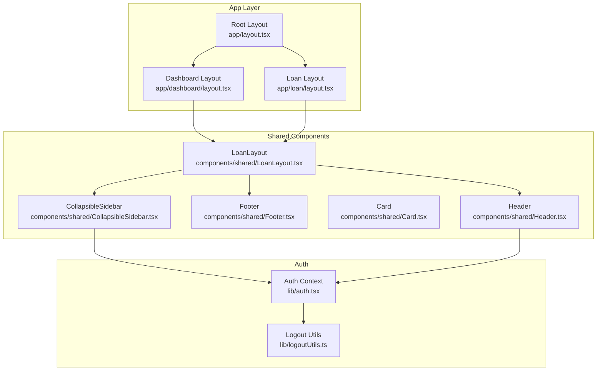
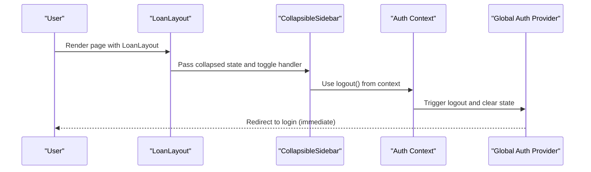
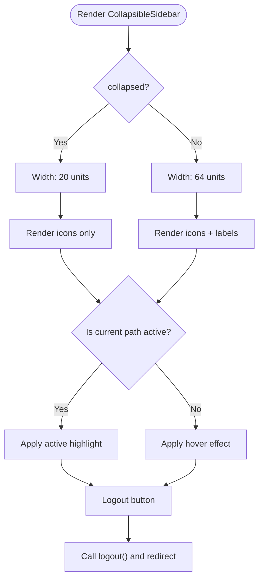
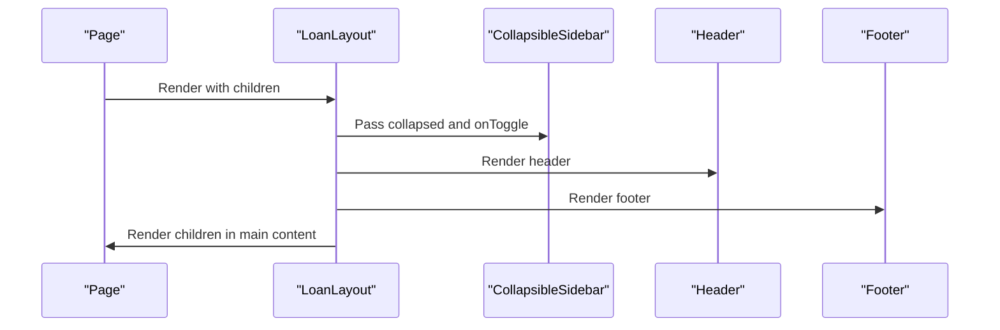
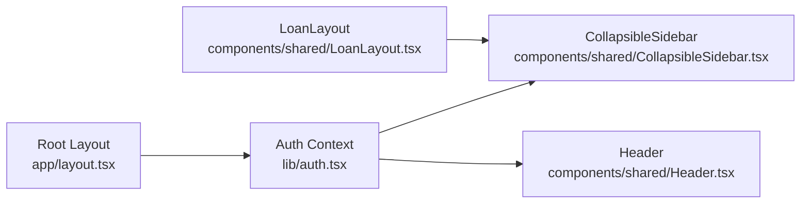

# Shared Components

<cite>
**Referenced Files in This Document**
- [Header.tsx](file://components/shared/Header.tsx)
- [Footer.tsx](file://components/shared/Footer.tsx)
- [Card.tsx](file://components/shared/Card.tsx)
- [CollapsibleSidebar.tsx](file://components/shared/CollapsibleSidebar.tsx)
- [LoanLayout.tsx](file://components/shared/LoanLayout.tsx)
- [auth.tsx](file://lib/auth.tsx)
- [logoutUtils.ts](file://lib/logoutUtils.ts)
- [index.ts](file://components/index.ts)
- [layout.tsx](file://app/layout.tsx)
- [dashboard/layout.tsx](file://app/dashboard/layout.tsx)
- [loan/layout.tsx](file://app/loan/layout.tsx)
</cite>

## Table of Contents
1. [Introduction](#introduction)
2. [Project Structure](#project-structure)
3. [Core Components](#core-components)
4. [Architecture Overview](#architecture-overview)
5. [Detailed Component Analysis](#detailed-component-analysis)
6. [Dependency Analysis](#dependency-analysis)
7. [Performance Considerations](#performance-considerations)
8. [Troubleshooting Guide](#troubleshooting-guide)
9. [Conclusion](#conclusion)
10. [Appendices](#appendices)

## Introduction
This document describes the Shared Components library used across all dashboards in the SAMPA Cooperative Management Platform. It focuses on five reusable UI building blocks: Header, Footer, Card, CollapsibleSidebar, and LoanLayout. These components are designed with consistent styling using Tailwind CSS, responsive behavior, and integration with the application’s authentication context. The documentation explains component APIs, composition patterns, customization options, and practical usage examples across different dashboard contexts.

## Project Structure
The shared components live under components/shared and are exported via components/index.ts for convenient imports across the application. They are consumed by page layouts such as app/dashboard/layout.tsx and app/loan/layout.tsx, which wrap page content with LoanLayout to provide a consistent sidebar-driven layout.

**Diagram sources**
- [layout.tsx](file://app/layout.tsx#L22-L37)
- [dashboard/layout.tsx](file://app/dashboard/layout.tsx#L1-L9)
- [loan/layout.tsx](file://app/loan/layout.tsx#L1-L9)
- [LoanLayout.tsx](file://components/shared/LoanLayout.tsx#L18-L41)
- [CollapsibleSidebar.tsx](file://components/shared/CollapsibleSidebar.tsx#L74-L80)
- [Header.tsx](file://components/shared/Header.tsx#L4-L26)
- [Footer.tsx](file://components/shared/Footer.tsx#L1-L9)
- [auth.tsx](file://lib/auth.tsx#L158-L682)
- [logoutUtils.ts](file://lib/logoutUtils.ts#L16-L93)

**Section sources**
- [index.ts](file://components/index.ts#L1-L14)
- [layout.tsx](file://app/layout.tsx#L22-L37)
- [dashboard/layout.tsx](file://app/dashboard/layout.tsx#L1-L9)
- [loan/layout.tsx](file://app/loan/layout.tsx#L1-L9)

## Core Components
This section documents the five shared components with their props, styling conventions, and usage patterns.

- Header
  - Purpose: Fixed top bar with branding and primary navigation links.
  - Props: None.
  - Styling: Uses Tailwind classes for fixed positioning, red background, white text, shadow, and responsive breakpoints.
  - Responsive: Desktop nav hidden on small screens; mobile menu icon present for small screens.
  - Integration: Links to dashboard, loan, savings, and profile routes.

- Footer
  - Purpose: Fixed bottom bar with copyright notice.
  - Props: None.
  - Styling: Blue background, white text, centered content, shadow.
  - Responsive: Text size increases slightly on medium screens.

- Card
  - Purpose: Content container with title and body.
  - Props:
    - title: string
    - children: ReactNode
    - className?: string
  - Styling: White background, rounded corners, shadow, padding, hover elevation, consistent spacing.

- CollapsibleSidebar
  - Purpose: Left sidebar with navigation items, icons, active highlighting, and logout.
  - Props:
    - collapsed: boolean
    - onToggle: () => void
  - Behavior: Collapses to icon-only width; highlights active link based on path; integrates with AuthContext for logout.
  - Icons: Home, Credit Card, Piggy Bank, User, Info, Menu, Logout.

- LoanLayout
  - Purpose: Page layout for loan-related views with a collapsible sidebar and scrollable main content area.
  - Props:
    - children: ReactNode
  - State: Manages sidebar collapse state locally.
  - Composition: Wraps children in a flex container with a sidebar and a main content area.

**Section sources**
- [Header.tsx](file://components/shared/Header.tsx#L4-L26)
- [Footer.tsx](file://components/shared/Footer.tsx#L1-L9)
- [Card.tsx](file://components/shared/Card.tsx#L3-L16)
- [CollapsibleSidebar.tsx](file://components/shared/CollapsibleSidebar.tsx#L74-L156)
- [LoanLayout.tsx](file://components/shared/LoanLayout.tsx#L18-L41)

## Architecture Overview
The shared components are composed within page layouts to deliver a consistent UI across dashboards. Authentication state is provided globally via AuthProvider and consumed by CollapsibleSidebar and Header to enable logout and role-aware behavior.

**Diagram sources**
- [LoanLayout.tsx](file://components/shared/LoanLayout.tsx#L18-L41)
- [CollapsibleSidebar.tsx](file://components/shared/CollapsibleSidebar.tsx#L84-L95)
- [auth.tsx](file://lib/auth.tsx#L621-L635)
- [logoutUtils.ts](file://lib/logoutUtils.ts#L65-L68)

## Detailed Component Analysis

### Header
- Fixed positioning and responsive design:
  - Fixed at top with z-index stacking context.
  - Desktop navigation hidden below medium breakpoint; mobile menu icon present.
- Navigation links:
  - Dashboard, Loans, Savings, Profile.
- Styling conventions:
  - Tailwind utilities for color, typography, spacing, and shadows.

Usage example:
- Included inside page layouts to provide consistent top navigation.

Customization options:
- Modify brand text and links by editing the component.
- Adjust colors and typography via Tailwind classes.

**Section sources**
- [Header.tsx](file://components/shared/Header.tsx#L4-L26)

### Footer
- Fixed at bottom with copyright notice.
- Responsive text sizing for improved readability on small screens.

Usage example:
- Included inside page layouts to provide consistent footer.

Customization options:
- Change year dynamically by reading current date.
- Adjust colors and paddings via Tailwind classes.

**Section sources**
- [Footer.tsx](file://components/shared/Footer.tsx#L1-L9)

### Card
- Props interface:
  - title: string
  - children: ReactNode
  - className?: string
- Styling patterns:
  - Rounded corners, shadow, padding, hover elevation.
  - Title typography and spacing for content separation.

Usage example:
- Wrap content sections in dashboards and forms for consistent presentation.

Customization options:
- Extend className to override styles.
- Remove title rendering by passing undefined.

**Section sources**
- [Card.tsx](file://components/shared/Card.tsx#L3-L16)

### CollapsibleSidebar
- Props interface:
  - collapsed: boolean
  - onToggle: () => void
- State and navigation:
  - Tracks active route and highlights current link.
  - Integrates with AuthContext for logout.
- Icons:
  - Home, Credit Card, Piggy Bank, User, Info, Menu, Logout.
- Styling conventions:
  - Transition effects for smooth resizing and hover states.
  - Conditional rendering for text labels when expanded.

**Diagram sources**
- [CollapsibleSidebar.tsx](file://components/shared/CollapsibleSidebar.tsx#L74-L156)
- [auth.tsx](file://lib/auth.tsx#L621-L635)
- [logoutUtils.ts](file://lib/logoutUtils.ts#L65-L68)

**Section sources**
- [CollapsibleSidebar.tsx](file://components/shared/CollapsibleSidebar.tsx#L74-L156)

### LoanLayout
- Props interface:
  - children: ReactNode
- State management:
  - Local state toggles sidebar collapse.
- Composition:
  - Left sidebar (CollapsibleSidebar), right main content area.
  - Scrollable main content with responsive padding.

**Diagram sources**
- [LoanLayout.tsx](file://components/shared/LoanLayout.tsx#L18-L41)
- [Header.tsx](file://components/shared/Header.tsx#L4-L26)
- [Footer.tsx](file://components/shared/Footer.tsx#L1-L9)
- [CollapsibleSidebar.tsx](file://components/shared/CollapsibleSidebar.tsx#L74-L80)

**Section sources**
- [LoanLayout.tsx](file://components/shared/LoanLayout.tsx#L18-L41)

## Dependency Analysis
- Shared components depend on:
  - Next.js routing primitives (usePathname, Link).
  - Tailwind CSS for styling.
  - Auth context for logout and user-aware behavior.
- Global provider:
  - AuthProvider wraps the application to supply authentication state and methods.

**Diagram sources**
- [auth.tsx](file://lib/auth.tsx#L158-L682)
- [CollapsibleSidebar.tsx](file://components/shared/CollapsibleSidebar.tsx#L5-L8)
- [Header.tsx](file://components/shared/Header.tsx#L1-L3)
- [LoanLayout.tsx](file://components/shared/LoanLayout.tsx#L1-L5)
- [layout.tsx](file://app/layout.tsx#L22-L37)

**Section sources**
- [auth.tsx](file://lib/auth.tsx#L158-L682)
- [layout.tsx](file://app/layout.tsx#L22-L37)

## Performance Considerations
- Prefer minimal re-renders by keeping component props simple and avoiding unnecessary state lifting.
- Use Tailwind utilities efficiently to avoid bloated CSS bundles.
- Memoize heavy computations outside components when possible.
- Keep sidebar content virtualized for large lists if extended in future iterations.

## Troubleshooting Guide
- Logout not redirecting:
  - Verify AuthProvider is wrapping the application root.
  - Confirm logout utility clears cookies and redirects appropriately.
- Active link highlighting incorrect:
  - Ensure usePathname matches navigation item paths exactly.
- Sidebar not collapsing:
  - Confirm onToggle updates the collapsed state and is passed down correctly.

**Section sources**
- [layout.tsx](file://app/layout.tsx#L22-L37)
- [logoutUtils.ts](file://lib/logoutUtils.ts#L65-L68)
- [CollapsibleSidebar.tsx](file://components/shared/CollapsibleSidebar.tsx#L81-L137)
- [LoanLayout.tsx](file://components/shared/LoanLayout.tsx#L23-L31)

## Conclusion
The Shared Components library provides a cohesive, responsive, and accessible foundation for dashboards across the SAMPA platform. By leveraging Tailwind CSS, Next.js routing, and a centralized authentication context, these components ensure consistent UX and maintainable code. Extending them involves adding props, integrating with additional contexts, and preserving existing styling and responsive patterns.

## Appendices

### Usage Examples Across Dashboards
- Dashboard pages:
  - Wrap page content with LoanLayout to inherit the sidebar and responsive layout.
- Loan pages:
  - Apply the same pattern to ensure consistent navigation and spacing.

**Section sources**
- [dashboard/layout.tsx](file://app/dashboard/layout.tsx#L1-L9)
- [loan/layout.tsx](file://app/loan/layout.tsx#L1-L9)

### Export and Import References
- Shared components are exported from components/index.ts for global consumption.

**Section sources**
- [index.ts](file://components/index.ts#L1-L14)