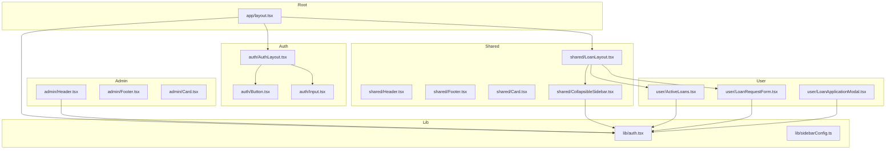
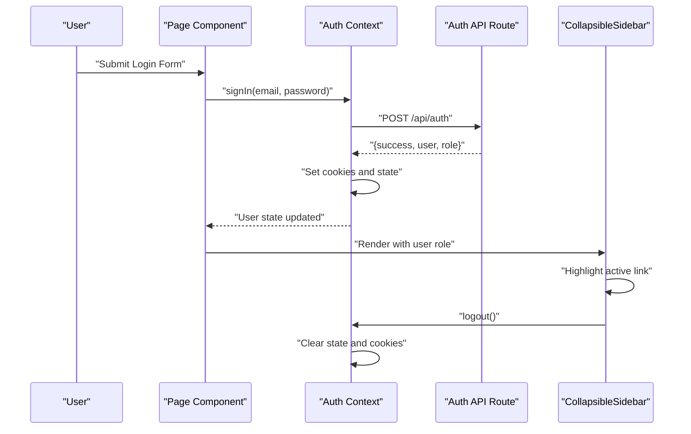
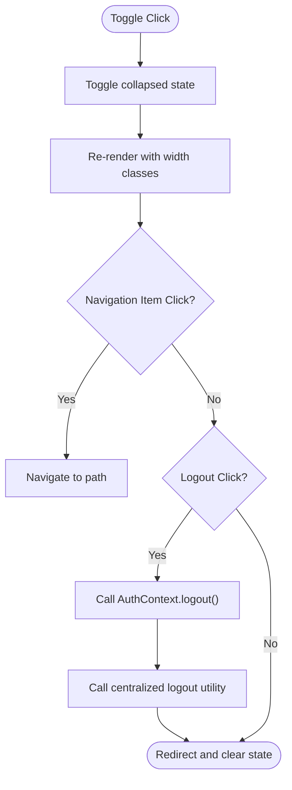
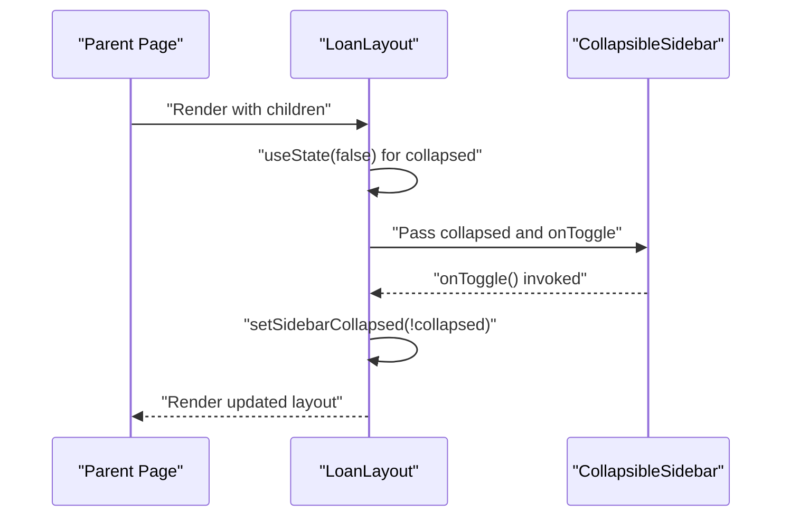
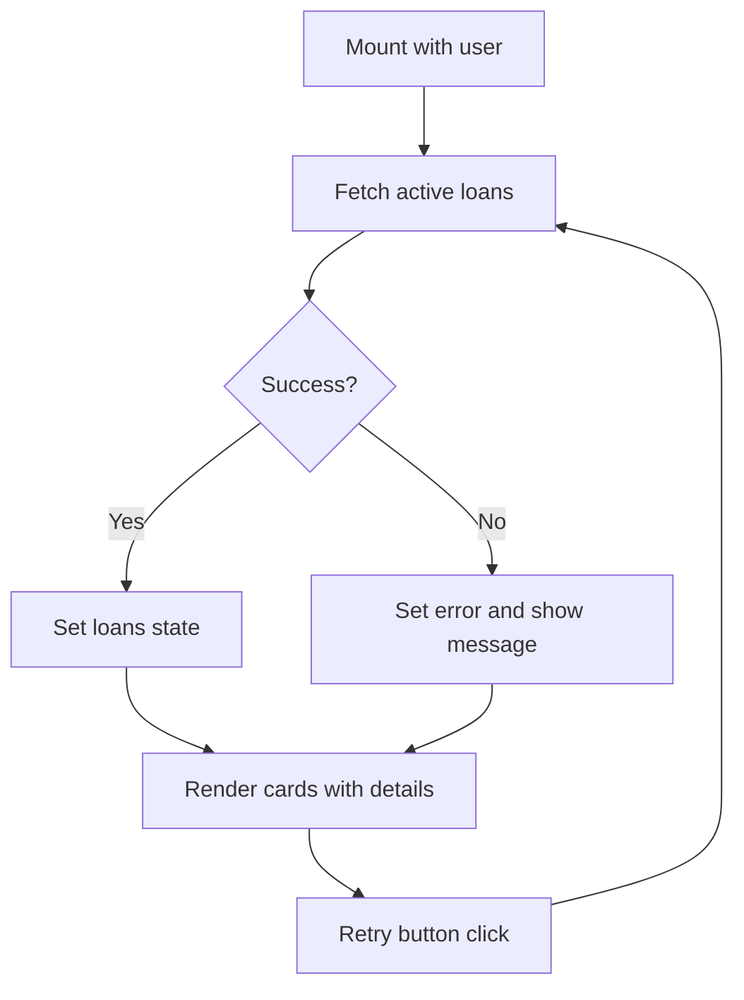
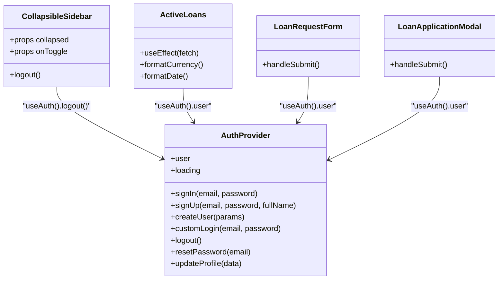
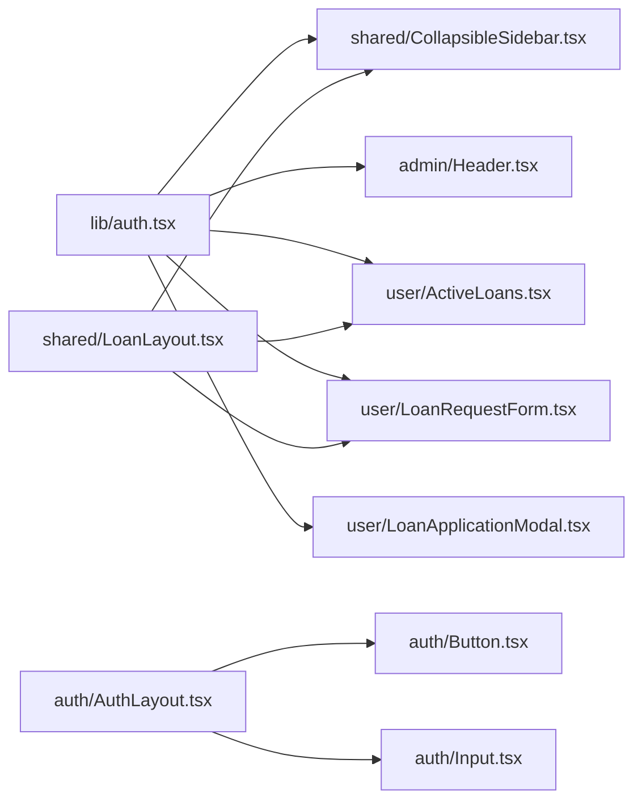

# UI Components & Design System

<cite>
**Referenced Files in This Document**
- [components/index.ts](file://components/index.ts)
- [components/shared/Header.tsx](file://components/shared/Header.tsx)
- [components/shared/Footer.tsx](file://components/shared/Footer.tsx)
- [components/shared/Card.tsx](file://components/shared/Card.tsx)
- [components/shared/CollapsibleSidebar.tsx](file://components/shared/CollapsibleSidebar.tsx)
- [components/shared/LoanLayout.tsx](file://components/shared/LoanLayout.tsx)
- [components/auth/AuthLayout.tsx](file://components/auth/AuthLayout.tsx)
- [components/auth/Button.tsx](file://components/auth/Button.tsx)
- [components/auth/Input.tsx](file://components/auth/Input.tsx)
- [components/admin/Header.tsx](file://components/admin/Header.tsx)
- [components/admin/Footer.tsx](file://components/admin/Footer.tsx)
- [components/admin/Card.tsx](file://components/admin/Card.tsx)
- [components/user/ActiveLoans.tsx](file://components/user/ActiveLoans.tsx)
- [components/user/LoanApplicationModal.tsx](file://components/user/LoanApplicationModal.tsx)
- [components/user/LoanRequestForm.tsx](file://components/user/LoanRequestForm.tsx)
- [lib/auth.tsx](file://lib/auth.tsx)
- [lib/sidebarConfig.ts](file://lib/sidebarConfig.ts)
- [app/layout.tsx](file://app/layout.tsx)
</cite>

## Table of Contents
1. [Introduction](#introduction)
2. [Project Structure](#project-structure)
3. [Core Components](#core-components)
4. [Architecture Overview](#architecture-overview)
5. [Detailed Component Analysis](#detailed-component-analysis)
6. [Dependency Analysis](#dependency-analysis)
7. [Performance Considerations](#performance-considerations)
8. [Troubleshooting Guide](#troubleshooting-guide)
9. [Conclusion](#conclusion)
10. [Appendices](#appendices)

## Introduction
This document describes the UI Components & Design System of the SAMPA Cooperative Management Platform. It focuses on the shared component library (Header, Footer, Card, CollapsibleSidebar), authentication-focused components (AuthLayout, Button, Input), and loan-specific layouts and forms. It explains component composition patterns, prop interfaces, customization options, responsive design using Tailwind CSS, state management and event handling integrated with the authentication context, and practical usage examples. Accessibility, cross-browser compatibility, and performance optimization guidance are also included.

## Project Structure
The UI components are organized by domain and shared usage:
- Shared components under components/shared are used across user dashboards and loan/savings contexts.
- Authentication components under components/auth provide secure input and button primitives and an auth layout container.
- Admin components under components/admin encapsulate admin panel UI elements.
- User components under components/user implement member-facing features such as active loans display and loan application workflows.
- The global AuthProvider is mounted at the root layout to enable authentication context across the app.

**Diagram sources**
- [app/layout.tsx](file://app/layout.tsx#L22-L37)
- [components/shared/LoanLayout.tsx](file://components/shared/LoanLayout.tsx#L18-L41)
- [components/shared/CollapsibleSidebar.tsx](file://components/shared/CollapsibleSidebar.tsx#L74-L80)
- [components/admin/Header.tsx](file://components/admin/Header.tsx#L37-L43)
- [components/auth/AuthLayout.tsx](file://components/auth/AuthLayout.tsx#L9-L23)
- [components/auth/Button.tsx](file://components/auth/Button.tsx#L8-L13)
- [components/auth/Input.tsx](file://components/auth/Input.tsx#L8-L27)
- [components/user/ActiveLoans.tsx](file://components/user/ActiveLoans.tsx#L19-L29)
- [components/user/LoanRequestForm.tsx](file://components/user/LoanRequestForm.tsx#L12-L18)
- [components/user/LoanApplicationModal.tsx](file://components/user/LoanApplicationModal.tsx#L16-L29)
- [lib/auth.tsx](file://lib/auth.tsx#L158-L682)
- [lib/sidebarConfig.ts](file://lib/sidebarConfig.ts#L29-L262)

**Section sources**
- [app/layout.tsx](file://app/layout.tsx#L22-L37)
- [components/index.ts](file://components/index.ts#L1-L14)

## Core Components
This section documents the shared component library and authentication-focused components.

- Shared Header
  - Purpose: Fixed top bar with branding, navigation links, and a mobile menu indicator.
  - Props: None.
  - Customization: Adjust color classes and link targets for branding and navigation changes.
  - Accessibility: Add aria-labels to links and ensure keyboard navigation.
  - Responsive: Uses hidden and md: visibility utilities for mobile/desktop.

- Shared Footer
  - Purpose: Fixed bottom bar with copyright and version info.
  - Props: None.
  - Customization: Modify text and styling classes for branding.

- Shared Card
  - Purpose: Consistent card container with title and children.
  - Props:
    - title: string
    - children: ReactNode
    - className?: string
  - Customization: Pass additional Tailwind classes via className.

- CollapsibleSidebar
  - Purpose: Left sidebar with navigation items, icons, active highlighting, and logout.
  - Props:
    - collapsed: boolean
    - onToggle: () => void
  - Behavior: Uses Next.js usePathname for active highlight; integrates with AuthContext for logout; triggers centralized logout utility.
  - Accessibility: Ensure focus styles and keyboard operability for nav items and logout button.

- LoanLayout
  - Purpose: Layout wrapper for loan pages with collapsible sidebar and main content area.
  - Props:
    - children: ReactNode
  - State: Manages sidebarCollapsed state locally.
  - Integration: Renders CollapsibleSidebar and passes state callbacks.

- AuthLayout
  - Purpose: Centered auth container with title and optional subtitle.
  - Props:
    - children: ReactNode
    - title: string
    - subtitle?: string
  - Customization: Adjust spacing and shadow classes for branding.

- Button
  - Purpose: Reusable button with primary/secondary variants and loading state.
  - Props:
    - children: ReactNode
    - isLoading?: boolean
    - variant?: 'primary' | 'secondary'
    - ...button attributes
  - Behavior: Disables when isLoading or disabled; shows spinner when loading.

- Input
  - Purpose: Styled input with label and optional error messaging.
  - Props:
    - label: string
    - error?: string
    - ...input attributes
  - Behavior: Applies error-specific border class; forwards additional props to input element.

**Section sources**
- [components/shared/Header.tsx](file://components/shared/Header.tsx#L4-L26)
- [components/shared/Footer.tsx](file://components/shared/Footer.tsx#L1-L9)
- [components/shared/Card.tsx](file://components/shared/Card.tsx#L3-L16)
- [components/shared/CollapsibleSidebar.tsx](file://components/shared/CollapsibleSidebar.tsx#L74-L80)
- [components/shared/LoanLayout.tsx](file://components/shared/LoanLayout.tsx#L18-L41)
- [components/auth/AuthLayout.tsx](file://components/auth/AuthLayout.tsx#L9-L23)
- [components/auth/Button.tsx](file://components/auth/Button.tsx#L8-L13)
- [components/auth/Input.tsx](file://components/auth/Input.tsx#L8-L27)

## Architecture Overview
The design system centers around:
- Global AuthProvider that exposes user state, login/logout, and profile updates.
- Shared components for consistent UI across dashboards.
- Role-aware navigation and layouts for admin and user dashboards.
- Loan-specific layout and forms for complex workflows.

**Diagram sources**
- [lib/auth.tsx](file://lib/auth.tsx#L197-L348)
- [components/shared/CollapsibleSidebar.tsx](file://components/shared/CollapsibleSidebar.tsx#L84-L95)

## Detailed Component Analysis

### Shared Components

#### CollapsibleSidebar
- Composition pattern: Stateless functional component receiving collapsed and onToggle props; renders navigation items with icons and a logout button.
- State management: Controlled via parent (LoanLayout) state; toggles collapsed state.
- Event handling: onClick handlers for toggle and logout; logout triggers AuthContext.logout and centralized logout utility.
- Accessibility: Add aria-current for active link; ensure focus-visible styles.

**Diagram sources**
- [components/shared/CollapsibleSidebar.tsx](file://components/shared/CollapsibleSidebar.tsx#L84-L95)
- [lib/auth.tsx](file://lib/auth.tsx#L621-L635)

**Section sources**
- [components/shared/CollapsibleSidebar.tsx](file://components/shared/CollapsibleSidebar.tsx#L74-L80)
- [lib/auth.tsx](file://lib/auth.tsx#L621-L635)

#### LoanLayout
- Composition pattern: Wraps children with a two-column layout; left sidebar is CollapsibleSidebar; right is main content area.
- State management: Local useState for sidebarCollapsed; passes callback to CollapsibleSidebar.
- Responsive: Uses flexbox and Tailwind utilities for responsive behavior.

**Diagram sources**
- [components/shared/LoanLayout.tsx](file://components/shared/LoanLayout.tsx#L18-L41)
- [components/shared/CollapsibleSidebar.tsx](file://components/shared/CollapsibleSidebar.tsx#L74-L80)

**Section sources**
- [components/shared/LoanLayout.tsx](file://components/shared/LoanLayout.tsx#L18-L41)

### Authentication Components

#### AuthLayout
- Purpose: Centers auth forms with title and optional subtitle inside a card-like container.
- Props: children, title, subtitle.
- Usage: Wrap auth forms (login/register) to enforce consistent branding and spacing.

**Section sources**
- [components/auth/AuthLayout.tsx](file://components/auth/AuthLayout.tsx#L9-L23)

#### Button
- Props: isLoading, variant, and standard button attributes.
- Variants: primary and secondary with distinct focus rings and hover states.
- Loading: Spinner animation when isLoading; disables button.

**Section sources**
- [components/auth/Button.tsx](file://components/auth/Button.tsx#L8-L13)

#### Input
- Props: label, error, and standard input attributes.
- Behavior: Applies error border class; displays error message below input.

**Section sources**
- [components/auth/Input.tsx](file://components/auth/Input.tsx#L8-L27)

### Admin Components

#### Admin Header
- Purpose: Top navigation bar with sidebar toggle, title, and user dropdown with logout.
- Props: sidebarCollapsed, onToggleSidebar.
- Behavior: Uses AuthContext.user and logout; manages dropdown visibility.

**Section sources**
- [components/admin/Header.tsx](file://components/admin/Header.tsx#L37-L43)

#### Admin Footer
- Purpose: Fixed footer with copyright and version info.
- Props: None.

**Section sources**
- [components/admin/Footer.tsx](file://components/admin/Footer.tsx#L8-L23)

#### Admin Card
- Purpose: Card with optional title and content padding.
- Props: title?, children, className?.

**Section sources**
- [components/admin/Card.tsx](file://components/admin/Card.tsx#L14-L35)

### User Components

#### ActiveLoans
- Purpose: Displays a user’s active loans with formatted currency/date and retry mechanism.
- State: loading, error, loans array.
- Data: Fetches from Firestore using a query with userId and status filters; formats currency and dates.
- Events: Retry button re-invokes fetch.

**Diagram sources**
- [components/user/ActiveLoans.tsx](file://components/user/ActiveLoans.tsx#L25-L72)

**Section sources**
- [components/user/ActiveLoans.tsx](file://components/user/ActiveLoans.tsx#L19-L177)

#### LoanRequestForm
- Purpose: Allows a user to submit a general loan request with amount, term, and optional description.
- State: amount, term, description, loading.
- Validation: Numeric checks for amount and term; fetches member info from Firestore to enrich payload.
- Submission: Posts to Firestore under loanRequests with status pending.

**Section sources**
- [components/user/LoanRequestForm.tsx](file://components/user/LoanRequestForm.tsx#L12-L223)

#### LoanApplicationModal
- Purpose: Modal for applying to a specific loan plan with plan details, amount, and term selection.
- State: amount, term, loading; resets on close.
- Validation: Enforces plan max amount and valid term options; submits to loanRequests.
- Integration: Uses AuthContext.user and router for navigation.

**Section sources**
- [components/user/LoanApplicationModal.tsx](file://components/user/LoanApplicationModal.tsx#L16-L200)

### Authentication Context Integration
- AuthProvider exposes user, loading, signIn, signUp, createUser, customLogin, logout, resetPassword, updateProfile.
- Components consume useAuth to access user state and call logout.
- Centralized logout clears cookies and user state.

**Diagram sources**
- [lib/auth.tsx](file://lib/auth.tsx#L158-L682)
- [components/shared/CollapsibleSidebar.tsx](file://components/shared/CollapsibleSidebar.tsx#L82-L89)
- [components/user/ActiveLoans.tsx](file://components/user/ActiveLoans.tsx#L20-L29)
- [components/user/LoanRequestForm.tsx](file://components/user/LoanRequestForm.tsx#L13-L17)
- [components/user/LoanApplicationModal.tsx](file://components/user/LoanApplicationModal.tsx#L17-L21)

**Section sources**
- [lib/auth.tsx](file://lib/auth.tsx#L158-L682)

## Dependency Analysis
- Shared components depend on Next.js routing (usePathname) and the AuthContext for logout.
- LoanLayout composes CollapsibleSidebar and user components.
- Admin components depend on AuthContext for user profile and logout.
- User components depend on AuthContext for user identity and on Firestore utilities for data operations.

**Diagram sources**
- [lib/auth.tsx](file://lib/auth.tsx#L158-L682)
- [components/shared/LoanLayout.tsx](file://components/shared/LoanLayout.tsx#L18-L41)
- [components/shared/CollapsibleSidebar.tsx](file://components/shared/CollapsibleSidebar.tsx#L82-L89)
- [components/admin/Header.tsx](file://components/admin/Header.tsx#L44-L59)
- [components/user/ActiveLoans.tsx](file://components/user/ActiveLoans.tsx#L20-L29)
- [components/user/LoanRequestForm.tsx](file://components/user/LoanRequestForm.tsx#L13-L17)
- [components/user/LoanApplicationModal.tsx](file://components/user/LoanApplicationModal.tsx#L17-L21)
- [components/auth/AuthLayout.tsx](file://components/auth/AuthLayout.tsx#L9-L23)
- [components/auth/Button.tsx](file://components/auth/Button.tsx#L8-L13)
- [components/auth/Input.tsx](file://components/auth/Input.tsx#L8-L27)

**Section sources**
- [lib/sidebarConfig.ts](file://lib/sidebarConfig.ts#L29-L262)

## Performance Considerations
- Prefer server components where appropriate; keep interactive components client-side with 'use client'.
- Memoize expensive computations (e.g., currency/date formatting) and avoid unnecessary re-renders by passing stable callbacks.
- Lazy-load heavy modals and tables; use virtualization for long lists.
- Minimize Tailwind classes per render; extract repeated class sets into constants.
- Debounce or throttle rapid user interactions (e.g., search or filter inputs).
- Use Suspense boundaries for data fetching to improve perceived performance.

## Troubleshooting Guide
- Authentication state not persisting:
  - Verify cookies are being set after login and cleared on logout.
  - Check AuthProvider initialization and useEffect logic for loading user from cookies.
- Logout not redirecting:
  - Ensure logout calls clearAllAuthData and redirects occur after state is cleared.
- Loan data not loading:
  - Confirm user is authenticated and Firestore is initialized; verify query filters and error handling paths.
- Sidebar navigation not highlighting:
  - Ensure usePathname matches the current path and that navigation items use the same paths.

**Section sources**
- [lib/auth.tsx](file://lib/auth.tsx#L164-L195)
- [lib/auth.tsx](file://lib/auth.tsx#L621-L635)
- [components/user/ActiveLoans.tsx](file://components/user/ActiveLoans.tsx#L31-L72)
- [components/shared/CollapsibleSidebar.tsx](file://components/shared/CollapsibleSidebar.tsx#L81-L82)

## Conclusion
The SAMPA Cooperative Management Platform employs a modular, role-aware design system built on shared components, a robust authentication context, and consistent layout patterns. The shared components (Header, Footer, Card, CollapsibleSidebar) and authentication primitives (AuthLayout, Button, Input) provide a cohesive user experience across dashboards. Loan-specific layouts and forms manage complex workflows with clear state and error handling. The system leverages Tailwind CSS for responsive design, integrates tightly with the AuthContext for secure interactions, and offers extensibility through well-defined props and composition patterns.

## Appendices

### Responsive Design and Tailwind Utilities
- Mobile-first approach: Hidden and md: visibility utilities control desktop vs. mobile views.
- Spacing and padding: Use p-4/md:p-6 for scalable spacing across breakpoints.
- Width and layout: w-full, max-w-md, flex-1, and grid utilities adapt to screen sizes.

### Accessibility Checklist
- Ensure all interactive elements have focus indicators and keyboard operability.
- Provide aria-current for active navigation items.
- Use semantic labels and descriptions for inputs and buttons.
- Test color contrast and ensure sufficient text sizes.

### Cross-Browser Compatibility
- Use standard HTML and CSS; avoid experimental APIs without polyfills.
- Validate Tailwind utilities across browsers; prefer widely supported features.
- Test form controls and focus states on major browsers.

### Extending the Component Library
- Follow existing prop interfaces and className extension patterns.
- Encapsulate state in parent components when appropriate (as seen in LoanLayout).
- Centralize shared logic (e.g., logout) in utilities or context providers.
- Document props and customization options for maintainability.