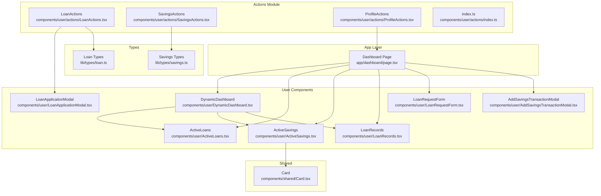
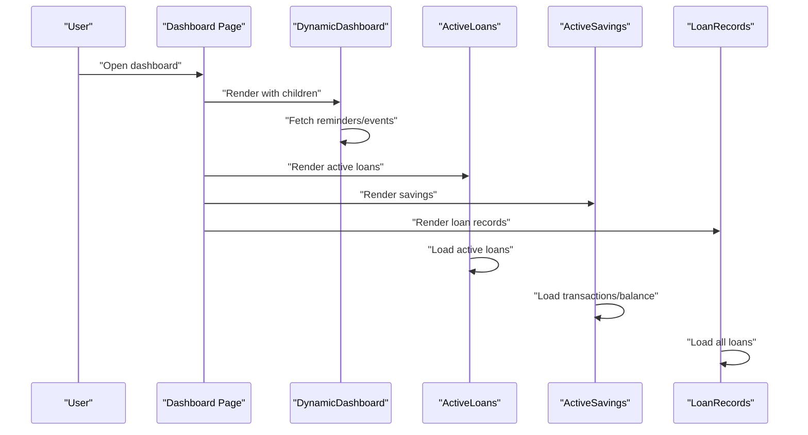
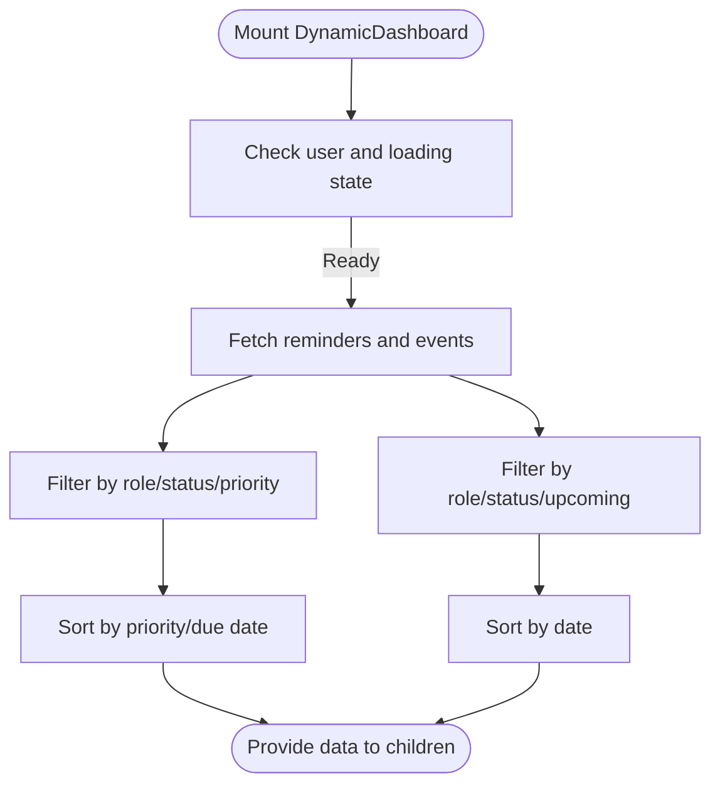
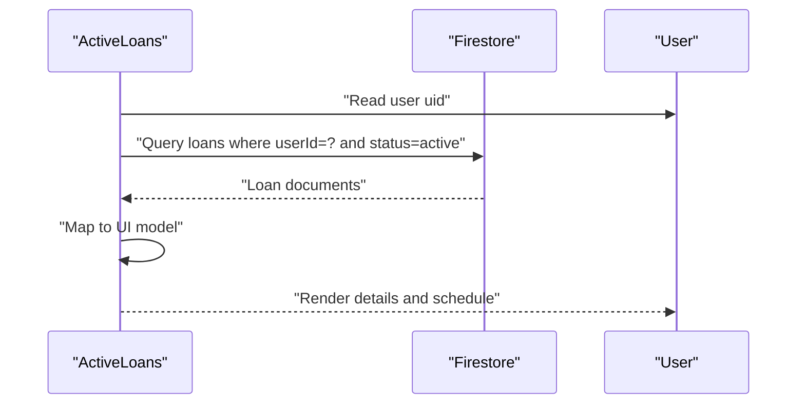
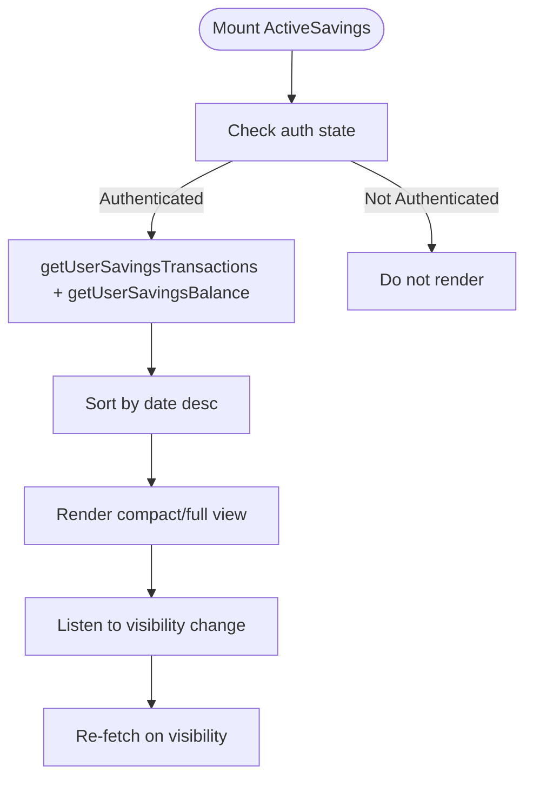
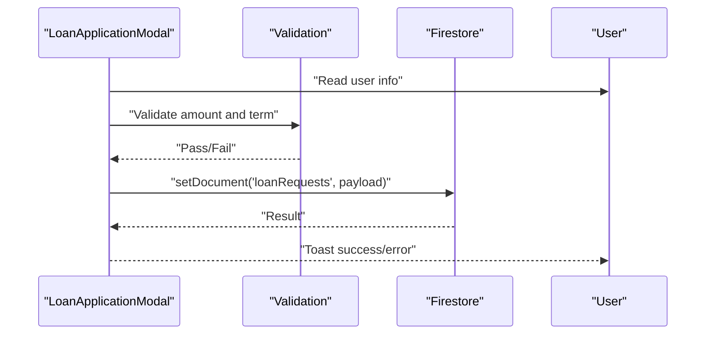
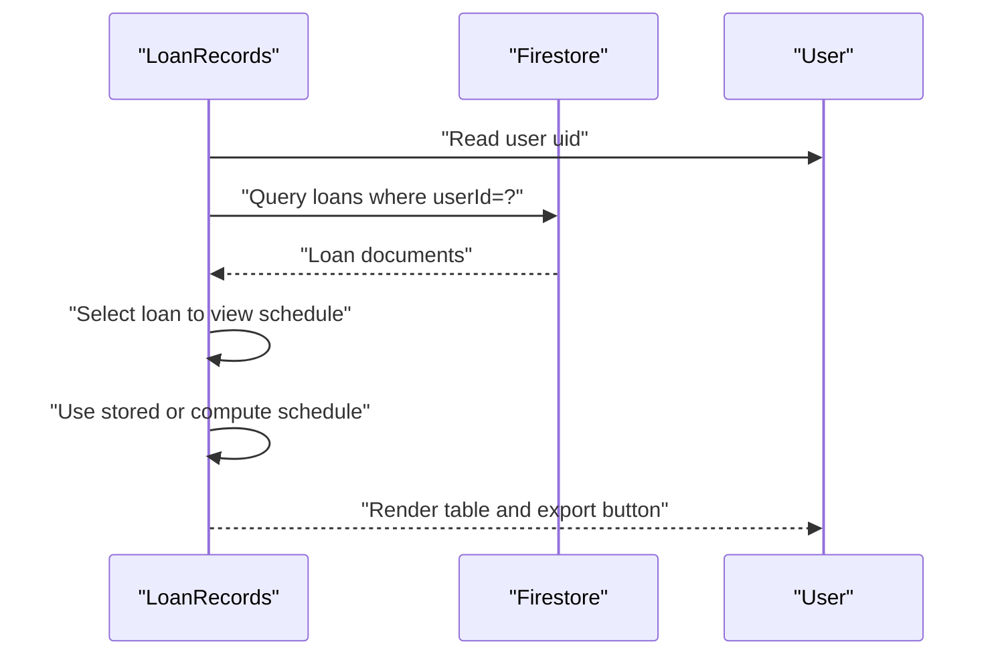
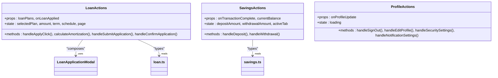
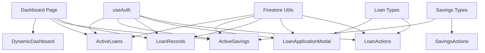

# User Interface Components

<cite>
**Referenced Files in This Document**
- [DynamicDashboard.tsx](file://components/user/DynamicDashboard.tsx)
- [ActiveLoans.tsx](file://components/user/ActiveLoans.tsx)
- [ActiveSavings.tsx](file://components/user/ActiveSavings.tsx)
- [LoanApplicationModal.tsx](file://components/user/LoanApplicationModal.tsx)
- [LoanRecords.tsx](file://components/user/LoanRecords.tsx)
- [LoanActions.tsx](file://components/user/actions/LoanActions.tsx)
- [SavingsActions.tsx](file://components/user/actions/SavingsActions.tsx)
- [ProfileActions.tsx](file://components/user/actions/ProfileActions.tsx)
- [index.ts](file://components/user/actions/index.ts)
- [page.tsx](file://app/dashboard/page.tsx)
- [LoanRequestForm.tsx](file://components/user/LoanRequestForm.tsx)
- [AddSavingsTransactionModal.tsx](file://components/user/AddSavingsTransactionModal.tsx)
- [Card.tsx](file://components/shared/Card.tsx)
- [loan.ts](file://lib/types/loan.ts)
- [savings.ts](file://lib/types/savings.ts)
</cite>

## Table of Contents
1. [Introduction](#introduction)
2. [Project Structure](#project-structure)
3. [Core Components](#core-components)
4. [Architecture Overview](#architecture-overview)
5. [Detailed Component Analysis](#detailed-component-analysis)
6. [Dependency Analysis](#dependency-analysis)
7. [Performance Considerations](#performance-considerations)
8. [Troubleshooting Guide](#troubleshooting-guide)
9. [Conclusion](#conclusion)
10. [Appendices](#appendices)

## Introduction
This document provides comprehensive documentation for the User Interface Components that deliver personalized experiences for cooperative members in the SAMPA Cooperative Management Platform. It focuses on:
- DynamicDashboard: adaptive layout and role-aware content aggregation
- ActiveLoans: loan tracking, status indicators, and payment scheduling visualization
- ActiveSavings: account balance display, transaction previews, and savings goal tracking
- LoanApplicationModal: form workflow, validation patterns, and submission handling
- LoanRecords: data table implementation, filtering, pagination, and export
- actions module: component composition pattern and shared functionality
- Integration with the user dashboard system and personalization features

The documentation explains state management patterns, data binding, and user interaction optimizations tailored for member-facing functionality.

## Project Structure
The user-facing components are organized under components/user and components/user/actions, with supporting types under lib/types. The dashboard page composes these components to present a personalized experience.

**Diagram sources**
- [page.tsx](file://app/dashboard/page.tsx#L1-L312)
- [DynamicDashboard.tsx](file://components/user/DynamicDashboard.tsx#L1-L149)
- [ActiveLoans.tsx](file://components/user/ActiveLoans.tsx#L1-L177)
- [ActiveSavings.tsx](file://components/user/ActiveSavings.tsx#L1-L270)
- [LoanApplicationModal.tsx](file://components/user/LoanApplicationModal.tsx#L1-L200)
- [LoanRecords.tsx](file://components/user/LoanRecords.tsx#L1-L350)
- [LoanRequestForm.tsx](file://components/user/LoanRequestForm.tsx#L1-L223)
- [AddSavingsTransactionModal.tsx](file://components/user/AddSavingsTransactionModal.tsx#L1-L221)
- [LoanActions.tsx](file://components/user/actions/LoanActions.tsx#L1-L619)
- [SavingsActions.tsx](file://components/user/actions/SavingsActions.tsx#L1-L237)
- [ProfileActions.tsx](file://components/user/actions/ProfileActions.tsx#L1-L101)
- [index.ts](file://components/user/actions/index.ts#L1-L4)
- [Card.tsx](file://components/shared/Card.tsx#L1-L16)
- [loan.ts](file://lib/types/loan.ts#L1-L19)
- [savings.ts](file://lib/types/savings.ts#L1-L20)

**Section sources**
- [page.tsx](file://app/dashboard/page.tsx#L1-L312)
- [index.ts](file://components/user/actions/index.ts#L1-L4)

## Core Components
This section summarizes the primary components and their responsibilities:
- DynamicDashboard: Aggregates reminders and events, filters by role/status, sorts priorities, and exposes data to children.
- ActiveLoans: Loads active loans for the authenticated user, formats currency/date, and renders payment schedules.
- ActiveSavings: Fetches recent transactions and balances, supports refresh on visibility change, and offers compact/full views.
- LoanApplicationModal: Validates inputs, constructs loan request payload, persists to Firestore, and notifies completion.
- LoanRecords: Lists all loans, calculates or uses stored amortization schedules, and exports to PDF.
- actions module: Provides reusable action components for loans, savings, and profile with shared patterns.

**Section sources**
- [DynamicDashboard.tsx](file://components/user/DynamicDashboard.tsx#L1-L149)
- [ActiveLoans.tsx](file://components/user/ActiveLoans.tsx#L1-L177)
- [ActiveSavings.tsx](file://components/user/ActiveSavings.tsx#L1-L270)
- [LoanApplicationModal.tsx](file://components/user/LoanApplicationModal.tsx#L1-L200)
- [LoanRecords.tsx](file://components/user/LoanRecords.tsx#L1-L350)
- [LoanActions.tsx](file://components/user/actions/LoanActions.tsx#L1-L619)
- [SavingsActions.tsx](file://components/user/actions/SavingsActions.tsx#L1-L237)
- [ProfileActions.tsx](file://components/user/actions/ProfileActions.tsx#L1-L101)

## Architecture Overview
The dashboard composes DynamicDashboard and child components. DynamicDashboard fetches role-aware reminders and events and passes data down. ActiveLoans and ActiveSavings rely on authentication and Firestore utilities. LoanRecords and LoanApplicationModal integrate with loan plans and payment schedules. The actions module encapsulates shared workflows.

**Diagram sources**
- [page.tsx](file://app/dashboard/page.tsx#L207-L309)
- [DynamicDashboard.tsx](file://components/user/DynamicDashboard.tsx#L36-L137)
- [ActiveLoans.tsx](file://components/user/ActiveLoans.tsx#L19-L72)
- [ActiveSavings.tsx](file://components/user/ActiveSavings.tsx#L16-L82)
- [LoanRecords.tsx](file://components/user/LoanRecords.tsx#L31-L82)

## Detailed Component Analysis

### DynamicDashboard
- Adaptive layout: Wraps children and exposes dynamic data (reminders, events) to descendants.
- Role-based content: Filters reminders and events by user role and status.
- Real-time data: Sorts reminders by priority and due date, events by upcoming date.
- Personalization: Role-aware visibility ensures members see relevant notices.

**Diagram sources**
- [DynamicDashboard.tsx](file://components/user/DynamicDashboard.tsx#L42-L137)

**Section sources**
- [DynamicDashboard.tsx](file://components/user/DynamicDashboard.tsx#L36-L149)

### ActiveLoans
- Data loading: Queries Firestore for active loans matching the authenticated user’s UID.
- Status indicators: Renders loan details and payment schedule summaries.
- Payment visualization: Uses stored schedule or computes monthly payment for display.
- Formatting: Currency and date formatting localized to Philippine Peso and locale.

**Diagram sources**
- [ActiveLoans.tsx](file://components/user/ActiveLoans.tsx#L31-L72)

**Section sources**
- [ActiveLoans.tsx](file://components/user/ActiveLoans.tsx#L19-L177)

### ActiveSavings
- Data binding: Fetches transactions and balance via savings service; sorts newest first.
- Personalization: Compact mode for dashboard cards; full mode for detailed table.
- Refresh behavior: Auto-refresh on page visibility change; exposes refresh function globally.
- Formatting: Currency/date formatting for consistent presentation.

**Diagram sources**
- [ActiveSavings.tsx](file://components/user/ActiveSavings.tsx#L22-L95)

**Section sources**
- [ActiveSavings.tsx](file://components/user/ActiveSavings.tsx#L16-L270)
- [Card.tsx](file://components/shared/Card.tsx#L9-L15)

### LoanApplicationModal
- Form workflow: Captures amount and term, validates against plan limits.
- Validation patterns: Numeric checks, inclusion in term options, and maximum amount enforcement.
- Submission handling: Constructs payload with user/member info, persists to Firestore, and notifies completion.

**Diagram sources**
- [LoanApplicationModal.tsx](file://components/user/LoanApplicationModal.tsx#L33-L98)

**Section sources**
- [LoanApplicationModal.tsx](file://components/user/LoanApplicationModal.tsx#L16-L200)
- [loan.ts](file://lib/types/loan.ts#L1-L19)

### LoanRecords
- Data table: Lists all loans with status badges and selection for schedule viewing.
- Filtering: Displays all loans for the authenticated user.
- Pagination: Not implemented in this component; the actions module demonstrates pagination for amortization schedules.
- Export: Generates PDF of amortization schedule using jsPDF and autoTable.

**Diagram sources**
- [LoanRecords.tsx](file://components/user/LoanRecords.tsx#L45-L148)

**Section sources**
- [LoanRecords.tsx](file://components/user/LoanRecords.tsx#L31-L350)

### actions Module Composition Pattern
The actions module exports reusable components for common workflows:
- LoanActions: Presents loan plans, collects amount/term, computes amortization, and submits requests with member info.
- SavingsActions: Handles deposits and withdrawals with balance checks and transaction persistence.
- ProfileActions: Provides navigation and logout handling.

**Diagram sources**
- [LoanActions.tsx](file://components/user/actions/LoanActions.tsx#L9-L31)
- [SavingsActions.tsx](file://components/user/actions/SavingsActions.tsx#L8-L18)
- [ProfileActions.tsx](file://components/user/actions/ProfileActions.tsx#L9-L16)
- [loan.ts](file://lib/types/loan.ts#L1-L19)
- [savings.ts](file://lib/types/savings.ts#L1-L20)

**Section sources**
- [LoanActions.tsx](file://components/user/actions/LoanActions.tsx#L14-L619)
- [SavingsActions.tsx](file://components/user/actions/SavingsActions.tsx#L13-L237)
- [ProfileActions.tsx](file://components/user/actions/ProfileActions.tsx#L13-L101)
- [index.ts](file://components/user/actions/index.ts#L1-L4)

## Dependency Analysis
Key dependencies and relationships:
- Authentication: All components depend on useAuth for user context.
- Firestore: Components use Firestore utilities to query and persist data.
- Types: Shared types define loan plans and savings transactions.
- Dashboard integration: Dashboard page composes DynamicDashboard and child components.

**Diagram sources**
- [ActiveLoans.tsx](file://components/user/ActiveLoans.tsx#L3-L4)
- [ActiveSavings.tsx](file://components/user/ActiveSavings.tsx#L3-L10)
- [LoanRecords.tsx](file://components/user/LoanRecords.tsx#L3-L6)
- [LoanApplicationModal.tsx](file://components/user/LoanApplicationModal.tsx#L3-L8)
- [LoanActions.tsx](file://components/user/actions/LoanActions.tsx#L3-L7)
- [page.tsx](file://app/dashboard/page.tsx#L3-L6)
- [loan.ts](file://lib/types/loan.ts#L1-L19)
- [savings.ts](file://lib/types/savings.ts#L1-L20)

**Section sources**
- [ActiveLoans.tsx](file://components/user/ActiveLoans.tsx#L3-L4)
- [ActiveSavings.tsx](file://components/user/ActiveSavings.tsx#L3-L10)
- [LoanRecords.tsx](file://components/user/LoanRecords.tsx#L3-L6)
- [LoanApplicationModal.tsx](file://components/user/LoanApplicationModal.tsx#L3-L8)
- [LoanActions.tsx](file://components/user/actions/LoanActions.tsx#L3-L7)
- [page.tsx](file://app/dashboard/page.tsx#L3-L6)

## Performance Considerations
- Efficient data fetching: Components query only required collections and apply filters client-side to reduce payload sizes.
- Sorting and filtering: Sorting by priority/date and filtering by role/status occur after retrieval; keep datasets small to maintain responsiveness.
- Visibility-driven refresh: ActiveSavings listens to visibility changes to refresh data without manual intervention.
- Pagination: LoanActions demonstrates pagination for amortization schedules to avoid rendering very long lists.
- Formatting: Currency and date formatting are computed locally; ensure minimal re-computation by memoizing where appropriate.

[No sources needed since this section provides general guidance]

## Troubleshooting Guide
Common issues and resolutions:
- Authentication failures: Ensure useAuth provides a valid user object before fetching data.
- Firestore initialization: Verify Firestore utilities are initialized before queries.
- Empty or missing data: Components handle empty results gracefully and display appropriate messages.
- Validation errors: Form components display toast notifications for invalid inputs and prevent submission.
- Export failures: LoanRecords export depends on jsPDF and autoTable; confirm dependencies are installed and accessible.

**Section sources**
- [ActiveLoans.tsx](file://components/user/ActiveLoans.tsx#L36-L44)
- [ActiveSavings.tsx](file://components/user/ActiveSavings.tsx#L24-L49)
- [LoanRecords.tsx](file://components/user/LoanRecords.tsx#L166-L214)
- [LoanApplicationModal.tsx](file://components/user/LoanApplicationModal.tsx#L42-L52)

## Conclusion
The user interface components deliver a cohesive, personalized experience for cooperative members. They emphasize role-aware content, real-time data presentation, robust validation, and efficient data binding. The actions module promotes reuse and consistency across loan and savings workflows. Together, these components provide a solid foundation for member-facing functionality within the SAMPA Cooperative Management Platform.

[No sources needed since this section summarizes without analyzing specific files]

## Appendices

### Practical Usage Examples
- Integrating ActiveSavings in the dashboard:
  - Use compact mode for quick balance display on the dashboard grid.
  - Use full mode on dedicated savings pages for detailed transaction history.
- Using LoanActions:
  - Pass loanPlans prop to render available plans and enable application flow.
  - Handle onLoanApplied callback to refresh dependent UI.
- Using SavingsActions:
  - Provide currentBalance to enforce withdrawal limits.
  - Subscribe to onTransactionComplete to refresh savings data.

**Section sources**
- [page.tsx](file://app/dashboard/page.tsx#L300-L305)
- [LoanActions.tsx](file://components/user/actions/LoanActions.tsx#L9-L12)
- [SavingsActions.tsx](file://components/user/actions/SavingsActions.tsx#L8-L11)

### State Management Patterns
- Controlled forms: Inputs bind to component state with controlled onChange handlers.
- Local state composition: Components manage loading, error, and data state independently.
- Global refresh hooks: ActiveSavings exposes a global refresh function for coordinated updates.

**Section sources**
- [ActiveSavings.tsx](file://components/user/ActiveSavings.tsx#L52-L95)
- [LoanApplicationModal.tsx](file://components/user/LoanApplicationModal.tsx#L19-L28)

### Data Binding Patterns
- Currency/date formatting: Centralized formatting functions ensure consistent presentation.
- Type-safe props: Loan and savings types define shapes for safer data handling.
- Child-to-parent callbacks: Components notify parents on successful operations for cascading updates.

**Section sources**
- [ActiveLoans.tsx](file://components/user/ActiveLoans.tsx#L74-L88)
- [ActiveSavings.tsx](file://components/user/ActiveSavings.tsx#L97-L116)
- [loan.ts](file://lib/types/loan.ts#L1-L19)
- [savings.ts](file://lib/types/savings.ts#L1-L20)